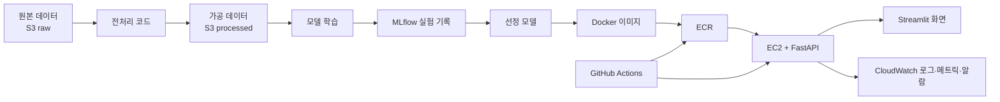

# 클라우드 MLOps 교육계획서 v4

작성일: 2026-08-24  
수업 시간: 15주 × 230분  

## 1. 교과목 개요

| 항목 | 내용 |
|---|---|
| 교과목명 | 클라우드 MLOps |
| 선수지식 | Python 기초, pandas·scikit-learn 입문 |
| 실습 환경 | AWS 서울 리전, Linux, Docker, GitHub |
| 프로젝트 | 3~4인 팀 프로젝트 1건 |
| 수업 비율 | 개념 약 30%, 실습 약 70% |
| 최종 결과 | 모델 학습부터 배포·자동화·모니터링까지 연결된 서비스 |

이 과목에서는 모델 성능만 높이는 데서 끝나지 않는다. 학생이 만든 모델을 다른 사람이 호출할 수 있는 API로 만들고, 같은 환경에서 다시 실행하고, 문제가 생겼을 때 확인할 수 있는 상태까지 완성한다.

## 2. 교육 목표

수강생은 다음을 수행할 수 있다.

1. AWS의 S3·EC2·ECR을 사용해 데이터와 실행 환경을 관리한다.
2. 재현 가능한 전처리·학습 코드를 만들고 실험 결과를 기록한다.
3. 모델을 Docker 이미지와 REST API로 묶어 배포한다.
4. 관리형 ML·생성형 AI 서비스를 직접 구축 방식과 비교한다.
5. GitHub Actions와 임시 자격 증명으로 배포를 자동화한다.
6. 로그·메트릭·알람으로 서비스 상태를 확인한다.
7. 팀 프로젝트를 다른 사람이 재현할 수 있도록 문서화하고 발표한다.

## 3. 교육 대상에 맞춘 설명 원칙

- 새 용어는 영어 원문보다 먼저 쉬운 한국어 뜻을 말한다.
- 한 문장에는 한 가지 행동만 넣는다.
- “설정한다”에서 끝내지 않고 어떤 메뉴에서 무엇을 확인하는지 적는다.
- 코드는 완성본을 먼저 보여주고, 학생이 바꿔야 할 부분을 표시한다.
- 실패 화면을 정상 화면만큼 중요하게 다룬다.
- 그림은 서비스 이름 나열이 아니라 데이터가 이동하는 순서로 그린다.
- 첫 수업은 선행 경험을 묻지 않고, 누구나 판단할 수 있는 생활 문제와 작동 화면으로 시작한다.

## 4. 전체 구성도

## 5. 주차별 교육 내용

| 주차 | 핵심 질문 | 개념 | 실습 | 제출물 |
|---|---|---|---|---|
| 1 | 이 노트북의 중고 가격을 화면에서 바로 예측하려면 무엇이 필요한가? | 사용자 화면, API, MLOps, 리전, 권한, 비용 | 가격 예측 체험, 로그인, S3·CLI | 버킷과 폴더 구조 |
| 2 | 클라우드 서버는 내 PC와 무엇이 다른가? | EC2, 보안그룹, Linux | 접속, Python, Jupyter | 서버 상태 화면 |
| 3 | 다시 돌릴 수 있는 데이터 준비란? | 데이터 계보, 문제 정의 | 전처리·데이터 카드 | 문제정의서 초안 |
| 4 | 성능을 정직하게 비교하려면? | 분할, 누수, 지표 | 베이스라인 Pipeline | M1 문제정의서 |
| 5 | 어떤 모델을 왜 골랐는가? | 재현성, 실험 추적 | MLflow 5회 비교 | 모델 선정 근거 |
| 6 | 다른 컴퓨터에서도 똑같이 돌리려면? | 이미지, 컨테이너, 레지스트리 | Docker·ECR | 이미지 URI |
| 7 | 모델에 주소를 붙인다는 것은? | REST, JSON, 스키마 | FastAPI·테스트 | API 결과 |
| 8 | API를 사람이 보는 화면과 어떻게 잇나? | 네트워크, 비밀 정보 | EC2 배포·Streamlit | M2 중간 시연 |
| 9 | 앞 단계가 어디에서 끊겼나? | 통합 테스트, 기술 부채 | 전 구간 재연결 | M2+ 체크리스트 |
| 10 | 관리형 서비스는 무엇을 대신 해주나? | 관리형 학습·호스팅 | SageMaker AI | 비교표·삭제 증거 |
| 11 | 생성형 AI는 어디에 붙여야 하나? | FM, 프롬프트, 환각 | Bedrock Converse | 보조 기능 |
| 12 | 수동 배포를 어떻게 기록 가능한 과정으로 바꾸나? | CI/CD, OIDC | GitHub Actions | 자동 배포 기록 |
| 13 | 서비스가 조용히 나빠지는 것을 어떻게 아나? | 로그·메트릭·드리프트 | CloudWatch | M3 운영 자료 |
| 14 | 다른 팀도 우리 프로젝트를 재현할 수 있나? | 재현성, 운영 매뉴얼 | 교차 테스트·리허설 | 최종 후보본 |
| 15 | 무엇을 만들었고 어떻게 운영했나? | 성과 평가, 비용, 회고 | 발표·자원 정리 | M4 최종본 |

## 6. NCS 연계 원칙

주 세분류는 `20010703 인공지능모델링`, `20010704 인공지능서비스운영관리`로 두고, `20010701 인공지능플랫폼구축`, `20010702 인공지능서비스기획`, `20010209 빅데이터플랫폼구축`은 연계 세분류로 사용한다.

NCS 코드는 많이 붙이는 것이 목적이 아니다. 학생이 실제로 수행하고 제출물로 증명할 수 있는 요소만 연결한다. 자세한 매핑은 `NCS매핑표_v3_15주차.md`를 따른다.

> 버전 주의: 학교 보유 PDF는 일부 `18v1` 코드를 사용한다. 공식 제출 전 교무처 기준 연도와 NCS 최신 버전을 확인한다.

## 7. 실습 운영

### 팀 구성과 역할 순환

- 1주차에 35~40분을 배정해 3~4인 팀을 확정한다.
- 학생은 팀 등록표, 팀 규칙, 역할 순환표, 프로젝트 후보 카드를 작성해 LMS에 제출한다.
- 역할은 `제품·데이터`, `모델·실험`, `플랫폼·배포`, `운영·품질`로 나누고 4·8·12주차 종료 후 순환한다.
- 개인별로 커밋, 시연, 리뷰·테스트, 문제 해결 증거를 남기며 한 명에게 작업이 편중되지 않게 한다.
- 팀 구성과 작성 양식은 `팀빌딩_학생장표_콘텐츠.md`와 `학생배포/공통/cloud-mlops-team-start-kit-v1.zip`을 기준으로 한다.

### 매주 공통 흐름

1. 학생이 경험과 관계없이 답할 수 있는 문제나 작동 화면으로 시작한다.
2. 오늘 결과물을 먼저 보여준다.
3. 필요한 개념을 40분 안에 설명한다.
4. 강사 예제로 전체 흐름을 한 번 실행한다.
5. 학생은 팀 데이터와 저장소에 같은 구조를 적용한다.
6. 제출물이 실제로 열리거나 실행되는지 확인한다.
7. AWS 리소스와 비용을 확인하고 종료한다.

### 실습 지원 자료

- 화면 이동 경로와 직접 링크
- 명령어 치트시트
- 빈칸 채우기 코드
- 정상 화면과 자주 발생하는 오류 화면
- 주차별 완성 태그 `week-NN-done`
- 9주차 복구용 통합 체크리스트

## 8. AWS 계정·보안·비용 정책

### 권장 계정 구성

1. 가능하면 AWS Organizations와 IAM Identity Center를 사용한다.
2. 학생은 그룹과 권한 세트를 통해 역할을 받아 로그인한다.
3. CLI는 AWS access portal에서 받은 임시 자격 증명 또는 SSO 프로필을 사용한다.
4. EC2에는 인스턴스 역할을 연결하고 코드에 키를 넣지 않는다.
5. GitHub Actions는 OIDC 역할로 AWS에 접속한다.

단일 계정 환경에서 IAM 사용자를 사용해야 할 경우에는 MFA, 최소 권한, 학기 종료 즉시 비활성화, 액세스 키 회수 절차를 추가한다.

### 리소스 이름과 태그

- 이름: `mlops-<팀번호>-<용도>`
- 태그: `Course=MLOps`, `Team=T01`, `Owner=<학번>`, `Expires=<종료일>`

### 비용 통제

- AWS Budgets와 Cost Explorer를 강사 계정에서 확인한다.
- 고정 예상 비용을 교안에 쓰지 않는다. 리전·인스턴스·모델 가격을 수업 당일 확인한다.
- SageMaker 엔드포인트, EC2, EBS, Elastic IP, ECR, S3 순서로 잔여 리소스를 확인한다.

## 9. 평가 계획

| 항목 | 배점 | 핵심 기준 |
|---|---:|---|
| 출석·참여 | 10 | 실습 참여, 안전 절차 준수 |
| 주차별 체크포인트 | 25 | 실행 가능성, 제출 증거, 정리 여부 |
| M1 문제정의서 | 10 | 문제·데이터·지표·성공 기준의 일관성 |
| M2 중간 시연 | 15 | API와 화면 통합, 팀 역할 |
| 최종 산출물 | 25 | 재현성 7, 모델 5, 배포 5, 운영 5, 문서화 3 |
| 최종 발표 | 15 | 문제 설명 3, 근거 4, 시연 4, 질의응답 4 |

## 10. 공식 문서와 콘솔 이동 경로

| 서비스 | 콘솔 이동 경로 | 직접 링크 | 공식 문서 |
|---|---|---|---|
| S3 | 서비스 검색 → S3 → Buckets | <https://console.aws.amazon.com/s3/> | <https://docs.aws.amazon.com/AmazonS3/latest/userguide/create-bucket-overview.html> |
| EC2 | 서비스 검색 → EC2 → Instances | <https://console.aws.amazon.com/ec2/> | <https://docs.aws.amazon.com/AWSEC2/latest/UserGuide/ec2-launch-instance-wizard.html> |
| ECR | 서비스 검색 → ECR → Private repositories | <https://console.aws.amazon.com/ecr/repositories> | <https://docs.aws.amazon.com/AmazonECR/latest/userguide/repository-create.html> |
| SageMaker AI | 서비스 검색 → Amazon SageMaker AI → Inference | <https://console.aws.amazon.com/sagemaker/> | <https://docs.aws.amazon.com/sagemaker/latest/dg/realtime-endpoints-delete-resources.html> |
| Bedrock | 서비스 검색 → Amazon Bedrock → Model catalog | <https://console.aws.amazon.com/bedrock/> | <https://docs.aws.amazon.com/bedrock/latest/userguide/model-access.html> |
| CloudWatch | 서비스 검색 → CloudWatch → Dashboards | <https://console.aws.amazon.com/cloudwatch/> | <https://docs.aws.amazon.com/AmazonCloudWatch/latest/monitoring/create_dashboard.html> |

## 11. 화면 자료 갱신 기준

- 개강 1주 전 서울 리전에서 화면 경로를 다시 확인한다.
- 버튼 위치가 바뀌어도 메뉴 이름과 리소스 이름으로 찾을 수 있게 설명한다.
- 학생 계정 권한이 다르면 보이지 않는 메뉴가 있음을 미리 적는다.
- 화면 자료 아래에는 캡처 날짜와 공식 문서 링크를 표기한다.
