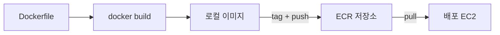

# 6주차 — 컨테이너 기초 (Docker · ECR)

**클라우드 MLOps** · 연성대학교 · 230분 (10분 조기 종료)
NCS: `2001070104_18v1.2` 인공지능 플랫폼 소프트웨어 환경 구현하기 / `2001070308_19v1.1` 인공지능 선정모델 구성 요소 관리하기(부분)

---

## 0. 회차 요약 (강사용 1페이지)

| 항목 | 내용 |
|---|---|
| 학습목표 | Docker를 설치해 이미지와 컨테이너를 구분해 다루고, 빈칸 채우기 템플릿을 이용해 Dockerfile을 완성·빌드·실행하며, 만든 이미지를 ECR에 push하고 다시 pull해 복구할 수 있다. |
| 오늘의 결과물 | ① EC2에서 도는 Docker ② 직접 빌드한 이미지 `mlops-train:0.1` ③ ECR 리포지토리 `mlops-2026-<학번>` 에 올라간 이미지 ④ 로컬 삭제 후 pull로 복구해 실행한 로그 |
| 사전 준비 | 저장소 태그 `week-06-start`/`week-06-done` 푸시 · Dockerfile 빈칸 템플릿 배포 · 학생 IAM에 `ecr:*`(본인 리포지토리 한정) 권한 확인 · **전 학생 EBS 여유 10GB 이상 사전 점검**(5주차 과제로 수집) · Docker Hub rate limit 대비 안내 |
| 학생 준비물 | 노트북, EC2 개발 서버, 4~5주차 학습 스크립트와 `requirements.txt`, 팀 데이터 접근 정보 |
| 예상 사고 지점 | ① `docker` 명령이 `permission denied`로 안 됨(그룹 반영 전) ② ECR 로그인 토큰 만료(12시간)로 push 실패 ③ 이미지 빌드 중 디스크 부족(`no space left on device`) |

### 시간표

| 시간 | 구성 | 분 |
|---|---|---|
| 00:00–00:10 | 도입 — 지난주 복습 퀴즈 + "제 컴퓨터에선 되는데요" 재현 실험 | 10 |
| 00:10–00:55 | 이론 — 컨테이너가 푸는 문제 / 이미지 vs 컨테이너 / 레이어 / Dockerfile 4명령 / 레지스트리와 ECR | 45 |
| 00:55–01:05 | 휴식 | 10 |
| 01:05–01:55 | **실습 A** — Docker 설치 → hello-world → 스크립트 컨테이너 실행 → Dockerfile 빈칸 완성 → 빌드/실행 | 50 |
| 01:55–02:05 | 휴식 | 10 |
| 02:05–03:30 | **실습 B** — ECR 생성 → 로그인 → tag → push → 로컬 삭제 → pull 복구 → 팀 이미지 만들기 | 85 |
| 03:30–03:45 | 체크포인트 제출 + 다음 주 예고 | 15 |
| 03:45–03:50 | 리소스 정리 타임 (이미지 정리 · 디스크 확인 · EC2 중지) | 5 |
| **합계** | | **230** |

---

## 1. 도입 (10분)

### 지난주 복습 퀴즈 (구두 3문항)

1. MLflow에서 파라미터와 메트릭을 구분하는 기준 한 줄은? — (미리 정할 수 있으면 파라미터, 돌려봐야 알면 메트릭)
2. 모델을 `models:/team-T01-model@champion` 처럼 이름으로 부르는 이유는? — (파일 경로를 서빙 코드에 하드코딩하지 않기 위해. 모델을 바꿔도 API 코드를 안 고쳐도 되고, 되돌리기가 쉬움)
3. MLflow 서버를 tmux 안에서 띄운 이유는? — (SSH를 끊으면 프로세스가 같이 죽기 때문. tmux는 터미널을 화면 밖에 붙잡아 둔다)

### 오늘 만들 것 데모

강사는 **먼저 문제를 재현해 보이고**, 그다음 해결책을 보여줍니다. 순서가 중요합니다.

**1단계 — 문제 재현 (2분)**
강사 EC2에 파이썬 3.8만 설치된 별도 계정/디렉터리를 준비해 두고, 5주차 학습 스크립트를 실행합니다.

```text
$ python train_mlflow.py --bucket mlops-2026-instructor
Traceback (most recent call last):
  ...
TypeError: OneHotEncoder.__init__() got an unexpected keyword argument 'sparse_output'
```

> "이 코드, 지난주에 제 컴퓨터에서 멀쩡히 돌던 코드입니다. 옆방 서버에서 돌리니까 죽습니다. 왜죠? scikit-learn 버전이 다릅니다. 여러분도 이런 경험 있죠? 조원이 짠 코드를 받아서 돌렸더니 안 되는 거요. 그러면 조원이 뭐라고 합니까? **'어? 제 컴퓨터에선 되는데요.'** 오늘은 이 문장을 없애러 왔습니다."

**2단계 — 해결 시연 (3분)**

```bash
docker run --rm mlops-train:0.1 python -c "import sklearn, sys; print(sys.version.split()[0], sklearn.__version__)"
# 3.11.10 1.5.2
```

> "지금 이 서버에는 파이썬 3.8이 깔려 있습니다. 그런데 방금 3.11이 찍혔죠. **파이썬을 새로 설치한 게 아닙니다.** 파이썬 3.11과 scikit-learn 1.5.2가 통째로 들어 있는 상자를 가져와서 그 안에서 돌린 겁니다. 이 상자를 컨테이너라고 합니다."

**3단계 — 오늘의 목적지 (1분)**
ECR 콘솔을 열어 `mlops-2026-instructor` 리포지토리의 이미지 목록을 보여줍니다.

> "그리고 그 상자를 AWS에 올려 두면, 다른 서버에서 한 줄로 내려받아 똑같이 돌릴 수 있습니다. 오늘 끝나면 여러분 이름의 리포지토리에 여러분이 만든 상자가 올라가 있을 겁니다. 그 상자가 **7주차에 API가 되고, 8주차에 배포되고, 12주차에 자동으로 만들어집니다.** 오늘이 그 시작입니다."

---

## 2. 이론 (45분)

### 2-1. "제 컴퓨터에선 되는데요" — 컨테이너가 푸는 문제 (10분)

**강의 스크립트**

> 방금 본 에러의 정체를 정리해 봅시다. 프로그램 하나를 돌리려면 뭐가 필요할까요? 코드만 있으면 될까요?
>
> 아닙니다. 코드 밑에 **파이썬 인터프리터**가 있어야 하고, 그 밑에 **라이브러리들**이 있어야 하고, 그 밑에 **운영체제 라이브러리**(리눅스의 각종 `.so` 파일들)가 있어야 하고, 또 **환경변수**와 **설정 파일**이 있어야 합니다. 코드는 이 탑의 꼭대기에 얹혀 있는 아주 얇은 층입니다.
>
> 우리가 GitHub에 올리는 건 뭐죠? **꼭대기 한 층뿐입니다.** 나머지는 "알아서 깔아라"입니다. 그래서 `requirements.txt`를 씁니다. 그런데 이것도 완벽하지 않아요. 파이썬 버전이 다르면? 리눅스 배포판이 다르면? `libgomp`가 없으면? 우분투랑 아마존리눅스가 다르면?
>
> 여기서 발상의 전환이 나옵니다. **"그럼 탑을 통째로 옮기면 되잖아."**
>
> 이걸 실제로 하는 방법이 예전에도 있었습니다. 가상머신(VM)입니다. 서버 안에 가짜 컴퓨터를 통째로 만들어서 운영체제부터 다 깔아 옮기는 거죠. 잘 됩니다. 그런데 문제가 있어요. **무겁습니다.** 운영체제 하나가 통째로 들어가니 파일 크기가 수 GB고, 켜는 데 1분씩 걸립니다.
>
> 컨테이너는 여기서 영리한 절충을 합니다. **운영체제의 커널(핵심부)은 호스트 것을 빌려 쓰고, 그 위의 파일 시스템과 라이브러리만 따로 싼다.** 그러니까 무게가 확 줄어듭니다. 수십~수백 MB, 시작은 1초 이내.
>
> 비유를 하나 들겠습니다. 이사를 한다고 합시다. 가상머신은 **집을 통째로 들어서 옮기는 것**입니다. 확실하지만 크레인이 필요하죠. 컨테이너는 **이삿짐 컨테이너 박스에 짐만 싸서 옮기는 것**입니다. 집(커널)은 그쪽 것을 쓰고, 내 짐(라이브러리·코드)만 상자에 담아 갑니다. 그래서 이름이 컨테이너예요. 실제로 이 이름은 항만의 컨테이너에서 왔습니다. 배·트럭·기차 뭐가 오든 규격이 같으니 그냥 얹으면 되는 거죠.
>
> 정리하면 컨테이너가 우리에게 주는 건 세 가지입니다. **① 어디서 돌려도 같은 환경 ② 가벼움 ③ 한 서버에서 여러 개를 격리해서 돌리기.** 우리 과목에서 제일 중요한 건 ①입니다. 7주차에 여러분 노트북에서 만든 API가 8주차에 EC2에서 똑같이 돌아야 하니까요.

**판서/슬라이드 요점**

- 프로그램 실행에 필요한 것 = 코드 + 런타임 + 라이브러리 + OS 라이브러리 + 설정 (**코드는 맨 위 한 층뿐**)
- `requirements.txt`는 라이브러리 층만 고정 → 파이썬 버전·OS 차이는 못 막음
- 가상머신 = 집을 통째로 이사 (무겁다, GB, 분 단위 부팅)
- 컨테이너 = 짐만 상자에 (가볍다, MB, 초 단위 시작) — **커널은 호스트 것을 공유**
- 얻는 것: ① 환경 동일성 ② 경량 ③ 격리

**학생 질문 예상 & 답변**

- Q: 그럼 가상머신은 이제 안 쓰나요? → A: 씁니다. 사실 우리 EC2가 가상머신입니다. 컨테이너는 커널을 공유하니까 **리눅스 컨테이너는 리눅스에서만** 돕니다. 윈도우/맥에서 Docker를 쓰면 뒤에서 리눅스 VM이 몰래 하나 돌고 있습니다. 그리고 보안 격리 수준은 VM이 더 강합니다. 용도가 다릅니다.
- Q: 컨테이너 안에 데이터도 넣나요? → A: 원칙적으로 **넣지 않습니다.** 컨테이너는 지웠다 다시 만들 수 있어야 하는데, 안에 데이터를 넣으면 지울 때 같이 날아갑니다. 데이터는 S3나 볼륨에 두고, 컨테이너는 "코드와 환경"만 담습니다. 우리 프로젝트도 데이터는 S3, 모델은 S3/MLflow에 둡니다.
- Q: 컨테이너 하나에 프로그램 여러 개 넣어도 되나요? → A: 기술적으로 되지만 권장하지 않습니다. **한 컨테이너에 한 프로세스**가 원칙입니다. 8주차에 API와 Streamlit UI를 띄울 때 컨테이너 두 개를 쓰고 `docker compose`로 묶는 이유가 그겁니다.

---

### 2-2. 이미지 vs 컨테이너, 그리고 레이어 (12분)

**강의 스크립트**

> 오늘 여러분이 제일 많이 헷갈릴 두 단어를 먼저 정리하겠습니다. **이미지(image)** 와 **컨테이너(container)** 입니다.
>
> 이렇게 생각하세요. **이미지는 붕어빵 틀이고, 컨테이너는 붕어빵입니다.** 틀은 하나인데 붕어빵은 여러 개 찍을 수 있죠. 틀은 굳어 있고 안 바뀝니다. 붕어빵은 먹으면 없어집니다.
>
> 프로그래밍을 배운 분들은 이렇게 생각해도 됩니다. **이미지는 클래스, 컨테이너는 인스턴스.**
>
> 구체적으로. 이미지는 **디스크에 저장된 읽기 전용 파일 묶음**입니다. `docker images`로 목록을 봅니다. 컨테이너는 **그 이미지를 가지고 실제로 돌고 있는(또는 돌았던) 프로세스**입니다. `docker ps`로 봅니다. 이미지 하나로 컨테이너를 열 개 만들 수 있습니다.
>
> 여기서 중요한 성질 하나. **컨테이너 안에서 파일을 바꿔도 이미지는 안 바뀝니다.** 컨테이너를 지우면 그 변경도 같이 사라집니다. 이걸 처음 만나면 "어? 내가 저장한 파일 어디 갔지?" 하고 당황합니다. 그래서 오늘 실습에서 `-v` 옵션으로 호스트 폴더를 컨테이너 안에 연결하는 걸 배웁니다.
>
> 이제 **레이어(layer)** 이야기를 하겠습니다. 이게 Docker의 진짜 영리한 부분입니다.
>
> 이미지는 하나의 통짜 파일이 아니라 **여러 겹의 층이 쌓인 것**입니다. 투명 필름을 여러 장 겹쳐 그림을 완성하는 거랑 같아요. 맨 아래에 우분투 파일들 한 층, 그 위에 파이썬 한 층, 그 위에 pip로 깐 라이브러리 한 층, 맨 위에 내 코드 한 층.
>
> 왜 이렇게 만들까요? **재사용 때문입니다.** 여러분이 코드 한 줄을 고쳐서 다시 빌드한다고 합시다. 맨 위 층만 새로 만들면 되죠? 아래 세 층은 이미 있으니 그대로 씁니다. 그래서 두 번째 빌드부터는 몇 초 만에 끝납니다. 이걸 **레이어 캐시**라고 합니다.
>
> 자, 그럼 여기서 아주 실용적인 결론이 나옵니다. 여러분이 오늘 Dockerfile을 쓸 때, **자주 바뀌는 걸 아래쪽(나중)에 쓰고, 잘 안 바뀌는 걸 위쪽(먼저)에 써야 합니다.** 코드는 매일 바뀌고 `requirements.txt`는 몇 주에 한 번 바뀌죠? 그러니까 `requirements.txt`를 먼저 복사해서 설치하고, **그다음에** 코드를 복사해야 합니다.
>
> 만약 순서를 반대로 하면? 코드 한 글자만 고쳐도 그 아래층인 pip install이 무효가 돼서 라이브러리를 전부 다시 깝니다. 3분 걸릴 게 5초면 되는데 매번 3분 기다리는 거죠. 오늘 실습에서 이걸 직접 시간 재서 확인합니다.

**판서/슬라이드 요점**

| | 이미지 (image) | 컨테이너 (container) |
|---|---|---|
| 비유 | 붕어빵 틀 / 클래스 | 붕어빵 / 인스턴스 |
| 상태 | 읽기 전용, 변하지 않음 | 실행 중이거나 멈춘 프로세스 |
| 확인 명령 | `docker images` | `docker ps -a` |
| 관계 | 1개 | N개 만들 수 있음 |

- 이미지 = **레이어(층)의 쌓임**. 층 단위로 캐시·재사용된다
- 컨테이너 안에서 만든 변경은 컨테이너를 지우면 사라진다 → 데이터는 `-v`로 밖에 둔다
- **Dockerfile 작성 철칙: 잘 안 바뀌는 것 먼저, 자주 바뀌는 것 나중에**
- `requirements.txt` 복사 → 설치 → **그다음** 코드 복사

**학생 질문 예상 & 답변**

- Q: 이미지 하나가 몇 GB인데 이게 가벼운 건가요? → A: `python:3.11` 은 약 1GB지만 `python:3.11-slim` 은 약 150MB입니다. 뒤에 붙는 `-slim`은 필요 없는 걸 뺀 버전이라는 뜻이고, 우리는 이걸 씁니다. 그리고 같은 베이스를 쓰는 이미지 열 개를 받아도 **베이스 층은 한 번만 저장**됩니다.
- Q: 컨테이너를 껐다 켜면 안에 있던 파일이 사라지나요? → A: `docker stop` 후 `docker start`는 유지됩니다. `docker rm`으로 지우면 사라집니다. 우리가 오늘 자주 쓸 `--rm` 옵션은 "끝나면 바로 지워라"라는 뜻이라 남지 않습니다.
- Q: 태그(`:0.1`)는 뭔가요? → A: 이미지의 버전 이름표입니다. `mlops-train:0.1`에서 `mlops-train`이 이름, `0.1`이 태그입니다. 안 붙이면 `latest`가 붙는데, **실무에서 `latest`만 쓰면 어느 버전이 올라간 건지 알 수 없어 사고가 납니다.** 오늘부터 버전을 붙이는 습관을 들이세요.

---

### 2-3. Dockerfile — `FROM` / `COPY` / `RUN` / `CMD` (12분)

**강의 스크립트**

> 이미지를 어떻게 만들까요? **레시피를 씁니다.** 그 레시피 파일 이름이 `Dockerfile`입니다. 확장자가 없습니다. 대문자 D로 시작합니다.
>
> 문법은 놀랄 만큼 단순합니다. 오늘 배울 건 네 개뿐입니다. 요리에 비유해서 설명하겠습니다.
>
> **`FROM`** — 어떤 밑재료에서 시작할 것인가. 우리는 맨땅에서 시작하지 않습니다. 이미 파이썬이 깔린 이미지를 가져다 씁니다. `FROM python:3.11-slim` 이렇게요. 이게 **반죽이 이미 되어 있는 상태에서 시작하는 것**입니다. 모든 Dockerfile의 첫 줄은 무조건 `FROM`입니다.
>
> **`COPY`** — 내 파일을 상자 안에 넣기. `COPY train.py /app/train.py` 하면 내 폴더의 `train.py`가 이미지 안 `/app/` 으로 들어갑니다. **왼쪽이 내 컴퓨터, 오른쪽이 상자 안**입니다. 이 방향을 헷갈리는 학생이 매년 나옵니다.
>
> **`RUN`** — 상자를 만드는 도중에 실행할 명령. `RUN pip install -r requirements.txt` 처럼요. **이건 빌드할 때 딱 한 번 실행되고 그 결과가 이미지에 굳습니다.** 라이브러리 설치, 폴더 만들기 같은 게 여기 들어갑니다.
>
> **`CMD`** — 상자를 열었을 때 기본으로 실행할 명령. `CMD ["python", "train.py"]` 처럼요. **이건 빌드할 때가 아니라 컨테이너를 시작할 때 실행됩니다.**
>
> 여기서 `RUN`과 `CMD`를 구분하는 게 오늘의 핵심 이해입니다. 다시 요리 비유로 가면, **`RUN`은 요리하는 과정이고 `CMD`는 손님에게 내는 것**입니다. `RUN`은 여러 번 쓸 수 있지만 `CMD`는 마지막 하나만 유효합니다.
>
> 두 개만 더 알려드리겠습니다. **`WORKDIR`** 은 상자 안의 작업 폴더를 정합니다. `cd` 라고 생각하면 됩니다. **`ENV`** 는 환경변수를 심습니다. 우리는 AWS 리전을 여기 넣을 겁니다.
>
> 마지막으로 `.dockerignore`. `.gitignore`랑 똑같은 개념입니다. 상자에 넣지 말 것들을 적습니다. **`.venv` 폴더나 대용량 CSV를 안 빼면 이미지가 몇 GB로 부풀고, 오늘 디스크가 터집니다.** 반드시 만드세요.
>
> 자, 오늘 여러분은 이 Dockerfile을 **백지에서 쓰지 않습니다.** 제가 빈칸이 뚫린 템플릿을 드립니다. 여섯 개 빈칸만 채우면 됩니다. 다만 채우면서 "왜 여기가 이 순서인가"를 생각하세요. 그게 오늘 배울 것의 전부입니다.

**판서/슬라이드 요점**

| 명령 | 언제 실행 | 하는 일 | 예 |
|---|---|---|---|
| `FROM` | 빌드 시작 | 밑바탕 이미지 지정 (**항상 첫 줄**) | `FROM python:3.11-slim` |
| `WORKDIR` | 빌드 | 상자 안 작업 폴더 지정 (`cd`) | `WORKDIR /app` |
| `COPY` | 빌드 | 내 파일 → 상자 안 (**왼쪽=내PC, 오른쪽=상자**) | `COPY train.py .` |
| `RUN` | **빌드 시 1회** | 상자를 만드는 도중 명령 실행 | `RUN pip install -r requirements.txt` |
| `ENV` | 빌드 | 환경변수 심기 | `ENV AWS_DEFAULT_REGION=ap-northeast-2` |
| `CMD` | **컨테이너 시작 시** | 기본 실행 명령 (**마지막 1개만 유효**) | `CMD ["python", "train.py"]` |

- `RUN`은 요리 과정, `CMD`는 손님에게 내는 것
- 순서 원칙: `FROM` → `WORKDIR` → **`COPY requirements.txt` → `RUN pip install`** → `COPY 코드` → `CMD`
- `.dockerignore` 필수 — `.venv`, `*.csv`, `*.pkl`, `.git` 제외

**학생 질문 예상 & 답변**

- Q: `CMD` 를 `CMD python train.py` 라고 써도 되나요? → A: 동작은 합니다(셸 형식). 다만 대괄호를 쓰는 형식(exec 형식)이 권장됩니다. 셸 형식은 프로세스 구조가 한 겹 더 생겨서 컨테이너를 정지할 때 신호가 제대로 전달되지 않는 문제가 있습니다. **대괄호 형식으로 쓰는 습관**을 들이세요.
- Q: `RUN`을 여러 줄 쓰면 안 좋다던데요? → A: `RUN` 한 줄이 레이어 한 층이라 층이 많아집니다. 그래서 실무에서는 `apt-get update && apt-get install -y ... && rm -rf /var/lib/apt/lists/*` 처럼 `&&`로 묶습니다. 오늘 템플릿에도 그렇게 되어 있습니다.
- Q: `COPY . .` 하면 편한데 왜 나눠 쓰나요? → A: 편하지만 **레이어 캐시를 다 버립니다.** 코드 한 글자만 고쳐도 pip install부터 다시 돕니다. 오늘 실습 ⑥에서 시간을 직접 재서 차이를 확인합니다.

---

### 2-4. 레지스트리와 ECR — 상자를 어디에 보관하는가 (11분)

**강의 스크립트**

> 상자를 만들었습니다. 그런데 그 상자는 지금 여러분 EC2 안에만 있습니다. 8주차에 다른 서버에 배포하려면 어떻게 옮기죠?
>
> USB로 복사하나요? 아닙니다. **레지스트리(registry)** 를 씁니다. 우리말로 하면 이미지 보관소입니다.
>
> 개념은 GitHub이랑 똑같습니다. GitHub이 코드를 올려두고 `git push` / `git pull` 하는 곳이라면, 레지스트리는 이미지를 올려두고 `docker push` / `docker pull` 하는 곳입니다. 명령어 이름까지 똑같죠? 일부러 그렇게 만든 겁니다.
>
> 가장 유명한 공개 레지스트리가 **Docker Hub**입니다. 우리가 `FROM python:3.11-slim` 이라고 쓰면 Docker Hub에서 자동으로 받아옵니다. 여러분은 이미 오늘 Docker Hub를 쓴 겁니다.
>
> 그런데 회사에서 만든 이미지를 Docker Hub에 공개로 올리면 어떻게 되죠? 전 세계가 봅니다. 코드가 그 안에 들어 있는데요. 그래서 **비공개 레지스트리**가 필요합니다. AWS가 제공하는 게 **ECR(Elastic Container Registry)** 입니다.
>
> ECR을 쓰면 좋은 점이 세 가지 있습니다. **첫째, 비공개**입니다. IAM 권한이 있는 사람만 받습니다. **둘째, 같은 AWS 안이라 빠르고 전송 요금이 안 나옵니다.** 서울 리전 EC2가 서울 리전 ECR에서 받으면 인터넷을 안 거칩니다. **셋째, IAM으로 권한 관리가 됩니다.** 별도 계정 체계를 안 만들어도 됩니다.
>
> ECR을 쓸 때 하나 알아둘 게 있습니다. **로그인이 필요한데, 그 로그인 토큰이 12시간짜리입니다.** 그래서 어제 로그인했다고 오늘 push가 되는 게 아닙니다. 매번 이 명령을 먼저 칩니다.
>
> ```
> aws ecr get-login-password | docker login --username AWS --password-stdin <계정ID>.dkr.ecr.ap-northeast-2.amazonaws.com
> ```
>
> 이 명령이 하는 일은 이겁니다. **AWS에게 "나 인증된 사용자야, 임시 비밀번호 하나 줘"** 하고 받아서, 그걸 바로 `docker login`에 파이프로 넘기는 거죠. 오늘 실습 중에 push가 갑자기 안 되면 90%는 이 토큰이 만료된 겁니다. **제일 먼저 다시 로그인해 보세요.**
>
> 마지막으로 이미지 주소 형식을 봅시다. ECR의 이미지 주소는 이렇게 생겼습니다.
>
> ```
> 123456789012.dkr.ecr.ap-northeast-2.amazonaws.com/mlops-2026-20251234:0.1
> └──── 계정 ID ────┘        └── 리전 ──┘                └ 리포지토리 ┘ └태그┘
> ```
>
> 길죠? 그래서 `docker tag` 명령으로 **로컬 이름에 이 긴 주소를 별명으로 붙여 줍니다.** 파일에 바로가기를 만드는 것과 같습니다. 원본은 그대로 있고 이름표가 하나 더 붙는 겁니다.

**판서/슬라이드 요점**

- 레지스트리 = 이미지 보관소. **GitHub : 코드 = 레지스트리 : 이미지**
- 공개 레지스트리 = Docker Hub (`FROM python:3.11-slim` 이 여기서 옴)
- 비공개 = **Amazon ECR** — ① 비공개 ② 같은 리전이면 빠르고 전송비 없음 ③ IAM 권한 통합
- ECR 로그인 토큰은 **12시간 유효** → push 실패 시 재로그인부터
- 이미지 주소: `<계정ID>.dkr.ecr.<리전>.amazonaws.com/<리포지토리>:<태그>`
- `docker tag` = 별명 붙이기 (복사가 아님)
- 흐름: **build → tag → login → push** / 받을 때: **login → pull → run**

**학생 질문 예상 & 답변**

- Q: ECR도 돈이 드나요? → A: 저장 용량 기준 GB당 월 $0.10 수준입니다. 우리 이미지가 500MB면 월 $0.05입니다. 무시할 수준이지만, **오래된 이미지가 계속 쌓이면 늘어납니다.** 그래서 오늘 정리 시간에 필요 없는 태그를 지웁니다. 실무에서는 수명 주기 정책으로 자동 삭제를 겁니다.
- Q: Docker Hub에서 받을 때 자꾸 실패해요. → A: Docker Hub는 익명 사용자에게 **시간당 pull 횟수 제한**을 겁니다. 실습실에서 30명이 같은 IP로 나가면 걸릴 수 있습니다. 그럴 땐 강사가 미리 ECR Public 또는 학과 계정 ECR에 올려 둔 미러 이미지를 씁니다. 실습 중 이 상황이 오면 안내합니다.
- Q: 같은 이미지를 태그만 다르게 여러 개 올리면 용량도 배로 드나요? → A: 아닙니다. 레이어 단위로 저장되므로 **같은 레이어는 한 번만** 저장됩니다. 코드 한 줄만 바뀐 이미지를 10개 올려도 용량은 거의 안 늘어납니다.

---

## 3. 실습 A — Docker 설치하고 내 손으로 이미지 만들기 (50분) · 공통 예제 따라하기

**목표** EC2에 Docker를 설치해 이미지와 컨테이너를 구분해 다루고, 빈칸 템플릿을 채워 완성한 Dockerfile로 학습 스크립트 이미지를 빌드·실행한다.

**사전 배포 파일**

| 파일 | 내용 | 배포 방식 |
|---|---|---|
| `Dockerfile.template` | **빈칸 6개짜리 Dockerfile** (아래 원문 수록) | LMS + 저장소 `week-06-start` |
| `.dockerignore` | 제외 목록 (완성본 제공) | 저장소 `week-06-start` |
| `requirements.txt` | 5주차와 동일 버전 | 저장소 `week-06-start` |
| `hello_gpu.py` | 컨테이너 환경 확인용 짧은 스크립트 | 저장소 `week-06-start` |

### 수행 순서

**① EC2 접속 및 디스크 여유 확인 (3분)**

```bash
ssh -i <키파일경로> ubuntu@<퍼블릭IP>
df -h /
```

- 확인 포인트: `Avail` 이 **10G 이상**이어야 합니다. 미만이면 아래를 먼저 실행합니다.

```bash
du -sh ~/* 2>/dev/null | sort -h | tail -10     # 뭐가 용량을 먹는지 확인
rm -f ~/mlops/*.pkl                              # S3에 이미 올린 모델 파일 정리
pip cache purge
```

**② Docker 설치 (10분)**

```bash
# 공식 설치 스크립트 사용 (우분투 기준)
curl -fsSL https://get.docker.com -o get-docker.sh
sudo sh get-docker.sh

# 버전 확인
sudo docker --version
```

- 확인 포인트: `Docker version 27.x.x` 같은 출력이 나오면 성공입니다.

지금 `sudo` 없이 `docker ps`를 쳐 보세요. **에러가 납니다.** 일부러 시켜서 에러를 보게 합니다.

```bash
docker ps
# permission denied while trying to connect to the Docker daemon socket ...
```

> 강사 멘트: "이 에러, 오늘 여러분이 제일 많이 볼 에러입니다. Docker는 시스템 권한이 필요한 프로그램이라 기본적으로 관리자만 쓸 수 있습니다. 매번 `sudo`를 붙이거나, 내 계정을 `docker` 그룹에 넣으면 됩니다."

```bash
sudo usermod -aG docker $USER
```

**그리고 여기서 함정이 있습니다.** 이 명령을 쳐도 **지금 세션에는 반영되지 않습니다.** 그룹 정보는 로그인할 때 읽어오기 때문입니다. SSH를 끊고 다시 접속해야 합니다.

```bash
exit
# 다시 접속
ssh -i <키파일경로> ubuntu@<퍼블릭IP>
docker ps       # 이제 sudo 없이 됩니다
groups          # 목록에 docker 가 있으면 성공
```

- 확인 포인트: `docker ps` 가 헤더만 있는 빈 표를 출력하면 성공입니다. (`CONTAINER ID   IMAGE   COMMAND ...`)

**③ `hello-world` 로 첫 컨테이너 (3분)**

```bash
docker run hello-world
```

- 확인 포인트: `Hello from Docker!` 가 나오면 성공입니다.

무슨 일이 일어났는지 눈으로 확인합니다.

```bash
docker images        # 이미지 목록 — hello-world 가 보임
docker ps            # 실행 중 컨테이너 — 비어 있음 (이미 끝났으니까)
docker ps -a         # 끝난 것까지 포함 — Exited (0) 상태로 보임
```

> 강사 멘트: "여기서 이미지와 컨테이너의 차이가 보입니다. `docker images`에는 있고 `docker ps`에는 없죠. **틀은 남아 있고 붕어빵은 먹었습니다.**"

```bash
docker rm $(docker ps -aq --filter "ancestor=hello-world")   # 끝난 컨테이너 청소
```

**④ 내 파이썬 스크립트를 컨테이너로 실행하기 (7분)**

아직 Dockerfile을 쓰지 않고, **공식 파이썬 이미지를 빌려서** 내 스크립트를 돌려봅니다.

```bash
mkdir -p ~/docker-lab && cd ~/docker-lab
cat > hello_env.py << 'EOF'
import platform
import sys

print("=" * 50)
print("파이썬 버전 :", sys.version.split()[0])
print("운영체제    :", platform.platform())
try:
    import sklearn
    print("scikit-learn:", sklearn.__version__)
except ImportError:
    print("scikit-learn: 설치 안 됨")
print("=" * 50)
EOF

# 먼저 EC2에서 그냥 실행 (호스트 환경)
python3 hello_env.py

# 이번엔 컨테이너 안에서 실행
docker run --rm -v "$PWD":/app -w /app python:3.11-slim python hello_env.py
```

옵션 뜻을 한 줄씩 짚습니다.

| 옵션 | 뜻 |
|---|---|
| `--rm` | 끝나면 컨테이너를 자동으로 지운다 (찌꺼기 방지) |
| `-v "$PWD":/app` | 지금 폴더를 컨테이너 안 `/app` 에 연결한다 (**왼쪽=내 서버, 오른쪽=상자 안**) |
| `-w /app` | 컨테이너 안 작업 폴더를 `/app` 으로 (`cd` 와 같음) |
| `python:3.11-slim` | 사용할 이미지 |
| `python hello_env.py` | 컨테이너 안에서 실행할 명령 |

- 확인 포인트: **두 실행의 파이썬 버전이 다릅니다.** 호스트는 3.12(우분투 24.04 기준), 컨테이너는 3.11.x가 나옵니다. 이게 오늘의 핵심 체험입니다.
- 두 실행 모두 `scikit-learn: 설치 안 됨` 이 나올 수 있습니다. 다음 단계에서 해결합니다.

컨테이너 안에 들어가 보기 (선택, 30초):

```bash
docker run --rm -it python:3.11-slim bash
# 컨테이너 안입니다
ls /
cat /etc/os-release      # 데비안이라고 나옵니다. 호스트는 우분투인데도!
exit
```

**⑤ Dockerfile 빈칸 채우기 → 완성 (15분)**

> **난이도 대응**: 백지에서 쓰지 않습니다. 아래 템플릿을 그대로 받아 **`____` 여섯 곳만** 채웁니다.

**Dockerfile 빈칸 템플릿 원문** (LMS 배포본과 동일)

```dockerfile
# ============================================================
#  6주차 실습 A — Dockerfile 빈칸 채우기 템플릿
#  ____ 로 표시된 6곳만 채우면 됩니다. 나머지는 건드리지 마세요.
#  힌트는 각 줄 위 주석에 있습니다.
# ============================================================

# [빈칸 1] 밑바탕 이미지를 지정합니다.
#   힌트: 파이썬 3.11의 가벼운(slim) 공식 이미지. 형식은 이름:태그
FROM ____

# 상자 안 작업 폴더를 /app 으로 정합니다. (이 줄은 완성되어 있습니다)
WORKDIR /app

# 환경변수. 리전을 고정하고, 파이썬 로그가 바로 보이게 합니다.
ENV AWS_DEFAULT_REGION=ap-northeast-2
ENV PYTHONUNBUFFERED=1

# [빈칸 2] 라이브러리 목록 파일만 먼저 상자 안으로 복사합니다.
#   힌트: 왼쪽은 내 서버의 파일명, 오른쪽은 상자 안 경로(. 은 현재 WORKDIR)
#   왜 코드보다 먼저 복사할까요? → 레이어 캐시를 살리기 위해서입니다.
COPY ____ .

# [빈칸 3] 복사한 목록대로 라이브러리를 설치합니다.
#   힌트: 빌드 중에 실행하는 명령. pip 설치 명령을 그대로 씁니다.
#   --no-cache-dir 는 pip 캐시를 남기지 않아 이미지 용량을 줄입니다.
____ pip install --no-cache-dir -r requirements.txt

# [빈칸 4] 이제 내 코드를 전부 상자 안으로 복사합니다.
#   힌트: 현재 폴더 전체를 상자의 현재 폴더로. (.dockerignore 가 제외 목록을 걸러줍니다)
COPY ____ .

# [빈칸 5] 컨테이너를 시작할 때 기본으로 실행할 명령을 정합니다.
#   힌트: 대괄호 형식으로. ["실행파일", "인자1", "인자2"]
#         hello_env.py 를 파이썬으로 실행하게 하세요.
CMD ____

# [빈칸 6] 이 이미지를 만든 사람을 기록합니다. (선택이지만 오늘은 필수 제출 항목)
#   힌트: LABEL 키="값" 형식. owner 라는 키에 본인 학번을 넣으세요.
LABEL ____
```

**완성 예시** (강사는 학생이 다 채운 뒤에 공개합니다)

```dockerfile
FROM python:3.11-slim

WORKDIR /app

ENV AWS_DEFAULT_REGION=ap-northeast-2
ENV PYTHONUNBUFFERED=1

COPY requirements.txt .

RUN pip install --no-cache-dir -r requirements.txt

COPY . .

CMD ["python", "hello_env.py"]

LABEL owner="20251234"
```

작업 폴더에 필요한 파일들을 만듭니다.

```bash
cd ~/docker-lab

cat > requirements.txt << 'EOF'
pandas==2.2.3
numpy==2.1.3
scikit-learn==1.5.2
joblib==1.4.2
boto3==1.35.54
EOF

cat > .dockerignore << 'EOF'
.venv/
__pycache__/
*.pyc
*.csv
*.pkl
*.db
.git/
.gitignore
mlruns/
EOF

nano Dockerfile      # 위 템플릿을 붙여 넣고 빈칸 6개를 채운다
```

빌드합니다.

```bash
time docker build -t mlops-train:0.1 .
```

- 확인 포인트: 마지막에 `naming to docker.io/library/mlops-train:0.1` 과 유사한 줄이 나오고, `docker images` 에 `mlops-train  0.1` 이 보이면 성공입니다.
- 걸린 시간을 메모해 둡니다 (보통 2~4분).

**⑥ 실행 + 레이어 캐시 체감 (12분)**

```bash
docker run --rm mlops-train:0.1
```

- 확인 포인트: `scikit-learn: 1.5.2` 가 출력됩니다. **호스트에는 없는데 상자 안에는 있습니다.** 이게 오늘의 결론입니다.

기본 명령(`CMD`)을 무시하고 다른 명령을 실행할 수도 있습니다.

```bash
docker run --rm mlops-train:0.1 python -c "import sklearn; print(sklearn.__version__)"
docker run --rm -it mlops-train:0.1 bash      # 상자 안에서 둘러보기, exit 로 나옴
```

이제 **레이어 캐시**를 눈으로 확인합니다.

```bash
# 1) 코드만 한 글자 고친다
echo 'print("두 번째 빌드")' >> hello_env.py

# 2) 다시 빌드하고 시간을 잰다
time docker build -t mlops-train:0.2 .
```

- 확인 포인트: 로그에 `CACHED` 표시가 여러 줄 보이고, **빌드 시간이 몇 초로 줄어듭니다.** pip install 층이 재사용된 것입니다.

이번엔 **일부러 순서를 잘못 쓴 Dockerfile**로 비교합니다.

```bash
cat > Dockerfile.bad << 'EOF'
FROM python:3.11-slim
WORKDIR /app
COPY . .
RUN pip install --no-cache-dir -r requirements.txt
CMD ["python", "hello_env.py"]
EOF

time docker build -f Dockerfile.bad -t mlops-train:bad .
echo 'print("세 번째")' >> hello_env.py
time docker build -f Dockerfile.bad -t mlops-train:bad .    # 캐시가 안 먹는다
```

- 확인 포인트: 좋은 Dockerfile은 재빌드가 수 초, 나쁜 Dockerfile은 매번 pip install부터 다시 돕니다. **이 시간 차이를 캡처해서 제출합니다.**

이미지 크기와 레이어 구조도 확인합니다.

```bash
docker images mlops-train
docker history mlops-train:0.1        # 층별 크기가 보인다
```

### ⚠ 여기서 막히면

| 증상 | 원인 | 조치 |
|---|---|---|
| `permission denied while trying to connect to the Docker daemon socket at unix:///var/run/docker.sock` | 계정이 `docker` 그룹에 없거나, 그룹 추가 후 재접속을 안 함 | ① `sudo usermod -aG docker $USER` ② **`exit` 후 SSH 재접속** ③ `groups` 에 `docker` 확인. 급하면 `sudo docker ...` 로 진행 |
| `docker: command not found` | 설치 스크립트가 중간에 실패 | `sudo sh get-docker.sh` 를 다시 실행하고 마지막 줄의 에러를 읽는다. `sudo apt-get install -y docker.io` 로 대체 가능 |
| `Cannot connect to the Docker daemon. Is the docker daemon running?` | 데몬이 안 떠 있음 | `sudo systemctl start docker && sudo systemctl enable docker` |
| 빌드 중 `no space left on device` | 디스크 부족 (EBS 30GB에 이미지·캐시가 쌓임) | `df -h /` → `docker system df` 로 확인 → `docker system prune -a -f` (미사용 이미지·캐시 삭제). 그래도 부족하면 `~/mlops` 의 CSV·pkl 정리, 최후에 조교가 EBS 확장 |
| 빌드가 `COPY failed: file not found` | `COPY` 대상 파일이 현재 폴더에 없음 | `ls` 로 `requirements.txt` 존재 확인. Dockerfile이 있는 폴더에서 `docker build ... .` 를 실행해야 한다 (마지막 `.` 이 빌드 컨텍스트) |
| 빌드가 `context` 전송에서 몇 분씩 멈춤 | `.dockerignore` 없이 대용량 파일까지 전부 전송 중 | `Ctrl+C` 로 중단 → `.dockerignore` 작성 → 재빌드. `.venv`, `*.csv`, `mlruns/` 를 반드시 포함 |
| `ERROR: failed to solve: python:3.11-slim: ... toomanyrequests` | Docker Hub 익명 pull 횟수 제한 (실습실 공용 IP) | 강사가 안내하는 **미러 이미지**로 `FROM` 을 교체. 예: `FROM public.ecr.aws/docker/library/python:3.11-slim` |
| `pip install` 이 아주 느리거나 타임아웃 | 네트워크 또는 패키지 빌드 | `pip install --no-cache-dir` 유지 + 재시도. numpy/scikit-learn은 휠(wheel)로 받아지므로 정상은 1~3분 |
| 컨테이너 안에서 만든 파일이 사라짐 | 컨테이너를 `--rm` 으로 지웠음 | 정상 동작. 남겨야 하는 결과물은 `-v "$PWD":/app` 로 호스트 폴더에 쓰게 한다 |
| `standard_init_linux.go: exec format error` | 다른 CPU 아키텍처용 이미지 | EC2가 x86(t3)인데 ARM 이미지를 받은 경우. `docker build --platform linux/amd64 ...` 로 지정 |

### 컷오프 안내

50분 경과 시 강제 종료합니다. ⑥번까지 못 온 학생은 완성본을 받아 실습 B로 진입합니다.

```bash
cd ~/mlops
git stash
git checkout week-06-done
cp -r docker-lab-done ~/docker-lab2 && cd ~/docker-lab2
docker build -t mlops-train:0.1 .
```

Docker 설치 자체가 안 된 학생은 **조교가 개별 처리**하고, 그동안 실습 B의 ECR 리포지토리 생성·콘솔 확인 부분(1~2단계)을 먼저 진행하게 합니다.

---

## 4. 실습 B — ECR에 올리고 다시 내려받아 복구하기 (85분) · 각자/팀이 직접 수행

**목표** 본인 ECR 리포지토리를 만들어 이미지를 push하고, 로컬 이미지를 완전히 삭제한 뒤 pull로 복구해 동일하게 실행되는 것을 확인한다. 이어서 팀 학습 코드로 이미지를 만든다.

**과제 지시문** (학생에게 그대로 읽어줍니다)

> "85분입니다. 세 덩어리입니다.
> **첫 35분** — 실습 A에서 만든 이미지를 ECR에 올립니다. 순서는 딱 네 단계예요. **만들고(create), 로그인하고(login), 별명 붙이고(tag), 올린다(push).** 이 네 단어를 외우세요.
> **다음 20분** — 여기가 오늘의 하이라이트입니다. **여러분 EC2에서 이미지를 완전히 지우세요.** 무섭죠? 지우세요. 그리고 ECR에서 다시 받아서 실행해 보세요. 똑같이 돌아갑니다. 이걸 직접 해봐야 '이제 내 이미지는 내 서버에 묶여 있지 않다'는 감각이 생깁니다. **8주차에 우리는 완전히 다른 서버에서 이걸 받아 배포할 겁니다.**
> **마지막 30분** — 팀 학습 스크립트를 컨테이너에 담으세요. 실습 A의 Dockerfile에서 `CMD` 한 줄만 바꾸면 됩니다. 그리고 컨테이너 안에서 S3에 접근해야 하니 자격 증명을 어떻게 넘길지 고민해 보세요. 힌트는 지시문 아래에 있습니다.
> 그리고 오늘 반드시 지킬 것 하나. **`latest` 태그만 쓰지 마세요.** `0.1`, `0.2` 처럼 버전을 붙이세요. 8주차에 '어제 잘 되던 게 왜 안 되지'가 나왔을 때 되돌릴 방법이 그것뿐입니다."

### 수행 항목

**1. ECR 리포지토리 생성 (10분)**

먼저 본인 AWS 계정 ID를 확인합니다. 이후 모든 명령에 들어갑니다.

```bash
aws sts get-caller-identity --query Account --output text
# 예: 123456789012  ← 이 숫자를 메모하세요
```

**방법 1 — CLI (권장)**

```bash
# <학번>: 본인 학번
aws ecr create-repository \
  --repository-name mlops-2026-<학번> \
  --region ap-northeast-2 \
  --image-scanning-configuration scanOnPush=true \
  --tags Key=Course,Value=MLOps Key=Team,Value=T<팀번호> Key=Owner,Value=<학번>
```

- 확인 포인트: 출력 JSON의 `repositoryUri` 를 메모합니다. `123456789012.dkr.ecr.ap-northeast-2.amazonaws.com/mlops-2026-20251234` 형태입니다.

**방법 2 — 콘솔**
AWS 콘솔 → ECR → 리포지토리 → **리포지토리 생성** → 이름 `mlops-2026-<학번>` → 푸시 시 스캔 켜기 → 태그 3종(`Course=MLOps`, `Team=T<팀번호>`, `Owner=<학번>`) 입력 → 생성.

> ⚠ 태그 3종은 **교육계획서 비용 운영 정책상 필수**입니다. 강사가 Cost Explorer에서 태그별로 확인합니다. 빠뜨리면 감점입니다.

**2. ECR 로그인 (5분)**

```bash
# <계정ID>: 위에서 확인한 12자리 숫자
aws ecr get-login-password --region ap-northeast-2 \
  | docker login --username AWS --password-stdin <계정ID>.dkr.ecr.ap-northeast-2.amazonaws.com
```

- 확인 포인트: `Login Succeeded` 가 나오면 성공입니다.
- ⚠ **이 토큰은 12시간 유효**합니다. 다음 주 수업에서는 반드시 다시 실행해야 합니다.

경고 메시지 `WARNING! Your password will be stored unencrypted in /home/ubuntu/.docker/config.json` 는 정상이며, 실습 환경에서는 무시합니다.

**3. tag → push (10분)**

```bash
# 편의를 위해 변수로 잡아 둡니다 (이 세션에서만 유효)
export ACCOUNT_ID=<계정ID>
export REGION=ap-northeast-2
export REPO=mlops-2026-<학번>
export ECR_URI=${ACCOUNT_ID}.dkr.ecr.${REGION}.amazonaws.com/${REPO}

# 로컬 이름에 ECR 주소 별명을 붙인다 (복사가 아니라 이름표 추가)
docker tag mlops-train:0.1 ${ECR_URI}:0.1

docker images | grep mlops       # 같은 IMAGE ID에 이름이 두 개 붙어 있는 것 확인

# 올린다
docker push ${ECR_URI}:0.1
```

- 확인 포인트: 레이어별 진행률이 흐르고 마지막에 `0.1: digest: sha256:... size: ...` 가 나오면 성공입니다.

```bash
aws ecr list-images --repository-name ${REPO} --region ${REGION}
```

콘솔 → ECR → 리포지토리 → 이미지 목록 화면을 캡처합니다. → 체크포인트 제출물 ②

**4. 로컬 이미지 삭제 → pull 복구 확인 (20분)**

**(a) 지우기 전에 현재 상태를 캡처합니다.**

```bash
docker images | grep mlops
docker run --rm ${ECR_URI}:0.1        # 지금은 로컬에 있으니 바로 실행됨
```

**(b) 로컬에서 완전히 지웁니다.**

```bash
docker rmi mlops-train:0.1
docker rmi ${ECR_URI}:0.1
docker images | grep mlops            # 아무것도 안 나와야 정상
```

- 확인 포인트: 아무 줄도 안 나오면 성공입니다. 안 지워지면 그 이미지를 쓰는 컨테이너가 남아 있는 것이니 `docker rm $(docker ps -aq)` 후 다시 시도합니다.

**(c) ECR에서 다시 받아 실행합니다.**

```bash
docker pull ${ECR_URI}:0.1
docker run --rm ${ECR_URI}:0.1
```

- 확인 포인트: 실습 A와 **똑같은 출력**(`scikit-learn: 1.5.2` 포함)이 나오면 성공입니다.
- 이 (b)→(c) 과정을 한 화면에 담아 캡처합니다. → 체크포인트 제출물 ③

> 순회 중 강사 멘트: "지금 여러분 이미지는 서버에 묶여 있지 않습니다. 다음 주에 이 상자 안에 API를 넣고, 8주차엔 이걸 다른 서버에서 받아서 띄웁니다. **오늘 이 두 줄이 배포의 전부입니다.**"

**5. 팀 학습 코드를 컨테이너에 담기 (30분)**

```bash
mkdir -p ~/team-image && cd ~/team-image
cp ~/mlops/train_team.py .          # 4주차 팀 학습 스크립트
cp ~/docker-lab/requirements.txt .
cp ~/docker-lab/.dockerignore .
```

Dockerfile은 실습 A 완성본에서 **`CMD` 한 줄만** 바꿉니다.

```dockerfile
FROM python:3.11-slim

WORKDIR /app

ENV AWS_DEFAULT_REGION=ap-northeast-2
ENV PYTHONUNBUFFERED=1

COPY requirements.txt .
RUN pip install --no-cache-dir -r requirements.txt

COPY . .

# 팀 학습 스크립트를 기본 실행 명령으로
CMD ["python", "train_team.py", "--bucket", "mlops-2026-<학번>"]

LABEL owner="<학번>"
LABEL team="T<팀번호>"
```

빌드하고 실행합니다. **컨테이너가 S3에 접근해야 하므로 자격 증명을 넘겨야 합니다.**

```bash
docker build -t team-train:0.1 .

# 방법 A) EC2에 IAM 역할(인스턴스 프로파일)이 붙어 있는 경우 — 아무것도 안 해도 됩니다
docker run --rm team-train:0.1

# 방법 B) ~/.aws/credentials 를 쓰는 경우 — 읽기 전용으로 마운트
docker run --rm -v ~/.aws:/root/.aws:ro team-train:0.1
```

> ⚠ **절대 금지**: Dockerfile 안에 `ENV AWS_ACCESS_KEY_ID=...` 처럼 키를 적지 마세요. **이미지에 굳어서 ECR에 올라가고, 이미지를 받은 사람은 누구나 볼 수 있습니다.** 8주차 이론에서 다시 다룹니다. 오늘은 "키는 이미지에 넣지 않는다"만 기억하면 됩니다.

팀 이미지도 ECR에 올립니다.

```bash
docker tag team-train:0.1 ${ECR_URI}:team-0.1
docker push ${ECR_URI}:team-0.1
aws ecr list-images --repository-name ${REPO} --region ${REGION}
```

### ⚠ 여기서 막히면

| 증상 | 원인 | 조치 |
|---|---|---|
| `denied: Your authorization token has expired. Reauthenticate and try again.` | **ECR 로그인 토큰 12시간 만료** | `aws ecr get-login-password --region ap-northeast-2 \| docker login --username AWS --password-stdin <계정ID>.dkr.ecr.ap-northeast-2.amazonaws.com` 재실행 후 push 재시도 |
| `denied: requested access to the resource is denied` | 리포지토리가 없거나 이름/계정ID 오타, 또는 IAM 권한 부족 | ① `aws ecr describe-repositories --region ap-northeast-2` 로 이름 확인 ② `${ECR_URI}` 값을 `echo` 로 눈으로 확인 ③ 다른 학생 계정ID를 쓰고 있지 않은지 확인 |
| `name unknown: The repository with name '...' does not exist in the registry` | 리포지토리 미생성 | `aws ecr create-repository --repository-name mlops-2026-<학번> --region ap-northeast-2` |
| push가 `retrying in 5 seconds` 를 반복 | 네트워크 또는 대용량 레이어 | 기다린다(첫 push는 300~600MB 전송). 5분 이상 진전이 없으면 `Ctrl+C` 후 재로그인·재push (이미 올라간 레이어는 건너뜁니다) |
| `no space left on device` (push/pull 중) | 디스크 부족 | `docker system df` → `docker system prune -a -f` → `df -h /` 재확인. 빌드 캐시가 수 GB인 경우가 많음 |
| `docker rmi` 가 `image is being used by stopped container` | 그 이미지를 쓴 컨테이너가 남아 있음 | `docker ps -a` 확인 후 `docker rm <컨테이너ID>`, 또는 `docker rm $(docker ps -aq)` |
| `docker rmi` 가 `image is referenced in multiple repositories` | 같은 이미지에 태그가 여러 개 | 태그별로 각각 `docker rmi <이름:태그>` 실행 |
| 컨테이너 안에서 `NoCredentialsError` | 컨테이너에 AWS 자격 증명이 전달되지 않음 | ① EC2에 IAM 역할 부착(권장) ② 또는 `-v ~/.aws:/root/.aws:ro` 로 마운트. **Dockerfile에 키를 넣는 것은 금지** |
| 컨테이너 안에서 `botocore ... region not specified` | 리전 미설정 | Dockerfile의 `ENV AWS_DEFAULT_REGION=ap-northeast-2` 확인, 또는 `docker run -e AWS_DEFAULT_REGION=ap-northeast-2 ...` |
| 팀 이미지가 1GB를 넘음 | `.dockerignore` 누락으로 데이터·가상환경까지 포함 | `.dockerignore` 에 `.venv/`, `*.csv`, `*.pkl`, `mlruns/`, `.git/` 추가 후 재빌드. `docker history <이미지>` 로 어느 층이 큰지 확인 |

### 팀 프로젝트 연결

- 오늘 만든 `Dockerfile`은 **7주차에 FastAPI를 담을 그 파일**입니다. `CMD`가 `uvicorn ...` 으로 바뀌고 `EXPOSE 8000`이 추가되는 정도의 차이입니다. 팀 저장소 루트에 커밋하세요.
- 오늘 만든 ECR 리포지토리는 **12주차 GitHub Actions가 자동으로 push할 목적지**입니다. `repositoryUri`를 팀 README에 적어 두세요.
- 오늘 확인한 "삭제 후 pull 복구"는 **8주차 배포의 원리 그 자체**입니다. 8주차엔 다른 EC2에서 이 pull을 합니다.
- 태그 규칙(`0.1`, `0.2`, `team-0.1`)을 팀에서 통일해 README에 명시하세요. 이게 되돌리기의 근거가 됩니다.

### 순회 지도 포인트

1. **`latest` 태그만 쓰고 있지 않은가.** 가장 흔합니다. 발견 즉시 버전 태그를 붙이게 하고, "8주차에 되돌릴 방법이 없어집니다"라고 이유를 붙여 말합니다.
2. **`.dockerignore` 를 만들었는가, 이미지 크기가 몇 MB인가.** `docker images` 를 같이 봅니다. 1GB를 넘는 팀은 `docker history` 로 원인 층을 함께 찾습니다. 대개 CSV나 `.venv`입니다.
3. **자격 증명을 Dockerfile에 넣지 않았는가.** `grep -i "AWS_ACCESS\|SECRET" Dockerfile` 을 한 번 돌려 봅니다. 발견 시 그 자리에서 제거하고 이미지를 다시 빌드하게 합니다. **이미 push했다면 해당 태그를 ECR에서 삭제**하게 합니다.

---

## 5. 체크포인트 (제출물)

| # | 제출물 | 형식 | 배점 |
|---|---|---|---|
| 1 | 본인이 완성한 **Dockerfile 전문**(빈칸 6개 채운 것, `LABEL owner` 포함) | 텍스트 또는 스크린샷 | 0.4 |
| 2 | ECR 콘솔의 본인 리포지토리 이미지 목록 (리포지토리명·태그·크기 보이게) | 스크린샷 | 0.6 |
| 3 | **로컬 이미지 삭제 → `docker pull` → 실행 성공**까지 한 화면 | 스크린샷 | 0.5 |
| 4 | 레이어 캐시 비교: 좋은 Dockerfile vs `COPY . .` 먼저 쓴 것의 재빌드 시간 두 값 | `time` 출력 스크린샷 | 0.3 |
| 5 | 팀 학습 이미지 실행 로그 (컨테이너 안에서 S3 데이터를 읽어 학습이 시작된 부분) | 스크린샷 | 0.2 |

### 평가 기준 (NCS 수행준거 연계)

- `2001070104_18v1.2` **인공지능 플랫폼 소프트웨어 환경 구현하기** — 실행에 필요한 런타임(파이썬 버전)과 라이브러리 의존성을 `requirements.txt`로 명세하고, 컨테이너 이미지로 구현해 **호스트 환경과 무관하게 동일한 실행 결과**를 얻을 수 있음을 증명했는가. 불필요한 파일을 제외(`.dockerignore`)해 이미지 구성을 최적화했는가.
- `2001070308_19v1.1` **인공지능 선정모델 구성 요소 관리하기(부분)** — 모델 실행에 필요한 구성 요소(코드·의존성·환경변수)를 하나의 이미지로 묶고, 버전 태그와 소유자 라벨을 부여해 레지스트리에 등록·조회·복구할 수 있는 상태로 관리했는가. 자격 증명 등 비밀 정보를 이미지에 포함하지 않았는가.

---

## 6. 정리 & 다음 주 예고 (15분)

**오늘 배운 것 3줄 요약**

1. 컨테이너는 **코드가 아니라 실행 환경 전체를 상자에 담는 것**이다. "제 컴퓨터에선 되는데요"가 사라진다.
2. **이미지는 틀, 컨테이너는 붕어빵.** 이미지는 층(레이어)으로 쌓이므로 **잘 안 바뀌는 것을 먼저** 써야 재빌드가 빠르다.
3. 만든 상자는 **ECR에 올려 두면 어느 서버에서든 받아서 똑같이 돌린다.** 순서는 create → login → tag → push.

**다음 주 미리보기 한 문장**

> "오늘 여러분의 상자는 학습을 합니다. 실행하고 끝나죠. 다음 주에는 이 상자를 **꺼지지 않고 계속 켜져서 요청을 기다리는 상자**로 바꿉니다. 브라우저 주소창에 `/predict`를 치면 예측값이 JSON으로 돌아옵니다. 그때 5주차에 등록한 `models:/team-T01-model@champion` 이 딱 한 줄로 불려 나옵니다. **드디어 여러분 모델에 주소가 생기는 날입니다.**"

**리소스 정리 타임 (5분) 체크 항목**

```bash
# 1) 끝난 컨테이너와 미사용 이미지·캐시 정리
docker system df                      # 지금 뭐가 얼마나 차지하는지
docker container prune -f             # 멈춘 컨테이너 삭제
docker image prune -f                 # 태그 없는(dangling) 이미지 삭제

# ⚠ 아래는 "받아둔 이미지까지 전부" 지웁니다. 디스크가 부족할 때만 쓰세요.
# docker system prune -a -f

# 2) 디스크 여유 확인 — 다음 주에도 최소 10GB 필요
df -h /

# 3) ECR에 올라간 이미지 확인 (여기 있는 건 지우지 않습니다)
aws ecr list-images --repository-name mlops-2026-<학번> --region ap-northeast-2

# 4) 실습 중 만든 실패 태그 정리 (bad 태그 등)
docker rmi mlops-train:bad 2>/dev/null || true
aws ecr batch-delete-image --repository-name mlops-2026-<학번> \
  --image-ids imageTag=<지울태그> --region ap-northeast-2

# 5) EC2 인스턴스 중지 (Terminate 아님)
aws ec2 stop-instances --instance-ids <인스턴스ID> --region ap-northeast-2
```

- [ ] `docker ps -a` 에 멈춘 컨테이너가 쌓여 있지 않은가
- [ ] `df -h /` 의 여유 공간이 **10GB 이상**인가 (다음 주 7주차 빌드에 필요)
- [ ] ECR에 본인 이미지 태그가 **의도한 것만** 남아 있는가 (실패한 실험 태그는 삭제)
- [ ] Dockerfile에 AWS 키가 들어가 있지 않은가 (`grep -i "AWS_ACCESS\|SECRET" Dockerfile`)
- [ ] EC2 인스턴스가 `stopped` 인가 — 조교 1:1 확인

> ⚠ **비용 메모**: ECR 저장 요금은 저장 용량과 리전에 따라 달라집니다. 수업 당일 가격표에서 서울 리전 단가를 확인합니다. 매주 태그를 추가하고 정리하지 않으면 저장 용량과 EC2 빌드 캐시가 계속 늘어납니다. 정리 시간에 `docker system df`를 확인하고, ECR도 `ap-northeast-2`에 만듭니다.

---

## 7. 과제

**(1) 개인 과제 — 이미지 다이어트 (제출: 다음 주 수업 시작 전)**

지금 이미지의 크기를 줄여 보세요. 아래 셋 중 **두 가지 이상**을 적용하고 전/후 크기를 비교해 제출합니다.

| 방법 | 힌트 |
|---|---|
| `.dockerignore` 보강 | `docker history` 로 큰 층을 찾아 원인 파일을 제외 |
| 베이스 이미지 교체 | `python:3.11` → `python:3.11-slim` (이미 slim이면 설치 패키지 축소로 대체) |
| `RUN` 합치기 | `apt-get` 관련 명령을 `&&` 로 한 줄로 묶고 `rm -rf /var/lib/apt/lists/*` 추가 |

제출 형식:

| 항목 | 적용 전 | 적용 후 |
|---|---|---|
| 이미지 크기 (`docker images`) | MB | MB |
| 재빌드 시간 (`time docker build`) | 초 | 초 |
| 적용한 방법 | | |

**(2) 팀 과제 — README 갱신 + 태그 규칙 확정**

팀 저장소 README에 아래 블록을 추가합니다.

```markdown
## 컨테이너
- ECR: 123456789012.dkr.ecr.ap-northeast-2.amazonaws.com/mlops-2026-20251234
- 태그 규칙: <용도>-<major>.<minor>  (예: train-0.1, api-0.1)
- 빌드: docker build -t train:0.1 .
- 실행: docker run --rm -v ~/.aws:/root/.aws:ro train:0.1
- 주의: 자격 증명은 이미지에 넣지 않는다 (마운트 또는 IAM 역할)
```

**(3) 읽어올 것 — 다음 주 준비**

7주차에는 `/predict` API를 만듭니다. 미리 두 가지를 정해 오세요.

1. **우리 모델의 입력 JSON 형식** — 어떤 키에 어떤 타입이 들어가는가. 예:
   ```json
   {"temp": 21.5, "humidity": 55, "windspeed": 2.1, "rainfall": 0.0,
    "hour": 18, "weekday": "Mon", "season": "spring", "holiday": 0}
   ```
2. **응답 JSON 형식** — 예: `{"prediction": 1842.3, "model_version": 3}`

이 두 개를 팀 README의 "API 명세" 절에 적어 오면 다음 주 실습 A가 훨씬 빨라집니다.

---

## 부록 A. 명령어 치트시트

> 1페이지로 인쇄해 배포. `<학번>`, `<계정ID>`, `<인스턴스ID>` 는 본인 값으로 치환.

```bash
# ── 0. 설치 (최초 1회) ──────────────────────────────────
curl -fsSL https://get.docker.com -o get-docker.sh && sudo sh get-docker.sh
sudo usermod -aG docker $USER
exit            # ★ 반드시 재접속해야 그룹이 적용된다
groups          # docker 가 보이면 성공

# ── 1. 이미지 / 컨테이너 기본 ───────────────────────────
docker images                       # 이미지(틀) 목록
docker ps                           # 실행 중 컨테이너
docker ps -a                        # 끝난 것까지
docker run --rm hello-world
docker run --rm -it python:3.11-slim bash        # 상자 안 둘러보기
docker run --rm -v "$PWD":/app -w /app python:3.11-slim python hello_env.py
docker logs <컨테이너ID>
docker stop <컨테이너ID> ; docker rm <컨테이너ID>
docker rmi <이미지:태그>

# ── 2. 빌드 ─────────────────────────────────────────────
time docker build -t mlops-train:0.1 .           # 마지막 . 은 빌드 컨텍스트
docker build -f Dockerfile.bad -t mlops-train:bad .
docker build --no-cache -t mlops-train:0.1 .     # 캐시 무시하고 처음부터
docker history mlops-train:0.1                   # 층별 크기 확인

# ── 3. ECR : create → login → tag → push ────────────────
aws sts get-caller-identity --query Account --output text     # 계정ID 확인

aws ecr create-repository --repository-name mlops-2026-<학번> \
  --region ap-northeast-2 --image-scanning-configuration scanOnPush=true \
  --tags Key=Course,Value=MLOps Key=Team,Value=T01 Key=Owner,Value=<학번>

export ACCOUNT_ID=<계정ID>
export REGION=ap-northeast-2
export REPO=mlops-2026-<학번>
export ECR_URI=${ACCOUNT_ID}.dkr.ecr.${REGION}.amazonaws.com/${REPO}

aws ecr get-login-password --region ${REGION} \
  | docker login --username AWS --password-stdin ${ACCOUNT_ID}.dkr.ecr.${REGION}.amazonaws.com

docker tag mlops-train:0.1 ${ECR_URI}:0.1
docker push ${ECR_URI}:0.1
aws ecr list-images --repository-name ${REPO} --region ${REGION}

# ── 4. 복구 확인 ────────────────────────────────────────
docker rmi mlops-train:0.1 ${ECR_URI}:0.1
docker pull ${ECR_URI}:0.1
docker run --rm ${ECR_URI}:0.1

# ── 5. 정리 · 진단 ──────────────────────────────────────
df -h /
docker system df                     # Docker가 쓰는 용량
docker container prune -f
docker image prune -f
docker system prune -a -f            # ⚠ 받아둔 이미지까지 전부 삭제
sudo systemctl status docker
aws ecr batch-delete-image --repository-name ${REPO} \
  --image-ids imageTag=<태그> --region ${REGION}
aws ec2 stop-instances --instance-ids <인스턴스ID> --region ap-northeast-2
```

**Dockerfile 골격 (외울 순서)**

```dockerfile
FROM python:3.11-slim          # 밑바탕
WORKDIR /app                   # 작업 폴더
ENV AWS_DEFAULT_REGION=ap-northeast-2
COPY requirements.txt .        # ★ 잘 안 바뀌는 것 먼저
RUN pip install --no-cache-dir -r requirements.txt
COPY . .                       # ★ 자주 바뀌는 것 나중에
CMD ["python", "train.py"]     # 컨테이너 시작 시 실행
LABEL owner="<학번>"
```

---

## 부록 B. 용어 정리

| 용어 | 뜻 | 한 줄 설명 |
|---|---|---|
| 컨테이너 (container) | 격리된 실행 상자 | 코드 + 런타임 + 라이브러리를 함께 싸서 어디서든 같게 실행 |
| 이미지 (image) | 컨테이너의 틀 | 디스크에 저장된 읽기 전용 파일 묶음. 붕어빵 틀 |
| 레이어 (layer) | 이미지의 한 층 | 명령 하나가 한 층. 안 바뀐 층은 재사용(캐시)된다 |
| 레이어 캐시 | 층 재사용 | 바뀐 층부터만 다시 만들어 빌드가 빨라진다 |
| Docker 데몬 (daemon) | 백그라운드 서비스 | 실제로 컨테이너를 만들고 돌리는 프로그램. `docker` 명령은 여기에 지시를 보낸다 |
| Dockerfile | 이미지 레시피 | `FROM`/`COPY`/`RUN`/`CMD` 로 이미지 만드는 법을 적은 파일 |
| `FROM` | 밑바탕 지정 | 항상 첫 줄. 어떤 이미지에서 시작할지 |
| `COPY` | 파일 넣기 | 왼쪽=내 서버, 오른쪽=상자 안 |
| `RUN` | 빌드 중 실행 | 이미지를 만드는 도중 딱 한 번 실행되어 결과가 굳는다 |
| `CMD` | 시작 시 실행 | 컨테이너를 켤 때 실행되는 기본 명령. 마지막 하나만 유효 |
| `WORKDIR` | 작업 폴더 | 상자 안의 `cd` |
| `.dockerignore` | 제외 목록 | 이미지에 넣지 않을 파일 목록. `.venv`, `*.csv` 등 |
| 빌드 컨텍스트 (build context) | 빌드에 넘기는 폴더 | `docker build ... .` 의 마지막 `.`. 이 폴더 전체가 데몬에 전송된다 |
| 태그 (tag) | 이미지 버전 이름표 | `mlops-train:0.1` 의 `0.1`. 안 붙이면 `latest` |
| 레지스트리 (registry) | 이미지 보관소 | 이미지를 올리고 내려받는 곳. GitHub의 이미지판 |
| Docker Hub | 공개 레지스트리 | `python:3.11-slim` 같은 공식 이미지가 있는 곳 |
| ECR | AWS 비공개 레지스트리 | Elastic Container Registry. IAM으로 접근 제어, 같은 리전이면 빠르고 무료 전송 |
| `docker push` / `pull` | 올리기 / 내려받기 | `git push`/`pull` 과 같은 개념 |
| 볼륨 마운트 (`-v`) | 폴더 연결 | 호스트 폴더를 컨테이너 안에 연결해 데이터를 남긴다 |
| `--rm` | 자동 삭제 | 컨테이너가 끝나면 바로 지운다. 찌꺼기 방지 |
| dangling 이미지 | 이름 없는 이미지 | 재빌드로 밀려나 태그를 잃은 이미지. `docker image prune` 으로 정리 |
| 인스턴스 프로파일 | EC2에 붙이는 IAM 역할 | 키를 파일에 두지 않고 AWS 권한을 얻는 방법 |

---

## 부록. AWS 화면과 공식 문서


- 콘솔: <https://console.aws.amazon.com/ecr/repositories>
- 이동 경로: **ECR → Private repositories → Create repository**
- 화면에서 확인: 저장소 이름, 이미지 태그 변경 정책, 스캔 설정, 암호화
- 공식 문서: <https://docs.aws.amazon.com/AmazonECR/latest/userguide/repository-create.html>



## 실제 AWS 콘솔 화면 실습 가이드 (6주차)

> 2026-08-24 서울 리전에서 저장소를 직접 만들고 캡처했다. 화면 모양이 바뀌더라도 메뉴 경로와 확인 항목을 기준으로 찾는다.

### ECR 프라이빗 저장소 목록


- 콘솔 경로: **ECR → Private registry → Repositories**
- 확인할 것: 실습 전 저장소 유무와 현재 리전
- [같은 화면 열기](https://ap-northeast-2.console.aws.amazon.com/ecr/private-registry/repositories?region=ap-northeast-2)

### 저장소 생성 설정


- 콘솔 경로: **ECR → Repositories → Create repository**
- 확인할 것: 이름 `ysu-mlops-api`, Immutable 태그, AES-256 암호화
- [생성 화면 열기](https://ap-northeast-2.console.aws.amazon.com/ecr/private-registry/repositories/create?region=ap-northeast-2)

### 저장소 생성 완료


- 콘솔 경로: **ECR → Repositories**
- 확인할 것: 성공 알림, 생성 시각, 태그 변경 불가능 여부
- [저장소 목록 열기](https://ap-northeast-2.console.aws.amazon.com/ecr/private-registry/repositories?region=ap-northeast-2)

### CloudShell에서 실습 환경 확인


- 콘솔 경로: **상단 CloudShell 아이콘**
- 확인할 것: 버킷·인스턴스·역할·VPC가 서울 리전에 만들어졌는지
- [CloudShell 열기](https://ap-northeast-2.console.aws.amazon.com/cloudshell/home?region=ap-northeast-2)

### 이미지가 없는 새 저장소


- 콘솔 경로: **ECR → ysu-mlops-api → Images**
- 확인할 것: 푸시 전에는 활성 이미지가 없다는 점
- [ECR 저장소 목록 열기](https://ap-northeast-2.console.aws.amazon.com/ecr/private-registry/repositories?region=ap-northeast-2)

### ECR 푸시 명령


- 콘솔 경로: **ECR → ysu-mlops-api → View push commands**
- 확인할 것: 로그인 → 빌드 → 태그 → 푸시 순서
- [ECR CLI 시작 문서](https://docs.aws.amazon.com/ko_kr/AmazonECR/latest/userguide/getting-started-cli.html)

### 저장소 요약


- 콘솔 경로: **ECR → ysu-mlops-api → Summary**
- 확인할 것: URI, 태그 변경 정책, 암호화 방식
- [ECR 저장소 목록 열기](https://ap-northeast-2.console.aws.amazon.com/ecr/private-registry/repositories?region=ap-northeast-2)

### 수명 주기 정책


- 콘솔 경로: **ECR → ysu-mlops-api → Lifecycle policy**
- 확인할 것: 오래된 이미지 자동 정리 규칙을 두는 위치
- [수명 주기 정책 문서](https://docs.aws.amazon.com/AmazonECR/latest/userguide/LifecyclePolicies.html)

### 저장소 권한


- 콘솔 경로: **ECR → ysu-mlops-api → Permissions**
- 확인할 것: 저장소 정책과 IAM 역할의 차이
- [ECR 저장소 정책 문서](https://docs.aws.amazon.com/AmazonECR/latest/userguide/repository-policies.html)

### 저장소 태그


- 콘솔 경로: **ECR → ysu-mlops-api → Repository tags**
- 확인할 것: 비용·소유자·정리 대상을 구분하는 태그
- [AWS 리소스 태그 문서](https://docs.aws.amazon.com/tag-editor/latest/userguide/tagging.html)
