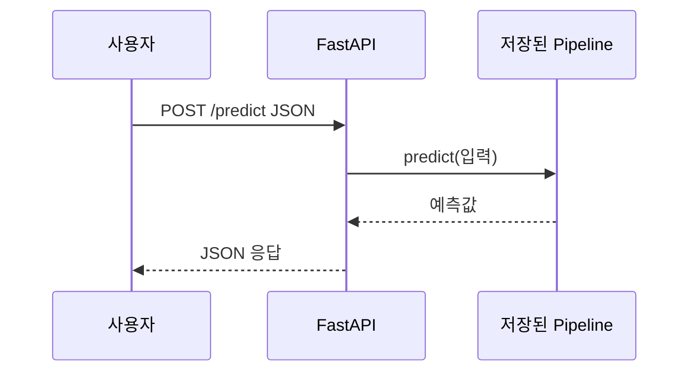

# 07주차 — 모델 서빙 API (FastAPI)

**클라우드 MLOps** · 연성대학교 · 230분 (10분 조기 종료)
NCS: `2001070105_18v1.2` 인공지능 추론 기능 구현하기 / `2001070106_18v1.3` 인공지능 플랫폼 외부 인터페이스 구현하기 / `2001070108_18v1.1` 인공지능 플랫폼 단위 테스트하기

---

## 0. 회차 요약 (강사용 1페이지)

| 항목 | 내용 |
|---|---|
| 학습목표 | 4주차에 저장한 모델 파일을 FastAPI로 감싸 `/health`·`/predict` 두 개의 HTTP 주소로 노출하고, 그 API를 Docker 이미지 하나로 묶어 ECR에 올릴 수 있다. |
| 오늘의 결과물 | ① Swagger UI에서 예측이 성공한 화면 ② `curl` 요청/응답 캡처 ③ ECR에 올라간 `bike-api:v1` 이미지 |
| 사전 준비 | ① 공통 예제 모델 `model.pkl`을 강사 S3 공개 경로에 업로드(4주차 산출물과 동일본) ② `week-07-start` / `week-07-done` 저장소 태그 준비 ③ 학습에 쓴 scikit-learn 버전을 확정해 `requirements.txt`에 고정 ④ 학생 EC2에 Docker가 살아 있는지 사전 점검(6주차 산출물) ⑤ ECR 리포지토리 생성 권한 확인 |
| 학생 준비물 | 노트북, EC2 접속 키페어, 6주차에 만든 ECR 리포지토리 이름, 4주차 `model.pkl`의 S3 경로 |
| 예상 사고 지점 | ① 학습 환경과 서빙 환경의 scikit-learn 버전 불일치로 `model.pkl` 로드 실패 ② 컨테이너 안에서 모델 파일 경로를 못 찾음(`FileNotFoundError`) ③ `docker run`에 `-p 8000:8000`을 빼먹거나 uvicorn을 `127.0.0.1`에 바인딩해서 `curl` 연결 거부 |

### 시간표

| 시간 | 구성 | 분 |
|---|---|---|
| 00:00–00:10 | 도입 — 지난주 복습 퀴즈 + 오늘 만들 결과물 데모 | 10 |
| 00:10–00:55 | 이론 — 배치/실시간 추론, REST API, JSON 스키마, 학습-서빙 스큐 | 45 |
| 00:55–01:05 | 휴식 | 10 |
| 01:05–01:55 | **실습 A** — FastAPI로 `/health`·`/predict` 만들고 Swagger UI로 테스트 | 50 |
| 01:55–02:05 | 휴식 | 10 |
| 02:05–03:30 | **실습 B** — 모델+API를 Docker 이미지 하나로 빌드 → 실행 → `curl` → ECR push | 85 |
| 03:30–03:45 | 체크포인트 제출 + 다음주 예고 | 15 |
| 03:45–03:50 | 리소스 정리 타임 (인스턴스 중지 확인) | 5 |
| **합계** | | **230** |

---

## 1. 도입 (10분)

### 지난주 복습 퀴즈 (구두 3문항)

1. 도커 이미지(image)와 컨테이너(container)의 차이를 한 문장으로 말해보세요. — (이미지는 붕어빵 틀, 컨테이너는 그 틀로 찍어낸 붕어빵. 이미지는 파일로 저장된 정지 상태이고, 컨테이너는 그 이미지를 실행한 살아있는 프로세스입니다.)
2. Dockerfile에서 `COPY`와 `RUN`은 각각 언제 씁니까? — (`COPY`는 내 컴퓨터의 파일을 이미지 안으로 복사할 때, `RUN`은 이미지를 만드는 도중에 명령을 실행해서 결과를 이미지에 굽을 때.)
3. ECR이 무엇이고 왜 씁니까? — (AWS가 운영하는 도커 이미지 보관소. 내 EC2에서 만든 이미지를 다른 서버에서도 받아 쓰려면 어딘가에 올려둬야 하는데, 그 창고가 ECR입니다.)

> **강사 멘트**
> "지난주까지 여러분은 모델을 만들었고, 그걸 담을 상자(컨테이너)도 만들었습니다. 그런데 아직 이 모델은 **아무도 부를 수 없습니다.** 여러분 노트북에서 `python predict.py`를 쳐야만 답이 나오죠. 오늘은 여기에 **주소를 붙입니다.** 오늘이 끝나면 여러분 모델은 `http://주소/predict` 라는 문을 갖게 됩니다."

### 오늘 만들 것 데모

강사는 다음 순서를 그대로 화면에 띄우고 3분 안에 시연한다.

1. 미리 띄워둔 강사 API 서버의 브라우저 주소창에 `http://<강사EC2퍼블릭IP>:8000/docs` 를 입력해 **Swagger UI**(자동 생성된 API 시험 화면)를 보여준다.
2. `POST /predict`를 펼치고 **Try it out** → 예시 JSON이 채워진 상태에서 **Execute** → 아래쪽 Response body에 `{"predicted_count": 187.4, ...}` 가 뜨는 것을 확대해서 보여준다.
3. 터미널로 옮겨가 같은 요청을 `curl`로 날린다. 브라우저에서 본 것과 **똑같은 답**이 검은 화면에 찍히는 것을 보여준다.
4. 마지막으로 `docker ps`를 쳐서 "이 API가 컨테이너 안에서 돌고 있다"는 것을 보여주고 말한다.
   > "지금 이 화면이 오늘 여러분이 만들 것입니다. 이 상자는 여러분 노트북, EC2, 나중엔 팀원 서버 어디에 갖다 놔도 똑같이 돕니다."

---

## 2. 이론 (45분)

### 2-1. 배치 추론 vs 실시간 추론 (10분)

**강의 스크립트**

> 여러분에게 질문 하나 하겠습니다. 은행이 "이 고객이 대출을 못 갚을 확률"을 계산한다고 해봅시다. 이걸 **언제** 계산하는 게 좋을까요? 손 들고 말해보세요.
>
> 두 가지 답이 다 맞습니다. 하나는 "매일 새벽 3시에 전체 고객 100만 명을 한 번에 다 계산해서 표로 저장해 둔다"입니다. 이걸 **배치 추론(batch inference)**, 우리말로 하면 **일괄 추론**이라고 합니다. 밥솥에 쌀을 한꺼번에 안치는 것과 같습니다. 새벽에 서버가 한가할 때 몰아서 돌리니까 싸고, 실패하면 다시 돌리면 되니까 마음도 편합니다. 대신 오후 2시에 새로 가입한 고객은 내일 새벽까지 결과가 없습니다.
>
> 다른 하나는 "고객이 대출 신청 버튼을 누르는 그 순간, 0.2초 안에 계산해서 화면에 띄운다"입니다. 이건 **실시간 추론(real-time inference)**, **온라인 추론**이라고도 합니다. 주문 즉시 굽는 토스트입니다. 최신 정보로 즉시 답하지만, 서버가 24시간 깨어 있어야 하고 느리면 사용자가 그냥 나가버립니다.
>
> 자, 그러면 우리 수업의 공통 예제인 **따릉이 대여량 예측**은 어느 쪽일까요? … 사실 둘 다 가능합니다. "내일 하루치 시간대별 예측을 밤에 미리 계산해 둔다"면 배치고, "사용자가 웹에서 시간·날씨를 넣고 조회 버튼을 누르면 그때 계산한다"면 실시간입니다.
>
> 우리는 **실시간을 선택합니다.** 이유는 두 가지인데, 첫째는 여러분 프로젝트 발표 때 심사자가 화면에서 값을 바꿔가며 눌러볼 수 있어야 하기 때문이고, 둘째는 실시간 서빙을 할 줄 알면 배치는 for 문 하나로 만들 수 있기 때문입니다. 반대는 성립하지 않습니다. 어려운 쪽을 먼저 배우는 게 이득입니다.

**판서/슬라이드 요점**

- 배치 추론 = 몰아서 미리 계산 → 결과를 DB/파일로 저장 → 조회만 함 (싸다, 느리다)
- 실시간 추론 = 요청이 올 때 그 자리에서 계산 → 즉시 응답 (비싸다, 빠르다)
- 판단 기준: **답이 얼마나 신선해야 하는가** + **요청이 예측 가능한가**
- 우리 과목은 실시간 서빙을 기준으로 진행 (배치는 실시간 코드 재사용으로 가능)
- 서비스가 크면 두 개를 섞는다: 무거운 특징은 배치로 미리 계산, 최종 계산만 실시간

**학생 질문 예상 & 답변**

- Q: 실시간이면 서버를 24시간 켜둬야 하나요? → A: 원칙적으로는 그렇습니다. 그래서 비용이 듭니다. 우리 수업에서는 실습이 끝나면 EC2를 **Stop**해서 요금을 끊습니다. 실무에서는 요청이 없을 때 자동으로 0대까지 줄이는 방식(서버리스)도 씁니다.
- Q: 배치가 더 싸면 다들 배치 쓰면 되지 않나요? → A: 사용자가 방금 입력한 값으로 예측해야 하는 서비스는 배치로 불가능합니다. 어제 계산해 둔 표에 오늘 처음 온 입력값이 있을 리 없으니까요.

---

### 2-2. REST API 기초 — "함수 호출을 인터넷 너머로" (12분)

**강의 스크립트**

> 여러분이 지금까지 파이썬에서 예측할 때 이렇게 했죠. `result = model.predict(X)`. 함수를 부르고 결과를 받습니다. **API란 이 함수 호출을 네트워크 너머에서 하는 것**입니다. 그게 전부입니다. 어렵게 생각할 것 없습니다.
>
> 다만 인터넷 너머에 있는 함수를 부르려면 세 가지를 정해야 합니다. **어디로 부를지(주소), 어떻게 부를지(메서드), 무엇을 보낼지(본문)**입니다.
>
> 주소는 이렇게 생겼습니다. `http://13.125.10.20:8000/predict`. 앞의 숫자는 서버 컴퓨터 주소, `:8000`은 그 컴퓨터 안에서 몇 번 문으로 들어갈지를 뜻하는 **포트(port)**, 그리고 `/predict`가 그 서버 안의 어떤 기능인지를 가리키는 **경로(path)**입니다. 아파트로 치면 IP는 아파트 동, 포트는 호수, 경로는 그 집 안의 방입니다.
>
> 메서드는 몇 개만 알면 됩니다. **GET은 "주세요"**, **POST는 "이거 받고 처리해 주세요"**입니다. 브라우저 주소창에 주소를 치는 건 전부 GET입니다. 우리 `/health`는 "너 살아있니?"만 묻는 거니까 GET, `/predict`는 데이터를 보내야 하니까 POST입니다.
>
> 그리고 서버는 답할 때 **상태 코드(status code)**라는 세 자리 숫자를 같이 보냅니다. 여기서 딱 네 개만 외웁시다. **200은 성공**, **422는 네가 보낸 값이 이상하다**, **404는 그런 주소 없다**, **500은 내(서버) 잘못이다**. 실습하다 빨간 글씨가 뜨면 제일 먼저 이 숫자를 보세요. 422면 여러분이 보낸 JSON을 고쳐야 하고, 500이면 서버 코드를 고쳐야 합니다. 이 구분만 해도 디버깅 시간이 절반으로 줍니다.

**판서/슬라이드 요점**

- API = 네트워크 너머의 함수 호출. 주소(URL) + 메서드 + 본문(body)
- URL 구조: `http://` + `IP 또는 도메인` + `:포트` + `/경로`
- GET = 조회 / POST = 데이터 보내고 처리 요청
- 상태 코드 4개: **200 성공 · 422 입력값 오류 · 404 주소 없음 · 500 서버 오류**
- 오늘 만들 두 개의 문: `GET /health` (생존 확인), `POST /predict` (예측)

**학생 질문 예상 & 답변**

- Q: 왜 하필 8000번 포트인가요? → A: 관례입니다. 80번(웹 기본)은 권한이 필요하고, 8000·8080은 개발용으로 널리 쓰여서 충돌이 적습니다. 우리는 API=8000, 다음 주 Streamlit 화면=8501로 고정하겠습니다.
- Q: `/health`는 왜 필요하죠? 예측만 되면 되는 것 아닌가요? → A: 나중에 서버를 자동으로 관리하는 도구들이 "이 서버 살아있나?"를 1분마다 물어봅니다. 그때 예측을 시키면 낭비니까, 가볍게 "네 살아있어요"만 답하는 문을 따로 두는 겁니다. 13주차 모니터링에서 이 문을 씁니다.

---

### 2-3. 요청/응답 JSON 스키마 — "약속을 문서로" (10분)

**강의 스크립트**

> API를 만든다는 건 사실 **약속을 만드는 일**입니다. "나한테 이런 모양으로 보내주면, 나는 이런 모양으로 답해줄게"라는 약속이죠. 이 약속의 문서를 **스키마(schema)**라고 합니다.
>
> 예를 들어 우리 따릉이 예측 API의 약속은 이렇습니다. 보낼 때는 시간, 기온, 습도, 풍속, 요일, 공휴일 여부, 계절을 담은 JSON을 보낸다. 받을 때는 예측 대여 건수와 모델 버전을 담은 JSON을 받는다.
>
> 여기서 아주 중요한 이야기를 하나 하겠습니다. 이 약속을 **누가 지키게 하느냐**입니다. 만약 누군가 기온에 숫자 대신 `"따뜻함"`이라는 글자를 보내면 어떻게 될까요? 우리 모델은 그 순간 터집니다. 그러면 서버 로그에는 500 에러가 찍히고, 여러분은 "내 코드가 잘못됐나?" 하며 한 시간을 날립니다.
>
> 그래서 **문 앞에서 검사**를 합니다. 파이썬에는 **Pydantic**이라는 도구가 있어서, "기온은 실수여야 하고, 시간은 0에서 23 사이 정수여야 한다"고 선언만 해두면 조건에 안 맞는 요청을 **모델에 닿기 전에** 잘라내고 422를 돌려줍니다. 클럽 앞의 가드라고 생각하세요. 신분증 확인은 문 앞에서 하지, 춤추는 중간에 하지 않습니다.
>
> 그리고 오늘 여러분이 감동할 부분이 있습니다. FastAPI는 이 Pydantic 선언만 보고 **API 설명서 웹페이지를 자동으로 만들어 줍니다.** `/docs` 주소로 들어가면 문서가 있고, 심지어 거기서 바로 눌러서 테스트까지 됩니다. 여러분이 문서를 따로 쓸 필요가 없습니다.

**판서/슬라이드 요점**

- 스키마 = "이런 모양으로 주고받자"는 약속의 문서
- 요청 예: `{"hour":18,"temperature":24.5,"humidity":55,"windspeed":2.1,"weekday":2,"is_holiday":0,"season":"summer"}`
- 응답 예: `{"predicted_count":187.4,"model_version":"v1","unit":"건/시간"}`
- Pydantic = 입력 검증기. 조건 위반 시 **모델에 닿기 전에** 422 반환
- FastAPI는 스키마로부터 `/docs`(Swagger UI) 문서를 자동 생성

**학생 질문 예상 & 답변**

- Q: 검증을 안 하면 어떻게 되나요? → A: 대부분 500 에러가 나고, 로그만 보면 원인이 안 보입니다. 검증을 걸면 422와 함께 "humidity 필드가 float이 아니다"라는 문장이 그대로 나옵니다. 검증은 나중의 나를 위한 선물입니다.
- Q: JSON 키 이름은 마음대로 정해도 되나요? → A: 됩니다. 단 **학습 데이터의 컬럼명과 똑같이 맞추는 것을 강력히 권합니다.** 이름이 다르면 서빙 코드에서 매번 이름을 바꿔주는 코드가 붙고, 거기서 오타가 납니다.

---

### 2-4. 학습-서빙 스큐 — 오늘의 핵심 (13분)

**강의 스크립트**

> 오늘 이론에서 딱 하나만 기억해야 한다면 이겁니다. **학습-서빙 스큐(training-serving skew)**. 우리말로 옮기면 "학습할 때와 서빙할 때가 어긋나는 현상"입니다.
>
> 상황을 하나 그려보겠습니다. 4주차에 여러분은 학습 코드에서 이렇게 했습니다. 기온에서 평균을 빼고 표준편차로 나눠 스케일링했고, 계절 컬럼은 원-핫 인코딩(one-hot encoding, 문자열 범주를 0/1 열로 펼치는 것)을 했습니다. 이제 서빙 코드를 새로 짜면서 여러분은 그걸 **다시 손으로 씁니다.** 그런데 학습 때 평균 기온이 14.2였다는 걸 기억하나요? 표준편차는요? 계절 원-핫의 열 순서는 spring, summer, fall, winter였나요, 아니면 알파벳순이었나요?
>
> 하나라도 어긋나면 어떻게 될까요? **에러가 안 납니다.** 이게 무서운 점입니다. 코드는 멀쩡히 돌고 숫자도 나옵니다. 다만 그 숫자가 **틀립니다.** 학습에서 R²가 0.85였는데 실제 서비스에서는 엉뚱한 값이 나오고, 여러분은 "모델이 과적합됐나 봐요"라며 엉뚱한 곳을 파게 됩니다. 실무에서 가장 잡기 어려운 버그가 이 종류입니다.
>
> 그래서 4주차에 제가 왜 `Pipeline`을 통째로 저장하라고 했을까요? 바로 이것 때문입니다. `Pipeline(전처리 → 모델)` 전체를 `joblib.dump()`로 저장하면, 그 pkl 파일 안에는 **평균값·표준편차·원-핫 열 순서까지 전부 같이 들어갑니다.** 서빙에서는 그냥 `pipeline.predict(원본 데이터프레임)`을 부르면 끝입니다. 전처리 코드를 서빙에 **한 줄도 다시 쓸 필요가 없습니다.**
>
> 정리하면, **전처리를 사람이 두 번 쓰지 않게 하는 것**이 오늘의 원칙입니다. 두 번 쓰면 언젠가 반드시 어긋납니다. 사람은 어긋납니다. 파일은 안 어긋납니다.
>
> 하나 더. 그래서 오늘 여러분의 `/predict` 코드는 이렇게 생길 겁니다. JSON을 받아서 → **학습 때와 같은 컬럼명·같은 순서의 DataFrame 한 줄로 만들고** → `pipeline.predict()`에 넣는다. 이게 전부입니다. 코드가 짧다고 당황하지 마세요. 짧은 게 맞는 겁니다.

**판서/슬라이드 요점**

- 학습-서빙 스큐 = 학습 시 전처리 ≠ 서빙 시 전처리 → **에러 없이 조용히 틀린 답**
- 원인 1위: 서빙에서 전처리를 손으로 다시 구현
- 해법: 전처리+모델을 `Pipeline`으로 묶어 **통째로 저장/로드** (4주차 결정의 이유)
- 서빙 코드 3줄 원칙: `JSON → DataFrame(같은 컬럼명·순서) → pipeline.predict()`
- 컬럼명·범주값 문자열도 학습 때와 **글자 단위로** 동일해야 함 (`"summer"` ≠ `"Summer"`)

**학생 질문 예상 & 답변**

- Q: 그럼 `model.pkl` 안에 전처리가 들어 있는지 어떻게 확인하죠? → A: 파이썬에서 로드한 뒤 `print(model)`을 찍어보세요. `Pipeline(steps=[('prep', ColumnTransformer(...)), ('model', RandomForestRegressor(...))])`처럼 나오면 들어 있는 겁니다. `RandomForestRegressor(...)`만 나오면 전처리가 빠진 것이니 4주차 코드를 고쳐서 다시 저장해야 합니다.
- Q: 컬럼 순서까지 맞춰야 하나요? DataFrame은 이름으로 찾지 않나요? → A: `ColumnTransformer`는 이름으로 찾으므로 대체로 괜찮습니다. 하지만 전처리 없이 넘파이 배열을 바로 넣는 모델은 순서가 곧 의미입니다. **순서까지 맞추는 습관**을 들이면 나중에 안 다칩니다.
- Q: 이번 학기 프로젝트에서 팀원이 전처리를 바꾸면요? → A: 학습 코드를 바꾸고 **pkl을 다시 만들어 S3에 새 버전으로 올린 뒤**, 서빙 이미지를 다시 빌드합니다. pkl과 이미지는 항상 세트로 움직인다고 생각하세요.

---

## 3. 실습 A — FastAPI로 예측 API 만들기 (50분) · 공통 예제 따라하기

**목표** 공통 예제 모델(`model.pkl`)을 불러와 `GET /health`와 `POST /predict`를 제공하는 FastAPI 서버를 EC2에서 띄우고, Swagger UI에서 예측을 성공시킨다.

**사전 배포 파일**
- `app/schemas.py` (Pydantic 스키마 — 타이핑 분량이 많아 **미리 배포**, 학생은 읽고 이해만)
- `requirements.txt` (버전 고정본 — **미리 배포**)
- `sample_request.json` (테스트용 요청 예시)
- 완성본 태그: `week-07-done`

### 수행 순서

**① 작업 폴더 만들고 모델 내려받기**

EC2에 SSH(원격 접속 프로토콜)로 접속한 뒤 그대로 입력한다.

```bash
mkdir -p ~/bike-api/app ~/bike-api/model
cd ~/bike-api
aws s3 cp s3://mlops-2026-<학번>/models/model.pkl ./model/model.pkl --region ap-northeast-2
ls -lh ./model/model.pkl
```

`<학번>` 자리에는 본인 학번을 넣는다(예: `mlops-2026-20231234`). 4주차에 본인 모델을 올리지 못한 학생은 아래 공통 예제 모델을 쓴다.

```bash
aws s3 cp s3://mlops-2026-class-shared/week07/model.pkl ./model/model.pkl --region ap-northeast-2
```

- 확인 포인트: `ls -lh` 결과에 `model.pkl` 파일이 보이고 크기가 0이 아니면 성공.

**② 모델 안에 전처리가 들어 있는지 눈으로 확인 (스큐 점검)**

```bash
cd ~/bike-api
python3 -c "import joblib; m = joblib.load('model/model.pkl'); print(type(m)); print(m)"
```

- 확인 포인트: 출력 첫 줄이 `<class 'sklearn.pipeline.Pipeline'>` 이어야 한다. 아니면 4주차 저장 방식이 잘못된 것이므로 조교를 부른다.

**③ 파이썬 가상환경과 라이브러리 설치**

```bash
cd ~/bike-api
python3 -m venv .venv
source .venv/bin/activate
pip install --upgrade pip
pip install -r requirements.txt
```

배포한 `requirements.txt` 내용은 다음과 같다. **버전을 임의로 바꾸지 않는다.**

```text
fastapi==0.115.5
uvicorn[standard]==0.32.1
pydantic==2.10.2
scikit-learn==1.5.2
pandas==2.2.3
numpy==2.1.3
joblib==1.4.2
```

- 확인 포인트: `pip list | grep scikit-learn` 결과가 `1.5.2`. 이 숫자가 **4주차 학습 때 쓴 버전과 같아야** 한다.

**④ 입력 스키마 파일 확인 (`app/schemas.py`) — 배포본, 읽기만**

```bash
nano ~/bike-api/app/schemas.py
```

```python
from typing import Literal
from pydantic import BaseModel, Field


class PredictRequest(BaseModel):
    """예측 요청 1건. 학습 데이터의 컬럼명과 글자 단위로 동일하게 맞춘다."""

    hour: int = Field(..., ge=0, le=23, description="시간대 0~23")
    temperature: float = Field(..., ge=-30.0, le=50.0, description="기온(섭씨)")
    humidity: float = Field(..., ge=0.0, le=100.0, description="습도(%)")
    windspeed: float = Field(..., ge=0.0, le=50.0, description="풍속(m/s)")
    weekday: int = Field(..., ge=0, le=6, description="요일 0=월 ~ 6=일")
    is_holiday: int = Field(..., ge=0, le=1, description="공휴일이면 1, 아니면 0")
    season: Literal["spring", "summer", "fall", "winter"] = Field(
        ..., description="계절. 학습 데이터와 동일한 소문자 표기만 허용"
    )

    model_config = {
        "json_schema_extra": {
            "examples": [
                {
                    "hour": 18,
                    "temperature": 24.5,
                    "humidity": 55.0,
                    "windspeed": 2.1,
                    "weekday": 2,
                    "is_holiday": 0,
                    "season": "summer",
                }
            ]
        }
    }


class PredictResponse(BaseModel):
    predicted_count: float
    unit: str = "건/시간"
    model_version: str


class HealthResponse(BaseModel):
    status: str
    model_loaded: bool
    sklearn_version: str
```

> 강사 설명 포인트: `ge`는 "이 값 이상", `le`는 "이 값 이하". `Literal`은 "이 네 글자 중 하나만". 이 세 줄이 곧 문 앞의 가드다.

**⑤ 본체 코드 작성 (`app/main.py`) — 학생이 직접 입력**

```bash
nano ~/bike-api/app/main.py
```

```python
import os
import logging

import joblib
import pandas as pd
import sklearn
from fastapi import FastAPI, HTTPException

from app.schemas import HealthResponse, PredictRequest, PredictResponse

logging.basicConfig(level=logging.INFO)
logger = logging.getLogger("bike-api")

MODEL_PATH = os.getenv("MODEL_PATH", "model/model.pkl")
MODEL_VERSION = os.getenv("MODEL_VERSION", "v1")

# 학습 시 사용한 컬럼명과 순서. 여기서 어긋나면 학습-서빙 스큐가 발생한다.
FEATURE_ORDER = [
    "hour",
    "temperature",
    "humidity",
    "windspeed",
    "weekday",
    "is_holiday",
    "season",
]

app = FastAPI(
    title="따릉이 대여량 예측 API",
    description="클라우드 MLOps 7주차 실습용 실시간 추론 API",
    version="1.0.0",
)

model = None


@app.on_event("startup")
def load_model() -> None:
    """서버가 뜰 때 모델을 딱 한 번만 읽는다. 요청마다 읽으면 매우 느려진다."""
    global model
    logger.info("모델 로드 시작: %s", MODEL_PATH)
    model = joblib.load(MODEL_PATH)
    logger.info("모델 로드 완료: %s", type(model).__name__)


@app.get("/health", response_model=HealthResponse)
def health() -> HealthResponse:
    return HealthResponse(
        status="ok",
        model_loaded=model is not None,
        sklearn_version=sklearn.__version__,
    )


@app.post("/predict", response_model=PredictResponse)
def predict(req: PredictRequest) -> PredictResponse:
    if model is None:
        raise HTTPException(status_code=503, detail="모델이 아직 로드되지 않았습니다.")

    # JSON 1건 -> 학습 때와 같은 컬럼명/순서를 가진 DataFrame 한 줄
    row = pd.DataFrame([req.model_dump()])[FEATURE_ORDER]

    try:
        pred = float(model.predict(row)[0])
    except Exception as exc:  # noqa: BLE001
        logger.exception("예측 실패")
        raise HTTPException(status_code=500, detail=f"예측 중 오류: {exc}") from exc

    logger.info("predict hour=%s temp=%s -> %.2f", req.hour, req.temperature, pred)
    return PredictResponse(predicted_count=round(pred, 2), model_version=MODEL_VERSION)
```

`app` 폴더가 파이썬 패키지로 인식되도록 빈 파일을 하나 만든다.

```bash
touch ~/bike-api/app/__init__.py
```

**⑥ 서버 실행**

```bash
cd ~/bike-api
source .venv/bin/activate
uvicorn app.main:app --host 0.0.0.0 --port 8000 --reload
```

- 확인 포인트: 터미널에 `모델 로드 완료: Pipeline` 과 `Uvicorn running on http://0.0.0.0:8000` 두 줄이 보이면 성공.
- `--host 0.0.0.0`의 의미: "이 컴퓨터의 모든 네트워크 카드에서 요청을 받겠다". 기본값인 `127.0.0.1`로 두면 **서버 자기 자신에서만** 접속되고 밖에서는 절대 안 붙는다. 오늘 가장 많이 나는 실수다.

**⑦ 보안그룹에서 8000번 포트 열기 (한 번만)**

AWS 콘솔 → EC2 → 인스턴스 선택 → 보안 탭 → 보안 그룹 클릭 → 인바운드 규칙 편집 → 규칙 추가

| 유형 | 포트 범위 | 소스 | 설명 |
|---|---|---|---|
| 사용자 지정 TCP | 8000 | 내 IP | `mlops-api-8000` |

- 확인 포인트: 저장 후 인바운드 규칙 목록에 8000이 보인다.
- 소스를 `0.0.0.0/0`(전 세계 공개)으로 두지 않는다. 수업 중에는 **내 IP**로 충분하다.

**⑧ Swagger UI에서 테스트**

브라우저 주소창에 입력한다.

```text
http://<EC2퍼블릭IP>:8000/docs
```

1. `GET /health` → Try it out → Execute → `{"status":"ok","model_loaded":true,...}` 확인
2. `POST /predict` → Try it out → 예시 JSON이 채워진 상태로 Execute → `predicted_count` 값 확인
3. **일부러 틀려보기**: `season`을 `"Summer"`(대문자 S)로 바꿔서 Execute → **422**가 뜨고 어떤 필드가 문제인지 메시지가 나오는 것을 확인한다. 이것이 Pydantic 검증이 일하는 모습이다.

- 확인 포인트(제출용 스크린샷 ①): Swagger UI에서 200 응답과 `predicted_count`가 함께 보이는 화면.

### ⚠ 여기서 막히면

| 증상 | 원인 | 조치 |
|---|---|---|
| `joblib.load` 시 `InconsistentVersionWarning` 경고 후 예측값이 이상하거나, `AttributeError: Can't get attribute '_RemainderColsList'` 등으로 로드 실패 | **학습에 쓴 scikit-learn 버전과 지금 설치된 버전이 다름** | `pip install scikit-learn==1.5.2`로 학습 때 버전에 맞춘다. 학습 버전을 모르면 4주차 노트북에서 `import sklearn; print(sklearn.__version__)`을 확인. 그래도 안 되면 4주차 코드로 **모델을 다시 학습·저장**한다(공통 예제는 5분 이내) |
| `FileNotFoundError: model/model.pkl` | 실행 위치가 `~/bike-api`가 아니거나 S3 다운로드 실패 | `cd ~/bike-api` 후 `ls model/`로 파일 존재 확인. 없으면 ①단계 `aws s3 cp` 재실행 |
| `ModuleNotFoundError: No module named 'app'` | `uvicorn`을 `app` 폴더 안에서 실행했거나 `__init__.py` 없음 | 반드시 `~/bike-api`에서 실행하고 `touch app/__init__.py` |
| 브라우저에서 `/docs`가 안 열림 (계속 로딩만) | 보안그룹 8000 인바운드 미개방 | ⑦단계 수행. 학교망 차단 의심 시 EC2 안에서 `curl http://localhost:8000/health`로 먼저 확인 |
| 브라우저에서 "연결이 거부됨" | uvicorn이 `127.0.0.1`에 바인딩됨 | `--host 0.0.0.0` 옵션을 붙여 재실행 |
| Swagger에서 422가 계속 남 | 필드명 오타, `season` 대소문자, 숫자에 따옴표 | 응답 본문의 `loc` 항목이 문제 필드명을 알려준다. 그 필드만 고친다 |
| `Address already in use` | 이전에 띄운 uvicorn이 살아 있음 | `pkill -f uvicorn` 실행 후 재시도 |

### 컷오프 안내

50분 경과 시 강제 종료한다. Swagger에서 200을 못 본 학생은 완성본 태그에서 이어받는다.

```bash
cd ~/bike-api
git clone --branch week-07-done https://github.com/<강사계정>/mlops-2026-reference.git ~/week07-done
cp -r ~/week07-done/app ~/bike-api/
```

---

## 4. 실습 B — 모델+API를 컨테이너 하나로 묶어 ECR에 올리기 (85분) · 각자/팀이 직접 수행

**목표** 모델 파일과 API 코드를 하나의 Docker 이미지로 빌드해 컨테이너로 실행하고, 다른 터미널에서 `curl`로 호출한 뒤 ECR에 push한다.

**과제 지시문** (학생에게 그대로 읽어줄 문장)

> "지금 여러분 API는 EC2 한 대에 묶여 있습니다. 가상환경을 만들고, 라이브러리를 깔고, 모델을 내려받아야 겨우 돕니다. 다음 주에 우리는 이걸 다른 서버에서 띄울 겁니다. 그때 이 과정을 다시 반복할 수는 없습니다. 그래서 지금부터 **모델과 코드와 라이브러리 버전까지 전부 한 상자에 넣습니다.** 상자를 만들고, 상자를 열어 API가 도는지 확인하고, 그 상자를 ECR 창고에 맡기는 것까지가 오늘 여러분이 할 일입니다. 마지막에 `curl` 결과 화면을 제출합니다."

### 수행 항목

**1) `.dockerignore` 작성** — 가상환경까지 이미지에 들어가면 용량이 폭발한다.

```bash
cd ~/bike-api
cat > .dockerignore << 'EOF'
.venv/
__pycache__/
*.pyc
.git/
.pytest_cache/
EOF
```

**2) `Dockerfile` 작성** — 아래 전체를 그대로 입력한다.

```bash
nano ~/bike-api/Dockerfile
```

```dockerfile
FROM python:3.11-slim

# 파이썬이 로그를 즉시 내보내게 한다(컨테이너 로그가 안 보이는 문제 예방)
ENV PYTHONUNBUFFERED=1 \
    PYTHONDONTWRITEBYTECODE=1

WORKDIR /app

# 라이브러리를 먼저 설치하면, 코드만 바꿨을 때 재빌드가 빨라진다(레이어 캐시)
COPY requirements.txt /app/requirements.txt
RUN pip install --no-cache-dir -r /app/requirements.txt

# 애플리케이션 코드와 모델을 이미지 안으로 복사
COPY app/ /app/app/
COPY model/model.pkl /app/model/model.pkl

# 컨테이너 안에서의 모델 경로를 환경변수로 고정
ENV MODEL_PATH=/app/model/model.pkl \
    MODEL_VERSION=v1

EXPOSE 8000

CMD ["uvicorn", "app.main:app", "--host", "0.0.0.0", "--port", "8000"]
```

> 주의: `CMD`에서 `--reload`를 빼는 이유 — 개발용 자동 재시작 기능은 운영 컨테이너에서 메모리를 잡아먹고 모델을 두 번 로드한다.

**3) 이미지 빌드**

```bash
cd ~/bike-api
docker build -t bike-api:v1 .
docker images | grep bike-api
```

- 확인 포인트: `Successfully tagged bike-api:v1` 메시지와, `docker images` 목록에 `bike-api  v1` 행.

**4) 컨테이너 실행**

```bash
docker run -d --name bike-api -p 8000:8000 bike-api:v1
docker ps
docker logs bike-api
```

- 확인 포인트: `docker ps`의 STATUS가 `Up ...`이고, `docker logs`에 `모델 로드 완료: Pipeline`이 보인다.
- `-p 8000:8000`의 의미: 왼쪽이 EC2의 포트, 오른쪽이 컨테이너 안의 포트. **이걸 빼면 밖에서 절대 못 들어간다.**

**5) 다른 터미널에서 `curl` 호출** — 새 SSH 창을 하나 더 연다.

```bash
curl -s http://localhost:8000/health
```

```bash
curl -s -X POST http://localhost:8000/predict \
  -H "Content-Type: application/json" \
  -d '{
    "hour": 18,
    "temperature": 24.5,
    "humidity": 55.0,
    "windspeed": 2.1,
    "weekday": 2,
    "is_holiday": 0,
    "season": "summer"
  }'
```

응답 예시:

```json
{"predicted_count":187.43,"unit":"건/시간","model_version":"v1"}
```

일부러 틀린 요청도 한 번 날려 422를 확인한다(단위 테스트 성격).

```bash
curl -i -s -X POST http://localhost:8000/predict \
  -H "Content-Type: application/json" \
  -d '{"hour": 99, "temperature": 24.5, "humidity": 55.0, "windspeed": 2.1, "weekday": 2, "is_holiday": 0, "season": "summer"}'
```

- 확인 포인트(제출용 스크린샷 ②): 정상 요청의 200 응답과 잘못된 요청의 422 응답이 **한 화면에** 보이도록 캡처한다.

**6) ECR에 push**

```bash
# 본인 AWS 계정 ID를 변수로 잡는다
export ACCOUNT_ID=$(aws sts get-caller-identity --query Account --output text)
export REGION=ap-northeast-2
export REPO=mlops-2026-<학번>/bike-api

# 리포지토리 생성 (이미 있으면 오류가 나지만 무시해도 된다)
aws ecr create-repository --repository-name $REPO --region $REGION

# ECR 로그인 (토큰은 12시간 유효)
aws ecr get-login-password --region $REGION \
  | docker login --username AWS --password-stdin $ACCOUNT_ID.dkr.ecr.$REGION.amazonaws.com

# 태그를 붙이고 올린다
docker tag bike-api:v1 $ACCOUNT_ID.dkr.ecr.$REGION.amazonaws.com/$REPO:v1
docker push $ACCOUNT_ID.dkr.ecr.$REGION.amazonaws.com/$REPO:v1

# 올라갔는지 확인
aws ecr list-images --repository-name $REPO --region $REGION
```

- 확인 포인트(제출용 스크린샷 ③): `aws ecr list-images` 결과에 `"imageTag": "v1"`이 보이거나, ECR 콘솔에서 이미지가 보이는 화면.

**7) 팀 데이터로 갈아 끼우기 (남는 시간 전부)**

같은 골격에 **팀 모델만 갈아 끼운다.** 바꿀 곳은 딱 세 군데다.

| 바꿀 파일 | 바꿀 내용 |
|---|---|
| `app/schemas.py` | `PredictRequest` 필드를 팀 데이터의 입력 컬럼명·타입·범위로 교체 |
| `app/main.py` | `FEATURE_ORDER` 리스트를 팀 학습 코드의 컬럼 순서로 교체 |
| `model/model.pkl` | 팀 모델 파일로 교체 (`aws s3 cp`) |

분류 문제인 팀은 응답 스키마를 다음처럼 바꾼다.

```python
class PredictResponse(BaseModel):
    predicted_label: int
    probability: float
    model_version: str
```

그리고 `main.py`의 예측부를 아래로 교체한다.

```python
    proba = float(model.predict_proba(row)[0][1])
    label = int(proba >= 0.5)
    return PredictResponse(predicted_label=label, probability=round(proba, 4),
                           model_version=MODEL_VERSION)
```

### 팀 프로젝트 연결

오늘 만든 이미지가 **M2 중간 시연(8주차)에서 "동작하는 API 호출 시연"의 실체**가 된다. 다음 주에는 이 이미지를 그대로 EC2에서 `pull`해서 Streamlit 화면과 함께 띄운다. 즉 오늘 ECR에 올린 태그가 다음 주 `docker-compose.yml`에 그대로 적힌다. 오늘 push를 못 하면 다음 주 실습 A가 막힌다.

### 순회 지도 포인트

1. **`docker logs`에 `Pipeline`이 찍히는가** — `RandomForestRegressor`만 찍히면 전처리가 빠진 모델이다. 학습-서빙 스큐 폭탄이므로 즉시 4주차 저장 코드를 수정시킨다.
2. **`-p 8000:8000`과 `--host 0.0.0.0`이 둘 다 있는가** — 둘 중 하나만 빠져도 `curl`이 실패한다. 이 두 개를 한 세트로 확인한다.
3. **`.dockerignore`가 있는가 / 이미지 크기가 2GB를 넘지 않는가** — `.venv`가 딸려 들어간 학생을 잡아낸다. `docker images`의 SIZE 열로 즉시 판별된다.

---

## 5. 체크포인트 (제출물)

| # | 제출물 | 형식 | 배점 |
|---|---|---|---|
| 1 | Swagger UI(`/docs`)에서 `POST /predict`가 200으로 응답한 화면 | 스크린샷 | 0.7 |
| 2 | `curl`로 정상 요청(200)과 잘못된 요청(422)을 각각 호출한 터미널 화면 | 스크린샷 | 0.8 |
| 3 | 본인 ECR 리포지토리에 `bike-api:v1`(또는 팀 이미지)이 올라간 화면 | 스크린샷 또는 `aws ecr list-images` 출력 | 0.5 |

> 제출: LMS 7주차 과제방. 파일명 `07_<학번>_1.png` 형식. 스크린샷에 본인 학번이 포함된 프롬프트나 리포지토리명이 보이게 캡처할 것.

### 평가 기준 (NCS 수행준거 연계)

- `2001070105_18v1.2` **인공지능 추론 기능 구현하기** — 저장된 학습 모델을 서비스 코드에서 로드하여, 입력 데이터에 대한 추론 결과를 반환하는 기능을 구현했는가. (판정: `/predict` 호출 시 200과 함께 예측값이 반환되는가 / 모델을 요청마다가 아니라 기동 시 1회만 로드했는가)
- `2001070106_18v1.3` **인공지능 플랫폼 외부 인터페이스 구현하기** — 외부 시스템이 호출할 수 있도록 인터페이스 규격(요청·응답 형식, 경로, 메서드)을 정의하고 구현했는가. (판정: 요청/응답 JSON 스키마가 문서로 노출되는가(`/docs`) / 컨테이너 외부에서 `curl` 호출이 성공하는가)
- `2001070108_18v1.1` **인공지능 플랫폼 단위 테스트하기** — 구현 기능이 정상 입력과 비정상 입력에 대해 각각 기대한 결과를 내는지 확인했는가. (판정: 정상 입력 200 / 범위를 벗어난 입력 422를 캡처로 증명했는가 / `/health`가 모델 로드 상태를 보고하는가)

---

## 6. 정리 & 다음 주 예고 (15분)

**오늘 배운 것 3줄 요약**

1. 모델을 서비스로 만든다는 것은 `model.predict()`를 **HTTP 주소 뒤에 놓는 일**이다. `/health`는 생존 확인, `/predict`는 예측.
2. 입력 검증(Pydantic)은 문 앞의 가드다. 잘못된 값은 모델에 닿기 전에 **422로 돌려보낸다.**
3. 학습-서빙 스큐를 막는 유일하게 확실한 방법은 **전처리를 두 번 쓰지 않는 것** — `Pipeline`을 통째로 저장하고 통째로 로드한다.

**다음 주 미리보기 한 문장**

> "다음 주에는 오늘 만든 이 상자를 EC2에 갖다 놓고, 그 앞에 **사람이 보는 화면(Streamlit)**을 붙입니다. 그리고 마지막 40분에 팀별로 **M2 중간 시연**을 합니다. 오늘 API가 안 돌면 다음 주에 보여줄 게 없습니다. 오늘 안에 반드시 200을 보고 가세요."

**리소스 정리 타임 체크 항목 (5분, 조교 확인)**

```bash
# 1) 실습용 컨테이너 정리
docker stop bike-api && docker rm bike-api
docker ps -a          # 남은 컨테이너가 없는지 확인

# 2) 디스크 확인 (이미지가 쌓이면 EBS가 찬다)
df -h /
docker image prune -f  # 태그 없는 중간 이미지만 삭제
```

- [ ] `docker ps`에 실행 중인 컨테이너가 없다
- [ ] 브라우저에서 EC2 콘솔 → 인스턴스 **중지(Stop)** 완료 (종료(Terminate) 아님!)
- [ ] 보안그룹 8000번 소스가 `0.0.0.0/0`이 아니라 **내 IP**로 되어 있다
- [ ] ECR 이미지는 삭제하지 않는다 (다음 주에 사용)

---

## 7. 과제

1. **(필수)** 팀 데이터 기준으로 `app/schemas.py`의 `PredictRequest`를 완성하고, 팀 모델로 이미지를 빌드해 ECR에 `팀명:v1` 태그로 push한다. 다음 주 실습 A의 입력물이다.
2. **(필수)** `sample_request.json` 3건(정상 2건 + 경계값 1건)을 만들어 팀 저장소 `tests/` 폴더에 올린다. 다음 주 통합 테스트에 사용한다.
3. **(권장)** `/predict`에 여러 건을 한 번에 보내는 `POST /predict/batch`를 추가해 본다. 힌트: 요청 스키마를 `list[PredictRequest]`로 받고 `pd.DataFrame([r.model_dump() for r in items])`로 만들면 된다. 이것이 곧 **배치 추론**이다.
4. **(선택)** 응답에 `latency_ms`(예측에 걸린 밀리초)를 추가한다. 13주차 모니터링에서 이 값을 쓴다.

---

## 부록 A. 명령어 치트시트 (1페이지 배포용)

```bash
# ── 0. 변수 설정 (매 세션 1회) ─────────────────────────────
export ACCOUNT_ID=$(aws sts get-caller-identity --query Account --output text)
export REGION=ap-northeast-2
export REPO=mlops-2026-<학번>/bike-api

# ── 1. 모델 내려받기 ───────────────────────────────────────
aws s3 cp s3://mlops-2026-<학번>/models/model.pkl ./model/model.pkl --region $REGION

# ── 2. 로컬(가상환경) 실행 ────────────────────────────────
source .venv/bin/activate
uvicorn app.main:app --host 0.0.0.0 --port 8000 --reload

# ── 3. 도커 빌드 & 실행 ───────────────────────────────────
docker build -t bike-api:v1 .
docker run -d --name bike-api -p 8000:8000 bike-api:v1
docker ps
docker logs -f bike-api          # 로그 실시간 보기 (Ctrl+C로 빠져나옴)
docker stop bike-api && docker rm bike-api

# ── 4. 호출 테스트 ────────────────────────────────────────
curl -s http://localhost:8000/health
curl -s -X POST http://localhost:8000/predict \
  -H "Content-Type: application/json" \
  -d '{"hour":18,"temperature":24.5,"humidity":55.0,"windspeed":2.1,"weekday":2,"is_holiday":0,"season":"summer"}'

# ── 5. ECR 올리기 ─────────────────────────────────────────
aws ecr create-repository --repository-name $REPO --region $REGION
aws ecr get-login-password --region $REGION \
  | docker login --username AWS --password-stdin $ACCOUNT_ID.dkr.ecr.$REGION.amazonaws.com
docker tag bike-api:v1 $ACCOUNT_ID.dkr.ecr.$REGION.amazonaws.com/$REPO:v1
docker push $ACCOUNT_ID.dkr.ecr.$REGION.amazonaws.com/$REPO:v1
aws ecr list-images --repository-name $REPO --region $REGION

# ── 6. 자주 쓰는 응급 처치 ────────────────────────────────
pkill -f uvicorn                 # 포트 8000 점유 프로세스 종료
docker logs --tail 50 bike-api   # 최근 로그 50줄
docker exec -it bike-api ls -l /app/model   # 컨테이너 안 모델 파일 확인
```

---

## 부록 B. 용어 정리

| 용어 | 뜻 | 한 줄 설명 |
|---|---|---|
| API | Application Programming Interface | 프로그램끼리 정해진 형식으로 대화하는 창구. 오늘은 "네트워크 너머의 함수 호출"로 이해한다 |
| REST | Representational State Transfer | 주소(URL) + 메서드(GET/POST)로 기능을 표현하는 API 설계 관례 |
| 엔드포인트(endpoint) | 끝점 | API에서 호출 가능한 하나의 주소. `/health`, `/predict`가 각각 엔드포인트 |
| 포트(port) | 통신 문 번호 | 한 서버 안에서 프로그램을 구분하는 번호. 우리는 API=8000, UI=8501 |
| FastAPI | 파이썬 웹 프레임워크 | 타입 선언만으로 검증과 문서를 자동 생성해 주는 API 제작 도구 |
| Uvicorn | ASGI 서버 | FastAPI 코드를 실제로 실행해 요청을 받아주는 프로그램 |
| Swagger UI | API 문서 화면 | `/docs`에서 자동 생성되는 시험용 웹 화면. 코드 없이 API를 눌러볼 수 있다 |
| Pydantic | 데이터 검증 라이브러리 | "이 필드는 0~23 정수" 같은 규칙을 선언해 잘못된 입력을 막는다 |
| 스키마(schema) | 데이터 형식 명세 | 주고받을 JSON의 필드 이름·타입·범위를 정한 약속 |
| 배치 추론 | 일괄 추론 | 많은 건을 몰아서 미리 계산해 저장해 두는 방식 |
| 실시간 추론 | 온라인 추론 | 요청이 올 때 그 자리에서 계산해 즉시 응답하는 방식 |
| 학습-서빙 스큐 | training-serving skew | 학습 시 전처리와 서빙 시 전처리가 달라 **에러 없이 틀린 답**이 나오는 현상 |
| 상태 코드 | HTTP status code | 응답에 붙는 세 자리 숫자. 200 성공 / 422 입력 오류 / 404 없음 / 500 서버 오류 |
| `.dockerignore` | 제외 목록 | 이미지 빌드 시 복사하지 않을 파일 목록. `.venv` 등을 넣어 용량 폭발을 막는다 |
| ECR | Elastic Container Registry | AWS의 도커 이미지 보관소 |

---

## 부록. AWS 화면과 공식 문서

- EC2 콘솔: <https://console.aws.amazon.com/ec2/>
- ECR 콘솔: <https://console.aws.amazon.com/ecr/repositories>
- 이동 경로: **EC2 → Instances → 팀 인스턴스 → Security**, **ECR → 저장소 → Images**
- 화면에서 확인: 인스턴스 역할, 제한된 인바운드 규칙, API 이미지 태그
- FastAPI 공식 문서: <https://fastapi.tiangolo.com/tutorial/>



## 실제 AWS 콘솔 화면 실습 가이드 (7주차)

> 2026-08-24에 컨테이너 빌드, ECR 푸시, EC2 실행, API 상태 확인까지 실제로 수행한 결과다.

### Run Command 실행 기록


- 콘솔 경로: **Systems Manager → Run Command → Command history**
- 확인할 것: `YSU MLOps build push and run API` 명령의 성공 상태
- [명령 기록 열기](https://ap-northeast-2.console.aws.amazon.com/systems-manager/run-command?region=ap-northeast-2)

### 명령 실행 상세


- 콘솔 경로: **Systems Manager → Run Command → 명령 ID**
- 확인할 것: 대상 1개, 완료 1개, 오류 0개
- [Run Command 문서](https://docs.aws.amazon.com/systems-manager/latest/userguide/run-command.html)

### Docker 이미지 빌드 출력


- 콘솔 경로: **Run Command → 대상 인스턴스 → Output/Error**
- 확인할 것: Dockerfile 로드, 베이스 이미지 다운로드, 레이어 생성
- [Docker 빌드 문서](https://docs.docker.com/build/)

### API 상태와 예측 결과


- 콘솔 경로: **Run Command → 대상 인스턴스 → Output**
- 확인할 것: `healthy`, 버전 `1.0`, 예측값 `1`, 점수 `6.9`
- [Systems Manager 명령 출력 문서](https://docs.aws.amazon.com/systems-manager/latest/userguide/sysman-rc-setting-up-cwlogs.html)

### ECR 이미지 1.0


- 콘솔 경로: **ECR → ysu-mlops-api → Images**
- 확인할 것: 태그 `1.0`, 크기, 다이제스트, 푸시 시각
- [ECR 이미지 푸시 문서](https://docs.aws.amazon.com/AmazonECR/latest/userguide/docker-push-ecr-image.html)

### 이미지 상세 정보


- 콘솔 경로: **ECR → ysu-mlops-api → 1.0**
- 확인할 것: URI, 이미지 상태, 크기, 스캔 상태
- [ECR 이미지 상세 문서](https://docs.aws.amazon.com/AmazonECR/latest/userguide/listing_images.html)

### 실행 중인 API 서버


- 콘솔 경로: **EC2 → Instances**
- 확인할 것: `ysu-mlops-lab-ec2`, `t3.micro`, 상태 검사 3/3
- [EC2 인스턴스 화면 열기](https://ap-northeast-2.console.aws.amazon.com/ec2/home?region=ap-northeast-2#Instances:)

### EC2 인스턴스 상세


- 콘솔 경로: **EC2 → Instances → ysu-mlops-lab-ec2**
- 확인할 것: IAM 역할, IMDSv2 필수, VPC·서브넷
- [EC2 인스턴스 메타데이터 문서](https://docs.aws.amazon.com/AWSEC2/latest/UserGuide/configuring-instance-metadata-service.html)

### 인바운드를 닫은 보안 설정


- 콘솔 경로: **EC2 → 인스턴스 상세 → Security**
- 확인할 것: 불필요한 인바운드 포트를 열지 않고 Systems Manager로 관리
- [Session Manager 문서](https://docs.aws.amazon.com/systems-manager/latest/userguide/session-manager.html)

### 상태 검사와 CloudWatch 경보


- 콘솔 경로: **EC2 → 인스턴스 상세 → Status and alarms**
- 확인할 것: 시스템·인스턴스 상태 검사와 CPU 경보
- [EC2 상태 검사 문서](https://docs.aws.amazon.com/AWSEC2/latest/UserGuide/monitoring-system-instance-status-check.html)
