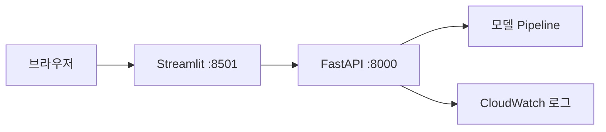

# 08주차 — 배포와 데모 화면 · 중간 점검 (M2)

**클라우드 MLOps** · 연성대학교 · 230분 (10분 조기 종료)
NCS: `2001070308_19v1.2` 인공지능 선정모델 배포 관리하기 / `2001070106_18v1.1` 인공지능 플랫폼 휴먼머신 인터랙션 구현하기 / `2001070108_18v1.2` 인공지능 플랫폼 통합 테스트하기

---

## 0. 회차 요약 (강사용 1페이지)

| 항목 | 내용 |
|---|---|
| 학습목표 | ECR의 이미지를 EC2로 내려받아 `docker compose`로 API와 Streamlit 화면을 동시에 띄우고, 브라우저에서 예측이 실행되는 데모 주소를 만들 수 있다. 그리고 팀 프로젝트의 중간 결과를 5분 안에 시연할 수 있다. |
| 오늘의 결과물 | ① 외부에서 접속되는 데모 URL `http://<퍼블릭IP>:8501` ② `docker compose ps`로 두 컨테이너가 Up인 화면 ③ **M2 중간 시연 완료** |
| 사전 준비 | ① 시연 순서표(팀 순번·타이머) 준비, 프로젝터/HDMI 사전 테스트 ② 시연 평가표(부록 C) 인쇄 — 팀 수 × (강사 1 + 타 팀 수) 부수 ③ 학교망에서 8000·8501 포트 접속 테스트 재확인 ④ `week-08-done` 태그(compose 파일 + Streamlit 앱 완성본) 준비 ⑤ 강사 계정에 데모용 백업 서비스 1식 상시 기동(팀 데모 실패 시 대체 시연용) ⑥ 시연 실패 팀을 위한 화면 녹화 안내 |
| 학생 준비물 | 노트북, 7주차에 ECR에 올린 이미지 태그, 4주차 문제정의서(M1), 베이스라인 성능 수치, 5분 시연 시나리오 |
| 예상 사고 지점 | ① 브라우저에서 퍼블릭 IP 접속이 안 됨 — 보안그룹 인바운드 8000/8501 미개방 ② 컨테이너는 떴는데 Streamlit이 `0.0.0.0`에 바인딩되지 않아 밖에서 못 붙음 ③ Streamlit 컨테이너가 API를 `localhost`로 부르다 실패 (컨테이너 안의 localhost는 자기 자신) |

### 시간표

> **이 회차는 표준 시간표의 예외다.** 마지막 40분을 M2 중간 시연에 배정하고 정리 시간을 시연 블록 안에 흡수했다.

| 시간 | 구성 | 분 |
|---|---|---|
| 00:00–00:10 | 도입 — 지난주 복습 퀴즈 + 오늘 만들 결과물 데모 | 10 |
| 00:10–00:45 | 이론 — 보안그룹·포트·퍼블릭 IP / 비밀 정보 다루기 / 데모 화면의 가치 | 35 |
| 00:45–00:55 | 휴식 ① | 10 |
| 00:55–01:45 | **실습 A** — ECR pull → `docker compose`로 API + Streamlit 동시 실행 | 50 |
| 01:45–01:55 | 휴식 ② | 10 |
| 01:55–03:10 | **실습 B** — 팀 프로젝트 중간 통합 + 시연 준비 | 75 |
| 03:10–03:50 | 🏁 **M2 중간 시연** (팀별 5분) + 강평 + 리소스 정리 확인 | 40 |
| **합계** | | **230** |

---

## 1. 도입 (10분)

### 지난주 복습 퀴즈 (구두 3문항)

1. `docker run`에서 `-p 8000:8000`을 빼면 어떻게 됩니까? — (컨테이너 안에서는 API가 돌지만 밖에서 접속할 수 없습니다. 왼쪽이 호스트 포트, 오른쪽이 컨테이너 포트입니다.)
2. 우리가 모델을 `Pipeline` 통째로 저장한 이유는? — (학습-서빙 스큐를 막기 위해서입니다. 전처리를 서빙에서 다시 손으로 쓰면 언젠가 어긋나고, 그때는 에러도 안 나고 답만 틀립니다.)
3. 상태 코드 422는 누구 잘못입니까? — (요청을 보낸 쪽입니다. 서버 코드가 아니라 보낸 JSON을 고쳐야 합니다.)

> **강사 멘트**
> "지난주 여러분은 `curl`로 예측을 성공시켰습니다. 그런데 여러분 부모님께 그 검은 화면을 보여드리면 뭐라고 하실까요? … 네, '그래서 그게 뭔데?'입니다. 오늘 우리는 두 가지를 합니다. 첫째, 그 API를 **다른 사람도 접속할 수 있는 주소**로 올립니다. 둘째, 그 앞에 **사람이 보고 누를 수 있는 화면**을 붙입니다. 그리고 오늘 마지막 40분에는 그걸 실제로 여러분이 발표합니다. 오늘은 처음으로 '남에게 보여주는 날'입니다."

### 오늘 만들 것 데모

강사는 다음을 순서대로 3분 안에 시연한다.

1. 노트북이 아니라 **휴대폰**을 꺼내 브라우저에 `http://<강사EC2퍼블릭IP>:8501`을 입력한다. 학생들이 보는 앞에서 예측 화면이 뜬다.
   > "제 노트북이 아닙니다. 제 휴대폰입니다. 즉 이 서비스는 이제 **인터넷에 있습니다.**"
2. 슬라이더로 시간과 기온을 바꾸고 **예측하기** 버튼을 누른다. 숫자와 막대그래프가 갱신되는 것을 보여준다.
3. EC2 터미널로 옮겨 `docker compose ps`를 쳐서 컨테이너 **두 개**(`api`, `ui`)가 떠 있는 것을 보여준다.
4. `docker compose logs -f api`로 방금 휴대폰에서 누른 요청이 로그에 찍히는 것을 보여준다.
   > "화면은 껍데기고, 그 뒤에서 지난주에 만든 API가 그대로 일하고 있습니다. 오늘 새로 만드는 건 껍데기 하나뿐입니다."

---

## 2. 이론 (35분)

### 2-1. 보안그룹 · 포트 개방 · 퍼블릭 IP와 탄력적 IP (14분)

**강의 스크립트**

> 질문부터 하겠습니다. 지난주 여러분 API는 `curl http://localhost:8000`으로는 잘 됐는데, 친구 노트북에서는 안 됐습니다. 왜일까요?
>
> 세 개의 문이 순서대로 있기 때문입니다. 하나라도 닫혀 있으면 못 들어옵니다.
>
> **첫 번째 문은 프로그램입니다.** uvicorn이 `--host 0.0.0.0`으로 떠야 합니다. `127.0.0.1`은 "나 자신"이라는 뜻의 특별한 주소라서, 그렇게 뜨면 자기 자신 외에는 누구도 못 붙습니다. 문을 안쪽에서만 열 수 있게 만든 셈입니다.
>
> **두 번째 문은 컨테이너입니다.** `-p 8501:8501` 또는 compose의 `ports:` 설정입니다. 컨테이너는 아파트 안의 방인데, 방문이 안 열려 있으면 현관까지 온 사람도 못 들어옵니다.
>
> **세 번째 문이 오늘의 주인공, 보안그룹(Security Group)입니다.** 이건 EC2 앞에 붙은 **방화벽**입니다. 기본값은 "전부 차단"입니다. 우리가 "8501번 포트는 열어라"라고 규칙을 넣어야 비로소 열립니다. 여기서 중요한 건 **인바운드(inbound)와 아웃바운드(outbound)**입니다. 인바운드는 밖에서 안으로 들어오는 것, 아웃바운드는 안에서 밖으로 나가는 것입니다. 우리가 건드릴 건 거의 항상 **인바운드**입니다.
>
> 그리고 소스(Source)를 정할 때 주의하세요. `0.0.0.0/0`은 "전 세계 모든 IP 허용"이라는 뜻입니다. 편하지만 위험합니다. 인터넷에는 열린 포트를 하루 종일 훑고 다니는 자동 스캐너가 있고, 몇 시간 안에 발견됩니다. 그래서 원칙은 이렇습니다. **개발·실습 중에는 '내 IP', 시연 당일에만 잠깐 '0.0.0.0/0'을 열고 시연이 끝나면 다시 좁힌다.**
>
> 마지막으로 IP 이야기입니다. 여러분 2주차 과제 기억나나요? 인스턴스를 중지했다 켜니까 **퍼블릭 IP가 바뀌었죠.** 이게 왜 문제냐면, 발표 자료에 IP를 적어놨는데 발표 당일 아침에 인스턴스를 재시작하면 그 주소가 죽습니다. 그래서 AWS에는 **탄력적 IP(Elastic IP)**라는 게 있습니다. "이 IP를 내가 가져가서 계속 쓰겠다"고 예약하는 것입니다. 고정 주소를 얻는 대신, **인스턴스에 붙어있지 않은 상태로 방치하면 요금이 붙습니다.** 이번 학기에는 최종 발표 팀에게만 선택적으로 권합니다. 쓰기로 했다면 15주차 정리 때 반드시 해제(Release)하세요.

**판서/슬라이드 요점**

- 밖에서 접속되려면 **문 3개**가 모두 열려야 한다: ① 프로그램 바인딩 `0.0.0.0` ② 컨테이너 포트 매핑 `-p` ③ 보안그룹 인바운드 규칙
- 보안그룹 = EC2 앞의 방화벽. 기본은 전부 차단. **인바운드**를 연다
- 소스: 실습 중 `내 IP` → 시연 시 `0.0.0.0/0` → 시연 후 다시 좁힌다
- 퍼블릭 IP는 인스턴스를 **중지→시작하면 바뀐다.** 발표 자료에 IP를 박아 넣지 말 것
- 탄력적 IP = 고정 IP 예약. ⚠ 인스턴스에 미연결 상태로 두면 시간당 과금 → 학기 말 Release 필수

**학생 질문 예상 & 답변**

- Q: 22번(SSH)도 열려 있는데 왜 8501은 따로 열어야 하나요? → A: 보안그룹 규칙은 **포트별**입니다. 22번을 열었다고 8501이 열리지 않습니다. 포트마다 규칙을 하나씩 추가해야 합니다.
- Q: '내 IP'로 해뒀는데 다음 주에 안 되던데요? → A: 학교 와이파이의 공인 IP는 수시로 바뀝니다. 안 될 때 제일 먼저 보안그룹의 '내 IP'를 다시 눌러 갱신하세요.
- Q: 그냥 도메인 이름을 쓰면 안 되나요? → A: 됩니다만 도메인 구매·DNS 설정이 필요해 이번 학기 범위 밖입니다. 우리는 IP:포트로 갑니다.

---

### 2-2. 비밀 정보 다루기 — 코드에 키를 넣지 않는다 (11분)

**강의 스크립트**

> 이제 아주 중요한 이야기를 하겠습니다. 매년 뉴스에 나오는 사고입니다. 개발자가 AWS 액세스 키를 소스코드에 적은 채로 GitHub에 올립니다. 그 저장소가 공개였다면, 보통 **몇 분 안에** 봇이 찾아냅니다. 그러고 나면 남의 계정으로 값비싼 GPU 서버 수십 대가 켜지고, 청구서가 며칠 만에 수천만 원이 나옵니다. 과장이 아닙니다.
>
> 그래서 규칙은 단순합니다. **비밀 정보는 코드에 절대 쓰지 않는다.** 비밀 정보란 AWS 액세스 키, 비밀번호, API 토큰, 데이터베이스 접속 문자열 같은 것들입니다.
>
> 그럼 어디에 두느냐. 두 가지 방법을 배웁니다.
>
> 첫째, **환경변수(environment variable)**입니다. 프로그램 밖에서 값을 주입하는 통로입니다. 코드에는 `os.getenv("API_URL")`이라고만 쓰고, 실제 값은 실행할 때 컨테이너에 넣어줍니다. 오늘 compose 파일의 `environment:` 항목이 바로 그것입니다. 비밀이 아닌 설정값(예: API 주소)도 이렇게 빼두면 코드를 고치지 않고 환경만 바꿔서 개발/운영을 오갈 수 있습니다.
>
> 둘째, 그리고 AWS 안에서는 이게 정답인데, **IAM 역할(IAM Role)**입니다. EC2 인스턴스 자체에 "너는 이 S3 버킷을 읽을 수 있는 신분이야"라는 역할을 붙여줍니다. 그러면 그 안에서 도는 코드는 **키를 아예 가지고 있지 않아도** S3에 접근할 수 있습니다. `boto3`가 알아서 임시 자격증명을 받아옵니다. 키가 없으면 유출될 것도 없습니다. 이게 최선입니다.
>
> 비유하자면, 환경변수는 "열쇠를 코드에 적지 않고 봉투에 담아 전달하는 것"이고, IAM 역할은 "열쇠 자체를 없애고 출입증 인식기를 다는 것"입니다.
>
> 마지막으로 실전 규칙 하나. `.env` 파일을 만들어 쓰는 건 좋습니다. 단 **`.gitignore`에 `.env`를 반드시 넣으세요.** 이 한 줄이 여러분을 뉴스에서 지켜줍니다.

**판서/슬라이드 요점**

- 비밀 정보(액세스 키·비밀번호·토큰)는 **코드·저장소·스크린샷에 절대 넣지 않는다**
- 방법 1: **환경변수** — 코드는 `os.getenv("이름")`, 값은 compose의 `environment:` 또는 `.env`로 주입
- 방법 2: **IAM 역할** — EC2에 역할을 붙이면 키 없이 AWS 접근 가능 (AWS 안에서는 이게 정답)
- `.gitignore`에 `.env` 필수. 스크린샷 제출 시 키가 찍히지 않았는지 확인
- 실수로 올렸다면: 즉시 **키 비활성화 → 삭제 → 재발급**. 커밋만 지우는 것으로는 부족하다

**학생 질문 예상 & 답변**

- Q: 환경변수도 서버에 들어가면 볼 수 있잖아요? → A: 맞습니다. 환경변수는 "저장소에 남지 않게" 하는 장치이지 완벽한 금고가 아닙니다. 실무에서는 AWS Secrets Manager나 Parameter Store를 씁니다. 우리 수업 범위에서는 환경변수 + IAM 역할까지가 목표입니다.
- Q: 이미 GitHub에 키를 올렸는데 커밋을 지우면 되나요? → A: 안 됩니다. 이력에 남고 이미 수집됐을 수 있습니다. **키를 무효화하는 것**이 유일한 해결책입니다. 발견 즉시 조교에게 알리세요.

---

### 2-3. 데모 화면의 가치 — 심사자는 API가 아니라 화면을 본다 (10분)

**강의 스크립트**

> 여러분에게 불편한 진실을 하나 알려드리겠습니다. 여러분이 3주 동안 만든 파이프라인, 정성 들여 튜닝한 하이퍼파라미터, MLflow에 쌓은 실험 20건. **발표 5분 동안 심사자가 보는 것은 화면 하나입니다.**
>
> 억울한가요? 그런데 이건 심사자가 게을러서가 아닙니다. **동작하는 화면이 있다는 것 자체가 그 뒤의 모든 것이 실제로 연결되어 있다는 증거**이기 때문입니다. 화면에서 버튼을 눌러 숫자가 나왔다면, 그 순간 데이터 전처리도, 모델도, API도, 컨테이너도, 네트워크도 전부 살아 있다는 뜻입니다. 화면은 껍데기가 아니라 **통합 테스트의 결과물**입니다.
>
> 그래서 오늘 붙이는 Streamlit은 예쁜 장식이 아닙니다. 우리 파이프라인의 **최종 점검 장치**입니다.
>
> Streamlit이 뭐냐면, 파이썬 코드 몇 줄로 웹 화면을 만들어 주는 도구입니다. HTML도 CSS도 자바스크립트도 필요 없습니다. `st.slider("기온", -10, 40)` 한 줄이면 화면에 슬라이더가 생기고, 그 값이 파이썬 변수로 들어옵니다. 우리 같은 데이터 쪽 사람들을 위해 만들어진 도구입니다.
>
> 그리고 오늘 아키텍처를 머리에 그려두세요. **컨테이너 두 개**입니다. 하나는 지난주에 만든 API, 하나는 오늘 만들 UI. UI가 API를 HTTP로 부릅니다. 왜 하나로 안 합치냐고요? 세 가지 이유입니다. 화면이 죽어도 API는 살아 있어야 하고, 화면과 모델의 수정 주기가 다르고, 나중에 모바일 앱이 붙어도 API는 그대로 쓰기 때문입니다. **역할이 다르면 상자를 나눈다** — 이게 오늘 배우는 설계 원칙입니다.
>
> 마지막으로 시연 팁 하나. 오늘 5분 시연에서 가장 흔한 실패는 "현장에서 처음 눌러보는 것"입니다. 반드시 **팀에서 한 명이 리허설로 끝까지 눌러본 뒤** 발표에 들어가세요. 그리고 14주차에도 말하겠지만, **화면 녹화 백업**은 지금부터 습관을 들이세요.

**판서/슬라이드 요점**

- 데모 화면 = 예쁜 장식이 아니라 **파이프라인 전 구간이 살아 있다는 증거** (= 통합 테스트)
- Streamlit = 파이썬만으로 웹 UI를 만드는 도구. HTML/CSS/JS 불필요
- 오늘의 구조: **컨테이너 2개** — `api`(예측) + `ui`(화면), UI가 API를 HTTP로 호출
- 분리하는 이유: 장애 격리 · 수정 주기 분리 · 다른 클라이언트 재사용
- 시연 원칙: 현장에서 처음 누르지 않는다. 리허설 1회 + 화면 녹화 백업

**학생 질문 예상 & 답변**

- Q: Streamlit에서 모델을 직접 로드하면 안 되나요? 그러면 API가 필요 없잖아요. → A: 됩니다. 그런데 그러면 모델이 화면에 묶여서, 다른 곳(모바일, 다른 팀 시스템)에서 재사용할 수 없습니다. 그리고 이 과목의 목표는 "주소를 가진 서비스"를 만드는 것입니다. 화면 없이도 API는 서비스여야 합니다.
- Q: 디자인은 어디까지 해야 하나요? → A: 입력 위젯 + 예측 버튼 + 결과 숫자, 이 세 개면 만점 기준을 채웁니다. 시간이 남으면 그래프 하나만 더 붙이세요. 디자인에 시간 쓰지 마세요.

---

## 3. 실습 A — ECR 이미지를 EC2에 배포하고 화면 붙이기 (50분) · 공통 예제 따라하기

**목표** 7주차에 ECR에 올린 API 이미지를 EC2에서 `pull`하고, Streamlit UI 이미지를 새로 만들어 `docker compose`로 둘을 동시에 띄운 뒤 브라우저에서 예측을 실행한다.

**사전 배포 파일**
- `ui/app.py` (Streamlit 앱 — 절반은 채워진 상태로 배포, 핵심 호출부는 학생이 입력)
- `ui/requirements.txt`, `ui/Dockerfile`
- `docker-compose.yml` 골격 (이미지 주소만 빈칸)
- 완성본 태그: `week-08-done`

### 수행 순서

**① 작업 폴더 준비와 변수 설정**

```bash
mkdir -p ~/bike-demo/ui
cd ~/bike-demo

export ACCOUNT_ID=$(aws sts get-caller-identity --query Account --output text)
export REGION=ap-northeast-2
export API_REPO=mlops-2026-<학번>/bike-api
export UI_REPO=mlops-2026-<학번>/bike-ui
echo $ACCOUNT_ID.dkr.ecr.$REGION.amazonaws.com/$API_REPO:v1
```

- 확인 포인트: 마지막 줄이 `123456789012.dkr.ecr.ap-northeast-2.amazonaws.com/mlops-2026-20231234/bike-api:v1` 형태로 출력된다. 이 문자열을 그대로 복사해 둔다(다음 단계에서 붙여넣는다).

**② ECR 로그인 후 API 이미지 pull**

```bash
aws ecr get-login-password --region $REGION \
  | docker login --username AWS --password-stdin $ACCOUNT_ID.dkr.ecr.$REGION.amazonaws.com

docker pull $ACCOUNT_ID.dkr.ecr.$REGION.amazonaws.com/$API_REPO:v1
docker images | grep bike-api
```

- 확인 포인트: `Status: Downloaded newer image ...` 또는 `Image is up to date`가 나오고 `docker images`에 보인다.

**③ Streamlit 앱 작성 (`ui/app.py`)**

```bash
nano ~/bike-demo/ui/app.py
```

```python
import os

import pandas as pd
import requests
import streamlit as st

# API 주소는 코드에 박지 않고 환경변수로 주입받는다.
# compose 안에서는 서비스 이름 'api'가 그대로 호스트명이 된다.
API_URL = os.getenv("API_URL", "http://api:8000")

st.set_page_config(page_title="따릉이 대여량 예측 데모", page_icon="🚲", layout="centered")
st.title("따릉이 시간대별 대여량 예측")
st.caption("클라우드 MLOps 8주차 데모 · 예측 모델 v1")

# ── 사이드바: 서버 상태 확인 ────────────────────────────────
with st.sidebar:
    st.header("서버 상태")
    if st.button("헬스체크"):
        try:
            r = requests.get(f"{API_URL}/health", timeout=3)
            st.success(r.json())
        except Exception as exc:  # noqa: BLE001
            st.error(f"API에 연결할 수 없습니다: {exc}")
    st.write("API_URL:", API_URL)

# ── 입력 위젯 ──────────────────────────────────────────────
col1, col2 = st.columns(2)
with col1:
    hour = st.slider("시간대", 0, 23, 18)
    temperature = st.slider("기온(°C)", -10.0, 40.0, 24.5, step=0.5)
    humidity = st.slider("습도(%)", 0.0, 100.0, 55.0, step=1.0)
with col2:
    windspeed = st.slider("풍속(m/s)", 0.0, 15.0, 2.1, step=0.1)
    weekday = st.selectbox(
        "요일", options=[0, 1, 2, 3, 4, 5, 6],
        format_func=lambda d: ["월", "화", "수", "목", "금", "토", "일"][d], index=2,
    )
    season = st.selectbox("계절", options=["spring", "summer", "fall", "winter"], index=1)
    is_holiday = 1 if st.checkbox("공휴일") else 0

payload = {
    "hour": hour,
    "temperature": temperature,
    "humidity": humidity,
    "windspeed": windspeed,
    "weekday": weekday,
    "is_holiday": is_holiday,
    "season": season,
}

with st.expander("전송될 요청 JSON 보기"):
    st.json(payload)

# ── 예측 실행 ──────────────────────────────────────────────
if st.button("예측하기", type="primary", use_container_width=True):
    try:
        res = requests.post(f"{API_URL}/predict", json=payload, timeout=5)
    except Exception as exc:  # noqa: BLE001
        st.error(f"API 호출 실패: {exc}")
    else:
        if res.status_code == 200:
            data = res.json()
            st.metric(label="예측 대여량", value=f"{data['predicted_count']:.1f} {data['unit']}")
            st.caption(f"모델 버전: {data['model_version']}")
        elif res.status_code == 422:
            st.warning("입력값이 API 규격에 맞지 않습니다.")
            st.json(res.json())
        else:
            st.error(f"서버 오류 {res.status_code}")
            st.text(res.text)

# ── 하루 전체 곡선 (보조 기능) ─────────────────────────────
if st.checkbox("선택한 조건으로 하루 24시간 곡선 그리기"):
    rows = []
    for h in range(24):
        body = dict(payload, hour=h)
        try:
            r = requests.post(f"{API_URL}/predict", json=body, timeout=5)
            rows.append({"시간": h, "예측 대여량": r.json()["predicted_count"]})
        except Exception:  # noqa: BLE001
            break
    if rows:
        st.bar_chart(pd.DataFrame(rows).set_index("시간"))
```

**④ UI용 `requirements.txt`와 `Dockerfile`**

```bash
cat > ~/bike-demo/ui/requirements.txt << 'EOF'
streamlit==1.40.2
requests==2.32.3
pandas==2.2.3
EOF
```

```bash
nano ~/bike-demo/ui/Dockerfile
```

```dockerfile
FROM python:3.11-slim

ENV PYTHONUNBUFFERED=1

WORKDIR /app

COPY requirements.txt /app/requirements.txt
RUN pip install --no-cache-dir -r /app/requirements.txt

COPY app.py /app/app.py

EXPOSE 8501

# --server.address=0.0.0.0 이 없으면 컨테이너 밖에서 절대 접속되지 않는다.
CMD ["streamlit", "run", "app.py", \
     "--server.port=8501", \
     "--server.address=0.0.0.0", \
     "--server.headless=true", \
     "--browser.gatherUsageStats=false"]
```

**⑤ UI 이미지 빌드 후 ECR에 올리기**

```bash
cd ~/bike-demo/ui
docker build -t bike-ui:v1 .

aws ecr create-repository --repository-name $UI_REPO --region $REGION
docker tag bike-ui:v1 $ACCOUNT_ID.dkr.ecr.$REGION.amazonaws.com/$UI_REPO:v1
docker push $ACCOUNT_ID.dkr.ecr.$REGION.amazonaws.com/$UI_REPO:v1
```

**⑥ `docker-compose.yml` 작성** — 두 컨테이너를 한 파일로 묶는다.

```bash
nano ~/bike-demo/docker-compose.yml
```

```yaml
services:
  api:
    image: ${ACCOUNT_ID}.dkr.ecr.${REGION}.amazonaws.com/${API_REPO}:v1
    container_name: bike-api
    ports:
      - "8000:8000"
    environment:
      MODEL_VERSION: "v1"
    restart: unless-stopped
    healthcheck:
      test: ["CMD-SHELL", "python -c \"import urllib.request;urllib.request.urlopen('http://localhost:8000/health')\""]
      interval: 15s
      timeout: 3s
      retries: 5

  ui:
    image: ${ACCOUNT_ID}.dkr.ecr.${REGION}.amazonaws.com/${UI_REPO}:v1
    container_name: bike-ui
    ports:
      - "8501:8501"
    environment:
      # 'api'는 위 서비스 이름. compose가 만든 네트워크 안에서 호스트명으로 통한다.
      API_URL: "http://api:8000"
    depends_on:
      api:
        condition: service_healthy
    restart: unless-stopped
```

compose가 `${ACCOUNT_ID}` 같은 값을 읽을 수 있도록 `.env` 파일을 만든다.

```bash
cd ~/bike-demo
cat > .env << EOF
ACCOUNT_ID=$ACCOUNT_ID
REGION=$REGION
API_REPO=$API_REPO
UI_REPO=$UI_REPO
EOF

cat > .gitignore << 'EOF'
.env
__pycache__/
EOF
```

> ⚠ `.env`는 **절대 git에 올리지 않는다.** 오늘은 계정 ID만 들어 있지만, 습관을 지금 들인다.

**⑦ 실행과 확인**

```bash
cd ~/bike-demo
docker compose up -d
docker compose ps
docker compose logs -f ui     # Ctrl+C 로 빠져나온다
```

- 확인 포인트: `docker compose ps`에 `bike-api`(healthy)와 `bike-ui` 두 줄이 모두 `Up`.

**⑧ 보안그룹에서 8501 열기**

AWS 콘솔 → EC2 → 인스턴스 → 보안 → 보안 그룹 → 인바운드 규칙 편집 → 규칙 추가

| 유형 | 포트 범위 | 소스 | 설명 |
|---|---|---|---|
| 사용자 지정 TCP | 8501 | 내 IP | `mlops-ui-8501` |
| 사용자 지정 TCP | 8000 | 내 IP | `mlops-api-8000` (7주차에 이미 추가했다면 그대로) |

**⑨ 브라우저에서 접속**

```text
http://<EC2퍼블릭IP>:8501
```

퍼블릭 IP를 모르면 EC2 안에서 확인한다.

```bash
curl -s http://169.254.169.254/latest/meta-data/public-ipv4; echo
```

- 확인 포인트(제출용 스크린샷 ①): 브라우저 주소창의 `퍼블릭IP:8501`과 예측 결과 숫자가 **한 화면에** 보이도록 캡처.

### ⚠ 여기서 막히면

| 증상 | 원인 | 조치 |
|---|---|---|
| 브라우저가 계속 돌기만 하고 화면이 안 뜸 | **보안그룹 인바운드 8501 미개방** (가장 흔함) | ⑧단계 수행. 이미 넣었다면 소스의 '내 IP'를 다시 눌러 현재 IP로 갱신 |
| "연결이 거부됨(ERR_CONNECTION_REFUSED)" | Streamlit이 `0.0.0.0`에 바인딩되지 않음 | `ui/Dockerfile`의 `CMD`에 `--server.address=0.0.0.0`이 있는지 확인. 고쳤으면 `docker compose build ui && docker compose up -d` |
| UI 화면은 뜨는데 "API 호출 실패: Connection refused" | `API_URL`을 `http://localhost:8000`으로 둠. **컨테이너 안의 localhost는 자기 자신(UI 컨테이너)** | compose의 `API_URL`을 `http://api:8000`(서비스 이름)으로 고친다 |
| `docker compose up` 시 `pull access denied` / `no basic auth credentials` | ECR 로그인 토큰 만료(12시간) | ②단계의 `get-login-password` 명령 재실행 |
| `manifest unknown` | 이미지 태그가 실제 ECR에 없음 | `aws ecr list-images --repository-name $API_REPO --region $REGION`으로 태그 확인 후 compose 수정 |
| `docker: 'compose' is not a docker command` | Compose 플러그인 미설치 | `sudo apt-get update && sudo apt-get install -y docker-compose-plugin` |
| `permission denied while trying to connect to the Docker daemon` | 현재 사용자가 docker 그룹에 없음 | `sudo usermod -aG docker $USER` 후 **로그아웃 → 재접속** |
| 어제 되던 주소가 오늘 안 됨 | 인스턴스 중지→시작으로 **퍼블릭 IP가 바뀜** | 새 IP를 확인해 다시 접속. 발표 자료에 IP를 박아두지 말 것 |
| 화면은 뜨는데 한글이 깨짐 | 브라우저 인코딩 문제 아님, 대개 폰트 | 실습 범위 밖. 제출에는 영향 없음 |

### 컷오프 안내

50분 경과 시 강제 종료. 못 따라온 학생은 완성본에서 이어받는다.

```bash
git clone --branch week-08-done https://github.com/<강사계정>/mlops-2026-reference.git ~/week08-done
cp ~/week08-done/docker-compose.yml ~/bike-demo/
cp -r ~/week08-done/ui ~/bike-demo/
```

---

## 4. 실습 B — 팀 프로젝트 중간 통합 + 시연 준비 (75분) · 팀 단위 수행

**목표** 팀 데이터·팀 모델로 API + UI를 띄우고, 5분 시연 시나리오를 완성한다.

**과제 지시문** (학생에게 그대로 읽어줄 문장)

> "지금부터 75분 동안 팀별로 앉습니다. 목표는 딱 하나입니다. **75분 뒤에 여러분 팀 주소를 브라우저에 치면 팀 모델이 예측을 해야 합니다.** 새로 만드는 것은 없습니다. 방금 만든 골격에 여러분 데이터만 갈아 끼우는 것입니다. 그리고 마지막 15분은 코딩을 멈추고 **시연 리허설**에 씁니다. 5분 안에 세 가지를 말해야 합니다. 우리 문제가 뭔지, 지금 성능이 얼마인지, 그리고 실제로 도는 것을 보여주기. 코드 설명은 하지 마세요. 아무도 안 궁금해합니다."

### 수행 항목

1. **역할 분담 (5분)** — 서빙 담당은 compose 띄우기, 모델 담당은 성능 수치 정리, 문서 담당은 시연 대본, 데이터 담당은 시연용 입력값 3세트 준비.
2. **팀 이미지로 교체 (25분)**
   - `docker-compose.yml`의 `image:`를 팀 ECR 주소로 변경
   - `ui/app.py`의 입력 위젯을 팀 입력 필드로 교체 (슬라이더/셀렉트박스 이름과 범위)
   - 분류 문제 팀은 결과 표시를 다음처럼 변경
     ```python
     st.metric("예측 결과", "이탈 예상" if data["predicted_label"] == 1 else "유지 예상")
     st.progress(data["probability"], text=f"이탈 확률 {data['probability']*100:.1f}%")
     ```
3. **통합 테스트 (20분)** — 7주차 과제로 만든 `tests/sample_request.json` 3건을 순서대로 넣어본다.
   ```bash
   for f in tests/*.json; do
     echo "== $f"
     curl -s -X POST http://localhost:8000/predict -H "Content-Type: application/json" -d @"$f"
     echo
   done
   ```
   - 정상 2건은 200, 경계값 1건은 의도한 결과(200 또는 422)가 나오는지 기록한다. 이 기록이 곧 통합 테스트 결과다.
4. **시연용 보안그룹 임시 개방 (5분)** — 시연 시간에 강사 노트북에서 접속해야 하므로, **8501 인바운드에 강사 노트북 IP 또는 `0.0.0.0/0`을 임시 추가**한다. 시연 종료 후 되돌린다.
5. **시연 리허설 (15분)** — 아래 5분 대본 틀을 채우고, 실제로 타이머를 켜고 한 번 돌려본다.

   | 시간 | 말할 것 | 화면 |
   |---|---|---|
   | 0:00–1:00 | 우리 문제: 누가, 어떤 상황에서, 무엇을 몰라서 곤란한가 | 슬라이드 1장 |
   | 1:00–2:00 | 데이터: 출처·기간·행수, 입력 피처와 예측 대상 | 슬라이드 1장 |
   | 2:00–3:00 | 베이스라인 성능: 지표 이름과 숫자, 비교 대상(단순 규칙 대비) | 슬라이드 1장 |
   | 3:00–4:30 | **라이브 시연**: 브라우저에서 값 입력 → 예측 → 결과 설명 | 데모 화면 |
   | 4:30–5:00 | 남은 계획 한 문장 + 질문 받기 | — |

6. **백업 준비 (5분)** — 시연 화면을 휴대폰으로 30초 녹화해 둔다. 네트워크가 죽어도 시연은 진행된다.

### 팀 프로젝트 연결

오늘 실습 B의 산출물이 곧 **M2 중간 시연(15점)의 제출 실체**다. 그리고 여기서 만든 `docker-compose.yml`은 12주차 GitHub Actions 자동 배포에서 **배포 스크립트가 실행할 대상**이 된다. 즉 오늘 파일을 팀 저장소에 커밋해 두면 12주차에 그대로 재사용된다.

### 순회 지도 포인트

1. **`API_URL`이 `http://api:8000`인가** — `localhost`로 둔 팀이 반드시 나온다. 컨테이너 네트워크 개념을 그 자리에서 1분 설명하고 넘어간다.
2. **팀 저장소에 `.env`가 커밋되지 않았는가** — `git status`로 확인시킨다. 이번 주 이론의 실전 적용 지점이다.
3. **시연 대본이 '코드 설명'으로 흘러가지 않는가** — "문제 → 성능 → 동작"의 3단 구성인지 확인하고, 아키텍처 다이어그램 설명에 2분 이상 쓰는 팀은 잘라준다.

---

## 5. 체크포인트 (제출물)

| # | 제출물 | 형식 | 배점 |
|---|---|---|---|
| 1 | 브라우저 주소창(`퍼블릭IP:8501`)과 예측 결과가 함께 보이는 데모 화면 | 스크린샷 | 0.7 |
| 2 | `docker compose ps` 결과 — `api`, `ui` 두 컨테이너가 Up | 스크린샷 | 0.5 |
| 3 | 통합 테스트 기록 — 요청 3건의 상태코드와 응답 요약 | 텍스트 또는 스크린샷 | 0.8 |
| 4 | **M2 중간 시연** (팀 단위) | 현장 발표 5분 | **15점 (별도)** |

### 평가 기준 (NCS 수행준거 연계)

- `2001070308_19v1.2` **인공지능 선정모델 배포 관리하기** — 선정된 모델을 운영 환경에 배포하고, 배포된 버전과 구성을 식별·관리할 수 있는가. (판정: ECR의 특정 태그 이미지를 EC2에 배포해 기동시켰는가 / 배포 구성이 `docker-compose.yml` 파일로 명시·재현 가능한가 / 응답에 `model_version`이 포함되는가)
- `2001070106_18v1.1` **인공지능 플랫폼 휴먼머신 인터랙션 구현하기** — 사용자가 입력을 제공하고 결과를 확인할 수 있는 상호작용 화면을 구현했는가. (판정: 입력 위젯으로 값을 조작해 예측을 실행할 수 있는가 / 결과가 사람이 해석 가능한 형태(단위·라벨·확률)로 표시되는가 / 오류 상황을 사용자에게 안내하는가)
- `2001070108_18v1.2` **인공지능 플랫폼 통합 테스트하기** — 개별 구성요소를 연결한 상태에서 전체 흐름이 기대대로 동작하는지 확인했는가. (판정: UI→API→모델의 전 구간 호출이 외부 브라우저에서 성공하는가 / 정상·비정상 입력 각각에 대한 통합 테스트 기록을 남겼는가)

---

## 6. M2 중간 시연 · 정리 (40분)

### 진행 절차

| 시간 | 내용 |
|---|---|
| 03:10–03:12 | 시연 순서 발표, 타이머 세팅, 발표석 노트북을 프로젝터에 연결 |
| 03:12–03:42 | **팀별 5분 시연** (6팀 기준 30분, 팀당 5분 엄수. 4분 30초에 1차 벨, 5분에 종료 벨) |
| 03:42–03:47 | 강사 총평 — 잘된 점 3개, 공통 보완점 3개 |
| 03:47–03:50 | **리소스 정리 타임** 및 다음 주 예고 |

> 팀 수가 7팀 이상이면 시연을 4분으로 줄이고 질문을 생략한다. 시연 중 팀 데모가 실패하면 **30초 안에 백업 영상으로 전환**하고 감점하지 않는다(단, 백업이 없으면 '동작 시연' 항목 0점).

### 오늘 배운 것 3줄 요약

1. 밖에서 접속되려면 **문 세 개**(`0.0.0.0` 바인딩 · 포트 매핑 · 보안그룹 인바운드)가 모두 열려야 한다.
2. 비밀 정보는 코드에 넣지 않는다. **환경변수와 IAM 역할**이 답이고, `.gitignore`에 `.env`는 필수다.
3. 데모 화면은 장식이 아니라 **파이프라인 전 구간이 살아 있다는 증거**다. 그래서 화면 = 통합 테스트다.

### 다음 주 미리보기 한 문장

> "다음 주에는 **AWS가 대신 다 해주는 방식(SageMaker)**을 써 봅니다. 여러분이 2주에 걸쳐 만든 것을 30분 만에 만들어 볼 겁니다. 그리고 그게 왜 마냥 좋은 게 아닌지도 같이 봅니다. ⚠ 다음 주는 **비용이 실제로 나가는 회차**입니다. 지각하면 삭제 절차를 놓칩니다. 꼭 제시간에 오세요."

### 리소스 정리 타임 체크 항목 (조교 확인)

```bash
cd ~/bike-demo
docker compose down          # 두 컨테이너 모두 정지·삭제
docker ps -a                 # 남은 것이 없는지 확인
df -h /                      # 디스크 여유 확인
```

- [ ] `docker compose down` 완료, `docker ps`가 비어 있다
- [ ] **보안그룹에서 시연용으로 임시 개방한 `0.0.0.0/0` 규칙을 삭제**하고 '내 IP'로 되돌렸다
- [ ] EC2 인스턴스 **중지(Stop)** 완료
- [ ] 탄력적 IP를 할당받은 팀은, 인스턴스에 **연결된 상태**로 두었다 (미연결 방치 = 과금)
- [ ] `.env`가 git에 커밋되지 않았다 (`git status`로 확인)

---

## 7. 과제

1. **(필수)** 팀 저장소에 `docker-compose.yml`, `ui/` 폴더, `tests/` 폴더를 커밋한다. `.env`는 커밋하지 않고 `.env.example`(값을 비운 견본)만 올린다.
2. **(필수)** M2 시연에서 받은 지적사항을 팀 이슈로 3개 이상 등록하고 담당자를 지정한다. 14주차 코칭 때 이 목록을 점검한다.
3. **(권장)** UI에 "최근 예측 10건" 표를 추가한다. `st.session_state`에 리스트로 쌓아 `st.dataframe()`으로 표시하면 된다. 13주차 모니터링의 예고편이다.
4. **(선택)** `docker compose logs api > api.log` 로 로그를 파일로 남겨 보고, 어떤 정보가 부족한지 한 문단으로 적어 온다. 13주차 로그 설계에 쓴다.

---

## 부록 A. 명령어 치트시트 (1페이지 배포용)

```bash
# ── 0. 변수 (매 세션 1회) ─────────────────────────────────
export ACCOUNT_ID=$(aws sts get-caller-identity --query Account --output text)
export REGION=ap-northeast-2
export API_REPO=mlops-2026-<학번>/bike-api
export UI_REPO=mlops-2026-<학번>/bike-ui

# ── 1. ECR 로그인 & pull ──────────────────────────────────
aws ecr get-login-password --region $REGION \
  | docker login --username AWS --password-stdin $ACCOUNT_ID.dkr.ecr.$REGION.amazonaws.com
docker pull $ACCOUNT_ID.dkr.ecr.$REGION.amazonaws.com/$API_REPO:v1

# ── 2. UI 이미지 빌드 & push ──────────────────────────────
cd ~/bike-demo/ui && docker build -t bike-ui:v1 .
docker tag bike-ui:v1 $ACCOUNT_ID.dkr.ecr.$REGION.amazonaws.com/$UI_REPO:v1
docker push $ACCOUNT_ID.dkr.ecr.$REGION.amazonaws.com/$UI_REPO:v1

# ── 3. compose 운영 ───────────────────────────────────────
cd ~/bike-demo
docker compose up -d            # 백그라운드 기동
docker compose ps               # 상태 확인
docker compose logs -f ui       # 로그 실시간 (Ctrl+C)
docker compose restart ui       # 하나만 재시작
docker compose pull && docker compose up -d   # 새 이미지로 갱신 배포
docker compose down             # 전부 정지·삭제

# ── 4. 접속 확인 ──────────────────────────────────────────
curl -s http://169.254.169.254/latest/meta-data/public-ipv4; echo   # 내 퍼블릭 IP
curl -s http://localhost:8000/health                                # 서버 내부에서 API 확인
# 브라우저:  http://<퍼블릭IP>:8501

# ── 5. 응급 처치 ──────────────────────────────────────────
docker compose logs --tail 50 api
docker exec -it bike-ui env | grep API_URL      # UI가 보는 API 주소 확인
docker network inspect bike-demo_default        # 두 컨테이너가 같은 네트워크인지
sudo usermod -aG docker $USER                   # docker 권한 오류 시 (재접속 필요)
```

---

## 부록 B. 용어 정리

| 용어 | 뜻 | 한 줄 설명 |
|---|---|---|
| 보안그룹(Security Group) | 인스턴스 방화벽 | EC2 앞에서 포트별 접속 허용을 결정. 기본은 전부 차단 |
| 인바운드 / 아웃바운드 | 들어오는 / 나가는 트래픽 | 우리가 여는 것은 거의 항상 인바운드 |
| 퍼블릭 IP | 공인 주소 | 인터넷에서 이 서버를 가리키는 주소. **중지→시작 시 바뀐다** |
| 탄력적 IP(Elastic IP) | 고정 공인 주소 | 예약해 계속 쓰는 IP. ⚠ 미연결 방치 시 과금 |
| `0.0.0.0` (바인딩) | 모든 인터페이스 | 프로그램이 외부 접속을 받겠다는 설정. `127.0.0.1`은 자기 자신만 |
| `0.0.0.0/0` (소스) | 전 세계 허용 | 보안그룹 소스로 쓰면 누구나 접속 가능. 시연 때만 임시 사용 |
| Docker Compose | 다중 컨테이너 실행 도구 | 여러 컨테이너의 이미지·포트·환경변수를 YAML 한 장으로 정의 |
| 서비스 이름(compose) | 컨테이너 호스트명 | compose 네트워크 안에서 `api`가 곧 주소가 된다 (`http://api:8000`) |
| 헬스체크(healthcheck) | 생존 점검 | 컨테이너가 실제로 응답하는지 주기적으로 확인. `depends_on`과 함께 기동 순서를 보장 |
| 환경변수 | 실행 시 주입하는 설정값 | 코드에 값을 박지 않기 위한 통로. `os.getenv()`로 읽는다 |
| IAM 역할(Role) | 신분 부여 | EC2에 붙이면 **키 없이** AWS 리소스에 접근 가능 |
| Streamlit | 파이썬 웹 UI 도구 | HTML 없이 파이썬만으로 입력 위젯과 차트가 있는 화면 제작 |
| 통합 테스트 | integration test | 부품을 다 연결한 상태에서 전체 흐름이 도는지 확인하는 시험 |

---

## 부록 C. M2 중간 시연 평가표 (15점) — 인쇄 배포용

**팀명**: ______________  **발표자**: ______________  **평가자**: ______________  **일시**: 2026년 ___월 ___일

| # | 평가 항목 | 세부 기준 | 배점 | 점수 |
|---|---|---|---|---|
| 1 | **문제 정의의 명확성** | 누가·어떤 상황에서 무엇을 몰라 곤란한지가 한 문장으로 설명되는가. 입력과 출력이 무엇인지 명확한가 | 3 | |
| 2 | **데이터 근거** | 데이터의 출처·기간·규모를 밝혔는가. 개인정보/저작권 이슈를 확인했는가 | 2 | |
| 3 | **베이스라인 성능 제시** | 평가지표 이름과 수치를 제시했는가. 비교 기준(단순 규칙·평균 등)이 있는가 | 3 | |
| 4 | **동작하는 API 호출 시연** | 라이브로 예측이 실행되었는가. UI 또는 `curl`로 요청→응답이 관중 앞에서 확인되었는가 | **4** | |
| 5 | **배포 상태** | 외부 접속 가능한 주소로 서비스되고 있는가(로컬 실행만이면 1점) | 2 | |
| 6 | **발표 운영** | 5분 시간을 지켰는가. 코드 나열이 아닌 결과 중심으로 말했는가 | 1 | |
| | **합계** | | **15** | |

**감점 요소**
- 시연 실패 + 백업 영상 없음: 항목 4를 0점 처리
- 발표 시간 1분 초과마다 −1점 (최대 −2)
- 비밀 키가 화면/저장소에 노출된 것이 확인되면 −2점 및 즉시 키 재발급 지시

**서술 평가**

- 잘한 점 (1가지 이상 필수):

- 다음 4주 안에 반드시 보완할 점 (1가지 이상 필수):

- 위험 신호 (해당 시 체크)
  - [ ] 팀원 중 전 구간을 이해하는 사람이 1명뿐으로 보임
  - [ ] 데이터 확보가 아직 불안정함
  - [ ] 모델 성능이 기준선과 구분되지 않음
  - [ ] 배포가 개인 노트북에만 존재함

---

## 부록. AWS 화면과 공식 문서

- EC2 콘솔: <https://console.aws.amazon.com/ec2/>
- 이동 경로: **EC2 → Instances → 팀 인스턴스 → Security / Networking**
- 화면에서 확인: API·Streamlit 포트, 허용 소스, 퍼블릭 IP, 상태 검사
- 공식 문서: <https://docs.aws.amazon.com/AWSEC2/latest/UserGuide/security-group-rules.html>


## 실제 AWS 콘솔 화면 실습 가이드 (8주차)

> 화면 수를 고정하지 않는다. 2026-08-24 서울 리전에서 **인스턴스 확인 → 보안 규칙 입력 연습 → SSM 배포 → 실패 원인 확인 → 수정 → 성공 확인 → 비용 정리**를 실제로 수행하며, 학생이 판단하거나 입력해야 하는 지점마다 캡처했다. 보안 규칙 입력은 저장하지 않았고, EC2는 촬영 뒤 다시 중지했다.

### 1. EC2 인스턴스 목록에서 실습 대상 찾기


- 콘솔 경로: **EC2 → Instances → ysu-mlops-lab-ec2**
- 확인할 것: EC2 인스턴스 목록에서 실습 대상 찾기
- [관련 AWS·도구 공식 문서](https://docs.aws.amazon.com/AWSEC2/latest/UserGuide/Stop_Start.html)

### 2. 인스턴스 세부 정보 확인


- 콘솔 경로: **EC2 → Instances → ysu-mlops-lab-ec2**
- 확인할 것: 인스턴스 세부 정보 확인
- [관련 AWS·도구 공식 문서](https://docs.aws.amazon.com/AWSEC2/latest/UserGuide/Stop_Start.html)

### 3. 보안 탭 확인


- 콘솔 경로: **EC2 → Instances → ysu-mlops-lab-ec2**
- 확인할 것: 보안 탭 확인
- [관련 AWS·도구 공식 문서](https://docs.aws.amazon.com/AWSEC2/latest/UserGuide/Stop_Start.html)

### 4. 네트워킹 탭 확인


- 콘솔 경로: **EC2 → Instances → ysu-mlops-lab-ec2**
- 확인할 것: 네트워킹 탭 확인
- [관련 AWS·도구 공식 문서](https://docs.aws.amazon.com/AWSEC2/latest/UserGuide/Stop_Start.html)

### 5. 스토리지 탭 확인


- 콘솔 경로: **EC2 → Instances → ysu-mlops-lab-ec2**
- 확인할 것: 스토리지 탭 확인
- [관련 AWS·도구 공식 문서](https://docs.aws.amazon.com/AWSEC2/latest/UserGuide/Stop_Start.html)

### 6. 모니터링 탭 확인


- 콘솔 경로: **EC2 → Instances → ysu-mlops-lab-ec2**
- 확인할 것: 모니터링 탭 확인
- [관련 AWS·도구 공식 문서](https://docs.aws.amazon.com/AWSEC2/latest/UserGuide/Stop_Start.html)

### 7. 리소스 태그 확인


- 콘솔 경로: **EC2 → Instances → ysu-mlops-lab-ec2**
- 확인할 것: 리소스 태그 확인
- [관련 AWS·도구 공식 문서](https://docs.aws.amazon.com/AWSEC2/latest/UserGuide/Stop_Start.html)

### 8. 상태 검사와 경보 확인


- 콘솔 경로: **EC2 → Instances → ysu-mlops-lab-ec2**
- 확인할 것: 상태 검사와 경보 확인
- [관련 AWS·도구 공식 문서](https://docs.aws.amazon.com/AWSEC2/latest/UserGuide/Stop_Start.html)

### 9. 보안 그룹 규칙 목록 확인


- 콘솔 경로: **EC2 → Security Groups**
- 확인할 것: 보안 그룹 규칙 목록 확인
- [관련 AWS·도구 공식 문서](https://docs.aws.amazon.com/AWSEC2/latest/UserGuide/security-group-rules.html)

### 10. 인바운드 규칙 편집 화면 열기


- 콘솔 경로: **EC2 → Security Groups**
- 확인할 것: 인바운드 규칙 편집 화면 열기
- [관련 AWS·도구 공식 문서](https://docs.aws.amazon.com/AWSEC2/latest/UserGuide/security-group-rules.html)

### 11. 첫 인바운드 규칙 추가


- 콘솔 경로: **EC2 → Security Groups**
- 확인할 것: 첫 인바운드 규칙 추가
- [관련 AWS·도구 공식 문서](https://docs.aws.amazon.com/AWSEC2/latest/UserGuide/security-group-rules.html)

### 12. FastAPI 포트 8000 입력


- 콘솔 경로: **EC2 → Security Groups**
- 확인할 것: FastAPI 포트 8000 입력
- [관련 AWS·도구 공식 문서](https://docs.aws.amazon.com/AWSEC2/latest/UserGuide/security-group-rules.html)

### 13. API 소스를 내 IP로 제한


- 콘솔 경로: **EC2 → Security Groups**
- 확인할 것: API 소스를 내 IP로 제한
- [관련 AWS·도구 공식 문서](https://docs.aws.amazon.com/AWSEC2/latest/UserGuide/security-group-rules.html)

### 14. Streamlit 포트 8501 입력


- 콘솔 경로: **EC2 → Security Groups**
- 확인할 것: Streamlit 포트 8501 입력
- [관련 AWS·도구 공식 문서](https://docs.aws.amazon.com/AWSEC2/latest/UserGuide/security-group-rules.html)

### 15. 두 규칙 입력 결과 확인


- 콘솔 경로: **EC2 → Security Groups**
- 확인할 것: 두 규칙 입력 결과 확인
- [관련 AWS·도구 공식 문서](https://docs.aws.amazon.com/AWSEC2/latest/UserGuide/security-group-rules.html)

### 16. 규칙 저장 취소와 원상태 확인


- 콘솔 경로: **EC2 → Security Groups**
- 확인할 것: 규칙 저장 취소와 원상태 확인
- [관련 AWS·도구 공식 문서](https://docs.aws.amazon.com/AWSEC2/latest/UserGuide/security-group-rules.html)

### 17. 중지된 EC2 시작 요청


- 콘솔 경로: **EC2 → Instances → ysu-mlops-lab-ec2**
- 확인할 것: 중지된 EC2 시작 요청
- [관련 AWS·도구 공식 문서](https://docs.aws.amazon.com/AWSEC2/latest/UserGuide/Stop_Start.html)

### 18. EC2 실행 중 확인


- 콘솔 경로: **EC2 → Instances → ysu-mlops-lab-ec2**
- 확인할 것: EC2 실행 중 확인
- [관련 AWS·도구 공식 문서](https://docs.aws.amazon.com/AWSEC2/latest/UserGuide/Stop_Start.html)

### 19. SSM Run Command 양식 열기


- 콘솔 경로: **Systems Manager → Run Command**
- 확인할 것: SSM Run Command 양식 열기
- [관련 AWS·도구 공식 문서](https://docs.aws.amazon.com/systems-manager/latest/userguide/run-command.html)

### 20. AWS-RunShellScript 선택


- 콘솔 경로: **Systems Manager → Run Command**
- 확인할 것: AWS-RunShellScript 선택
- [관련 AWS·도구 공식 문서](https://docs.aws.amazon.com/systems-manager/latest/userguide/run-command.html)

### 21. Compose 배포 명령 입력


- 콘솔 경로: **Systems Manager → Run Command**
- 확인할 것: Compose 배포 명령 입력
- [관련 AWS·도구 공식 문서](https://docs.aws.amazon.com/systems-manager/latest/userguide/run-command.html)

### 22. 수동 대상 선택 방식


- 콘솔 경로: **Systems Manager → Run Command**
- 확인할 것: 수동 대상 선택 방식
- [관련 AWS·도구 공식 문서](https://docs.aws.amazon.com/systems-manager/latest/userguide/run-command.html)

### 23. 관리형 노드 Online 확인


- 콘솔 경로: **Systems Manager → Run Command**
- 확인할 것: 관리형 노드 Online 확인
- [관련 AWS·도구 공식 문서](https://docs.aws.amazon.com/systems-manager/latest/userguide/run-command.html)

### 24. Compose 배포 명령 접수


- 콘솔 경로: **Systems Manager → Run Command**
- 확인할 것: Compose 배포 명령 접수
- [관련 AWS·도구 공식 문서](https://docs.aws.amazon.com/systems-manager/latest/userguide/run-command.html)

### 25. 배포 진행 중 상태


- 콘솔 경로: **Systems Manager → Run Command**
- 확인할 것: 배포 진행 중 상태
- [관련 AWS·도구 공식 문서](https://docs.aws.amazon.com/systems-manager/latest/userguide/run-command.html)

### 26. 첫 배포 실패 상태


- 콘솔 경로: **Systems Manager → Run Command**
- 확인할 것: 첫 배포 실패 상태
- [관련 AWS·도구 공식 문서](https://docs.aws.amazon.com/systems-manager/latest/userguide/run-command.html)

### 27. Compose 플러그인 누락 오류


- 콘솔 경로: **Systems Manager → Run Command**
- 확인할 것: 오류 문구 `docker: 'compose' is not a docker command`
- [관련 AWS·도구 공식 문서](https://docs.aws.amazon.com/systems-manager/latest/userguide/run-command.html)

### 28. 실패 명령 복사


- 콘솔 경로: **Systems Manager → Run Command**
- 확인할 것: 실패 명령 복사
- [관련 AWS·도구 공식 문서](https://docs.aws.amazon.com/systems-manager/latest/userguide/run-command.html)

### 29. Compose 플러그인 설치 수정안


- 콘솔 경로: **Systems Manager → Run Command**
- 확인할 것: Compose 플러그인 설치 수정안
- [관련 AWS·도구 공식 문서](https://docs.aws.amazon.com/systems-manager/latest/userguide/run-command.html)

### 30. 수정 명령 접수


- 콘솔 경로: **Systems Manager → Run Command**
- 확인할 것: 수정 명령 접수
- [관련 AWS·도구 공식 문서](https://docs.aws.amazon.com/systems-manager/latest/userguide/run-command.html)

### 31. Streamlit 이미지 재빌드 진행


- 콘솔 경로: **Systems Manager → Run Command**
- 확인할 것: Streamlit 이미지 재빌드 진행
- [관련 AWS·도구 공식 문서](https://docs.aws.amazon.com/systems-manager/latest/userguide/run-command.html)

### 32. 복사 명령의 겉보기 성공


- 콘솔 경로: **Systems Manager → Run Command**
- 확인할 것: 복사 명령의 겉보기 성공
- [관련 AWS·도구 공식 문서](https://docs.aws.amazon.com/systems-manager/latest/userguide/run-command.html)

### 33. 남은 명령줄 결합 오류


- 콘솔 경로: **Systems Manager → Run Command**
- 확인할 것: 겉보기 성공이어도 Error의 `/tmp/week8-fix.shecho`를 확인
- [관련 AWS·도구 공식 문서](https://docs.aws.amazon.com/systems-manager/latest/userguide/run-command.html)

### 34. 새 양식에서 수정 명령 재작성


- 콘솔 경로: **Systems Manager → Run Command**
- 확인할 것: 새 양식에서 수정 명령 재작성
- [관련 AWS·도구 공식 문서](https://docs.aws.amazon.com/systems-manager/latest/userguide/run-command.html)

### 35. 깨끗한 수정 명령 접수


- 콘솔 경로: **Systems Manager → Run Command**
- 확인할 것: 깨끗한 수정 명령 접수
- [관련 AWS·도구 공식 문서](https://docs.aws.amazon.com/systems-manager/latest/userguide/run-command.html)

### 36. 컨테이너 시작 후 즉시 점검 실패


- 콘솔 경로: **Systems Manager → Run Command**
- 확인할 것: 컨테이너 시작 후 즉시 점검 실패
- [관련 AWS·도구 공식 문서](https://docs.aws.amazon.com/systems-manager/latest/userguide/run-command.html)

### 37. 준비 대기 후 헬스 체크 명령


- 콘솔 경로: **Systems Manager → Run Command**
- 확인할 것: 준비 대기 후 헬스 체크 명령
- [관련 AWS·도구 공식 문서](https://docs.aws.amazon.com/systems-manager/latest/userguide/run-command.html)

### 38. 헬스 체크 명령 접수


- 콘솔 경로: **Systems Manager → Run Command**
- 확인할 것: 헬스 체크 명령 접수
- [관련 AWS·도구 공식 문서](https://docs.aws.amazon.com/systems-manager/latest/userguide/run-command.html)

### 39. Compose Up과 포트 불일치 확인


- 콘솔 경로: **Systems Manager → Run Command**
- 확인할 것: 두 컨테이너는 Up이지만 API의 실제 포트가 8080임
- [관련 AWS·도구 공식 문서](https://docs.aws.amazon.com/systems-manager/latest/userguide/run-command.html)

### 40. API 포트 매핑 8000:8080 수정


- 콘솔 경로: **Systems Manager → Run Command**
- 확인할 것: API 포트 매핑 8000:8080 수정
- [관련 AWS·도구 공식 문서](https://docs.aws.amazon.com/systems-manager/latest/userguide/run-command.html)

### 41. Compose 최종 성공


- 콘솔 경로: **Systems Manager → Run Command**
- 확인할 것: Compose 최종 성공
- [관련 AWS·도구 공식 문서](https://docs.aws.amazon.com/systems-manager/latest/userguide/run-command.html)

### 42. API와 Streamlit 헬스 체크 성공


- 콘솔 경로: **Systems Manager → Run Command**
- 확인할 것: API `healthy`, Streamlit `ok`, 두 컨테이너 Up
- [관련 AWS·도구 공식 문서](https://docs.aws.amazon.com/systems-manager/latest/userguide/run-command.html)

### 43. 정리 전 실행 중 인스턴스 확인


- 콘솔 경로: **EC2 → Instances → ysu-mlops-lab-ec2**
- 확인할 것: 정리 전 실행 중 인스턴스 확인
- [관련 AWS·도구 공식 문서](https://docs.aws.amazon.com/AWSEC2/latest/UserGuide/Stop_Start.html)

### 44. 인스턴스 중지 확인 창


- 콘솔 경로: **EC2 → Instances → ysu-mlops-lab-ec2**
- 확인할 것: EBS·탄력적 IP는 중지 후에도 비용이 남을 수 있음
- [관련 AWS·도구 공식 문서](https://docs.aws.amazon.com/AWSEC2/latest/UserGuide/Stop_Start.html)

### 45. 중지 요청 완료


- 콘솔 경로: **EC2 → Instances → ysu-mlops-lab-ec2**
- 확인할 것: 중지 요청 완료
- [관련 AWS·도구 공식 문서](https://docs.aws.amazon.com/AWSEC2/latest/UserGuide/Stop_Start.html)
