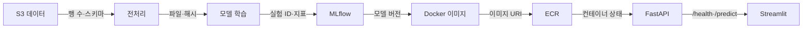

# 09주차 — 프로젝트 통합·보강

수업 시간: 230분  
이번 주 목표: 앞 8주의 산출물을 한 번에 연결하고, 끊긴 구간을 찾아 스스로 복구한다.

## 0. 회차 요약

| 항목 | 내용 |
|---|---|
| 오늘의 결과물 | 전 구간 연결 체크리스트, 기술 부채 이슈표, M2+ 시연 |
| 핵심 개념 | 통합 테스트, 상태 확인, 원인 범위 줄이기, 복구 기록 |
| 실습 A | 공통 예제의 S3→학습→MLflow→Docker→API→화면 연결 |
| 실습 B | 팀 프로젝트의 끊긴 구간을 찾아 복구 |
| NCS | 모델 배포·성능 관리, 운영 절차·자원 점검, 통합 테스트 |

## 1. 오늘의 구성

| 구간 | 시간 | 내용 |
|---|---:|---|
| 도입 | 10분 | M2 회고와 오늘의 통과 기준 |
| 미니 강의 | 30분 | 파이프라인을 구간별로 확인하는 법 |
| 휴식 | 10분 |  |
| 실습 A | 75분 | 공통 파이프라인 재연결 |
| 휴식 | 10분 |  |
| 실습 B | 75분 | 팀별 기술 부채 해결 |
| 제출 | 15분 | 체크리스트·이슈표·화면 제출 |
| 정리 | 5분 | AWS 리소스 확인 |

## 2. 미니 강의 — 한 번에 전체를 고치지 않는다

파이프라인이 안 될 때 “AWS가 이상하다”라고 말하면 원인을 찾을 수 없다. 데이터, 모델, 이미지, API, 화면을 한 구간씩 확인한다.



### 구간별 질문

1. 입력이 존재하는가?
2. 입력의 이름과 형식이 예상과 같은가?
3. 실행 결과가 파일·로그·주소로 남는가?
4. 다음 단계가 바로 그 결과를 읽는가?
5. 실패했을 때 되돌아갈 기준점이 있는가?

## 3. 실습 A — 공통 예제 재연결

### 3-1. 현재 AWS 자격 증명과 리전 확인

```bash
aws sts get-caller-identity
aws configure get region
```

통과 기준: 본인 또는 팀 역할이 보이고 리전이 `ap-northeast-2`이다.

### 3-2. 데이터 확인

```bash
aws s3 ls s3://<팀버킷>/raw/
aws s3 ls s3://<팀버킷>/processed/
```

통과 기준: 원본과 가공 데이터가 서로 다른 경로에 있고, 마지막 수정 시간이 설명 가능하다.

### 3-3. 모델·실험 확인

```bash
python train.py --data s3://<팀버킷>/processed/data.csv
curl -s http://localhost:5000/health || true
```

통과 기준: 학습 지표와 MLflow 실행 ID가 남고, 선택 모델의 버전을 찾을 수 있다.

### 3-4. 이미지 확인

```bash
docker build -t mlops-api:week09 .
docker run --rm -p 8000:8000 mlops-api:week09
```

다른 터미널에서 다음을 실행한다.

```bash
curl -s http://localhost:8000/health
curl -s -X POST http://localhost:8000/predict \
  -H 'Content-Type: application/json' \
  -d @sample.json
```

통과 기준: `/health`는 200, `/predict`는 스키마에 맞는 JSON을 돌려준다.

### 3-5. 배포와 화면 확인

```bash
docker compose ps
curl -s http://localhost:8000/health
curl -I http://localhost:8501
```

통과 기준: API와 화면 컨테이너가 모두 실행 중이고, 화면에서 예측 1건을 수행할 수 있다.

## 4. 실습 B — 팀별 기술 부채 해결

### 기술 부채 이슈표

| 번호 | 증상 | 실패 구간 | 확인한 근거 | 원인 | 조치 | 상태 |
|---|---|---|---|---|---|---|
| 1 | 예측 500 오류 | API | 컨테이너 로그 | 모델 경로 불일치 | 환경변수 수정 | 완료 |
| 2 | 화면 접속 불가 | 네트워크 | 보안그룹 | 8501 규칙 없음 | 소스 IP 제한 규칙 추가 | 완료 |

### 해결 우선순위

1. 데이터가 없거나 형식이 다른 문제
2. 모델 파일·버전이 다른 문제
3. 이미지가 만들어지지 않는 문제
4. API가 시작되지 않는 문제
5. 네트워크·보안그룹 문제
6. 화면 표시 문제

앞 단계가 실패했는데 뒤 단계를 먼저 고치지 않는다.

## 5. AWS 콘솔 화면 이동 경로

### S3

- 직접 링크: <https://console.aws.amazon.com/s3/>
- 이동 경로: S3 → Buckets → 팀 버킷 → `raw/`, `processed/`, `models/`
- 확인할 것: 파일 이름, 크기, 마지막 수정 시간, 퍼블릭 액세스 차단
- 공식 문서: <https://docs.aws.amazon.com/AmazonS3/latest/userguide/create-bucket-overview.html>

### EC2

- 직접 링크: <https://console.aws.amazon.com/ec2/>
- 이동 경로: EC2 → Instances → 팀 인스턴스 → Status checks / Security
- 확인할 것: 실행 상태, 퍼블릭 IP, 연결된 역할, 보안그룹
- 공식 문서: <https://docs.aws.amazon.com/AWSEC2/latest/UserGuide/EC2_GetStarted.html>

### ECR

- 직접 링크: <https://console.aws.amazon.com/ecr/repositories>
- 이동 경로: ECR → Private repositories → 팀 저장소 → Images
- 확인할 것: 이미지 태그, 푸시 시간, 이미지 digest
- 공식 문서: <https://docs.aws.amazon.com/AmazonECR/latest/userguide/Repositories.html>

## 6. 체크포인트

다음 세 가지를 제출한다.

1. 전 구간 연결 체크리스트
2. 해결 전·후가 보이는 기술 부채 이슈표
3. S3 경로, MLflow 실행, ECR 이미지, `/health`, Streamlit 예측이 보이는 화면

### 평가 기준

| 기준 | 배점 |
|---|---:|
| 여섯 구간의 상태를 근거로 확인했다 | 0.8 |
| 최소 한 개의 실제 문제를 원인까지 찾아 해결했다 | 0.6 |
| 해결 방법과 재발 방지 방법을 기록했다 | 0.4 |
| 수업 종료 전 비용 발생 리소스를 확인했다 | 0.2 |

## 7. NCS 수행 증거

- `2001070308_19v1.2` 인공지능 선정모델 배포 관리하기: 배포 파일·이미지·서비스 상태를 확인한다.
- `2001070308_19v1.3` 인공지능 선정모델 성능 관리하기: 기준 지표와 현재 예측 결과를 비교한다.
- `2001070401_20v1.2` 인공지능서비스 운영절차 수립하기: 팀 점검 순서를 체크리스트로 만든다.
- `2001070404_20v1.1` 인공지능서비스 운영 자원 점검하기: EC2·ECR·S3 상태를 확인한다.
- `2001070108_18v1.2` 인공지능 플랫폼 통합 테스트하기: 데이터부터 화면까지 전 구간을 실행한다.

## 8. 리소스 정리

```bash
docker compose down
aws ec2 describe-instances \
  --filters 'Name=tag:Course,Values=MLOps' 'Name=instance-state-name,Values=running' \
  --query 'Reservations[].Instances[].[InstanceId,Tags[?Key==`Team`].Value|[0],State.Name]' \
  --output table
```

오늘 이후에도 사용할 팀 인스턴스는 중지하고, 임시 컨테이너와 사용하지 않는 이미지는 정리한다.

---

## 부록. 화면 확인표

- S3: <https://console.aws.amazon.com/s3/>
- EC2: <https://console.aws.amazon.com/ec2/>
- ECR: <https://console.aws.amazon.com/ecr/repositories>
- 확인 순서: **데이터 → 모델 → 이미지 → 컨테이너 → API → 화면**
- 통합 테스트 참고: <https://docs.aws.amazon.com/AWSEC2/latest/UserGuide/monitoring-system-instance-status-check.html>

## 실제 AWS 콘솔 화면 실습 가이드 (9주차)

> 데이터에서 화면까지 한 번에 추측하지 않고 **S3 → ECR → EC2 → SSM → Compose → API → UI → 정리** 순서로 실제 연결을 확인했다. 화면 수는 절차에 필요한 21개이며, 마지막에는 EC2를 다시 중지했다.

### 1. S3 버킷 목록에서 팀 버킷 찾기


- 콘솔 경로: **S3 → ysu-mlops-lab-20260824-a7c9**
- 확인할 것: S3 버킷 목록에서 팀 버킷 찾기
- [관련 AWS 공식 문서](https://docs.aws.amazon.com/AmazonS3/latest/userguide/Welcome.html)

### 2. 팀 버킷의 최상위 경로 확인


- 콘솔 경로: **S3 → ysu-mlops-lab-20260824-a7c9**
- 확인할 것: 팀 버킷의 최상위 경로 확인
- [관련 AWS 공식 문서](https://docs.aws.amazon.com/AmazonS3/latest/userguide/Welcome.html)

### 3. datasets 데이터 경로 확인


- 콘솔 경로: **S3 → ysu-mlops-lab-20260824-a7c9**
- 확인할 것: datasets 데이터 경로 확인
- [관련 AWS 공식 문서](https://docs.aws.amazon.com/AmazonS3/latest/userguide/Welcome.html)

### 4. models 산출물 경로 확인


- 콘솔 경로: **S3 → ysu-mlops-lab-20260824-a7c9**
- 확인할 것: models 산출물 경로 확인
- [관련 AWS 공식 문서](https://docs.aws.amazon.com/AmazonS3/latest/userguide/Welcome.html)

### 5. 버전 관리와 암호화 속성 확인


- 콘솔 경로: **S3 → ysu-mlops-lab-20260824-a7c9**
- 확인할 것: 버전 관리와 암호화 속성 확인
- [관련 AWS 공식 문서](https://docs.aws.amazon.com/AmazonS3/latest/userguide/Welcome.html)

### 6. 퍼블릭 액세스 차단 확인


- 콘솔 경로: **S3 → ysu-mlops-lab-20260824-a7c9**
- 확인할 것: 퍼블릭 액세스 차단 확인
- [관련 AWS 공식 문서](https://docs.aws.amazon.com/AmazonS3/latest/userguide/Welcome.html)

### 7. ECR 팀 저장소 찾기


- 콘솔 경로: **ECR → ysu-mlops-api**
- 확인할 것: ECR 팀 저장소 찾기
- [관련 AWS 공식 문서](https://docs.aws.amazon.com/AmazonECR/latest/userguide/Repositories.html)

### 8. ECR 이미지 태그 1.0과 1.1 확인


- 콘솔 경로: **ECR → ysu-mlops-api**
- 확인할 것: ECR 이미지 태그 1.0과 1.1 확인
- [관련 AWS 공식 문서](https://docs.aws.amazon.com/AmazonECR/latest/userguide/Repositories.html)

### 9. API 이미지 1.0 다이제스트 확인


- 콘솔 경로: **ECR → ysu-mlops-api**
- 확인할 것: API 이미지 1.0 다이제스트 확인
- [관련 AWS 공식 문서](https://docs.aws.amazon.com/AmazonECR/latest/userguide/Repositories.html)

### 10. SageMaker 호환 이미지 1.1 확인


- 콘솔 경로: **ECR → ysu-mlops-api**
- 확인할 것: SageMaker 호환 이미지 1.1 확인
- [관련 AWS 공식 문서](https://docs.aws.amazon.com/AmazonECR/latest/userguide/Repositories.html)

### 11. 통합 점검 전 EC2 중지 상태


- 콘솔 경로: **EC2 → ysu-mlops-lab-ec2**
- 확인할 것: 통합 점검 전 EC2 중지 상태
- [관련 AWS 공식 문서](https://docs.aws.amazon.com/AWSEC2/latest/UserGuide/Stop_Start.html)

### 12. 인스턴스 시작 작업 선택


- 콘솔 경로: **EC2 → ysu-mlops-lab-ec2**
- 확인할 것: 인스턴스 시작 작업 선택
- [관련 AWS 공식 문서](https://docs.aws.amazon.com/AWSEC2/latest/UserGuide/Stop_Start.html)

### 13. 통합 점검용 EC2 실행 상태


- 콘솔 경로: **EC2 → ysu-mlops-lab-ec2**
- 확인할 것: 통합 점검용 EC2 실행 상태
- [관련 AWS 공식 문서](https://docs.aws.amazon.com/AWSEC2/latest/UserGuide/Stop_Start.html)

### 14. S3부터 UI까지 통합 점검 명령 입력


- 콘솔 경로: **Systems Manager → Run Command**
- 확인할 것: S3부터 UI까지 통합 점검 명령 입력
- [관련 AWS 공식 문서](https://docs.aws.amazon.com/systems-manager/latest/userguide/run-command.html)

### 15. SSM Online 대상 선택


- 콘솔 경로: **Systems Manager → Run Command**
- 확인할 것: SSM Online 대상 선택
- [관련 AWS 공식 문서](https://docs.aws.amazon.com/systems-manager/latest/userguide/run-command.html)

### 16. 통합 점검 명령 접수


- 콘솔 경로: **Systems Manager → Run Command**
- 확인할 것: 통합 점검 명령 접수
- [관련 AWS 공식 문서](https://docs.aws.amazon.com/systems-manager/latest/userguide/run-command.html)

### 17. 통합 점검 전체 성공


- 콘솔 경로: **Systems Manager → Run Command**
- 확인할 것: 통합 점검 전체 성공
- [관련 AWS 공식 문서](https://docs.aws.amazon.com/systems-manager/latest/userguide/run-command.html)

### 18. 자격 증명·S3·ECR·Compose·API·UI 결과


- 콘솔 경로: **Systems Manager → Run Command**
- 확인할 것: 서울 리전·datasets/models·ECR 1.0/1.1·두 컨테이너 Up·API healthy·UI ok
- [관련 AWS 공식 문서](https://docs.aws.amazon.com/systems-manager/latest/userguide/run-command.html)

### 19. 통합 점검 명령 기록


- 콘솔 경로: **Systems Manager → Run Command**
- 확인할 것: 통합 점검 명령 기록
- [관련 AWS 공식 문서](https://docs.aws.amazon.com/systems-manager/latest/userguide/run-command.html)

### 20. 실습 종료 인스턴스 중지 확인


- 콘솔 경로: **EC2 → ysu-mlops-lab-ec2**
- 확인할 것: 실습 종료 인스턴스 중지 확인
- [관련 AWS 공식 문서](https://docs.aws.amazon.com/AWSEC2/latest/UserGuide/Stop_Start.html)

### 21. EC2 중지 요청 완료


- 콘솔 경로: **EC2 → ysu-mlops-lab-ec2**
- 확인할 것: EC2 중지 요청 완료
- [관련 AWS 공식 문서](https://docs.aws.amazon.com/AWSEC2/latest/UserGuide/Stop_Start.html)
