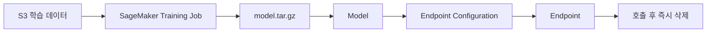

# 10주차 — 관리형 ML 서비스 (Amazon SageMaker AI) ⚠ 비용 주의 회차

**클라우드 MLOps** · 연성대학교 · 230분 (10분 조기 종료)
NCS: `2001070105_18v1.1` 인공지능 학습 기능 구현하기 / `2001070105_18v1.4` 인공지능 모델링 기능 구현하기(부분) / `2001070101_18v1.5` 인공지능 플랫폼 구축 비용 계획하기(부분)

> ## ⚠ 이 회차는 실제로 돈이 나가는 회차입니다
> SageMaker의 **실시간 엔드포인트**와 **Studio 노트북 스페이스**는 **켜져 있는 시간 전체**에 대해 과금됩니다. 코드를 실행하지 않아도, 브라우저를 닫아도, 노트북을 덮어도 **AWS 쪽에서는 계속 돌고 있습니다.**
> 하루를 방치하면 `ml.m5.large` 엔드포인트 하나가 약 **$3.4**, 한 주를 방치하면 약 **$24**입니다. 학생 1인 학기 예산이 $25입니다. **한 번의 방치로 학기 예산 전체가 날아갑니다.**
> 오늘은 **만드는 것보다 지우는 것이 더 중요한 수업**입니다. 6장의 삭제 점검을 통과하지 못하면 귀가할 수 없습니다.

---

## 0. 회차 요약 (강사용 1페이지)

| 항목 | 내용 |
|---|---|
| 학습목표 | SageMaker AI Studio에서 학습 잡과 실시간 엔드포인트를 만들어 보고, 7~8주차에 직접 구축한 FastAPI 방식과 비용·속도·자유도·운영 부담을 항목별로 비교해 설명할 수 있다. 그리고 생성한 과금 리소스를 스스로 확인·삭제할 수 있다. |
| 오늘의 결과물 | ① 학습 잡 완료 화면 + S3의 `model.tar.gz` ② 엔드포인트 호출 응답 캡처 ③ **삭제 확인 캡처(필수)** ④ 직접구축 vs 관리형 비교표 |
| 사전 준비 | ① **SageMaker AI Studio 도메인을 강사가 미리 생성**(학생 1인당 사용자 프로필 발급). 도메인 생성은 10~20분 걸리므로 수업 중 하지 않는다 ② 실행 역할(Execution Role)에 S3 접근 권한 부여 ③ IAM에서 **인스턴스 타입 화이트리스트**(`ml.t3.medium`, `ml.m5.large`)만 허용, GPU 타입 차단 ④ **콘솔 UI가 자주 바뀌므로 개강 전에 화면 캡처를 전부 갱신할 것** — 특히 Studio 진입 경로, 스페이스 생성 화면, 엔드포인트 삭제 화면 ⑤ 조교 1:1 삭제 점검 명단 준비(부록 C) ⑥ 강사 계정에서 전날 잔여 리소스 일괄 점검 |
| 학생 준비물 | 노트북, 3주차 전처리 완료 데이터의 S3 경로, 8주차까지의 산출물, **AWS 콘솔 로그인 정보** |
| 예상 사고 지점 | ① Studio 스페이스가 안 뜨거나 5분 넘게 `Starting`에 머묾 ② 학습 잡이 `AccessDenied`로 실패(실행 역할의 S3 권한) ③ **엔드포인트를 지우지 않고 귀가** — 오늘 최대 사고 |

### 시간표

| 시간 | 구성 | 분 |
|---|---|---|
| 00:00–00:10 | 도입 — 지난주 복습 퀴즈 + ⚠ 비용 경고 브리핑 + 오늘 만들 결과물 데모 | 10 |
| 00:10–00:55 | 이론 — 관리형이 대신 해주는 것/잃는 것, 직접구축 vs 관리형 4축 비교, 과금 구조 | 45 |
| 00:55–01:05 | 휴식 | 10 |
| 01:05–01:55 | **실습 A** — Studio 노트북 기동 → 학습 잡 실행 → S3 산출물 확인 | 50 |
| 01:55–02:05 | 휴식 (⚠ 이 시점에 노트북 스페이스 상태 1차 점검) | 10 |
| 02:05–03:30 | **실습 B** — 엔드포인트 배포 → 호출 → **즉시 삭제** → 비교표 작성 | 85 |
| 03:30–03:45 | 체크포인트 제출 + 다음 주 예고 | 15 |
| 03:45–03:50 | ⚠ **리소스 정리 타임 — 조교 1:1 삭제 확인 (귀가 조건)** | 5 |
| **합계** | | **230** |

---

## 1. 도입 (10분)

### 지난주 복습 퀴즈 (구두 3문항)

1. 브라우저에서 우리 데모에 접속하려면 열려야 하는 '문 세 개'는? — (프로그램의 `0.0.0.0` 바인딩, 컨테이너 포트 매핑, 보안그룹 인바운드 규칙.)
2. compose 안에서 UI가 API를 부를 때 주소를 `localhost`로 쓰면 왜 안 됩니까? — (컨테이너 안의 localhost는 그 컨테이너 자기 자신이기 때문입니다. 서비스 이름인 `api`를 써야 합니다.)
3. AWS 액세스 키를 코드에 쓰면 안 되는 이유와 대안은? — (유출 시 계정이 도용되어 요금 폭탄이 납니다. 환경변수나 IAM 역할을 씁니다.)

### ⚠ 비용 경고 브리핑 (3분, 생략 금지)

강사는 다음을 **판서하고 학생들이 따라 읽게** 한다.

```
오늘 만드는 것 중 3가지는 "켜두면 계속 돈이 나간다"
  1) Studio 노트북 스페이스   (리전·인스턴스별 시간 요금)
  2) 학습 잡                   (실행되는 동안만 과금 — 끝나면 자동 종료)
  3) 실시간 엔드포인트         (리전·인스턴스별 시간 요금)

이 중 자동으로 꺼지는 것은 2번뿐이다.
1번과 3번은 내가 지워야만 꺼진다.
```

> **강사 멘트**
> "여러분 학기 예산이 1인당 $10 한도, 학기 전체 추정이 $25입니다. `ml.m5.large` 엔드포인트 하나를 일주일 켜두면 $24입니다. 딱 한 번의 실수로 한 학기 예산이 없어집니다. 그래서 오늘은 규칙이 하나 있습니다. **엔드포인트를 만든 사람은 30분 안에 지운다.** 만들자마자 지우는 게 목표입니다. 오늘 배울 것은 '어떻게 만드나'와 '어떻게 확실히 지우나' 두 가지인데, 시험에 나온다면 두 번째입니다."

### 오늘 만들 것 데모

1. 강사가 SageMaker AI Studio를 열어 이미 완료된 **Training Job** 목록을 보여준다. 상태가 `Completed`이고 소요 시간이 4분인 것을 확대해서 보여준다.
2. S3 콘솔로 이동해 그 잡이 남긴 `output/model.tar.gz`를 보여준다.
   > "우리가 4주차에 손으로 `joblib.dump` 해서 `aws s3 cp` 했던 그것을, SageMaker는 자동으로 압축해서 여기에 놓습니다."
3. 노트북에서 엔드포인트 호출 셀을 실행해 예측값이 나오는 것을 보여준 뒤, **바로 다음 셀에서 `predictor.delete_endpoint()`를 실행**하고 콘솔에서 사라지는 것까지 보여준다.
   > "만들고 → 부르고 → 지운다. 오늘 이 3박자가 한 세트입니다. 지우는 것까지가 실습입니다."
4. 마지막으로 8주차에 만든 우리 FastAPI 데모 화면을 나란히 띄운다.
   > "오른쪽은 여러분이 2주 걸려 만든 것, 왼쪽은 30분이면 되는 것. 그런데 왼쪽이 항상 정답일까요? 오늘 이론에서 그 얘기를 합니다."

---

## 2. 이론 (45분)

### 2-1. 관리형 서비스가 대신 해주는 것 (12분)

**강의 스크립트**

> 여러분, 지난 2주 동안 API 하나 띄우려고 뭘 했는지 세어봅시다. EC2를 만들고, SSH로 붙고, 도커를 깔고, Dockerfile을 쓰고, 이미지를 빌드하고, ECR에 올리고, 다시 받아서, compose를 쓰고, 보안그룹을 열었습니다. 아홉 단계입니다. 그리고 그 사이에 몇 번 막혔죠?
>
> **관리형 서비스(managed service)**란, 이 아홉 단계 중 여러분이 신경 쓸 필요가 없는 부분을 클라우드 회사가 대신 해주는 것입니다. 식당에 비유하면, 직접 구축은 장을 보고 재료를 손질하고 요리하는 것이고, 관리형은 밀키트를 사서 끓이기만 하는 것입니다. 밀키트가 나쁜가요? 아닙니다. 다만 **국물 간을 내 맘대로 못 바꿉니다.** 그리고 비쌉니다.
>
> SageMaker AI가 구체적으로 대신 해주는 것을 보겠습니다.
>
> 학습 잡을 예로 들죠. 여러분이 `estimator.fit()` 한 줄을 실행하면, AWS는 뒤에서 이렇게 합니다. 서버 한 대를 새로 켜고, 거기에 파이썬과 scikit-learn이 들어 있는 컨테이너를 띄우고, S3에서 데이터를 그 서버로 내려받고, 여러분 학습 스크립트를 실행하고, 결과 모델을 압축해서 S3에 올리고, **그리고 서버를 끕니다.** 마지막이 중요합니다. 학습 잡은 끝나면 자동으로 꺼지고, 돈은 **돌아간 시간만큼만** 나갑니다. 4분 학습했으면 4분치입니다. 이건 정말 좋은 성질입니다.
>
> 엔드포인트도 봅시다. `deploy()` 한 줄이면 서버를 띄우고, 모델을 로드하고, HTTPS 주소를 만들고, 인증서를 붙이고, 로그를 CloudWatch로 보내고, 서버가 죽으면 자동으로 되살립니다. 우리가 8주차에 손으로 한 것을 전부 해줍니다.
>
> **그런데** 엔드포인트는 학습 잡과 결정적으로 다릅니다. **끝나는 시점이 없습니다.** 24시간 대기하는 게 존재 이유니까요. 그래서 내가 지우기 전까지 영원히 과금됩니다. 오늘 위험은 전부 여기서 나옵니다.

**판서/슬라이드 요점**

- 관리형 서비스 = 서버 준비·환경 구성·스케일링·복구를 클라우드가 대행
- **학습 잡**: `fit()` → 서버 기동 → 데이터 다운로드 → 학습 → 모델을 S3에 업로드 → **자동 종료** (초 단위 과금)
- **엔드포인트**: `deploy()` → 상시 대기 서버 + HTTPS 주소 + 자동 복구 → **자동 종료 없음** (시간당 과금)
- 오늘의 위험은 전부 "자동 종료 없음"에서 온다
- 밀키트 비유: 빠르고 편하지만 간을 못 바꾸고 값이 비싸다

**학생 질문 예상 & 답변**

- Q: 그럼 학습 잡은 마음껏 돌려도 되나요? → A: 시간만큼 과금이니 "마음껏"은 아니지만, 우리 예제는 4~6분이라 회당 몇 센트입니다. 단, **큰 인스턴스를 고르면 단가가 뜁니다.** 오늘은 `ml.m5.large` 고정입니다.
- Q: EC2에서 직접 돌리면 공짜 아닌가요? → A: EC2도 시간당 과금입니다. 다만 우리가 이미 켜둔 서버를 재사용하니 추가 비용이 안 느껴질 뿐입니다. "안 보이는 비용"과 "안 나가는 비용"은 다릅니다.

---

### 2-2. 대신 잃는 것 — 자유도, 이식성, 그리고 이해 (11분)

**강의 스크립트**

> 편한 만큼 잃는 것이 있습니다. 세 가지를 말씀드리겠습니다.
>
> 첫째, **자유도**입니다. SageMaker의 기본 컨테이너에는 정해진 라이브러리 버전이 들어 있습니다. 여러분이 "나는 scikit-learn 1.5.2를 써야 한다"고 하면, 지원 목록에 있어야 합니다. 없으면 컨테이너를 직접 만들어야 하는데, 그러면 결국 도커를 배워야 합니다. 즉 **쉬운 길로 가려다 결국 어려운 길을 만납니다.** 그래서 우리는 도커를 먼저 배운 겁니다. 순서가 그래야 합니다.
>
> 둘째, **이식성**입니다. 여러분이 8주차에 만든 것은 Dockerfile과 compose 파일입니다. 이건 AWS든, 네이버 클라우드든, 학교 서버든, 여러분 노트북이든 **똑같이 돕니다.** 반면 SageMaker Estimator 코드는 AWS 밖에서는 한 줄도 안 돕니다. 이걸 **락인(lock-in), 종속**이라고 합니다. 회사를 옮기거나 클라우드를 바꿀 때 다시 짜야 합니다.
>
> 셋째, 그리고 여러분에게 가장 중요한 것 — **이해**입니다. `deploy()` 한 줄로 서비스가 뜨면, 그 안에서 무슨 일이 일어나는지 배우지 못합니다. 그래서 문제가 생겼을 때 손을 못 댑니다. 여러분은 이미 직접 만들어 봤기 때문에, 오늘 SageMaker를 보면 "아, 얘가 지금 내가 했던 그걸 대신 하는구나"가 보일 겁니다. **먼저 손으로 해보고 나중에 자동을 배우는 순서**, 그게 이 과목의 설계입니다.
>
> 질문 하나 던지겠습니다. 그러면 실무에서는 뭘 쓸까요? … 정답은 "둘 다"입니다. 사람이 적고 빨리 만들어야 하는 스타트업 초기에는 관리형이 유리하고, 트래픽이 커지고 비용이 커지면 직접 구축으로 옮겨갑니다. **판단할 줄 아는 사람**이 되는 게 오늘의 목표입니다.

**판서/슬라이드 요점**

- 잃는 것 ① **자유도** — 지원 프레임워크·버전 목록 안에서만 자유롭다
- 잃는 것 ② **이식성** — 코드가 특정 클라우드에 묶인다 (벤더 락인)
- 잃는 것 ③ **이해** — 자동화 뒤의 동작을 모르면 장애 때 손을 못 댄다
- 실무의 답은 "둘 중 하나"가 아니라 **상황에 따른 선택**
- 이 과목의 순서: 직접 구축(6~8주) → 관리형(9주) → 판단 기준 습득

**학생 질문 예상 & 답변**

- Q: 취업할 때 어느 쪽이 유리한가요? → A: 직접 구축을 아는 사람이 관리형도 금방 씁니다. 반대는 잘 안 됩니다. 이력서에는 둘 다 써넣되, 면접에서 설명할 수 있는 건 직접 구축 쪽이어야 합니다.
- Q: 그럼 왜 굳이 SageMaker를 배우나요? → A: 현업 채용 공고에 자주 나오고, 무엇보다 **비교 대상이 있어야 여러분이 만든 것의 가치를 설명할 수 있기 때문**입니다. 오늘 비교표가 곧 여러분의 논거가 됩니다.

---

### 2-3. 직접 구축 vs 관리형 — 4축으로 비교하기 (12분)

**강의 스크립트**

> 비교는 감으로 하면 안 됩니다. **축을 정해놓고** 해야 합니다. 오늘은 네 개 축을 씁니다. 구축 시간, 비용, 수정 자유도, 운영 부담.
>
> **구축 시간.** 우리 방식은 2주 걸렸습니다. 물론 배우면서 했으니까 그렇고, 익숙해지면 반나절입니다. SageMaker는 코드 30줄, 30분입니다. 여기는 관리형 압승입니다.
>
> **비용.** EC2와 SageMaker AI의 단가는 리전·인스턴스 유형·구매 방식에 따라 달라집니다. 오늘 AWS 가격표에서 같은 시점의 서울 리전 단가를 찾아 비교합니다. 관리형 서비스는 운영 편의가 포함되지만, 모델마다 별도 엔드포인트를 두면 비용이 빠르게 늘 수 있습니다.
>
> **수정 자유도.** 우리 방식에서 응답에 필드를 하나 추가하려면? `schemas.py` 고치고 다시 빌드하면 끝입니다. 무엇이든 넣을 수 있습니다. SageMaker 기본 컨테이너는 정해진 입출력 형식을 씁니다. 바꾸려면 추론 스크립트(`inference.py`)의 규칙을 따라야 하고, 그래도 안 되면 커스텀 컨테이너를 만들어야 합니다. 우리 방식 우세입니다.
>
> **운영 부담.** 서버가 죽으면? 우리는 새벽에 일어나서 `docker compose up`을 해야 합니다. SageMaker는 알아서 되살립니다. 트래픽이 10배가 되면? 우리는 인스턴스를 늘리고 로드밸런서를 붙여야 합니다. SageMaker는 오토스케일링 설정 한 번이면 됩니다. 여기는 관리형 압승입니다.
>
> 자, 그럼 승부는 2대 2입니다. **그래서 정답이 없습니다.** 대신 판단 기준을 하나 드리겠습니다.
>
> "**사람이 부족하면 관리형, 돈이 부족하면 직접 구축.**"
>
> 스타트업 3명이 6개월 안에 뭔가 내놔야 하면 관리형입니다. 인프라 담당자가 있고 서비스가 커져서 월 클라우드 비용이 수천만 원이면 직접 구축으로 옮깁니다. 오늘 실습 B에서 여러분이 이 표를 직접 채웁니다.

**판서/슬라이드 요점**

| 축 | 직접 구축 (EC2+Docker+FastAPI) | 관리형 (SageMaker AI) |
|---|---|---|
| 구축 시간 | 길다 (학습 곡선 있음) | **짧다** (코드 수십 줄) |
| 비용(동급 사양) | 수업 당일 서울 리전 단가 확인 | 수업 당일 서울 리전 단가 확인 |
| 수정 자유도 | **높다** (무엇이든 가능) | 제한적 (지원 형식·프레임워크 내) |
| 운영 부담 | 높다 (장애·확장 직접 대응) | **낮다** (자동 복구·오토스케일링) |
| 이식성 | **높다** (어디서나 동작) | 낮다 (AWS 종속) |

- 판단 한 문장: **사람이 부족하면 관리형, 돈이 부족하면 직접 구축**
- 모델 개수가 늘수록 관리형의 비용 격차가 커진다

---

### 2-4. SageMaker AI의 과금 구조와 안전장치 (10분)

**강의 스크립트**

> 마지막으로 오늘의 생존 지식입니다. SageMaker는 **하나의 서비스가 아니라 여러 개의 과금 항목**입니다. 이걸 구분 못 하면 "나는 지웠는데 왜 돈이 나가지?"가 됩니다.
>
> 네 가지를 구분하세요.
>
> 첫째, **Studio 스페이스(Space)**. 노트북을 쓰기 위해 실행되는 컴퓨팅 자원입니다. 브라우저를 닫아도 자동으로 멈추지 않을 수 있으므로 반드시 스페이스 상태를 확인하고 Stop 합니다.
>
> 둘째, **학습 잡(Training Job)**. 아까 말했듯 끝나면 자동으로 꺼집니다. 이건 안심해도 됩니다.
>
> 셋째, **엔드포인트(Endpoint)**. 오늘의 최대 위험. 시간당 과금이고 자동 종료가 없습니다.
>
> 넷째, **S3와 EBS**. 학습 결과물과 노트북의 저장 공간입니다. 금액은 작지만 계속 쌓입니다.
>
> 그리고 함정이 하나 있습니다. 엔드포인트를 지웠는데도 콘솔에 뭔가 남아 있는 걸 보게 될 겁니다. **엔드포인트 구성(Endpoint Configuration)**과 **모델(Model)**입니다. 이 둘은 **과금되지 않습니다.** 설정 정보일 뿐이거든요. 하지만 헷갈리니까 오늘은 셋 다 지우겠습니다. 지우는 순서는 **엔드포인트 → 엔드포인트 구성 → 모델**입니다. 순서를 지켜야 합니다. 사용 중인 것을 먼저 지울 수 없기 때문입니다.
>
> 안전장치도 하나 알려드립니다. Studio에는 **유휴 자동 종료(idle shutdown)** 설정이 있습니다. 강사가 미리 켜뒀지만, 여러분은 이걸 믿지 마세요. **믿을 것은 여러분의 손으로 확인한 삭제 화면뿐입니다.**

**판서/슬라이드 요점**

| 항목 | 과금 방식 | 자동 종료 | 오늘 조치 |
|---|---|---|---|
| Studio 스페이스 | 인스턴스 유형별 시간 요금 | ✕ (유휴 설정 시 △) | 수업 끝나면 **Stop** |
| 학습 잡 | 실행 시간만 (초 단위) | ✅ 자동 | 조치 불필요 |
| **실시간 엔드포인트** | **인스턴스 유형별 시간 요금** | **✕** | **호출 직후 즉시 삭제** |
| Model / EndpointConfig | **과금 없음** | — | 정리 차원에서 삭제 |
| S3 / EBS | 저장 용량 | ✕ | 학기 말 정리 |

- 삭제 순서: **Endpoint → EndpointConfig → Model → Space**
- ⚠ 자동 종료 설정을 믿지 말 것. **눈으로 확인한 삭제 결과만 믿는다**

**학생 질문 예상 & 답변**

- Q: 브라우저 탭을 닫으면 스페이스도 꺼지나요? → A: 아니요. 그게 가장 흔한 사고입니다. 스페이스는 별도로 Stop 해야 합니다.
- Q: 계정에 돈이 없으면 자동으로 멈추지 않나요? → A: 멈추지 않습니다. 그냥 청구됩니다. 학과 결제 계정이라 여러분에게 직접 청구되지는 않지만, **미정리 적발 시 회당 −2점**입니다.

---

## 3. 실습 A — Studio 노트북과 학습 잡 (50분) · 공통 예제 따라하기

**목표** SageMaker AI Studio에서 JupyterLab 스페이스를 띄우고, 3주차 전처리 데이터로 학습 잡(Training Job)을 실행해 S3에 모델 산출물을 만든다.

**사전 배포 파일**
- `sm_train.py` (SageMaker용 학습 스크립트 — 전체 배포, 학생은 읽고 이해)
- `week09_notebook.ipynb` (셀 골격, 값 빈칸)
- 완성본 태그: `week-09-done`

> ⚠ **강사 안내**: 아래 화면 경로는 2026년 상반기 콘솔 기준이다. **SageMaker 콘솔 UI는 변경이 잦으므로 개강 전 반드시 캡처를 갱신**하고, 경로가 다르면 현재 화면을 기준으로 안내한다. 또한 2025년 이후 `Amazon SageMaker AI`(기존 ML 기능)와 `SageMaker Unified Studio`(통합 콘솔)로 제품이 분리되었으므로, **콘솔에서 반드시 `Amazon SageMaker AI`를 선택**해야 한다. Unified Studio로 들어가면 화면 구성이 완전히 달라 실습이 진행되지 않는다.

### 수행 순서

**① Studio 진입** (강사 화면과 함께 진행)

1. AWS 콘솔 우측 상단 리전이 **서울(ap-northeast-2)** 인지 먼저 확인한다.
2. 검색창에 `SageMaker AI` 입력 → **Amazon SageMaker AI** 클릭 (⚠ `SageMaker Unified Studio` 아님)
3. 좌측 메뉴 **Studio** 클릭 → 도메인 `mlops-2026`, 사용자 프로필 `mlops-2026-<학번>` 선택 → **Open Studio**

- 확인 포인트: Studio 홈 화면이 뜬다. 좌측에 JupyterLab / Code Editor 등의 앱 카드가 보인다.

**② JupyterLab 스페이스 생성 및 기동** ⚠ **여기서 과금이 시작된다**

1. Studio 홈에서 **JupyterLab** → **Create JupyterLab space**
2. 이름: `w09-<학번>`
3. Instance: **`ml.t3.medium`** (⚠ 목록에 더 큰 것이 보여도 절대 선택하지 않는다)
4. Storage: `5 GB` (기본값이 더 크면 5로 줄인다)
5. **Run space** 클릭 → 상태가 `Starting` → `Running`이 될 때까지 2~4분 대기

- 확인 포인트: 상태가 `Running`이 되고 **Open JupyterLab** 버튼이 활성화된다.
- ⚠ 이 순간부터 시간당 요금이 발생한다. 지금 시각을 노트에 적어둔다.

**③ 노트북 생성과 기본 설정**

Open JupyterLab → Python 3 노트북 새로 만들기 → 첫 셀에 아래를 입력하고 실행한다.

```python
import sagemaker
import boto3

session = sagemaker.Session()
region = session.boto_region_name
role = sagemaker.get_execution_role()          # 강사가 미리 붙여둔 실행 역할
bucket = "mlops-2026-<학번>"                    # 본인 버킷명으로 교체
prefix = "sagemaker/bike"

print("region  :", region)
print("role    :", role)
print("bucket  :", bucket)
print("sagemaker sdk:", sagemaker.__version__)
```

- 확인 포인트: `region`이 `ap-northeast-2`, `role`이 `arn:aws:iam::...:role/mlops-2026-sagemaker-exec` 형태로 출력된다.

**④ 학습 데이터를 S3의 학습 잡 입력 위치로 복사**

```python
import boto3

s3 = boto3.client("s3")
# 3주차에 만든 전처리 결과를 학습 잡 입력 경로로 복사
s3.copy_object(
    Bucket=bucket,
    CopySource={"Bucket": bucket, "Key": "processed/bike_train.csv"},
    Key=f"{prefix}/input/train.csv",
)

train_input = f"s3://{bucket}/{prefix}/input/train.csv"
print(train_input)
```

- 확인 포인트: `s3://mlops-2026-<학번>/sagemaker/bike/input/train.csv` 출력. 3주차 산출물이 없는 학생은 아래 공통 데이터를 쓴다.

```python
s3.copy_object(
    Bucket=bucket,
    CopySource={"Bucket": "mlops-2026-class-shared", "Key": "week09/bike_train.csv"},
    Key=f"{prefix}/input/train.csv",
)
```

**⑤ 학습 스크립트 확인 (`sm_train.py`) — 배포본**

JupyterLab에서 새 파일 `sm_train.py`를 만들고 아래를 붙여 넣는다.

```python
"""SageMaker 학습 잡에서 실행되는 스크립트.
핵심: 4주차에 만든 Pipeline 구조를 그대로 쓴다. 학습-서빙 스큐를 막기 위함이다.
"""
import argparse
import os

import joblib
import pandas as pd
from sklearn.compose import ColumnTransformer
from sklearn.ensemble import RandomForestRegressor
from sklearn.metrics import mean_absolute_error, r2_score
from sklearn.model_selection import train_test_split
from sklearn.pipeline import Pipeline
from sklearn.preprocessing import OneHotEncoder, StandardScaler

NUM_COLS = ["hour", "temperature", "humidity", "windspeed", "weekday", "is_holiday"]
CAT_COLS = ["season"]
TARGET = "count"


def build_pipeline(n_estimators: int, max_depth: int) -> Pipeline:
    pre = ColumnTransformer(
        transformers=[
            ("num", StandardScaler(), NUM_COLS),
            ("cat", OneHotEncoder(handle_unknown="ignore"), CAT_COLS),
        ]
    )
    model = RandomForestRegressor(
        n_estimators=n_estimators, max_depth=max_depth, random_state=42, n_jobs=-1
    )
    return Pipeline([("prep", pre), ("model", model)])


def main() -> None:
    parser = argparse.ArgumentParser()
    parser.add_argument("--n-estimators", type=int, default=200)
    parser.add_argument("--max-depth", type=int, default=12)
    # 아래 세 경로는 SageMaker가 환경변수로 자동 주입한다.
    parser.add_argument("--model-dir", type=str, default=os.environ.get("SM_MODEL_DIR"))
    parser.add_argument("--train", type=str, default=os.environ.get("SM_CHANNEL_TRAIN"))
    args = parser.parse_args()

    df = pd.read_csv(os.path.join(args.train, "train.csv"))
    X = df[NUM_COLS + CAT_COLS]
    y = df[TARGET]
    X_tr, X_va, y_tr, y_va = train_test_split(X, y, test_size=0.2, random_state=42)

    pipe = build_pipeline(args.n_estimators, args.max_depth)
    pipe.fit(X_tr, y_tr)

    pred = pipe.predict(X_va)
    # 아래 두 줄은 CloudWatch 로그에 남고, 잡 목록의 메트릭으로도 수집된다.
    print(f"validation:mae={mean_absolute_error(y_va, pred):.4f};")
    print(f"validation:r2={r2_score(y_va, pred):.4f};")

    joblib.dump(pipe, os.path.join(args.model_dir, "model.joblib"))
    print("saved to", args.model_dir)


def model_fn(model_dir: str):
    """엔드포인트가 모델을 로드할 때 SageMaker가 호출하는 함수."""
    return joblib.load(os.path.join(model_dir, "model.joblib"))


if __name__ == "__main__":
    main()
```

> 강사 설명 포인트: `SM_MODEL_DIR`, `SM_CHANNEL_TRAIN` 두 환경변수가 SageMaker의 핵심 규약이다. **"정해진 폴더에 저장하면 알아서 S3로 옮겨준다"** — 이 약속만 지키면 나머지는 AWS가 한다. 우리가 `aws s3 cp`로 하던 일을 규약으로 대체한 것이다.

**⑥ 학습 잡 실행** ⚠ 실행 시간만큼 과금 (약 5분, 수 센트)

```python
from sagemaker.sklearn.estimator import SKLearn

estimator = SKLearn(
    entry_point="sm_train.py",
    role=role,
    instance_type="ml.m5.large",     # ⚠ 반드시 이 타입. 더 큰 것 금지
    instance_count=1,
    framework_version="1.2-1",       # SageMaker가 제공하는 sklearn 컨테이너 버전
    py_version="py3",
    output_path=f"s3://{bucket}/{prefix}/output",
    base_job_name=f"bike-<학번>",
    hyperparameters={"n-estimators": 200, "max-depth": 12},
    metric_definitions=[
        {"Name": "validation:mae", "Regex": "validation:mae=([0-9\\.]+);"},
        {"Name": "validation:r2", "Regex": "validation:r2=([0-9\\.]+);"},
    ],
)

estimator.fit({"train": train_input}, wait=True)
print("model artifact:", estimator.model_data)
```

- 확인 포인트: 로그 마지막에 `Training job completed`와 `Billable seconds: NN`이 찍히고, `model artifact: s3://.../output/bike-<학번>-.../output/model.tar.gz`가 출력된다.
- **`Billable seconds` 숫자를 노트에 적는다.** 실습 B의 비교표에 쓴다.

**⑦ S3 산출물 확인**

```python
import boto3
s3 = boto3.client("s3")
resp = s3.list_objects_v2(Bucket=bucket, Prefix=f"{prefix}/output/")
for o in resp.get("Contents", []):
    print(o["Key"], round(o["Size"] / 1024, 1), "KB")
```

- 확인 포인트(제출용 스크린샷 ①): `model.tar.gz`가 목록에 보이는 화면. 또는 콘솔 SageMaker AI → Training → Training jobs 목록에서 상태가 `Completed`인 화면.

> **비교 포인트 짚어주기**: "4주차에 여러분은 `joblib.dump` → `aws s3 cp` 두 단계를 손으로 했습니다. 여기서는 정해진 폴더에 저장만 했더니 압축과 업로드가 자동으로 됐습니다. 이것이 관리형이 대신 해주는 것의 실체입니다."

### ⚠ 여기서 막히면

| 증상 | 원인 | 조치 |
|---|---|---|
| 스페이스가 5분 넘게 `Starting`에서 안 넘어감 | 용량 부족 또는 일시적 지연 | 10분까지 기다린 뒤 Stop → Run space 재시도. 그래도 안 되면 강사 공용 스페이스에서 2인 1조로 진행 |
| `sagemaker.get_execution_role()`에서 예외 발생 | Studio가 아닌 로컬에서 실행 중 | 반드시 Studio JupyterLab 안에서 실행. 로컬이라면 역할 ARN을 문자열로 직접 지정 |
| 학습 잡이 `AccessDenied`로 실패 | 실행 역할에 해당 S3 버킷 권한 없음 | 버킷명 오타 확인 → 그래도 나면 강사 호출(역할 정책 수정 필요). 임시로 공통 버킷 `mlops-2026-class-shared` 사용 |
| `ResourceLimitExceeded` | 계정의 해당 인스턴스 타입 쿼터 초과(동시 실행 수) | 옆 학생 잡이 끝날 때까지 대기. 강사는 수업 전 서비스 할당량(Service Quotas)에서 `ml.m5.large` 학습 잡 한도를 학생 수 이상으로 증설해 둘 것 |
| `FileNotFoundError: .../train.csv` | 채널 이름과 파일명 불일치 | `fit({"train": ...})`의 키가 `train`이고, 스크립트가 `SM_CHANNEL_TRAIN` 아래에서 `train.csv`를 찾는지 확인 |
| `KeyError: 'count'` | 팀 데이터의 타깃 컬럼명이 다름 | `sm_train.py`의 `TARGET`, `NUM_COLS`, `CAT_COLS`를 팀 데이터에 맞게 수정 |
| 로그에 아무것도 안 보임 | 출력 버퍼링 | `print()` 뒤에 `flush=True`를 주거나 CloudWatch Logs에서 직접 확인 |

### 컷오프 안내

50분 경과 시 강제 종료. 학습 잡이 실패한 학생은 강사가 미리 돌려둔 산출물로 실습 B를 진행한다.

```python
model_data = "s3://mlops-2026-class-shared/week09/output/model.tar.gz"
```

> ⚠ **휴식 시간 1차 점검**: 휴식 들어가기 전 강사는 다음을 구두 확인한다. "학습 잡은 자동으로 꺼집니다. 스페이스는 켜져 있습니다. 지금은 그대로 두되, 이따 반드시 지웁니다."

---

## 4. 실습 B — 엔드포인트 배포·호출·즉시 삭제, 그리고 비교표 (85분) · 각자 수행

**목표** 학습된 모델을 실시간 엔드포인트로 배포해 호출한 뒤 **즉시 삭제**하고, 직접 구축 방식과의 비교표를 완성한다.

**과제 지시문** (학생에게 그대로 읽어줄 문장)

> "지금부터 85분입니다. 그런데 이 중 엔드포인트가 살아 있는 시간은 **최대 20분**입니다. 배포에 5분, 호출과 관찰에 10분, 삭제에 2분. 나머지 60분은 **엔드포인트가 없는 상태에서** 비교표를 쓰는 시간입니다. 지금 옆 사람과 약속하세요. '내가 엔드포인트를 지웠는지 서로 확인해준다.' 두 명이 서로 확인하면 사고가 절반으로 줍니다. 그리고 오늘 제출물 중 **가장 배점이 높은 것은 삭제 확인 캡처**입니다. 만든 캡처가 아니라 지운 캡처입니다."

### 수행 항목

**1) 엔드포인트 배포 (약 5~8분 소요)** ⚠ **여기서부터 시간당 과금 시작 — 시계를 본다**

```python
from sagemaker.sklearn.model import SKLearnModel
import time

endpoint_name = f"bike-ep-<학번>-{int(time.time())}"

model = SKLearnModel(
    model_data=estimator.model_data,      # 실습 A에서 만든 산출물
    role=role,
    entry_point="sm_train.py",            # model_fn 이 이 파일에 들어 있다
    framework_version="1.2-1",
    py_version="py3",
)

predictor = model.deploy(
    initial_instance_count=1,
    instance_type="ml.m5.large",          # ⚠ 반드시 이 타입
    endpoint_name=endpoint_name,
)

print("배포 완료:", endpoint_name)
print("⚠ 지금부터 시간당 과금됩니다. 삭제 예정 시각을 적으세요:", time.strftime("%H:%M"))
```

**즉시 아래를 실습 노트 상단에 손으로 적는다.**

```
엔드포인트 이름: bike-ep-<학번>-________
생성 시각: __:__      삭제 목표 시각: __:__ (생성 +20분)
짝꿍 이름: ____________ (상호 확인 담당)
```

**2) 엔드포인트 호출 (10분)**

```python
from sagemaker.serializers import CSVSerializer
from sagemaker.deserializers import CSVDeserializer
import pandas as pd

sample = pd.DataFrame([{
    "hour": 18, "temperature": 24.5, "humidity": 55.0,
    "windspeed": 2.1, "weekday": 2, "is_holiday": 0, "season": "summer",
}])

predictor.serializer = CSVSerializer()
predictor.deserializer = CSVDeserializer()
result = predictor.predict(sample.to_csv(index=False, header=False))
print("예측 결과:", result)
```

`boto3`로도 한 번 호출해 본다. **우리 FastAPI의 `curl`에 해당하는 것**이 이것임을 확인한다.

```python
import boto3

rt = boto3.client("sagemaker-runtime", region_name="ap-northeast-2")
resp = rt.invoke_endpoint(
    EndpointName=endpoint_name,
    ContentType="text/csv",
    Body="18,24.5,55.0,2.1,2,0,summer",
)
print(resp["Body"].read().decode())
```

- 확인 포인트(제출용 스크린샷 ②): 엔드포인트 이름과 예측 결과가 함께 보이는 셀 출력.

> **관찰 과제** — 다음 세 가지를 노트에 적는다. 비교표에 쓴다.
> ① 배포 명령부터 호출 성공까지 걸린 시간
> ② 응답 형식 — 우리 FastAPI는 JSON이었는데 여기는 무엇인가
> ③ 입력 검증 — 잘못된 값(`season`을 `"여름"`으로)을 보내면 어떤 응답이 오는가. 우리 Pydantic의 422와 비교하면?

**3) ⚠ 엔드포인트 즉시 삭제 (필수, 2분)**

```python
predictor.delete_endpoint(delete_endpoint_config=True)
print("삭제 요청 완료:", endpoint_name)
```

**삭제되었는지 반드시 코드로 확인한다. "지웠을 것이다"는 확인이 아니다.**

```python
import boto3
sm = boto3.client("sagemaker", region_name="ap-northeast-2")

eps = sm.list_endpoints()["Endpoints"]
cfgs = sm.list_endpoint_configs()["EndpointConfigs"]
print("남은 엔드포인트 수:", len(eps))
for e in eps:
    print("  -", e["EndpointName"], e["EndpointStatus"])
print("남은 엔드포인트 구성 수:", len(cfgs))
```

- 확인 포인트(제출용 스크린샷 ③ — **배점 최고**): `남은 엔드포인트 수: 0` 이 출력된 화면. 다른 학생 것이 섞여 보인다면 본인 이름(`bike-ep-<학번>-...`)이 목록에 **없음**이 보이도록 캡처한다.

콘솔에서도 눈으로 확인한다.
`SageMaker AI` → 좌측 `Inference` → `Endpoints` → **목록에 본인 엔드포인트가 없어야 한다.**

**4) 남은 Model 객체 정리 (과금은 없지만 정리)**

```python
models = sm.list_models(NameContains="<학번>")["Models"]
for m in models:
    sm.delete_model(ModelName=m["ModelName"])
    print("deleted model:", m["ModelName"])
print("남은 모델 수:", len(sm.list_models(NameContains="<학번>")["Models"]))
```

**5) 비교표 작성 (40분)** — 아래 양식을 채운다. 빈칸을 감으로 채우지 말고, **오늘 관찰한 값과 지난 2주의 경험**으로 채운다.

#### 직접 구축(EC2+Docker+FastAPI) vs 관리형(SageMaker AI) 비교표

| 축 | 세부 항목 | 직접 구축 (7~8주차) | 관리형 (10주차) | 승 |
|---|---|---|---|---|
| **구축 시간** | 모델 학습 실행까지 걸린 시간 | (예: 코드 작성 40분 + 실행 3분) | (`Billable seconds` = ___초, 코드 ___줄) | |
| | 예측 API가 호출되기까지 걸린 시간 | (7주차 실습 A+B = 약 ___분) | (deploy 명령 → 첫 호출 = 약 ___분) | |
| | 다시 하라면? (2회차 예상 소요) | ___분 | ___분 | |
| **비용** | 서버 단가 (시간당) | 수업 당일 가격표 | 수업 당일 가격표 | |
| | 24시간 서비스 시 하루 비용 | 약 $___ | 약 $___ | |
| | 모델 3개를 서비스한다면 | (한 서버에 컨테이너 3개 = 약 $___) | (엔드포인트 3개 = 약 $___) | |
| **수정 자유도** | 응답에 필드 하나 추가하기 | (방법: ______ / 난이도: 상중하) | (방법: ______ / 난이도: 상중하) | |
| | 라이브러리 버전 바꾸기 | (Dockerfile 수정 → 재빌드) | (지원 목록 확인 필요 / 커스텀 컨테이너) | |
| | 입력 검증(422) 구현 | (Pydantic으로 선언 1줄) | (관찰 결과: ____________) | |
| **운영 부담** | 서버가 죽으면 | (누가·어떻게 복구? ______) | (자동 복구 여부: ______) | |
| | 트래픽 10배 대응 | (해야 할 일: ______) | (해야 할 일: ______) | |
| | 로그 확인 방법 | `docker compose logs` | CloudWatch Logs | |
| **이식성** | 다른 클라우드/학교 서버로 옮기기 | (가능/불가, 이유: ______) | (가능/불가, 이유: ______) | |

**마지막 서술 (필수, 3~5문장)**

> "우리 팀 프로젝트에는 ____________ 방식이 더 적합하다. 그 이유는 첫째 ____________, 둘째 ____________ 이기 때문이다. 다만 만약 ____________ 상황이 된다면 ____________ 방식으로 바꾸는 것이 낫다."

### 팀 프로젝트 연결

이 비교표는 **최종 발표(15주차)의 '기술 선택 근거' 슬라이드가 된다.** 최종 산출물 루브릭의 "문서화·발표 — 문제정의·의사결정 근거가 명확" 항목에서 직접 평가된다. "왜 SageMaker를 안 썼나요?"라는 질문은 심사에서 반드시 나오며, 오늘의 표가 그 답이다. 팀 저장소 `docs/tech-choice.md`로 커밋한다.

### 순회 지도 포인트

1. **엔드포인트 생성 시각을 적어놨는가 / 짝꿍 이름을 적었는가** — 안 적은 학생은 그 자리에서 적게 한다. 이것이 오늘의 최우선 지도 항목이다.
2. **`instance_type`이 `ml.m5.large`인가** — 목록에서 더 큰 것을 고른 학생이 반드시 나온다. 발견 즉시 중단·재배포.
3. **비교표의 '비용' 행을 실제 숫자로 채웠는가** — "비쌈/쌈"이라고만 쓴 학생에게 계산을 시킨다. $0.14 × 24 = $3.36 을 직접 곱하게 하는 것이 오늘 비용 감각의 핵심이다.

---

## 5. 체크포인트 (제출물)

| # | 제출물 | 형식 | 배점 |
|---|---|---|---|
| 1 | 학습 잡 `Completed` 화면 + S3 `model.tar.gz` 확인 | 스크린샷 | 0.4 |
| 2 | 엔드포인트 호출 응답 (엔드포인트 이름이 함께 보일 것) | 스크린샷 | 0.4 |
| 3 | ⚠ **삭제 확인** — `남은 엔드포인트 수: 0` 출력 + 콘솔 Endpoints 목록 비어 있음 | 스크린샷 2장 | **0.8** |
| 4 | 직접구축 vs 관리형 비교표 (빈칸 전부 채움 + 마지막 서술) | 마크다운 또는 PDF | 0.4 |

> ⚠ 3번을 제출하지 않으면 이 회차 체크포인트 **전체를 0점 처리**하고, 잔여 리소스가 확인되면 감점 −2점을 추가 적용한다(교육계획서 7장 감점 요소).

### 평가 기준 (NCS 수행준거 연계)

- `2001070105_18v1.1` **인공지능 학습 기능 구현하기** — 학습 데이터와 알고리즘을 지정해 모델 학습이 수행되도록 구현하고, 학습 결과와 산출물을 확인할 수 있는가. (판정: 학습 잡이 `Completed`로 종료되었는가 / 검증 지표(MAE·R²)가 로그·메트릭으로 수집되었는가 / 학습 산출물이 지정한 S3 경로에 생성되었는가)
- `2001070105_18v1.4` **인공지능 모델링 기능 구현하기(부분)** — 전처리와 알고리즘을 하나의 학습 파이프라인으로 구성해 재실행 가능한 형태로 구현했는가. (판정: `sm_train.py`가 하이퍼파라미터를 인자로 받아 동일 조건 재실행이 가능한가 / 전처리+모델이 `Pipeline`으로 묶여 산출물에 함께 저장되었는가)
- `2001070101_18v1.5` **인공지능 플랫폼 구축 비용 계획하기(부분)** — 구축 방식별 자원 사용량과 비용을 산정해 비교하고, 상황에 맞는 방식을 선택·설명할 수 있는가. (판정: 비교표의 비용 항목을 **실제 단가와 시간으로 계산**했는가 / 팀 프로젝트에 적합한 방식과 그 근거를 3문장 이상으로 서술했는가 / **생성한 과금 리소스를 종료하고 이를 증빙했는가**)

---

## 6. 정리 & 리소스 정리 타임 (15분 + 5분) ⚠ 오늘의 핵심 절차

### 오늘 배운 것 3줄 요약

1. 관리형 서비스는 서버 준비·업로드·복구·확장을 대신 해준다. 대신 **자유도·이식성·이해**를 내준다.
2. 학습 잡은 끝나면 자동으로 꺼지지만, **엔드포인트와 노트북 스페이스는 내가 지워야만 꺼진다.**
3. 기술 선택에 정답은 없다. **사람이 부족하면 관리형, 돈이 부족하면 직접 구축** — 그리고 그 판단 근거를 표로 쓸 수 있어야 한다.

### 다음 주 미리보기 한 문장

> "다음 주에는 **생성형 AI(Bedrock)**를 붙입니다. 여러분 예측 결과를 사람이 읽을 문장으로 설명해주는 기능을 만들 겁니다. 오늘처럼 시간당 과금은 아니고 **쓴 만큼만** 나가니 마음은 조금 편할 겁니다. 다만 모델 액세스 승인이 안 되어 있으면 아무것도 못 하니, 오늘 저녁에 공지 확인하세요."

### ⚠ 리소스 정리 절차 — 조교 1:1 점검 (5분, 귀가 조건)

> **운영 원칙**: 조교는 학생 노트북 화면을 **직접 눈으로 보고** 아래 4단계를 확인한 뒤 부록 C 명단에 서명한다. 학생의 구두 보고("지웠어요")는 확인으로 인정하지 않는다. 서명이 없는 학생은 귀가하지 않는다.

**STEP 1 — 엔드포인트 0건 확인 (학생이 아래를 실행하고 화면을 보여준다)**

```python
import boto3
sm = boto3.client("sagemaker", region_name="ap-northeast-2")
print("Endpoints      :", [e["EndpointName"] for e in sm.list_endpoints()["Endpoints"]])
print("EndpointConfigs:", [c["EndpointConfigName"] for c in sm.list_endpoint_configs()["EndpointConfigs"]])
print("Models         :", [m["ModelName"] for m in sm.list_models()["Models"]])
```

혹은 CloudShell/터미널에서 AWS CLI로 확인해도 된다.

```bash
aws sagemaker list-endpoints --region ap-northeast-2 \
  --query "Endpoints[].[EndpointName,EndpointStatus]" --output table

aws sagemaker list-endpoint-configs --region ap-northeast-2 \
  --query "EndpointConfigs[].EndpointConfigName" --output table
```

- ✅ 통과 기준: 목록에 본인 학번이 포함된 항목이 **하나도 없다.**
- ✕ 남아 있으면 그 자리에서 삭제한다.
  ```bash
  aws sagemaker delete-endpoint --endpoint-name <엔드포인트이름> --region ap-northeast-2
  aws sagemaker delete-endpoint-config --endpoint-config-name <구성이름> --region ap-northeast-2
  aws sagemaker delete-model --model-name <모델이름> --region ap-northeast-2
  ```

**STEP 2 — Studio 스페이스 Stop 확인**

콘솔: `SageMaker AI` → `Studio` → 본인 프로필 → `Spaces` 탭 → `w09-<학번>`의 상태가 **`Stopped`**
또는 CLI:

```bash
aws sagemaker list-spaces --region ap-northeast-2 \
  --query "Spaces[].[SpaceName,Status]" --output table
```

- ✅ 통과 기준: 본인 스페이스 상태가 `Stopped`. (`Running`, `Starting`, `Updating`이면 미통과)
- 삭제까지 하려면(권장 — 다음 주에 안 쓴다):
  ```bash
  aws sagemaker delete-space --domain-id <도메인ID> --space-name w09-<학번> --region ap-northeast-2
  ```

**STEP 3 — 실행 중인 앱(App) 확인** — 스페이스를 Stop해도 앱이 남는 경우가 있다.

```bash
aws sagemaker list-apps --region ap-northeast-2 \
  --query "Apps[?Status!='Deleted'].[AppName,AppType,Status]" --output table
```

- ✅ 통과 기준: 본인 앱이 없거나 상태가 `Deleted`.

**STEP 4 — EC2 인스턴스 중지 확인 (평소와 동일)**

```bash
aws ec2 describe-instances --region ap-northeast-2 \
  --filters "Name=tag:Owner,Values=<학번>" \
  --query "Reservations[].Instances[].[InstanceId,State.Name]" --output table
```

- ✅ 통과 기준: `stopped`.

**정리 체크리스트 (학생 개인 확인용)**

- [ ] `list-endpoints` 결과에 내 것이 없다
- [ ] `list-endpoint-configs` 결과에 내 것이 없다
- [ ] `list-models` 결과에 내 것이 없다
- [ ] Studio 스페이스가 `Stopped`(또는 삭제됨)
- [ ] `list-apps`에 살아 있는 앱이 없다
- [ ] EC2 인스턴스가 `stopped`
- [ ] 짝꿍의 화면도 내가 확인해 주었다
- [ ] 조교 서명을 받았다

> **강사 마무리 멘트**
> "오늘 여러분이 배운 가장 중요한 기술은 SageMaker가 아닙니다. **내가 켠 것을 내가 확실히 껐는지 확인하는 습관**입니다. 현업에서 이 습관이 없는 사람은 언젠가 반드시 사고를 냅니다. 오늘 그걸 손으로 한 번 해봤다는 게 오늘의 성과입니다. 그리고 내일 아침에 한 번 더 확인하세요. 명령어는 치트시트 맨 아래에 있습니다."

---

## 7. 과제

1. **(필수)** **내일 아침 9시 전에** 다음 명령을 다시 실행해 결과를 캡처해 제출한다. 24시간 뒤에도 리소스가 0인지 확인하는 것이 목적이다.
   ```bash
   aws sagemaker list-endpoints --region ap-northeast-2 --output table
   aws sagemaker list-apps --region ap-northeast-2 --output table
   ```
2. **(필수)** 비교표를 팀 저장소 `docs/tech-choice.md`로 커밋하고, 팀에서 한 명이 대표로 "우리 팀의 선택과 근거"를 5문장으로 정리해 이슈에 남긴다.
3. **(권장)** AWS 콘솔 → **Cost Explorer**에서 오늘 날짜의 SageMaker 비용을 확인하고 금액을 적어 온다. 실제로 얼마 나갔는지 눈으로 보는 것이 목적이다. (반영에 24시간 정도 걸리므로 내일 확인)
4. **(선택)** `sm_train.py`의 `n-estimators`를 100/300/500으로 바꿔 학습 잡을 3번 돌리고 `Billable seconds`와 R²를 표로 비교한다. 5주차 MLflow 실험과 같은 활동을 관리형에서 해보는 것이다. ⚠ 학습 잡은 자동 종료되므로 안전하지만, 각 잡의 완료를 확인하고 다음을 실행할 것.

---

## 부록 A. 명령어 치트시트 (1페이지 배포용)

```bash
# ══════════════════════════════════════════════════════════
#  ⚠ 이 페이지의 하단 '삭제' 부분은 매일 아침 한 번씩 실행한다
# ══════════════════════════════════════════════════════════
export REGION=ap-northeast-2

# ── 조회: 지금 돈이 나가고 있는가? ────────────────────────
aws sagemaker list-endpoints --region $REGION \
  --query "Endpoints[].[EndpointName,EndpointStatus,CreationTime]" --output table
aws sagemaker list-apps --region $REGION \
  --query "Apps[?Status!='Deleted'].[AppName,AppType,Status]" --output table
aws sagemaker list-spaces --region $REGION \
  --query "Spaces[].[SpaceName,Status]" --output table
aws sagemaker list-training-jobs --region $REGION --max-results 5 \
  --query "TrainingJobSummaries[].[TrainingJobName,TrainingJobStatus]" --output table

# ── 삭제: 순서를 지킨다 (Endpoint → Config → Model) ───────
aws sagemaker delete-endpoint        --endpoint-name <이름>        --region $REGION
aws sagemaker delete-endpoint-config --endpoint-config-name <이름> --region $REGION
aws sagemaker delete-model           --model-name <이름>           --region $REGION
aws sagemaker delete-space --domain-id <도메인ID> --space-name w09-<학번> --region $REGION

# ── S3 산출물 확인 ────────────────────────────────────────
aws s3 ls s3://mlops-2026-<학번>/sagemaker/bike/output/ --recursive --human-readable

# ── EC2도 잊지 않는다 ─────────────────────────────────────
aws ec2 describe-instances --region $REGION \
  --filters "Name=tag:Owner,Values=<학번>" \
  --query "Reservations[].Instances[].[InstanceId,State.Name]" --output table
```

```python
# ── 노트북 안에서 쓰는 3줄 (SDK) ──────────────────────────
predictor.delete_endpoint(delete_endpoint_config=True)   # 배포 직후 바로 실행

import boto3; sm = boto3.client("sagemaker", region_name="ap-northeast-2")
print(len(sm.list_endpoints()["Endpoints"]))             # 0 이어야 한다
```

---

## 부록 B. 용어 정리

| 용어 | 뜻 | 한 줄 설명 |
|---|---|---|
| 관리형 서비스 | managed service | 서버 준비·운영·복구를 클라우드가 대신해 주는 서비스 형태 |
| Amazon SageMaker AI | AWS의 ML 관리형 서비스 | 학습·배포·관리를 제공. 2025년 이후 `SageMaker Unified Studio`와 명칭이 분리됨 |
| Studio / Space | 통합 개발 환경 / 작업 공간 | 브라우저 기반 노트북 환경. 스페이스가 곧 켜져 있는 서버이며 **시간당 과금** |
| 학습 잡(Training Job) | 일회성 학습 실행 | 서버를 띄워 학습하고 **끝나면 자동 종료**. 실행 시간만 과금 |
| 엔드포인트(Endpoint) | 실시간 추론 서버 | 상시 대기하는 예측 서버. **자동 종료 없음 → 시간당 계속 과금** |
| 엔드포인트 구성(EndpointConfig) | 배포 설정 | 어떤 모델을 어떤 인스턴스로 띄울지의 설정. 과금 없음 |
| Model (SageMaker) | 모델 등록 객체 | 산출물 위치와 컨테이너 정보를 담은 메타데이터. 과금 없음 |
| 실행 역할(Execution Role) | SageMaker의 신분 | SageMaker가 S3 등에 접근할 때 쓰는 IAM 역할 |
| `SM_MODEL_DIR` | 모델 저장 규약 경로 | 이 폴더에 저장하면 SageMaker가 압축해 S3로 자동 업로드 |
| `SM_CHANNEL_TRAIN` | 학습 데이터 경로 | `fit({"train": ...})`로 준 S3 데이터가 내려받아지는 컨테이너 내부 경로 |
| `model.tar.gz` | 학습 산출물 | SageMaker가 만든 모델 압축 파일. 우리가 손으로 하던 업로드의 자동판 |
| Billable seconds | 과금 대상 시간 | 학습 잡 로그 끝에 표시되는 실제 청구 초 |
| 벤더 락인(lock-in) | 특정 업체 종속 | 코드가 한 클라우드에 묶여 이전이 어려워지는 현상 |
| 오토스케일링 | 자동 확장 | 부하에 따라 서버 대수를 자동 조절하는 기능 |

---

## 부록 C. 조교용 리소스 삭제 1:1 점검표 (인쇄 배포)

**일시**: 2026년 ___월 ___일 10주차 · **점검 시각**: 03:45–03:50 · **조교**: ____________

> 학생 화면을 직접 확인하고 각 칸에 ✅ 표시한 뒤 서명한다. 구두 보고는 인정하지 않는다.
> 미통과 학생은 그 자리에서 삭제 명령을 실행시킨 뒤 재확인한다. **전원 통과 전 종료하지 않는다.**

| # | 학번 | 이름 | ① 엔드포인트 0 | ② 스페이스 Stopped | ③ 앱 없음 | ④ EC2 stopped | 조교 서명 |
|---|---|---|---|---|---|---|---|
| 1 | | | | | | | |
| 2 | | | | | | | |
| 3 | | | | | | | |
| 4 | | | | | | | |
| 5 | | | | | | | |
| 6 | | | | | | | |
| 7 | | | | | | | |
| 8 | | | | | | | |
| 9 | | | | | | | |
| 10 | | | | | | | |

**미통과 후속 조치 기록**

| 학번 | 남아 있던 리소스 | 조치 시각 | 최종 확인 |
|---|---|---|---|
| | | | |
| | | | |

**강사 최종 확인 (수업 종료 후 콘솔에서 전체 스캔)**

```bash
aws sagemaker list-endpoints --region ap-northeast-2 --output table
aws sagemaker list-apps --region ap-northeast-2 --query "Apps[?Status!='Deleted']" --output table
```

- [ ] 전체 엔드포인트 0건
- [ ] 살아 있는 앱 0건
- [ ] 익일 오전 재확인 완료 (____월 ____일 ____시)

---

## 부록. AWS 화면과 공식 문서


- 콘솔: <https://console.aws.amazon.com/sagemaker/>
- 이동 경로: **Amazon SageMaker AI → Inference → Endpoints**
- 화면에서 확인: 엔드포인트 상태, 인스턴스 유형, 생성 시각, 연결된 구성과 모델
- 삭제 공식 문서: <https://docs.aws.amazon.com/sagemaker/latest/dg/realtime-endpoints-delete-resources.html>


## 실제 AWS 콘솔 화면 실습 가이드 (10주차)

> 실시간 엔드포인트 할당량 0을 확인한 뒤 서버리스로 진행했다. v1은 약 7분 뒤 `serve` 진입점 누락으로 실패했고, 실패 엔드포인트를 삭제한 뒤 이미지 1.2를 수정·검증·푸시했다. v2는 `InService`와 실제 추론을 확인하고 **Endpoint → Config → Model** 순서로 즉시 정리했다.

### 1. SageMaker 모델·구성·엔드포인트 사전 점검


- 콘솔 경로: **CloudShell 또는 Systems Manager**
- 확인할 것: SageMaker 모델·구성·엔드포인트 사전 점검
- [관련 AWS 공식 문서](https://docs.aws.amazon.com/sagemaker/latest/dg/serverless-endpoints.html)

### 2. SageMaker 모델 목록


- 콘솔 경로: **SageMaker AI → Deployments & inference**
- 확인할 것: SageMaker 모델 목록
- [관련 AWS 공식 문서](https://docs.aws.amazon.com/sagemaker/latest/dg/serverless-endpoints.html)

### 3. 엔드포인트 구성 목록


- 콘솔 경로: **SageMaker AI → Deployments & inference**
- 확인할 것: 엔드포인트 구성 목록
- [관련 AWS 공식 문서](https://docs.aws.amazon.com/sagemaker/latest/dg/serverless-endpoints.html)

### 4. 실습 전 엔드포인트 없음 확인


- 콘솔 경로: **SageMaker AI → Deployments & inference**
- 확인할 것: 실습 전 엔드포인트 없음 확인
- [관련 AWS 공식 문서](https://docs.aws.amazon.com/sagemaker/latest/dg/serverless-endpoints.html)

### 5. 서버리스 엔드포인트 생성 요청


- 콘솔 경로: **CloudShell 또는 Systems Manager**
- 확인할 것: 서버리스 엔드포인트 생성 요청
- [관련 AWS 공식 문서](https://docs.aws.amazon.com/sagemaker/latest/dg/serverless-endpoints.html)

### 6. 생성 중 엔드포인트 목록


- 콘솔 경로: **SageMaker AI → Deployments & inference**
- 확인할 것: 생성 중 엔드포인트 목록
- [관련 AWS 공식 문서](https://docs.aws.amazon.com/sagemaker/latest/dg/serverless-endpoints.html)

### 7. 생성 중 엔드포인트 상세


- 콘솔 경로: **SageMaker AI → Deployments & inference**
- 확인할 것: 생성 중 엔드포인트 상세
- [관련 AWS 공식 문서](https://docs.aws.amazon.com/sagemaker/latest/dg/serverless-endpoints.html)

### 8. 모델 v1 상세


- 콘솔 경로: **SageMaker AI → Deployments & inference**
- 확인할 것: 모델 v1 상세
- [관련 AWS 공식 문서](https://docs.aws.amazon.com/sagemaker/latest/dg/serverless-endpoints.html)

### 9. 서버리스 구성 v1 상세


- 콘솔 경로: **SageMaker AI → Deployments & inference**
- 확인할 것: 서버리스 구성 v1 상세
- [관련 AWS 공식 문서](https://docs.aws.amazon.com/sagemaker/latest/dg/serverless-endpoints.html)

### 10. 훈련 작업 목록


- 콘솔 경로: **SageMaker AI → Deployments & inference**
- 확인할 것: 훈련 작업 목록
- [관련 AWS 공식 문서](https://docs.aws.amazon.com/sagemaker/latest/dg/serverless-endpoints.html)

### 11. S3 모델 산출물 경로


- 콘솔 경로: **S3 → models/**
- 확인할 것: S3 모델 산출물 경로
- [관련 AWS 공식 문서](https://docs.aws.amazon.com/sagemaker/latest/dg/model-train-storage.html)

### 12. 훈련 작업 생성 양식


- 콘솔 경로: **SageMaker AI → Deployments & inference**
- 확인할 것: 훈련 작업 생성 양식
- [관련 AWS 공식 문서](https://docs.aws.amazon.com/sagemaker/latest/dg/serverless-endpoints.html)

### 13. 서버리스 엔드포인트 상태 확인


- 콘솔 경로: **SageMaker AI → Deployments & inference**
- 확인할 것: 서버리스 엔드포인트 상태 확인
- [관련 AWS 공식 문서](https://docs.aws.amazon.com/sagemaker/latest/dg/serverless-endpoints.html)

### 14. 엔드포인트 관찰성 지표


- 콘솔 경로: **SageMaker AI → Deployments & inference**
- 확인할 것: 엔드포인트 관찰성 지표
- [관련 AWS 공식 문서](https://docs.aws.amazon.com/sagemaker/latest/dg/serverless-endpoints.html)

### 15. SageMaker 서비스 할당량 목록


- 콘솔 경로: **Service Quotas → Amazon SageMaker**
- 확인할 것: SageMaker 서비스 할당량 목록
- [관련 AWS 공식 문서](https://docs.aws.amazon.com/sagemaker/latest/dg/regions-quotas.html)

### 16. ml.m5.large 관련 할당량


- 콘솔 경로: **Service Quotas → Amazon SageMaker**
- 확인할 것: ml.m5.large 관련 할당량
- [관련 AWS 공식 문서](https://docs.aws.amazon.com/sagemaker/latest/dg/regions-quotas.html)

### 17. 실시간 엔드포인트 ml.m5.large 할당량 0


- 콘솔 경로: **Service Quotas → Amazon SageMaker**
- 확인할 것: 실시간 ml.m5.large 계정 할당량이 0이라 서버리스 방식을 사용해야 함
- [관련 AWS 공식 문서](https://docs.aws.amazon.com/sagemaker/latest/dg/regions-quotas.html)

### 18. 서버리스 엔드포인트 v1 Failed


- 콘솔 경로: **SageMaker AI → Deployments & inference**
- 확인할 것: 서버리스 엔드포인트 v1 Failed
- [관련 AWS 공식 문서](https://docs.aws.amazon.com/sagemaker/latest/dg/serverless-endpoints.html)

### 19. serve 진입점 누락 오류


- 콘솔 경로: **SageMaker AI → Deployments & inference**
- 확인할 것: `Model entrypoint executable "serve" was not found in container PATH`
- [관련 AWS 공식 문서](https://docs.aws.amazon.com/sagemaker/latest/dg/serverless-endpoints.html)

### 20. 실패 엔드포인트 삭제 확인


- 콘솔 경로: **SageMaker AI → Deployments & inference**
- 확인할 것: 실패 엔드포인트 삭제 확인
- [관련 AWS 공식 문서](https://docs.aws.amazon.com/sagemaker/latest/dg/serverless-endpoints.html)

### 21. 실패 엔드포인트 삭제 완료


- 콘솔 경로: **SageMaker AI → Deployments & inference**
- 확인할 것: 실패 엔드포인트 삭제 완료
- [관련 AWS 공식 문서](https://docs.aws.amazon.com/sagemaker/latest/dg/serverless-endpoints.html)

### 22. 이미지 수정을 위한 EC2 시작


- 콘솔 경로: **EC2 → ysu-mlops-lab-ec2**
- 확인할 것: 이미지 수정을 위한 EC2 시작
- [관련 AWS 공식 문서](https://docs.aws.amazon.com/AWSEC2/latest/UserGuide/Stop_Start.html)

### 23. serve 포함 이미지 1.2 빌드 명령


- 콘솔 경로: **CloudShell 또는 Systems Manager**
- 확인할 것: serve 포함 이미지 1.2 빌드 명령
- [관련 AWS 공식 문서](https://docs.aws.amazon.com/sagemaker/latest/dg/serverless-endpoints.html)

### 24. 이미지 1.2 빌드 명령 접수


- 콘솔 경로: **CloudShell 또는 Systems Manager**
- 확인할 것: 이미지 1.2 빌드 명령 접수
- [관련 AWS 공식 문서](https://docs.aws.amazon.com/sagemaker/latest/dg/serverless-endpoints.html)

### 25. 이미지 1.2 빌드·푸시 성공


- 콘솔 경로: **CloudShell 또는 Systems Manager**
- 확인할 것: 이미지 1.2 빌드·푸시 성공
- [관련 AWS 공식 문서](https://docs.aws.amazon.com/sagemaker/latest/dg/serverless-endpoints.html)

### 26. 로컬 ping·invocations 검증


- 콘솔 경로: **CloudShell 또는 Systems Manager**
- 확인할 것: `/ping` 200과 `/invocations` prediction 응답
- [관련 AWS 공식 문서](https://docs.aws.amazon.com/sagemaker/latest/dg/serverless-endpoints.html)

### 27. ECR 이미지 1.2 확인


- 콘솔 경로: **ECR → ysu-mlops-api**
- 확인할 것: ECR 이미지 1.2 확인
- [관련 AWS 공식 문서](https://docs.aws.amazon.com/AmazonECR/latest/userguide/Repositories.html)

### 28. 모델·구성·엔드포인트 v2 생성


- 콘솔 경로: **CloudShell 또는 Systems Manager**
- 확인할 것: 모델·구성·엔드포인트 v2 생성
- [관련 AWS 공식 문서](https://docs.aws.amazon.com/sagemaker/latest/dg/serverless-endpoints.html)

### 29. 이미지 수정 후 EC2 중지


- 콘솔 경로: **EC2 → ysu-mlops-lab-ec2**
- 확인할 것: 이미지 수정 후 EC2 중지
- [관련 AWS 공식 문서](https://docs.aws.amazon.com/AWSEC2/latest/UserGuide/Stop_Start.html)

### 30. 서버리스 엔드포인트 v2 생성 중


- 콘솔 경로: **SageMaker AI → Deployments & inference**
- 확인할 것: 서버리스 엔드포인트 v2 생성 중
- [관련 AWS 공식 문서](https://docs.aws.amazon.com/sagemaker/latest/dg/serverless-endpoints.html)

### 31. 수정 모델 v2 상세


- 콘솔 경로: **SageMaker AI → Deployments & inference**
- 확인할 것: 수정 모델 v2 상세
- [관련 AWS 공식 문서](https://docs.aws.amazon.com/sagemaker/latest/dg/serverless-endpoints.html)

### 32. 서버리스 구성 v2 상세


- 콘솔 경로: **SageMaker AI → Deployments & inference**
- 확인할 것: 서버리스 구성 v2 상세
- [관련 AWS 공식 문서](https://docs.aws.amazon.com/sagemaker/latest/dg/serverless-endpoints.html)

### 33. 엔드포인트 v2 생성 목록


- 콘솔 경로: **SageMaker AI → Deployments & inference**
- 확인할 것: 엔드포인트 v2 생성 목록
- [관련 AWS 공식 문서](https://docs.aws.amazon.com/sagemaker/latest/dg/serverless-endpoints.html)

### 34. 서버리스 엔드포인트 v2 InService


- 콘솔 경로: **SageMaker AI → Deployments & inference**
- 확인할 것: 상태 InService
- [관련 AWS 공식 문서](https://docs.aws.amazon.com/sagemaker/latest/dg/serverless-endpoints.html)

### 35. 첫 서버리스 추론 성공


- 콘솔 경로: **CloudShell 또는 Systems Manager**
- 확인할 것: prediction 1, score 6.9, model_version 1.2
- [관련 AWS 공식 문서](https://docs.aws.amazon.com/sagemaker/latest/dg/serverless-endpoints.html)

### 36. 임계값 아래·위 추론 비교


- 콘솔 경로: **CloudShell 또는 Systems Manager**
- 확인할 것: score 2.5는 0, score 7.0은 1
- [관련 AWS 공식 문서](https://docs.aws.amazon.com/sagemaker/latest/dg/serverless-endpoints.html)

### 37. 서버리스 v2 모니터링


- 콘솔 경로: **SageMaker AI → Deployments & inference**
- 확인할 것: 서버리스 v2 모니터링
- [관련 AWS 공식 문서](https://docs.aws.amazon.com/sagemaker/latest/dg/serverless-endpoints.html)

### 38. 서버리스 v2 설정


- 콘솔 경로: **SageMaker AI → Deployments & inference**
- 확인할 것: 서버리스 v2 설정
- [관련 AWS 공식 문서](https://docs.aws.amazon.com/sagemaker/latest/dg/serverless-endpoints.html)

### 39. 서버리스 v2 CloudWatch 로그


- 콘솔 경로: **SageMaker AI → Deployments & inference**
- 확인할 것: 서버리스 v2 CloudWatch 로그
- [관련 AWS 공식 문서](https://docs.aws.amazon.com/sagemaker/latest/dg/serverless-endpoints.html)

### 40. 성공 엔드포인트 삭제 확인


- 콘솔 경로: **SageMaker AI → Deployments & inference**
- 확인할 것: 성공 엔드포인트 삭제 확인
- [관련 AWS 공식 문서](https://docs.aws.amazon.com/sagemaker/latest/dg/serverless-endpoints.html)

### 41. 엔드포인트 v2 삭제 요청


- 콘솔 경로: **SageMaker AI → Deployments & inference**
- 확인할 것: 엔드포인트 v2 삭제 요청
- [관련 AWS 공식 문서](https://docs.aws.amazon.com/sagemaker/latest/dg/serverless-endpoints.html)

### 42. Endpoint→Config→Model 삭제 완료


- 콘솔 경로: **CloudShell 또는 Systems Manager**
- 확인할 것: Endpoint → Endpoint Configuration → Model 순서와 남은 엔드포인트 0건
- [관련 AWS 공식 문서](https://docs.aws.amazon.com/sagemaker/latest/dg/serverless-endpoints.html)
