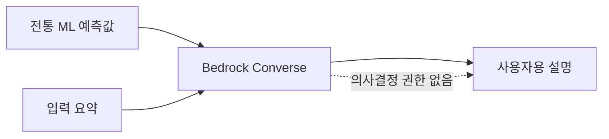

# 11주차 — 생성형 AI 활용 (Amazon Bedrock)

**클라우드 MLOps** · 연성대학교 · 230분 (10분 조기 종료)
NCS: `2001070106_18v1.3` 인공지능 플랫폼 외부 인터페이스 구현하기 / `2001070206_18v1.1` 인공지능 서비스 활용 방안 분석하기(부분)

---

## 0. 회차 요약 (강사용 1페이지)

| 항목 | 내용 |
|---|---|
| 학습목표 | Bedrock의 파운데이션 모델을 `boto3`로 호출해 텍스트를 생성하고, 팀 프로젝트 API에 LLM 보조 기능 엔드포인트를 1개 추가할 수 있다. 또한 어떤 문제에 LLM을 쓰고 어떤 문제에 전통 ML을 쓸지 기준을 들어 판단할 수 있다. |
| 오늘의 결과물 | ① Bedrock 텍스트 생성 호출 결과 ② 프롬프트 3종 비교 기록 ③ 팀 API에 붙은 `/explain`(또는 `/summarize`) 엔드포인트 응답 캡처 |
| 사전 준비 | ① 서울 리전에서 사용할 모델·추론 프로필을 개강 직전 확인 ② AWS Marketplace 권한과 최초 사용 조건 확인 ③ 학생 역할에 최소 호출 권한 부여 ④ 수업 당일 `list-foundation-models`와 1회 시험 호출 ⑤ 콘솔 UI 캡처 갱신 ⑥ `week-11-done` 태그 준비 |
| 학생 준비물 | 노트북, 8주차 API 소스(`~/bike-api`), 팀 저장소, 팀 프로젝트 예측 결과 예시 3건 |
| 예상 사고 지점 | ① `AccessDeniedException` — 모델 액세스 미승인 ② `ValidationException: model not found` — 서울 리전에 그 모델이 없음 / 모델 ID 오타 ③ 입력이 길어 토큰 한도 초과 또는 응답이 중간에 잘림 |

### 시간표

| 시간 | 구성 | 분 |
|---|---|---|
| 00:00–00:10 | 도입 — 지난주 복습 퀴즈 + 오늘 만들 결과물 데모 | 10 |
| 00:10–00:55 | 이론 — 파운데이션 모델, 프롬프트, 토큰·과금, LLM vs 전통 ML, 한계 | 45 |
| 00:55–01:05 | 휴식 | 10 |
| 01:05–01:55 | **실습 A** — 모델 액세스 확인 → `boto3`로 텍스트 생성 → 프롬프트 변경 실험 | 50 |
| 01:55–02:05 | 휴식 | 10 |
| 02:05–03:30 | **실습 B** — 팀 프로젝트에 LLM 보조 기능 1개 붙이기 | 85 |
| 03:30–03:45 | 체크포인트 제출 + 다음 주 예고 | 15 |
| 03:45–03:50 | 리소스 정리 타임 | 5 |
| **합계** | | **230** |

---

## 1. 도입 (10분)

### 지난주 복습 퀴즈 (구두 3문항)

1. SageMaker 학습 잡과 엔드포인트의 결정적 차이는? — (학습 잡은 끝나면 자동으로 꺼지고, 엔드포인트는 내가 지우기 전까지 계속 켜져서 시간당 과금됩니다.)
2. 관리형 서비스를 쓰면 잃는 것 세 가지는? — (자유도, 이식성, 그리고 내부 동작에 대한 이해입니다.)
3. "사람이 부족하면 ___, 돈이 부족하면 ___" — (관리형 / 직접 구축.)

> **강사 확인**: 어제 과제였던 `list-endpoints` 캡처 제출 현황을 화면에 띄우고, 미제출자는 지금 그 자리에서 실행하게 한다. (2분)

> **강사 멘트**
> "지난주까지 여러분이 만든 API는 숫자를 하나 뱉습니다. `187.4`. 이 숫자를 보고 따릉이 운영 담당자가 뭘 할 수 있을까요? … 사실 잘 모릅니다. 187이 많은 건지 적은 건지, 왜 그런지 모르니까요. 오늘은 여기에 **말을 붙입니다.** '오늘 저녁 6시 강남역 일대는 평소 대비 20% 많은 대여가 예상됩니다. 기온이 높고 평일 퇴근 시간대이기 때문입니다. 자전거 재배치를 권장합니다.' 이런 문장을요. 숫자를 만드는 건 여러분 모델이고, 그 숫자를 사람 말로 바꾸는 건 오늘 배울 생성형 AI입니다."

### 오늘 만들 것 데모

1. 강사가 8주차 Streamlit 데모를 띄우고 예측을 실행한다. 숫자 `187.4`가 나온다.
2. 아래에 새로 생긴 **"결과 설명 보기"** 버튼을 누른다. 3~4초 뒤 두세 문장의 설명이 나타난다.
3. 입력값을 새벽 3시, 기온 2도로 바꾸고 다시 누른다. **설명 문장이 완전히 달라지는 것**을 보여준다.
   > "이게 지난주와 결정적으로 다른 점입니다. 우리 예측 모델은 같은 입력에 항상 같은 숫자를 냅니다. 그런데 이 설명은 같은 입력에도 문장이 조금씩 달라집니다. 좋은 걸까요, 나쁜 걸까요? 그게 오늘 이론의 주제입니다."
4. 터미널에서 `curl`로 `/explain`을 호출해 JSON 응답과 함께 `input_tokens`, `output_tokens` 값이 찍히는 것을 보여준다.
   > "그리고 이 숫자들. 이게 오늘 여러분이 새로 배울 비용의 단위입니다."

---

## 2. 이론 (45분)

### 2-1. 파운데이션 모델과 프롬프트 (11분)

**강의 스크립트**

> 여러분이 4주차에 만든 모델과 오늘 쓸 모델은 만든 방식이 근본적으로 다릅니다. 그 차이부터 잡고 갑시다.
>
> 여러분 모델은 **하나의 일**을 하도록 만들어졌습니다. 따릉이 대여량을 예측하는 모델은 대여량만 예측합니다. 데이터를 모으고, 라벨을 붙이고, 학습을 시켰습니다. 다른 일을 시키려면 처음부터 다시 해야 합니다.
>
> **파운데이션 모델(Foundation Model, 기반 모델)**은 반대입니다. 인터넷 규모의 텍스트로 **미리** 아주 크게 학습해 둔 범용 모델입니다. 특정 업무를 위해 학습된 게 아니라, "언어 자체"를 학습했습니다. 그래서 요약도 하고, 번역도 하고, 분류도 하고, 코드도 씁니다. 학습을 다시 시키지 않고요.
>
> 비유하자면 이렇습니다. 여러분 모델은 **자격증 하나 딴 전문 기능공**입니다. 그 일은 정확하게 잘합니다. 파운데이션 모델은 **책을 아주 많이 읽은 신입사원**입니다. 뭘 시켜도 어느 정도는 합니다. 다만 우리 회사 사정은 모릅니다.
>
> 여기서 **프롬프트(prompt)**가 나옵니다. 우리말로는 '지시문'입니다. 이 신입사원에게 일을 시키는 **업무 지시서**입니다. 학습을 다시 시키는 대신, 지시를 잘 쓰는 것으로 성능을 올립니다. 이게 생성형 AI 시대에 일하는 방식이 바뀐 지점입니다.
>
> 좋은 프롬프트에는 보통 네 가지가 들어갑니다. **역할, 맥락, 지시, 형식**입니다.
> - 역할: "너는 따릉이 운영 담당자를 돕는 분석 어시스턴트다"
> - 맥락: "예측 모델이 오늘 저녁 6시 대여량을 187건으로 예측했다. 평소 같은 시간대 평균은 150건이다."
> - 지시: "왜 이런 예측이 나왔는지 입력 조건에 근거해 설명하라"
> - 형식: "3문장 이내, 존댓말, 숫자는 반드시 포함"
>
> 여기서 아주 중요한 이야기. **형식을 지정하지 않으면 매번 다른 길이의 답이 옵니다.** API로 쓸 때 이건 재앙입니다. 화면이 깨지니까요. 그래서 실무 프롬프트는 형식 지정이 절반을 차지합니다.
>
> 마지막으로 **Amazon Bedrock**이 뭐냐. 여러 회사(Anthropic, Amazon, Meta 등)의 파운데이션 모델을 **AWS 안에서 API 하나로 골라 쓰게 해주는 서비스**입니다. 서버를 띄우지 않습니다. 우리는 `boto3`로 호출만 합니다. 지난주 엔드포인트처럼 켜놓고 돈 나가는 구조가 아니라, **부른 만큼만** 냅니다. 이건 마음이 편합니다.

**판서/슬라이드 요점**

- 우리 모델 = 한 가지 일을 위해 **직접 학습** / 파운데이션 모델 = 범용, **이미 학습됨**
- 파운데이션 모델을 쓰는 법 = 재학습이 아니라 **프롬프트(지시문) 작성**
- 좋은 프롬프트 4요소: **역할 · 맥락 · 지시 · 형식**
- 형식(길이·문체·구조) 지정은 선택이 아니라 필수 — API로 쓰려면 출력이 예측 가능해야 한다
- Amazon Bedrock = 여러 회사의 FM을 AWS API 하나로 사용. **서버 없음, 쓴 만큼 과금**

**학생 질문 예상 & 답변**

- Q: 그럼 우리 예측 모델도 그냥 LLM한테 시키면 안 되나요? → A: 좋은 질문입니다. 시킬 수는 있는데 **정확도·비용·속도가 다 나쁩니다.** 숫자 예측은 전통 ML이 압도적으로 잘합니다. 다음 소주제에서 기준을 표로 정리하겠습니다.
- Q: 프롬프트를 한국어로 써도 되나요? → A: 됩니다. 다만 지시는 명확하게 쓰세요. "잘 설명해줘"보다 "3문장 이내로, 숫자를 인용해서 설명해줘"가 훨씬 잘 동작합니다.

---

### 2-2. 토큰과 과금 구조 (10분)

**강의 스크립트**

> 이제 돈 이야기입니다. 지난주 SageMaker는 **시간당** 과금이었죠. Bedrock은 다릅니다. **토큰당** 과금입니다.
>
> **토큰(token)**이 뭐냐. 모델이 글자를 쪼개서 처리하는 단위입니다. 영어는 대략 단어 하나가 토큰 1개 정도, 한국어는 좀 더 잘게 쪼개져서 **글자 하나가 토큰 1개에 가깝습니다.** 그래서 같은 내용이면 한국어가 토큰을 더 많이 씁니다. 대략 감을 잡자면 **한국어 원고지 한 장(200자)이 대략 150~250토큰** 정도라고 생각하세요.
>
> 그리고 중요한 건, **입력 토큰과 출력 토큰의 값이 다르다**는 겁니다. 보통 출력이 3~5배 비쌉니다. 왜냐하면 모델이 출력은 한 글자씩 만들어내야 하니까요.
>
> 여기서 실무 감각 하나. 여러분이 프롬프트에 "참고 자료"라며 문서 10페이지를 통째로 붙이면, **매 호출마다** 그 10페이지의 입력 토큰이 청구됩니다. 100번 부르면 1000페이지 값입니다. 그래서 프롬프트를 짧고 정확하게 쓰는 것은 품질 문제이자 **비용 문제**입니다.
>
> 그리고 하나 더. **`max_tokens`(최대 출력 토큰)를 반드시 지정하세요.** 이건 안전벨트입니다. 모델이 폭주해서 3000자를 쓰는 걸 막고, 비용 상한을 만듭니다. 우리 실습에서는 300으로 두겠습니다.
>
> Bedrock 비용은 모델, 입력·출력 토큰 수, 추론 방식에 따라 달라집니다. 오늘 사용할 모델의 가격표를 먼저 확인하고 호출 횟수 상한을 정합니다. 반복문 안에서 호출할 때는 반드시 건수를 제한하세요.

**판서/슬라이드 요점**

- 토큰 = 모델이 글자를 처리하는 단위. **한국어는 대체로 글자 수에 가깝다** (영어보다 토큰을 많이 씀)
- 과금 = **입력 토큰 × 단가 + 출력 토큰 × 단가**. 보통 출력이 3~5배 비싸다
- 서버 상시 비용 없음 → **호출하지 않으면 0원** (SageMaker 엔드포인트와 결정적 차이)
- 긴 프롬프트는 **매 호출마다** 청구된다 → 짧고 정확하게
- ⚠ `max_tokens` 지정은 비용 안전벨트. 실습 기본값 **300**
- ⚠ 반복문 안 호출 주의 — 건수 제한을 코드로 걸 것

**학생 질문 예상 & 답변**

- Q: 몇 토큰 썼는지 어떻게 아나요? → A: 응답에 `usage` 항목으로 입력/출력 토큰이 그대로 옵니다. 오늘 실습에서 매번 출력해 볼 겁니다.
- Q: 무료 사용량은 없나요? → A: Bedrock은 기본적으로 유료입니다. 학과 계정 예산 안에서 쓰되, 프롬프트 실험은 짧은 입력으로 하세요.

---

### 2-3. ⚠ 언제 LLM을 쓰고 언제 전통 ML을 쓰나 — 오늘의 핵심 (13분)

**강의 스크립트**

> 오늘 여러분이 시험에서든 면접에서든 답할 수 있어야 하는 부분입니다. 요즘 현업에서 가장 흔한 실수가 **"일단 LLM에 넣어보자"**입니다. 이건 계산기로 될 일에 슈퍼컴퓨터를 부르는 겁니다. 느리고, 비싸고, 심지어 덜 정확합니다.
>
> 판단 기준을 다섯 개로 정리해 드리겠습니다. 표를 보면서 갑시다.
>
> 첫째, **출력이 숫자냐 문장이냐.** 숫자(가격, 수요량, 확률)면 전통 ML입니다. 문장이면 LLM입니다. 이게 제일 굵은 기준입니다.
>
> 둘째, **정답이 있는가.** 대여량 187건은 나중에 실제 값과 비교해 맞았는지 틀렸는지 채점할 수 있습니다. 정답이 있으면 학습시킬 수 있고, 학습시킬 수 있으면 전통 ML이 이깁니다. 반면 "이 리뷰를 잘 요약했는가"는 정답이 하나가 아닙니다. 이런 건 LLM 영역입니다.
>
> 셋째, **학습 데이터가 있는가.** 라벨 붙은 데이터가 수천 건 있으면 전통 ML로 학습시키는 게 낫습니다. 데이터가 30건뿐이라면? 학습이 안 됩니다. 이럴 때 LLM은 **예시 몇 개만 프롬프트에 넣어도** 어느 정도 합니다. 데이터가 없을 때의 임시방편으로 훌륭합니다.
>
> 넷째, **매번 같은 답이 나와야 하는가.** 대출 심사에서 같은 사람에게 오늘은 승인, 내일은 거절이 나오면 큰일 납니다. **결정성(determinism)**이 필요하면 전통 ML입니다. LLM은 기본적으로 매번 조금씩 다른 답을 냅니다.
>
> 다섯째, **속도와 비용.** 우리 FastAPI 예측은 10밀리초, 사실상 공짜입니다. LLM 호출은 1~3초, 호출당 비용이 붙습니다. 초당 수천 건 처리해야 하면 LLM은 후보가 아닙니다.
>
> 자, 그럼 오늘 우리가 하는 건 뭘까요? **둘을 합치는 것**입니다. 숫자는 우리 모델이 만들고, 그 숫자를 사람 말로 옮기는 건 LLM이 합니다. 각자 잘하는 걸 시키는 거죠. 현업에서 가장 흔하고 가장 잘 먹히는 조합이 바로 이겁니다. 여러분 프로젝트에도 딱 이 구조로 붙이면 됩니다.

**판서/슬라이드 요점 — 판단 기준표 (배포용)**

| 판단 축 | 전통 ML을 쓴다 | LLM(생성형 AI)을 쓴다 |
|---|---|---|
| **출력 형태** | 숫자·확률·범주 (예: 대여량 187, 이탈 확률 0.73) | 자유로운 문장·요약·설명·분류 근거 |
| **정답 존재** | 채점 가능한 정답이 있다 (실제값과 비교 가능) | 정답이 하나로 정해지지 않는다 (요약·설명·아이디어) |
| **데이터 양** | 라벨 데이터 수백~수천 건 확보됨 | 데이터가 거의 없다 (예시 몇 개로 시작해야 함) |
| **결정성** | 같은 입력 → **항상 같은 출력**이 필요 (심사·정산·규제) | 표현이 매번 달라져도 무방 |
| **속도·비용** | 밀리초, 사실상 무료. 대량 처리 필요 | 1~3초, 호출당 과금. 건수가 적다 |
| **설명 대상** | 모델 자체가 결과물 | **다른 모델의 결과를 사람에게 설명**하는 역할 |

- 실무의 정석 조합: **숫자는 전통 ML → 그 숫자의 해석·요약은 LLM** (오늘 실습 B가 정확히 이 구조)
- 안티패턴: 숫자 예측을 LLM에 시키기 / 대량 정형 분류를 LLM에 시키기 / 규제 대상 판단을 LLM에 맡기기

**학생 질문 예상 & 답변**

- Q: 텍스트 분류(감성 분석)는 어느 쪽인가요? → A: 경계선입니다. 라벨 데이터가 많으면 전통 ML(또는 소형 모델)이 싸고 빠릅니다. 데이터가 없고 빨리 만들어야 하면 LLM이 유리합니다. C 도메인(리뷰) 팀은 **감성 분류는 여러분 모델, 요약과 개선점 도출은 LLM**으로 나누세요.
- Q: LLM이 계산도 하던데요? → A: 하는 것처럼 보일 뿐 자주 틀립니다. 숫자 계산은 코드에 맡기고, LLM에는 그 결과를 설명만 시키세요.

---

### 2-4. 생성형 AI의 한계 — 환각·비결정성·비용·개인정보 (11분)

**강의 스크립트**

> 마지막으로, 오늘 여러분이 반드시 알고 가야 할 네 가지 위험입니다. 이걸 모르고 서비스에 붙이면 사고가 납니다.
>
> **첫째, 환각(hallucination)**입니다. 모델이 **모르는 것을 모른다고 하지 않고 그럴듯하게 지어냅니다.** 존재하지 않는 논문 제목, 없는 법 조항, 틀린 통계를 아주 자신 있는 문장으로 씁니다. 이게 가장 위험한 이유는 **문장이 자연스럽기 때문에 사람이 믿는다**는 겁니다.
> 방어법은 두 가지입니다. 하나, **근거 데이터를 프롬프트에 같이 넣어주고 "제공된 정보에만 근거하라"고 지시**합니다. 둘, **모르면 모른다고 답하라**고 명시합니다. 오늘 실습 프롬프트에 이 두 문장을 넣을 겁니다.
>
> **둘째, 비결정성**입니다. 같은 질문에 매번 다른 답이 옵니다. 온도(temperature)라는 값을 0에 가깝게 낮추면 편차가 줄지만 **완전히 같아지지는 않습니다.** 그래서 LLM 출력은 자동 테스트를 짜기 어렵습니다. 우리 `/predict`는 "187.4가 나오는지" 테스트할 수 있지만, `/explain`은 그렇게 못 합니다. 대신 "3문장 이내인가", "숫자가 포함되었는가" 같은 **형식 검사**를 합니다.
>
> **셋째, 비용과 지연**입니다. 아까 말한 대로입니다. 사용자가 버튼을 누르고 3초를 기다려야 하면, 화면에 "생성 중..." 표시를 반드시 넣어야 합니다. 안 그러면 사용자는 고장 난 줄 알고 계속 누릅니다. 그러면 호출이 5번 나가고 요금도 5배가 됩니다.
>
> **넷째, 개인정보입니다.** 이건 규칙으로 못 박겠습니다. **주민번호, 실명, 연락처, 주소, 카드번호를 프롬프트에 넣지 마세요.** 우리 수업 데이터에는 없어야 정상이지만, 팀 데이터를 그대로 프롬프트에 붙이다 실수하는 경우가 있습니다. 프롬프트에 넣기 전에 **필요한 필드만 골라서 넣는 습관**을 들이세요. 교육계획서 감점 조항에 개인정보 위반은 프로젝트 0점으로 되어 있습니다. 농담이 아닙니다.
>
> 마지막 한마디. 생성형 AI는 **결정하는 자리에 두지 말고, 설명하는 자리에 두세요.** 판단은 여러분 모델이 하고, LLM은 그 판단을 사람에게 전달합니다. 이 원칙만 지켜도 오늘 배운 위험의 대부분이 사라집니다.

**판서/슬라이드 요점**

- **환각** — 모르는 것을 그럴듯하게 지어냄. 방어: ① 근거를 프롬프트에 제공 + "제공된 정보에만 근거하라" ② "모르면 모른다고 답하라"
- **비결정성** — 같은 입력에 다른 출력. `temperature`를 낮춰도 완전히 같지 않음 → 테스트는 **형식 검사**로
- **비용·지연** — 1~3초 소요. UI에 로딩 표시 필수(중복 클릭 = 중복 과금)
- **개인정보** — 실명·연락처·주민번호·주소를 프롬프트에 넣지 않는다. **필요한 필드만 선별**
- 원칙: **LLM은 결정하는 자리가 아니라 설명하는 자리에 둔다**

**학생 질문 예상 & 답변**

- Q: 환각을 100% 막을 수 있나요? → A: 못 막습니다. 줄일 뿐입니다. 그래서 중요한 판단에는 사람 검토를 반드시 끼웁니다. 서비스 화면에 "AI가 생성한 설명입니다" 같은 안내를 넣는 것도 실무 관행입니다.
- Q: 우리가 넣은 데이터로 모델이 학습되나요? → A: Bedrock은 고객 입력을 기반 모델 학습에 사용하지 않는다고 명시하고 있습니다. 그래도 개인정보를 넣지 않는 원칙은 그대로 지킵니다. 서비스 정책은 바뀔 수 있고, 로그에는 남기 때문입니다.

---

## 3. 실습 A — Bedrock 첫 호출과 프롬프트 실험 (50분) · 공통 예제 따라하기

**목표** 서울 리전에서 사용 가능한 모델을 확인하고, `boto3`의 Converse API로 텍스트를 생성한 뒤, 프롬프트를 바꿔가며 출력이 어떻게 달라지는지 기록한다.

**사전 배포 파일**
- `bedrock_demo.py` (호출 함수 골격)
- `models_ap-northeast-2.md` (⚠ **강사가 개강 직전 갱신한 서울 리전 사용 가능 모델 ID 목록**)
- 완성본 태그: `week-11-done`

> ⚠ **강사 안내**: Bedrock의 모델 라인업과 모델 ID 체계(특히 교차 리전 추론 프로파일 접두어)는 자주 바뀐다. 아래 코드의 `MODEL_ID`는 **수업 당일 배포 목록의 값으로 반드시 교체**해 진행한다. 학생이 임의로 다른 모델 ID를 넣으면 대부분 `ValidationException`이 난다.

### 수행 순서

**① 모델과 권한 상태 확인 (콘솔)**

1. AWS 콘솔 리전이 **서울(ap-northeast-2)** 인지 확인한다.
2. 검색창에 `Bedrock` → **Amazon Bedrock** 진입
3. **Model catalog**에서 오늘 사용할 모델을 연다.
4. 모델 ID 또는 추론 프로필, 서울 리전 지원 여부, 사용 조건을 확인한다.

- 확인 포인트: 올바른 Marketplace 권한이 있으면 상용 리전의 모델 액세스는 기본 활성화된다. 일부 제공자는 최초 사용 때 용도 정보가 필요할 수 있으므로, 시험 호출 오류가 나면 강사에게 알린다.

**② CLI로 사용 가능한 모델 목록 확인** — EC2 또는 CloudShell에서 실행한다.

```bash
aws bedrock list-foundation-models --region ap-northeast-2 \
  --query "modelSummaries[?contains(outputModalities, 'TEXT')].[modelId,providerName]" \
  --output table
```

- 확인 포인트: 표가 출력되고, 배포된 `models_ap-northeast-2.md`의 모델 ID가 목록에 있다.
- ⚠ 여기서 아무것도 안 나오거나 권한 오류가 나면 다음으로 넘어가지 말고 강사를 부른다.

**③ 파이썬 환경 준비**

```bash
mkdir -p ~/bedrock-lab && cd ~/bedrock-lab
python3 -m venv .venv
source .venv/bin/activate
pip install --upgrade pip
pip install "boto3>=1.35.0"
python -c "import boto3; print(boto3.__version__)"
```

- 확인 포인트: boto3 버전이 1.35 이상. (Converse API를 쓰려면 최신 boto3가 필요하다)

**④ 첫 호출 — Converse API**

```bash
nano ~/bedrock-lab/bedrock_demo.py
```

```python
"""Bedrock 텍스트 생성 최소 예제.
MODEL_ID 는 강사가 배포한 models_ap-northeast-2.md 의 값으로 교체할 것.
"""
import boto3

REGION = "ap-northeast-2"
MODEL_ID = "<수업당일_배포_모델ID>"   # 예: apac.anthropic.claude-3-5-haiku-20241022-v1:0

client = boto3.client("bedrock-runtime", region_name=REGION)


def generate(prompt: str, system: str = "", max_tokens: int = 300,
             temperature: float = 0.2) -> dict:
    """프롬프트를 받아 생성 결과와 토큰 사용량을 함께 돌려준다."""
    kwargs = {
        "modelId": MODEL_ID,
        "messages": [{"role": "user", "content": [{"text": prompt}]}],
        "inferenceConfig": {"maxTokens": max_tokens, "temperature": temperature},
    }
    if system:
        kwargs["system"] = [{"text": system}]

    resp = client.converse(**kwargs)
    return {
        "text": resp["output"]["message"]["content"][0]["text"],
        "input_tokens": resp["usage"]["inputTokens"],
        "output_tokens": resp["usage"]["outputTokens"],
        "stop_reason": resp["stopReason"],
    }


if __name__ == "__main__":
    out = generate("따릉이 공공자전거 서비스를 두 문장으로 소개해 주세요.")
    print(out["text"])
    print("-" * 50)
    print("입력 토큰:", out["input_tokens"], "/ 출력 토큰:", out["output_tokens"])
    print("종료 이유:", out["stop_reason"])
```

```bash
python bedrock_demo.py
```

- 확인 포인트: 한국어 문장 두 개가 출력되고, 아래에 토큰 수가 찍힌다.
- `종료 이유`가 `end_turn`이면 정상 종료, `max_tokens`면 **답이 중간에 잘린 것**이다.

**⑤ 프롬프트 실험 1 — 형식 지정의 효과**

같은 내용을 세 가지 프롬프트로 부르고 결과를 비교한다.

```bash
nano ~/bedrock-lab/exp1.py
```

```python
from bedrock_demo import generate

CONTEXT = (
    "예측 모델이 오늘 18시 따릉이 대여량을 187건으로 예측했습니다. "
    "같은 요일·같은 시간대 평균은 150건입니다. "
    "입력 조건은 기온 24.5도, 습도 55%, 풍속 2.1m/s, 수요일, 공휴일 아님입니다."
)

prompts = {
    "A. 지시만": f"{CONTEXT}\n이 예측을 설명해 주세요.",
    "B. 형식 추가": f"{CONTEXT}\n이 예측을 3문장 이내 존댓말로, 숫자를 인용해 설명해 주세요.",
    "C. 역할+형식+제약": f"{CONTEXT}\n이 예측을 3문장 이내 존댓말로, 숫자를 인용해 설명해 주세요.",
}

SYSTEM_C = (
    "당신은 공공자전거 운영 담당자를 돕는 데이터 분석 어시스턴트입니다. "
    "반드시 제공된 정보에만 근거해 답하고, 제공되지 않은 사실은 추측하지 마세요. "
    "모르면 '주어진 정보로는 알 수 없습니다'라고 답하세요."
)

for name, p in prompts.items():
    system = SYSTEM_C if name.startswith("C") else ""
    r = generate(p, system=system)
    print("=" * 60)
    print(name, f"(입력 {r['input_tokens']} / 출력 {r['output_tokens']} 토큰)")
    print(r["text"])
```

```bash
python exp1.py
```

- 확인 포인트: A는 길고 산만하며, B는 3문장으로 짧아지고, C는 근거가 없는 추측(예: "강남역 인근이 붐비기 때문")이 줄어든다.
- **관찰 기록지에 다음을 적는다**: 각 프롬프트의 출력 토큰 수, 문장 수, "지어낸 것 같은 문장"이 있었는지 여부.

**⑥ 프롬프트 실험 2 — temperature의 효과 (비결정성 체험)**

```bash
nano ~/bedrock-lab/exp2.py
```

```python
from bedrock_demo import generate

PROMPT = "따릉이 대여량이 평소보다 25% 많을 것으로 예상됩니다. 운영 담당자에게 보낼 안내 문구를 한 문장으로 작성하세요."

for temp in (0.0, 0.7):
    print("=" * 60)
    print(f"temperature = {temp}")
    for i in range(3):          # ⚠ 반복 횟수를 3으로 제한한다 (비용 안전장치)
        r = generate(PROMPT, max_tokens=120, temperature=temp)
        print(f"  [{i+1}] {r['text'].strip()}")
```

```bash
python exp2.py
```

- 확인 포인트: `temperature=0.0`은 세 번이 거의 같고, `0.7`은 표현이 눈에 띄게 달라진다.
- **기록**: "같은 입력인데 답이 달랐다 / 같았다"를 표에 적는다. 이것이 이론 2-4의 비결정성이다.

**⑦ 토큰 사용량 누계 확인**

```python
# 파이썬 인터프리터에서
from bedrock_demo import generate
r = generate("안녕하세요")                    # 짧은 한국어
print(r["input_tokens"], r["output_tokens"])
r = generate("Hello")                          # 짧은 영어
print(r["input_tokens"], r["output_tokens"])
```

- 확인 포인트(제출용 스크린샷 ①): 프롬프트 실험 결과와 토큰 수가 함께 보이는 터미널 화면.

### ⚠ 여기서 막히면

| 증상 | 원인 | 조치 |
|---|---|---|
| `AccessDeniedException: You don't have access to the model` | **모델 액세스 미승인** (오늘 1순위 사고) | 콘솔 → Bedrock → Model access에서 상태 확인. `Available to request`면 요청 버튼을 누르되 즉시 승인되지 않을 수 있으므로, 강사가 승인해 둔 **대체 모델 ID**로 교체해 진행 |
| `AccessDeniedException: not authorized to perform: bedrock:InvokeModel` | IAM 정책에 Bedrock 권한 없음 | 강사 호출. 학생 정책에 `bedrock:InvokeModel`, `bedrock:Converse` 필요 |
| `ValidationException: The provided model identifier is invalid` | 모델 ID 오타 또는 **서울 리전에 없는 모델** | ②단계 `list-foundation-models` 결과에 있는 ID만 사용. 교차 리전 추론 프로파일이 필요한 모델은 접두어(`apac.` 등)가 붙는다 — 배포 목록의 값을 그대로 복사 |
| `ResourceNotFoundException` / `Could not connect to the endpoint URL` | 리전 지정 누락 또는 오타 | `boto3.client("bedrock-runtime", region_name="ap-northeast-2")` 확인 |
| `stopReason`이 `max_tokens`이고 답이 중간에 끊김 | 출력 토큰 한도 초과 | `max_tokens`를 늘리거나(300→600) 프롬프트에 "3문장 이내"처럼 길이 제약을 넣는다 |
| `ValidationException: Input is too long` | 입력이 모델의 컨텍스트 한도 초과 | 프롬프트에 붙인 데이터를 줄인다. 리뷰 요약 팀은 **한 번에 30건 이하**로 자른다 |
| `ThrottlingException: Too many requests` | 짧은 시간에 과다 호출 (반복문 사고) | 반복 횟수를 줄이고 호출 사이에 `time.sleep(1)`을 넣는다 |
| `AttributeError: 'BedrockRuntime' object has no attribute 'converse'` | boto3 버전이 낮음 | `pip install --upgrade "boto3>=1.35.0"` |
| 한국어가 깨져서 출력됨 | 터미널 로케일 | `export LANG=C.UTF-8` 후 재실행 |

### 컷오프 안내

50분 경과 시 강제 종료. 액세스 문제로 호출을 못 한 학생은 **강사 계정의 대리 호출 결과 로그**를 받아 실습 B의 프롬프트 설계부터 참여시키고, 호출은 옆 학생과 2인 1조로 진행한다.

```bash
git clone --branch week-11-done https://github.com/<강사계정>/mlops-2026-reference.git ~/week11-done
```

---

## 4. 실습 B — 프로젝트에 LLM 보조 기능 1개 붙이기 (85분) · 팀 수행

**목표** 팀 프로젝트 API에 LLM 기반 보조 엔드포인트를 1개 추가하고, 컨테이너로 재빌드해 동작을 확인한다.

**과제 지시문** (학생에게 그대로 읽어줄 문장)

> "지금부터 85분입니다. 만들 것은 **엔드포인트 딱 하나**입니다. 욕심내지 마세요. 예측형 팀은 `/explain`, 텍스트형 팀은 `/summarize`입니다. 새 프로젝트를 만드는 게 아니라 **7주차에 만든 `app/main.py`에 함수 하나를 더 붙이는 것**입니다. 그리고 오늘 반드시 지킬 세 가지 규칙을 말하겠습니다. 첫째, **프롬프트에 개인정보를 넣지 않는다.** 둘째, **`max_tokens`를 반드시 지정한다.** 셋째, **반복문 안에서 부를 때는 건수를 코드로 제한한다.** 이 세 가지는 감점 항목입니다."

### 수행 항목

**1) 팀 유형 선택 (5분)**

| 팀 유형 | 만들 엔드포인트 | 입력 | 출력 |
|---|---|---|---|
| **A/B 도메인 (수요예측·분류)** | `POST /explain` | 예측 입력값 + 예측 결과 | 예측 근거를 설명하는 3문장 |
| **C 도메인 (텍스트 리뷰)** | `POST /summarize` | 리뷰 텍스트 목록(최대 30건) | 요약 3문장 + 키워드 5개 |

**2) EC2에 Bedrock 권한 부여 확인 (5분)** — 코드에 키를 넣지 않는다(8주차 이론 적용).

```bash
# EC2에 붙은 IAM 역할로 Bedrock이 호출되는지 확인
aws sts get-caller-identity
aws bedrock list-foundation-models --region ap-northeast-2 --query "modelSummaries[0].modelId"
```

- 권한 오류가 나면 강사에게 알린다. **절대 액세스 키를 코드나 `.env`에 적지 않는다.**

**3) 예측형 팀 — `/explain` 구현 (35분)**

`app/llm.py`를 새로 만든다.

```bash
nano ~/bike-api/app/llm.py
```

```python
"""LLM 보조 기능. Bedrock Converse API 호출을 한 곳에 모은다."""
import os

import boto3

REGION = os.getenv("AWS_REGION", "ap-northeast-2")
MODEL_ID = os.getenv("BEDROCK_MODEL_ID", "<수업당일_배포_모델ID>")
MAX_TOKENS = int(os.getenv("BEDROCK_MAX_TOKENS", "300"))

_client = boto3.client("bedrock-runtime", region_name=REGION)

SYSTEM_PROMPT = (
    "당신은 공공자전거 운영 담당자를 돕는 데이터 분석 어시스턴트입니다. "
    "반드시 아래에 주어진 수치에만 근거해 설명하고, 주어지지 않은 사실은 추측하거나 지어내지 마세요. "
    "판단할 수 없으면 '주어진 정보로는 알 수 없습니다'라고 답하세요. "
    "항상 한국어 존댓말로, 3문장 이내로 답하세요."
)


def explain_prediction(features: dict, predicted: float, baseline: float | None = None) -> dict:
    """예측 결과를 사람이 읽을 문장으로 설명한다.

    features 에는 예측에 사용한 값만 넣는다. 개인정보 필드는 호출 전에 제거할 것.
    """
    lines = [f"- {k}: {v}" for k, v in features.items()]
    context = "\n".join(lines)
    baseline_txt = (
        f"같은 조건대의 평균 대여량은 {baseline}건입니다.\n" if baseline is not None else ""
    )
    prompt = (
        f"예측 모델이 다음 조건에서 시간당 대여량을 {predicted:.1f}건으로 예측했습니다.\n"
        f"{baseline_txt}"
        f"[입력 조건]\n{context}\n\n"
        "이 예측 결과가 나온 이유를 입력 조건의 수치를 인용해 설명하고, "
        "운영 담당자가 취할 조치를 한 가지 제안해 주세요."
    )

    resp = _client.converse(
        modelId=MODEL_ID,
        system=[{"text": SYSTEM_PROMPT}],
        messages=[{"role": "user", "content": [{"text": prompt}]}],
        inferenceConfig={"maxTokens": MAX_TOKENS, "temperature": 0.2},
    )
    return {
        "explanation": resp["output"]["message"]["content"][0]["text"].strip(),
        "input_tokens": resp["usage"]["inputTokens"],
        "output_tokens": resp["usage"]["outputTokens"],
        "model_id": MODEL_ID,
    }
```

`app/main.py` 아래쪽에 엔드포인트를 추가한다.

```python
from botocore.exceptions import ClientError

from app.llm import explain_prediction
from app.schemas import ExplainResponse   # 아래에서 추가


@app.post("/explain", response_model=ExplainResponse)
def explain(req: PredictRequest) -> ExplainResponse:
    """예측을 수행하고, 그 결과를 사람이 읽을 문장으로 설명한다."""
    if model is None:
        raise HTTPException(status_code=503, detail="모델이 아직 로드되지 않았습니다.")

    row = pd.DataFrame([req.model_dump()])[FEATURE_ORDER]
    pred = float(model.predict(row)[0])

    try:
        result = explain_prediction(features=req.model_dump(), predicted=pred, baseline=150)
    except ClientError as exc:
        code = exc.response["Error"]["Code"]
        logger.exception("Bedrock 호출 실패: %s", code)
        # LLM이 죽어도 예측값은 돌려준다. 보조 기능이 본 기능을 죽이면 안 된다.
        return ExplainResponse(
            predicted_count=round(pred, 2),
            explanation=f"설명 생성을 일시적으로 사용할 수 없습니다. ({code})",
            input_tokens=0,
            output_tokens=0,
            model_id="unavailable",
        )

    return ExplainResponse(predicted_count=round(pred, 2), **result)
```

`app/schemas.py`에 응답 스키마를 추가한다.

```python
class ExplainResponse(BaseModel):
    predicted_count: float
    explanation: str
    input_tokens: int
    output_tokens: int
    model_id: str
```

**4) 텍스트형 팀 — `/summarize` 구현 (35분)**

```python
# app/llm.py 에 추가
MAX_REVIEWS = 30   # ⚠ 비용·토큰 한도 안전장치. 이 값을 넘기지 않는다

SUMMARY_SYSTEM = (
    "당신은 상품 리뷰를 분석하는 어시스턴트입니다. "
    "제공된 리뷰 텍스트에만 근거해 답하고, 리뷰에 없는 내용을 지어내지 마세요. "
    "반드시 아래 형식만 출력하세요.\n"
    "요약: (3문장 이내)\n"
    "키워드: (쉼표로 구분한 5개)\n"
    "개선점: (1가지)"
)


def summarize_reviews(reviews: list[str]) -> dict:
    reviews = [r.strip() for r in reviews if r.strip()][:MAX_REVIEWS]
    joined = "\n".join(f"{i+1}. {r}" for i, r in enumerate(reviews))
    prompt = f"다음은 고객 리뷰 {len(reviews)}건입니다.\n{joined}\n\n위 리뷰를 분석해 주세요."

    resp = _client.converse(
        modelId=MODEL_ID,
        system=[{"text": SUMMARY_SYSTEM}],
        messages=[{"role": "user", "content": [{"text": prompt}]}],
        inferenceConfig={"maxTokens": 400, "temperature": 0.2},
    )
    return {
        "result": resp["output"]["message"]["content"][0]["text"].strip(),
        "review_count": len(reviews),
        "input_tokens": resp["usage"]["inputTokens"],
        "output_tokens": resp["usage"]["outputTokens"],
        "model_id": MODEL_ID,
    }
```

```python
# app/schemas.py
class SummarizeRequest(BaseModel):
    reviews: list[str] = Field(..., min_length=1, max_length=30,
                               description="리뷰 텍스트 목록 (최대 30건)")


class SummarizeResponse(BaseModel):
    result: str
    review_count: int
    input_tokens: int
    output_tokens: int
    model_id: str
```

```python
# app/main.py
from app.llm import summarize_reviews
from app.schemas import SummarizeRequest, SummarizeResponse


@app.post("/summarize", response_model=SummarizeResponse)
def summarize(req: SummarizeRequest) -> SummarizeResponse:
    try:
        return SummarizeResponse(**summarize_reviews(req.reviews))
    except ClientError as exc:
        raise HTTPException(status_code=503,
                            detail=f"요약 생성 실패: {exc.response['Error']['Code']}") from exc
```

**5) 로컬 실행과 호출 테스트 (15분)**

```bash
cd ~/bike-api
source .venv/bin/activate
pip install "boto3>=1.35.0"
export BEDROCK_MODEL_ID="<수업당일_배포_모델ID>"
uvicorn app.main:app --host 0.0.0.0 --port 8000
```

다른 터미널에서 호출한다.

```bash
curl -s -X POST http://localhost:8000/explain \
  -H "Content-Type: application/json" \
  -d '{"hour":18,"temperature":24.5,"humidity":55.0,"windspeed":2.1,"weekday":2,"is_holiday":0,"season":"summer"}' \
  | python3 -m json.tool
```

```bash
curl -s -X POST http://localhost:8000/summarize \
  -H "Content-Type: application/json" \
  -d '{"reviews":["배송이 빨라서 좋았어요","포장이 부실해서 모서리가 찍혔습니다","가격 대비 성능은 만족합니다"]}' \
  | python3 -m json.tool
```

- 확인 포인트(제출용 스크린샷 ②): 응답 JSON에 한국어 설명/요약과 `input_tokens`, `output_tokens`가 함께 보이는 화면.

**6) 컨테이너 재빌드와 배포 (10분)**

`requirements.txt`에 boto3를 추가한다.

```text
boto3>=1.35.0
```

Dockerfile에 환경변수를 추가한다(모델 ID는 이미지에 굽지 말고 실행 시 주입한다).

```dockerfile
ENV BEDROCK_MAX_TOKENS=300
```

```bash
docker build -t bike-api:v2 .
docker run -d --name bike-api-v2 -p 8000:8000 \
  -e BEDROCK_MODEL_ID="<수업당일_배포_모델ID>" \
  -e AWS_REGION=ap-northeast-2 \
  bike-api:v2
docker logs bike-api-v2
```

> ⚠ 컨테이너 안에서 Bedrock을 부르려면 EC2에 붙은 **IAM 역할**이 그대로 상속된다. `docker run`에 액세스 키를 넣지 않는다.

**7) Streamlit에 버튼 추가 (남는 시간)**

```python
if st.button("결과 설명 보기"):
    with st.spinner("설명을 생성하는 중입니다... (약 3초)"):   # 로딩 표시 = 중복 클릭·중복 과금 방지
        r = requests.post(f"{API_URL}/explain", json=payload, timeout=30)
    if r.status_code == 200:
        d = r.json()
        st.info(d["explanation"])
        st.caption(f"AI가 생성한 설명입니다 · 토큰 {d['input_tokens']}/{d['output_tokens']}")
```

### 팀 프로젝트 연결

오늘 만든 엔드포인트는 최종 산출물 루브릭의 **"파이프라인 완성도"**에 더해 **차별화 요소**로 평가된다. 특히 C 도메인(텍스트 리뷰) 팀은 이 기능이 프로젝트의 핵심 기능 중 하나가 된다. 12주차 GitHub Actions 자동 배포에서는 오늘 만든 `v2` 이미지가 배포 대상이 되고, 13주차 모니터링에서는 **토큰 사용량이 커스텀 메트릭 후보**가 된다(`input_tokens`, `output_tokens`를 CloudWatch로 보낸다).

### 순회 지도 포인트

1. **프롬프트에 개인정보나 불필요한 원본 데이터 전체가 들어가지 않았는가** — `df.to_string()`을 통째로 붙인 팀이 반드시 나온다. 토큰 폭증과 개인정보 문제를 동시에 일으키므로 즉시 필드 선별로 고치게 한다.
2. **`max_tokens`와 반복 건수 제한이 코드에 있는가** — `for row in df.iterrows(): generate(...)` 형태를 발견하면 즉시 중단시키고 `[:30]` 제한을 넣게 한다.
3. **LLM 실패 시 본 기능이 함께 죽지 않는가** — `/explain`에서 Bedrock 예외를 잡아 예측값은 반환하도록 되어 있는지 확인한다. "보조 기능이 본 기능을 죽이지 않는다"는 운영 원칙을 그 자리에서 설명한다.

---

## 5. 체크포인트 (제출물)

| # | 제출물 | 형식 | 배점 |
|---|---|---|---|
| 1 | 프롬프트 3종(A/B/C) 비교 결과 + 토큰 수 | 스크린샷 또는 텍스트 | 0.5 |
| 2 | `temperature` 0.0 vs 0.7 비교 기록 (각 3회) | 표 | 0.3 |
| 3 | 팀 API의 `/explain`(또는 `/summarize`) 호출 응답 캡처 — 토큰 수 포함 | 스크린샷 | 0.8 |
| 4 | 우리 팀이 LLM을 쓴 자리와 전통 ML을 쓴 자리, 그 이유 (3문장) | 텍스트 | 0.4 |

### 평가 기준 (NCS 수행준거 연계)

- `2001070106_18v1.3` **인공지능 플랫폼 외부 인터페이스 구현하기** — 외부 인공지능 서비스(Bedrock)를 연동하는 인터페이스를 규격에 맞게 구현하고, 연동 실패 상황을 처리했는가. (판정: `boto3`로 Converse API를 호출해 응답을 파싱했는가 / 요청·응답 스키마가 정의되고 `/docs`에 노출되는가 / **예외 발생 시 본 기능(`/predict`)이 함께 중단되지 않도록 처리**했는가 / 자격증명을 코드에 하드코딩하지 않고 IAM 역할·환경변수로 주입했는가)
- `2001070206_18v1.1` **인공지능 서비스 활용 방안 분석하기(부분)** — 확정된 서비스의 적용 분야를 파악하고, 응용 범위와 필요 요소를 도출해 활용 방안을 제시했는가. (판정: LLM과 전통 ML의 적용 기준을 근거를 들어 구분했는가 / 팀 프로젝트에 **실제로 부가가치가 있는 보조 기능**을 선정하고 그 이유를 서술했는가 / 환각·비용·개인정보 등 한계를 인지하고 완화 조치를 코드나 프롬프트에 반영했는가)

---

## 6. 정리 & 다음 주 예고 (15분)

### 오늘 배운 것 3줄 요약

1. 파운데이션 모델은 재학습이 아니라 **프롬프트(역할·맥락·지시·형식)**로 쓴다. Bedrock은 서버 없이 **쓴 만큼만** 과금된다.
2. **숫자·정답·대량·결정성**이면 전통 ML, **문장·정답 없음·소량·표현 유연**이면 LLM. 실무의 정석은 **숫자는 우리 모델, 설명은 LLM**이다.
3. 환각·비결정성·비용·개인정보 — 네 가지 위험이 있으므로 **LLM은 결정하는 자리가 아니라 설명하는 자리**에 둔다.

### 다음 주 미리보기 한 문장

> "다음 주에는 **코드를 push하면 알아서 배포되는 파이프라인(GitHub Actions)**을 만듭니다. 오늘까지 여러분은 배포할 때마다 EC2에 들어가 `docker build`를 쳤죠. 다음 주부터는 그걸 안 합니다. 준비물은 **팀 GitHub 저장소에 오늘 코드가 올라가 있는 것**입니다. 커밋 안 해오면 다음 주에 할 게 없습니다."

### 리소스 정리 타임 체크 항목 (5분)

```bash
docker stop bike-api-v2 && docker rm bike-api-v2
docker ps -a
pkill -f uvicorn
```

- [ ] 실행 중인 컨테이너·uvicorn 프로세스 없음
- [ ] EC2 인스턴스 **중지(Stop)** 완료
- [ ] ⚠ **지난주 SageMaker 잔여 리소스 재확인** — `aws sagemaker list-endpoints --region ap-northeast-2 --output table` 결과가 비어 있는가
- [ ] Bedrock은 상시 과금 리소스가 없으므로 삭제할 것 없음. 단 **반복 호출 스크립트를 백그라운드에 켜두지 않았는지** 확인 (`ps aux | grep python`)
- [ ] 액세스 키를 코드·`.env`·스크린샷에 넣지 않았는지 최종 확인

---

## 7. 과제

1. **(필수)** 오늘 만든 엔드포인트를 팀 저장소에 커밋하고 `README.md`에 사용 예시(`curl` 명령 1개 + 응답 예시)를 추가한다. 다음 주 GitHub Actions의 배포 대상이 된다.
2. **(필수)** 프롬프트를 **1회 이상 개선**하고, 개선 전/후 출력을 나란히 비교한 표를 `docs/prompt-log.md`에 남긴다. 어떤 문장을 추가·삭제해서 무엇이 좋아졌는지 한 줄씩 적는다.
3. **(권장)** 환각을 일부러 유도해 본다. 프롬프트에 없는 정보(예: "이 지역의 작년 같은 날 대여량은?")를 물어보고, 시스템 프롬프트에 "모르면 모른다고 답하라"를 넣기 전과 후를 비교해 기록한다.
4. **(선택)** 호출 1회당 예상 비용을 계산해 본다. `input_tokens`, `output_tokens`와 배포된 모델 단가표를 곱해, "우리 서비스가 하루 500번 호출되면 월 얼마인가"를 산출한다. 10주차 비교표에 한 행으로 추가한다.

---

## 부록 A. 명령어 치트시트 (1페이지 배포용)

```bash
# ── 0. 준비 ───────────────────────────────────────────────
export REGION=ap-northeast-2
export BEDROCK_MODEL_ID="<수업당일_배포_모델ID>"
pip install --upgrade "boto3>=1.35.0"

# ── 1. 액세스 / 모델 목록 확인 ────────────────────────────
aws sts get-caller-identity
aws bedrock list-foundation-models --region $REGION \
  --query "modelSummaries[?contains(outputModalities,'TEXT')].[modelId,providerName]" --output table

# ── 2. CLI로 바로 한 번 호출해 보기 ───────────────────────
aws bedrock-runtime converse \
  --region $REGION \
  --model-id "$BEDROCK_MODEL_ID" \
  --messages '[{"role":"user","content":[{"text":"따릉이를 한 문장으로 소개해 주세요."}]}]' \
  --inference-config '{"maxTokens":200,"temperature":0.2}'

# ── 3. API 실행 & 호출 ────────────────────────────────────
uvicorn app.main:app --host 0.0.0.0 --port 8000

curl -s -X POST http://localhost:8000/explain \
  -H "Content-Type: application/json" \
  -d '{"hour":18,"temperature":24.5,"humidity":55.0,"windspeed":2.1,"weekday":2,"is_holiday":0,"season":"summer"}' \
  | python3 -m json.tool

curl -s -X POST http://localhost:8000/summarize \
  -H "Content-Type: application/json" \
  -d '{"reviews":["배송이 빨라요","포장이 부실합니다","가격 대비 만족"]}' \
  | python3 -m json.tool

# ── 4. 컨테이너로 실행 (키를 넣지 않는다) ─────────────────
docker build -t bike-api:v2 .
docker run -d --name bike-api-v2 -p 8000:8000 \
  -e BEDROCK_MODEL_ID="$BEDROCK_MODEL_ID" -e AWS_REGION=$REGION bike-api:v2

# ── 5. 정리 ───────────────────────────────────────────────
docker stop bike-api-v2 && docker rm bike-api-v2
ps aux | grep python        # 백그라운드 반복 호출 스크립트가 없는지 확인
aws sagemaker list-endpoints --region $REGION --output table   # 지난주 잔여 확인
```

```python
# ── 파이썬 최소 호출 (3줄) ────────────────────────────────
import boto3
c = boto3.client("bedrock-runtime", region_name="ap-northeast-2")
r = c.converse(modelId="<모델ID>",
               messages=[{"role": "user", "content": [{"text": "안녕하세요"}]}],
               inferenceConfig={"maxTokens": 200, "temperature": 0.2})
print(r["output"]["message"]["content"][0]["text"], r["usage"])
```

---

## 부록 B. 용어 정리

| 용어 | 뜻 | 한 줄 설명 |
|---|---|---|
| 생성형 AI | Generative AI | 새로운 텍스트·이미지 등을 만들어내는 AI. 분류·예측형과 구분된다 |
| 파운데이션 모델(FM) | 기반 모델 | 대규모 데이터로 미리 학습된 범용 모델. 재학습 없이 여러 일에 쓴다 |
| LLM | Large Language Model | 언어를 다루는 대규모 파운데이션 모델 |
| Amazon Bedrock | AWS의 FM 서비스 | 여러 회사의 파운데이션 모델을 API 하나로 호출. 서버 관리 불필요 |
| 모델 액세스 | Model access | Bedrock에서 특정 모델을 쓰기 위해 계정 단위로 받아야 하는 사용 승인 |
| Converse API | 통합 대화 API | 모델별 요청 형식 차이를 흡수한 Bedrock의 공통 호출 방식 |
| 프롬프트 | 지시문 | 모델에게 시키는 말. 역할·맥락·지시·형식으로 구성한다 |
| 시스템 프롬프트 | 역할 지정문 | 모델의 역할·제약을 미리 고정하는 지시. 매 요청에 함께 전송된다 |
| 토큰(token) | 처리 단위 | 글자를 쪼갠 단위. 한국어는 글자 수에 가깝고, 과금의 기준이 된다 |
| `max_tokens` | 최대 출력 토큰 | 출력 길이 상한. 비용 안전벨트이자 응답 잘림의 원인 |
| temperature | 온도 | 출력의 무작위성. 0에 가까울수록 같은 답이 자주 나온다 |
| `stopReason` | 종료 이유 | `end_turn`이면 정상 종료, `max_tokens`면 중간에 잘림 |
| 환각(hallucination) | 거짓 생성 | 모르는 것을 그럴듯하게 지어내는 현상. 문장이 자연스러워 더 위험하다 |
| 비결정성 | non-determinism | 같은 입력에도 출력이 달라지는 성질. 자동 테스트가 어렵다 |
| 교차 리전 추론 프로파일 | cross-region inference profile | 여러 리전에 걸쳐 요청을 분산하는 모델 ID 형태(접두어가 붙는다) |
| `AccessDeniedException` | 접근 거부 | 모델 액세스 미승인 또는 IAM 권한 부족 시 발생하는 대표 오류 |
| `ThrottlingException` | 호출 제한 | 짧은 시간에 너무 많이 호출했을 때 발생. 반복문 사고의 신호 |

---

## 부록. AWS 화면과 공식 문서


- 콘솔: <https://console.aws.amazon.com/bedrock/>
- 이동 경로: **Amazon Bedrock → Model catalog → 모델 선택 → Playground 또는 API 사용**
- 화면에서 확인: 서울 리전 지원 여부, 모델 ID 또는 추론 프로필, 가격 단위, 권한 오류
- 모델 액세스: <https://docs.aws.amazon.com/bedrock/latest/userguide/model-access.html>
- Converse API: <https://docs.aws.amazon.com/bedrock/latest/APIReference/API_runtime_Converse.html>



---

## 실제 AWS 실습 화면 가이드 (2026-08-24 검증)

> 이번 실습은 서울 리전에서 `apac.amazon.nova-micro-v1:0` 교차 리전 추론 프로파일을 사용해 실제로 호출했다. EC2 인스턴스 역할에는 처음부터 Bedrock 권한을 주지 않고, 실패를 확인한 뒤 필요한 권한만 잠시 추가했다. 실습이 끝난 뒤에는 API 프로세스와 임시 IAM 정책을 제거하고 EC2를 중지했다.

### 1. Bedrock 콘솔과 프롬프트 확인


- 콘솔 바로가기: <https://ap-northeast-2.console.aws.amazon.com/bedrock/home?region=ap-northeast-2#/model-catalog>
- 이동 방법: **Amazon Bedrock → Model catalog → Amazon Nova Micro → Playground 또는 API 요청 예시**
- 확인할 점: 생성형 AI는 “JSON으로만 답하라”고 지시해도 설명 문장이나 코드 블록을 덧붙일 수 있다. 따라서 응답을 바로 신뢰하지 말고 JSON 스키마 검증과 예외 처리를 둔다.
- Converse API 공식 문서: <https://docs.aws.amazon.com/bedrock/latest/userguide/conversation-inference-call.html>
- 교차 리전 추론 공식 문서: <https://docs.aws.amazon.com/bedrock/latest/userguide/cross-region-inference.html>

### 2. EC2 인스턴스 역할로 호출하고 IAM 오류 고치기


- EC2 바로가기: <https://ap-northeast-2.console.aws.amazon.com/ec2/home?region=ap-northeast-2#Instances:>
- Systems Manager Run Command: <https://ap-northeast-2.console.aws.amazon.com/systems-manager/run-command?region=ap-northeast-2>
- IAM 역할 바로가기: <https://us-east-1.console.aws.amazon.com/iam/home#/roles/details/ysu-mlops-ec2-role?section=permissions>
- 오류 해석: `assumed-role/ysu-mlops-ec2-role/... is not authorized to perform bedrock:InvokeModel`이면 액세스 키 문제가 아니라 **인스턴스 역할의 IAM 정책 문제**다.
- EC2에서 액세스 키를 저장하지 않았다. SDK는 인스턴스 프로파일의 임시 자격 증명을 자동으로 사용했다.
- IAM 최소 권한 예시 공식 문서: <https://docs.aws.amazon.com/bedrock/latest/userguide/security_iam_id-based-policy-examples.html>
- EC2 IAM 역할 공식 문서: <https://docs.aws.amazon.com/AWSEC2/latest/UserGuide/iam-roles-for-amazon-ec2.html>

### 3. `/explain` API를 실제로 배포하고 검증하기


- 검증된 엔드포인트: `GET /health`, `POST /explain`
- 첫 요청 결과: HTTP 200, 입력 116토큰, 출력 160토큰, 총 276토큰, 모델 지연 612ms.
- 두 번째 요청 결과: HTTP 200, 총 276토큰, 모델 지연 828ms. 같은 구조의 요청도 응답 시간과 문장은 달라질 수 있다.
- CloudWatch의 `AWS/Bedrock` 네임스페이스에서 `Invocations`, `InputTokenCount`, `OutputTokenCount`, `InvocationLatency`를 확인했다.
- Amazon Bedrock 지표 공식 문서: <https://docs.aws.amazon.com/bedrock/latest/userguide/monitoring.html>
- Systems Manager Run Command 공식 문서: <https://docs.aws.amazon.com/systems-manager/latest/userguide/run-command.html>

### 4. 실패를 수정하고 수업 종료 정리하기


- 첫 정리 명령은 셸의 `$(...)`와 JSON 인용이 겹쳐 실패했다. 명령 전체를 Base64로 전달해 인용 문제를 없앤 뒤 성공했다.
- 실습 종료 확인: 설명 API 프로세스 중지, `YSUWeek11BedrockInvoke` 정책 삭제, EC2 `stopped`.
- 운영 원칙: 권한과 서버는 “나중에 지워야지”라고 미루지 말고 실습 체크리스트의 마지막 단계에서 즉시 정리한다.

## 실제 AWS 콘솔 화면 실습 가이드

### 01. Bedrock 모델 카탈로그


- 콘솔 경로: **Amazon Bedrock → Model catalog**
- 확인할 것: 공급자, 입력·출력 방식, 모델 ID를 먼저 확인한다.
- [AWS 콘솔 열기](https://ap-northeast-2.console.aws.amazon.com/bedrock/home?region=ap-northeast-2#/model-catalog)

### 02. 모델 액세스 상태


- 콘솔 경로: **Amazon Bedrock → Model access**
- 확인할 것: 수업에서 사용할 모델의 액세스 가능 여부를 확인한다.
- [AWS 콘솔 열기](https://ap-northeast-2.console.aws.amazon.com/bedrock/home?region=ap-northeast-2#/modelaccess)

### 03. 채팅 플레이그라운드


- 콘솔 경로: **Amazon Bedrock → Playgrounds → Chat**
- 확인할 것: 모델 선택, temperature, 최대 출력 길이 위치를 확인한다.
- [AWS 콘솔 열기](https://ap-northeast-2.console.aws.amazon.com/bedrock/home?region=ap-northeast-2#/chat-playground)

### 04. Converse 첫 호출


- 콘솔 경로: **CloudShell → bedrock-runtime converse 실행**
- 확인할 것: 응답 본문과 입력·출력 토큰 수, 지연 시간을 함께 확인한다.
- [AWS 콘솔 열기](https://ap-northeast-2.console.aws.amazon.com/cloudshell/home?region=ap-northeast-2)

### 05. 역할과 출력 형식 지정


- 콘솔 경로: **CloudShell → 역할·대상·길이를 포함한 프롬프트 실행**
- 확인할 것: 지시가 구체적일수록 학생용 답변의 형태가 안정되는지 비교한다.
- [AWS 콘솔 열기](https://ap-northeast-2.console.aws.amazon.com/cloudshell/home?region=ap-northeast-2)

### 06. JSON 출력 요청과 형식 이탈


- 콘솔 경로: **CloudShell → JSON 전용 출력 프롬프트 실행**
- 확인할 것: 모델이 코드 블록이나 설명을 덧붙이는 형식 이탈을 확인한다.
- [AWS 콘솔 열기](https://ap-northeast-2.console.aws.amazon.com/cloudshell/home?region=ap-northeast-2)

### 07. EC2 시작 요청


- 콘솔 경로: **CloudShell → ec2 start-instances**
- 확인할 것: 이전 상태 stopped가 현재 상태 pending으로 바뀌는지 확인한다.
- [AWS 콘솔 열기](https://ap-northeast-2.console.aws.amazon.com/ec2/home?region=ap-northeast-2#Instances:)

### 08. EC2와 인스턴스 프로파일


- 콘솔 경로: **EC2 → Instances → ysu-mlops-lab-ec2**
- 확인할 것: 상태 running과 연결된 인스턴스 프로파일 ARN을 확인한다.
- [AWS 콘솔 열기](https://ap-northeast-2.console.aws.amazon.com/ec2/home?region=ap-northeast-2#Instances:)

### 09. Bedrock 권한 추가 전 역할 정책


- 콘솔 경로: **IAM → Roles → ysu-mlops-ec2-role → Permissions**
- 확인할 것: 기존 정책에는 bedrock 호출 권한이 없음을 확인한다.
- [AWS 콘솔 열기](https://us-east-1.console.aws.amazon.com/iam/home#/roles/details/ysu-mlops-ec2-role?section=permissions)

### 10. AccessDeniedException 확인


- 콘솔 경로: **Systems Manager → Run Command → 명령 출력**
- 확인할 것: 오류에 표시된 역할 ARN, 작업 bedrock:InvokeModel, 리소스를 읽는다.
- [AWS 콘솔 열기](https://ap-northeast-2.console.aws.amazon.com/systems-manager/run-command?region=ap-northeast-2)

### 11. 임시 최소 권한 정책 추가


- 콘솔 경로: **IAM → Roles → ysu-mlops-ec2-role → Permissions**
- 확인할 것: InvokeModel 작업과 Nova Micro 리소스만 허용했는지 확인한다.
- [AWS 콘솔 열기](https://us-east-1.console.aws.amazon.com/iam/home#/roles/details/ysu-mlops-ec2-role?section=permissions)

### 12. EC2 역할 호출 성공


- 콘솔 경로: **Systems Manager → Run Command → 명령 출력**
- 확인할 것: assumed-role ARN, 한국어 응답, 토큰 수와 지연 시간을 확인한다.
- [AWS 콘솔 열기](https://ap-northeast-2.console.aws.amazon.com/systems-manager/run-command?region=ap-northeast-2)

### 13. 설명 API 배포 명령 제출


- 콘솔 경로: **Systems Manager → Run Command → AWS-RunShellScript**
- 확인할 것: 명령 ID를 기록하고 대상 인스턴스가 맞는지 확인한다.
- [AWS 콘솔 열기](https://ap-northeast-2.console.aws.amazon.com/systems-manager/run-command?region=ap-northeast-2)

### 14. health와 explain 응답


- 콘솔 경로: **Systems Manager → Run Command → Output**
- 확인할 것: health 상태, 예측 설명, 토큰 사용량, 모델 지연을 확인한다.
- [AWS 콘솔 열기](https://ap-northeast-2.console.aws.amazon.com/systems-manager/run-command?region=ap-northeast-2)

### 15. 두 번째 응답과 애플리케이션 로그


- 콘솔 경로: **Systems Manager → Run Command → Output**
- 확인할 것: 다른 입력의 설명과 GET·POST HTTP 200 로그를 확인한다.
- [AWS 콘솔 열기](https://ap-northeast-2.console.aws.amazon.com/systems-manager/run-command?region=ap-northeast-2)

### 16. Bedrock CloudWatch 지표 목록


- 콘솔 경로: **CloudWatch → Metrics → AWS/Bedrock**
- 확인할 것: 호출 수, 입력·출력 토큰, 호출 지연 지표가 수집되는지 확인한다.
- [AWS 콘솔 열기](https://ap-northeast-2.console.aws.amazon.com/cloudwatch/home?region=ap-northeast-2#metricsV2:)

### 17. 모델 ID별 지표 차원


- 콘솔 경로: **CloudWatch → Metrics → AWS/Bedrock → ModelId**
- 확인할 것: apac.amazon.nova-micro-v1:0 차원의 Invocations와 InvocationLatency를 확인한다.
- [AWS 콘솔 열기](https://ap-northeast-2.console.aws.amazon.com/cloudwatch/home?region=ap-northeast-2#metricsV2:)

### 18. Run Command 성공 요약


- 콘솔 경로: **Systems Manager → Run Command → Command ID**
- 확인할 것: 전체 상태 성공, 대상 1개, 오류 0개를 확인한다.
- [AWS 콘솔 열기](https://ap-northeast-2.console.aws.amazon.com/systems-manager/run-command?region=ap-northeast-2)

### 19. Run Command API 출력


- 콘솔 경로: **Systems Manager → Run Command → 대상 인스턴스 → Output**
- 확인할 것: health JSON과 explain JSON이 같은 실행 기록에 남았는지 확인한다.
- [AWS 콘솔 열기](https://ap-northeast-2.console.aws.amazon.com/systems-manager/run-command?region=ap-northeast-2)

### 20. 첫 정리 명령 실패


- 콘솔 경로: **Systems Manager → Run Command → 정리 명령 출력**
- 확인할 것: Status Failed를 보고 셸 인용과 JSON 인용이 겹쳤는지 점검한다.
- [AWS 콘솔 열기](https://ap-northeast-2.console.aws.amazon.com/systems-manager/run-command?region=ap-northeast-2)

### 21. 인용 문제 수정 후 API 중지


- 콘솔 경로: **Systems Manager → Run Command → 재실행 결과**
- 확인할 것: Base64 방식으로 명령을 전달한 뒤 BEDROCK_API_STOPPED를 확인한다.
- [AWS 콘솔 열기](https://ap-northeast-2.console.aws.amazon.com/systems-manager/run-command?region=ap-northeast-2)

### 22. 임시 Bedrock 정책 삭제


- 콘솔 경로: **IAM → Roles → ysu-mlops-ec2-role → Permissions**
- 확인할 것: YSUWeek11BedrockInvoke가 목록에서 사라졌는지 확인한다.
- [AWS 콘솔 열기](https://us-east-1.console.aws.amazon.com/iam/home#/roles/details/ysu-mlops-ec2-role?section=permissions)

### 23. EC2 중지 요청


- 콘솔 경로: **EC2 → Instances → Instance state → Stop instance**
- 확인할 것: running에서 stopping으로 바뀌는지 확인한다.
- [AWS 콘솔 열기](https://ap-northeast-2.console.aws.amazon.com/ec2/home?region=ap-northeast-2#Instances:)

### 24. EC2 중지 완료


- 콘솔 경로: **EC2 → Instances → ysu-mlops-lab-ec2**
- 확인할 것: 상태가 stopped인지 확인하고 수업 종료 체크리스트를 마친다.
- [AWS 콘솔 열기](https://ap-northeast-2.console.aws.amazon.com/ec2/home?region=ap-northeast-2#Instances:)
