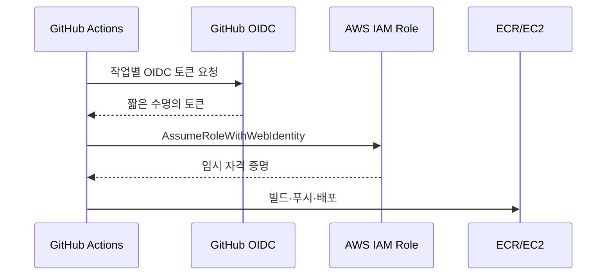

# 12주차 — 배포 자동화 (Git · GitHub Actions)

**클라우드 MLOps** · 연성대학교 · 230분 (10분 조기 종료)
NCS: `2001070308_19v1.2` 인공지능 선정모델 배포 관리하기 / `2001070401_20v1.2` 인공지능서비스 운영절차 수립하기(부분) / `2001070406_20v1.3` 인공지능서비스 운영장애 해결하기(부분)

---

## 0. 회차 요약 (강사용 1페이지)

| 항목 | 내용 |
|---|---|
| 학습목표 | 팀 저장소에 코드를 push하면 자동으로 테스트 → 이미지 빌드 → ECR 푸시 → EC2 재배포까지 진행되는 파이프라인을, 제공된 워크플로 템플릿의 빈칸을 채워 완성할 수 있다. |
| 오늘의 결과물 | ① 병합된 Pull Request 1건 ② 초록색 체크가 뜬 GitHub Actions 실행 로그 ③ 커밋 1회로 갱신된 API의 `/health` 응답 화면 |
| 사전 준비 | ① 팀별 GitHub 저장소 생성 및 학생 전원 Write 권한 부여 ② **GitHub OIDC용 IAM 역할(`mlops-2026-github-deploy`) 생성 및 신뢰정책 구성** ③ 각 팀 저장소 Secrets에 `AWS_DEPLOY_ROLE_ARN` 등록 ④ 배포 대상 EC2에 SSM 에이전트 동작 확인 + `AmazonSSMManagedInstanceCore`·`AmazonEC2ContainerRegistryReadOnly` 역할 부착 ⑤ EC2에 `/home/ubuntu/deploy.sh` 배포 스크립트 사전 배치 ⑥ 완성본 태그 `week-11-done` 준비 |
| 학생 준비물 | 노트북, GitHub 계정(2단계 인증 설정 완료), 7~8주차에 만든 FastAPI 컨테이너 코드, ECR 리포지토리 이름, 배포용 EC2 인스턴스 ID |
| 예상 사고 지점 | ① `git push` 시 GitHub 인증 실패(비밀번호 방식 폐지 → PAT/SSH 필요) ② YAML 들여쓰기 깨짐 ③ SSM Run Command가 `InvalidInstanceId`로 실패(에이전트 미동작 또는 IAM 역할 미부착) |

### 시간표

| 시간 | 구성 | 분 |
|---|---|---|
| 00:00–00:10 | 지난주 복습 + **오늘 만들 결과물 데모** | 10 |
| 00:10–00:55 | 이론 강의 — 수동 배포의 문제 / CI·CD / Git 최소 흐름 / Actions 구조 | 45 |
| 00:55–01:05 | 휴식 | 10 |
| 01:05–01:55 | **실습 A** — 팀 저장소 정리 · `.gitignore` · 브랜치 → PR 1회 | 50 |
| 01:55–02:05 | 휴식 | 10 |
| 02:05–03:30 | **실습 B** — 워크플로 템플릿 빈칸 채워 자동 배포 완성 | 85 |
| 03:30–03:45 | 체크포인트 제출 + 다음주 예고 | 15 |
| 03:45–03:50 | **리소스 정리 타임** | 5 |
| **합계** | | **230** |

---

## 1. 도입 (10분)

### 지난주 복습 퀴즈 (구두 3문항)

1. Bedrock을 호출할 때 우리가 실제로 코드에 쓴 boto3 클라이언트 이름은 무엇이었죠? — (`bedrock-runtime`. 모델 목록 조회용 `bedrock`과 다른 클라이언트입니다.)
2. LLM 응답이 매번 조금씩 달라지는 성질을 뭐라고 불렀습니까? 그리고 그게 서비스에서 왜 문제가 됩니까? — (비결정성. 같은 입력에 같은 출력을 보장할 수 없어서 테스트와 재현이 어렵습니다.)
3. 지난주까지 여러분이 서버에 새 코드를 반영할 때 밟은 순서를 말해보세요. — (로컬에서 `docker build` → `docker tag` → `ecr push` → EC2에 SSH 접속 → `docker pull` → `docker rm -f` → `docker run`. 손으로 7단계.)

> 세 번째 질문의 답을 칠판에 7단계로 적어두고, 오늘 수업 내내 지웁니다. 마지막에 남는 건 `git push` 한 줄입니다.

### 오늘 만들 것 데모 (강사 시연 절차)

1. 브라우저 창을 세 개 띄운다. ① 팀 데모 저장소의 GitHub Actions 탭 ② EC2 API의 `/health` 주소 ③ 코드 편집기.
2. `/health` 응답을 학생들에게 보여준다. `{"status":"ok","version":"v1"}` 이 나온다.
3. 편집기에서 `app/main.py`의 `VERSION = "v1"` 을 `VERSION = "v2"` 로 한 글자만 고친다.
4. 터미널에서 `git add . && git commit -m "bump version" && git push` 를 실행한다. **여기서 말한다** — "제가 서버에 접속했나요? 도커 명령을 쳤나요? 아무것도 안 했습니다."
5. Actions 탭을 새로고침한다. 노란 점이 돌기 시작한다. `test` → `build-and-deploy` 순서로 진행되는 것을 짚어준다.
6. 약 3분 뒤 초록 체크가 뜨면 `/health` 를 새로고침한다. `{"status":"ok","version":"v2"}`.
7. 마지막 한마디 — "오늘 여러분이 만들 것은 이 3분입니다. 그리고 이 3분을 만드는 데 여러분이 직접 쓸 YAML은 열 줄이 안 됩니다. 나머지는 제가 드릴 템플릿입니다."

---

## 2. 이론 (45분)

### 2-1. 수동 배포는 왜 반드시 사고가 나는가 (10분)

**강의 스크립트**

> 지난주까지 여러분은 코드를 고칠 때마다 일곱 단계를 손으로 밟았습니다. 빌드하고, 태그 붙이고, 푸시하고, SSH로 들어가서, 풀 받고, 컨테이너 죽이고, 다시 띄우고. 처음 두세 번은 재미있습니다. 열 번째부터는 귀찮고, 스무 번째에는 사고가 납니다.
>
> 왜 사고가 나는지 세 가지만 짚겠습니다.
>
> 첫째, **누락**입니다. `docker build`까지 하고 `docker push`를 빼먹습니다. 그러고 서버에서 `docker pull` 하면 어떻게 되죠? 에러가 안 납니다. 예전 이미지가 그대로 받아집니다. 서버는 멀쩡히 돌아가는데 내가 고친 코드는 반영이 안 된 상태. 이게 제일 무섭습니다. 아무도 모릅니다.
>
> 둘째, **실수**입니다. 태그를 `latest`로 붙여야 하는데 `lastest`라고 칩니다. 리전을 `ap-northeast-2`로 해야 하는데 콘솔이 버지니아로 열려 있어서 `us-east-1`에 올립니다. 사람은 하루에 서너 번 이런 오타를 냅니다. 저도 냅니다.
>
> 셋째, 이게 팀 프로젝트에서 진짜 문제인데요. **"누가 마지막에 뭘 올렸지?"** 입니다. 팀이 네 명이죠. A가 화요일에 모델을 바꿔 올렸고, B가 수요일에 전처리를 고쳐 올렸는데, B는 A의 코드를 안 받고 자기 노트북에서 빌드했습니다. 그러면 수요일 저녁 서버에는 A의 수정이 사라진 이미지가 올라갑니다. 로그도 없습니다. 흔적이 없어요. 한 주 뒤에 "어? 이거 고쳤는데 왜 안 되지?" 하고 다시 고칩니다.
>
> 여기서 질문 하나. **여러분 팀 서버에 지금 올라가 있는 이미지가 어느 시점 코드로 만들어진 건지, 지금 이 자리에서 증명할 수 있는 사람 손 들어보세요.** (…거의 없습니다.) 없죠. 그게 정상입니다. 손으로 배포하면 증명할 방법이 없어요.
>
> 자동화의 목적은 "편하려고"가 아닙니다. **배포를 사람의 기억력에서 떼어내서, 기록이 남는 기계의 절차로 만드는 것**입니다. 오늘 이후로 여러분 서버의 모든 이미지에는 그걸 만든 커밋 번호가 붙습니다. 문제가 생기면 "이 이미지는 3월 12일 커밋 `a1b2c3d`로 만들어졌다"고 1초 만에 답할 수 있습니다.

**판서/슬라이드 요점**
- 수동 배포 3대 실패: 단계 누락 / 오타·리전 실수 / 배포 주체·시점 추적 불가
- 가장 위험한 실패는 **에러 없이 조용히 예전 버전이 도는 것**
- 자동화 = 편의가 아니라 **기록과 재현**
- 이미지 태그에 커밋 해시(`github.sha`)를 박으면 "지금 도는 코드"가 특정된다
- NCS `2001070401_20v1.2` 운영절차 수립하기 — 배포 절차를 문서가 아니라 **실행 가능한 절차**로 고정하는 것

**학생 질문 예상 & 답변**
- Q: 그냥 셸 스크립트 하나 만들어서 쭉 실행하면 안 되나요? → A: 절반은 맞습니다. 스크립트는 누락과 오타를 없애줍니다. 하지만 "누가 언제 실행했는지"는 여전히 안 남고, 그 스크립트를 내 노트북에서 실행하는 한 내 노트북 상태에 따라 결과가 달라집니다. CI/CD는 그 스크립트를 **항상 깨끗한 남의 컴퓨터에서, 기록을 남기며** 실행해주는 것입니다.
- Q: `latest` 태그만 쓰면 편한데 왜 커밋 해시를 붙이나요? → A: `latest`는 "지금 최신"이라는 뜻일 뿐 어느 코드인지 알려주지 않습니다. 롤백할 때 돌아갈 주소가 없어집니다. 그래서 둘 다 붙입니다. 해시 태그는 되돌아갈 주소, `latest`는 편의용 별명입니다.

---

### 2-2. CI/CD — 지속적인 통합과 지속적인 배포 (12분)

**강의 스크립트**

> 오늘 배울 개념의 정식 이름을 먼저 붙이고 가겠습니다. **CI는 Continuous Integration, 우리말로 지속적인 통합**입니다. **CD는 Continuous Deployment 또는 Delivery, 지속적인 배포**입니다.
>
> 이 용어는 제가 만들어낸 말이 아닙니다. 여러분이 배우고 있는 국가직무능력표준, NCS의 `2001070406 인공지능서비스 운영장애관리` 학습모듈을 펴 보면 핵심 용어 목록에 **MLOps, AIOps, 오케스트레이션, 지속적인 통합, 지속적인 배포** 다섯 개가 나란히 적혀 있습니다. 즉 오늘 수업은 교수 취향이 아니라 국가 표준이 인공지능 서비스 운영자에게 요구하는 항목입니다. 이력서에 적어도 되는 내용이라는 뜻이에요.
>
> 그럼 "지속적인 통합"이 뭘 지속한다는 걸까요? **합치는 것**을 지속합니다. 팀이 네 명인데 각자 2주씩 따로 작업하다가 마지막 날 합치면 어떻게 되죠? 지옥이 열립니다. 충돌이 수백 줄 나고, 누구 코드가 맞는지 모릅니다. 그래서 **하루에 한 번씩 합칩니다.** 조금씩 자주 합치면 충돌도 조금씩만 납니다. 그리고 합칠 때마다 **자동으로 테스트를 돌려서** 합친 결과가 망가지지 않았는지 확인합니다. 이게 CI입니다.
>
> "지속적인 배포"는 통합이 끝난 코드를 **사람 손 안 거치고 서버까지 밀어 넣는 것**입니다.
>
> 우리 수업의 파이프라인은 네 단계입니다. 칠판을 보세요.
>
> **테스트 → 빌드 → 푸시 → 배포**
>
> 하나씩 보겠습니다. **테스트**는 "이 코드가 최소한 켜지기는 하는가"를 확인합니다. 여러분 프로젝트에서는 거창한 테스트 필요 없습니다. `/health`가 200을 주는지, 모델 파일이 로드되는지, 이 두 개면 충분합니다. **빌드**는 도커 이미지를 만드는 것, **푸시**는 그 이미지를 ECR에 올리는 것, **배포**는 EC2가 그 이미지를 받아서 컨테이너를 갈아 끼우는 것입니다.
>
> 중요한 규칙 하나. **앞 단계가 실패하면 뒤 단계는 실행되지 않습니다.** 테스트가 깨지면 빌드를 안 합니다. 빌드가 깨지면 배포를 안 합니다. 이게 자동화의 안전장치입니다. 망가진 코드가 서버까지 가는 걸 막아주는 문지기예요.
>
> 여기서 질문. **테스트를 아예 안 넣고 빌드부터 시작하면 안 될까요?** (…) 됩니다. 돌아갑니다. 그런데 그러면 문법 오류가 있는 코드도 그대로 서버에 올라가서 컨테이너가 죽습니다. 테스트 단계는 30초짜리 보험입니다.

**판서/슬라이드 요점**
- CI = 지속적인 통합 = 자주 합치고, 합칠 때마다 자동 검증
- CD = 지속적인 배포 = 검증 통과분을 사람 손 없이 서버까지
- 파이프라인 4단계: **테스트 → 빌드 → 푸시 → 배포** (앞이 실패하면 뒤는 중단)
- NCS 근거: `2001070406` 운영장애관리 학습모듈 핵심 용어에 MLOps · AIOps · 오케스트레이션 · 지속적인 통합 · 지속적인 배포 명시
- MLOps에서 CI/CD가 특별한 이유: 코드뿐 아니라 **모델 파일과 전처리기까지 같이 굳어져서** 나간다

**학생 질문 예상 & 답변**
- Q: CD의 D가 Deployment랑 Delivery 둘 다라던데 뭐가 맞나요? → A: Delivery는 "언제든 배포 가능한 상태까지 자동", 마지막 배포 버튼만 사람이 누릅니다. Deployment는 그 버튼까지 자동입니다. 우리 수업은 Deployment, 완전 자동입니다. 실무에서는 서비스 규모에 따라 마지막 승인을 사람이 남기는 경우가 많습니다.
- Q: 모델을 바꿔도 이 파이프라인이 도나요? → A: 모델 파일을 이미지에 넣었다면 그대로 돕니다. 모델을 S3에서 받아오는 구조라면 코드가 안 바뀌었으니 파이프라인이 안 돕니다. 그 경우엔 13주차에 배울 재학습 주기와 연결해서 수동 트리거(`workflow_dispatch`)로 돌립니다. 오늘 템플릿에 그 버튼이 들어 있습니다.

---

### 2-3. Git 최소 흐름 — clone → branch → commit → push → PR (13분)

**강의 스크립트**

> Git을 제대로 가르치려면 한 학기가 필요합니다. 오늘은 **다섯 개 동작만** 하겠습니다. 이 다섯 개로 팀 프로젝트 끝까지 갑니다.
>
> 먼저 개념 하나. Git은 "저장"이 아니라 **"스냅샷 사진첩"** 입니다. 저장 버튼을 누르면 파일이 덮어써지지만, 커밋을 하면 그 순간의 프로젝트 전체 사진이 사진첩에 한 장 추가됩니다. 이전 사진은 그대로 남아 있어요. 그래서 언제든 과거로 돌아갈 수 있습니다.
>
> **① `clone`** — 사진첩을 통째로 내 컴퓨터에 복사해 오는 것입니다. 팀 저장소를 각자 한 번씩만 합니다.
>
> **② `branch`** — 여기가 오늘의 핵심입니다. 브랜치는 **작업용 가지**입니다. 비유하자면 이렇습니다. 팀이 공동 보고서를 쓰는데, 원본 파일에 네 명이 동시에 타이핑하면 어떻게 되죠? 난장판이죠. 그래서 각자 사본을 뜹니다. `feature/add-logging` 같은 이름으로요. 자기 사본에서 실컷 고치고, 다 되면 원본에 합칩니다. 그 원본이 `main` 브랜치입니다.
>
> **규칙 하나만 외우세요. `main`에서 직접 작업하지 않는다.** 오늘부터 팀 저장소의 `main`은 "서버에 올라가 있는 것과 같은 코드"입니다. 여기가 깨지면 서비스가 죽습니다.
>
> **③ `commit`** — 사진을 한 장 찍는 것입니다. 찍을 때 반드시 메시지를 답니다. `"수정"`, `"ㅇㅇ"`, `"asdf"` 이런 메시지 쓰는 사람은 3주 뒤에 자기가 뭘 했는지 못 찾습니다. `"predict 응답에 확률값 추가"` 처럼 **무엇을 왜 바꿨는지** 씁니다. 한글로 쓰세요. 영어로 쓰다가 부실해지는 것보다 낫습니다.
>
> **④ `push`** — 내 컴퓨터 사진첩을 GitHub 서버 사진첩으로 밀어 올리는 것입니다. push를 안 하면 팀원 눈에는 아무것도 안 보입니다.
>
> **⑤ `PR`, Pull Request** — 우리말로 "합쳐주세요 요청"입니다. "제 가지에 있는 이 변경을 `main`에 합쳐도 될까요?" 하고 공식적으로 물어보는 겁니다. 그러면 GitHub 화면에 **뭐가 바뀌었는지 빨간 줄 초록 줄로** 보여줍니다. 팀원이 그걸 읽고 승인하면 합쳐집니다.
>
> PR이 왜 중요하냐면요. 아까 "누가 마지막에 뭘 올렸지?" 문제 기억하시죠. PR을 거치면 그 질문의 답이 저장소에 영구히 남습니다. **누가, 언제, 왜, 무엇을 바꿨고, 누가 승인했는지.** 그리고 오늘 만들 자동 배포는 이 PR이 `main`에 합쳐지는 순간 발동합니다.
>
> 마지막으로 겁주는 이야기 하나. **`.gitignore`** 라는 파일이 있습니다. "이건 사진첩에 넣지 마라"는 목록입니다. 여기에 반드시 넣어야 하는 것 — AWS 키가 든 `.env` 파일, 100MB 넘는 모델 파일, `__pycache__`, `.ipynb_checkpoints`. 특히 **AWS 액세스 키를 GitHub 공개 저장소에 올리면 몇 분 안에 봇이 긁어가서 남의 채굴기가 돌아갑니다.** 농담이 아니라 매년 실제로 발생합니다. 요금은 여러분 학과 계정으로 청구됩니다.

**판서/슬라이드 요점**
- Git = 저장이 아니라 **스냅샷 사진첩**
- 다섯 동작: `clone` → `branch` → `commit` → `push` → **PR**
- **`main`에서 직접 작업 금지.** `main` = 서버에 떠 있는 코드
- 커밋 메시지는 "무엇을 왜" (한글 권장)
- `.gitignore` 필수 항목: `.env` / 대용량 모델 / `__pycache__` / 자격증명 파일 — **키 유출은 실제로 돈이 나간다** ⚠

**학생 질문 예상 & 답변**
- Q: 브랜치 이름은 어떻게 짓나요? → A: `feature/기능이름`, `fix/버그이름` 정도면 충분합니다. 한글·공백·대문자는 피하세요. 예: `feature/cloudwatch-metric`.
- Q: 실수로 `.env`를 커밋했어요. 지우면 되나요? → A: 파일을 지우고 커밋해도 **과거 사진에는 남아 있습니다.** 정답은 두 가지입니다. ① 즉시 그 AWS 키를 콘솔에서 비활성화·삭제(가장 중요) ② 저장소가 공개였다면 새 저장소를 파는 게 빠릅니다. 오늘 실습 A에서 `.gitignore`를 제일 먼저 만드는 이유입니다.
- Q: 팀원 코드랑 충돌(conflict)이 났어요. → A: 충돌은 사고가 아니라 정상입니다. 같은 줄을 두 명이 고치면 Git이 "둘 중 뭐가 맞냐"고 묻는 것뿐입니다. `<<<<<<<`, `=======`, `>>>>>>>` 표시 사이에서 남길 쪽을 고르고 표시줄을 지운 뒤 다시 커밋하면 끝입니다. 순회하며 봐드립니다.

---

### 2-4. GitHub Actions의 구조 — 워크플로 · 잡 · 스텝 (10분)

**강의 스크립트**

> 이제 도구 이야기입니다. **GitHub Actions**는 GitHub이 제공하는 자동화 로봇입니다. 저장소 안에 `.github/workflows/` 폴더를 만들고 YAML 파일을 하나 넣으면, GitHub이 그걸 읽고 시키는 대로 합니다.
>
> 구조가 딱 3층입니다.
>
> **워크플로(Workflow)** — YAML 파일 하나가 워크플로 하나입니다. "언제 발동할지"를 맨 위 `on:` 에 씁니다. 우리는 `main`에 push될 때, 그리고 버튼을 눌렀을 때(`workflow_dispatch`) 발동하게 할 겁니다.
>
> **잡(Job)** — 워크플로 안의 큰 덩어리입니다. 우리는 두 개를 씁니다. `test` 잡과 `build-and-deploy` 잡. **잡은 기본적으로 동시에 실행됩니다.** 우리는 순서를 강제해야 하니까 `needs: test` 한 줄을 붙입니다. "test가 끝나야 나를 시작해라"는 뜻입니다.
>
> **스텝(Step)** — 잡 안의 한 줄 한 줄 명령입니다. 스텝은 두 종류입니다. `run:` 은 셸 명령을 그냥 치는 것이고, `uses:` 는 **남이 만들어둔 부품을 갖다 쓰는 것**입니다. 예를 들어 `uses: actions/checkout@v4` 는 "내 저장소 코드를 내려받기"인데, 이걸 직접 짜면 20줄입니다. 부품 하나로 끝냅니다.
>
> 그리고 이 로봇이 도는 컴퓨터를 **러너(Runner)** 라고 합니다. `runs-on: ubuntu-latest` 라고 쓰면 GitHub이 우분투 가상머신을 새로 하나 띄워서 거기서 돌리고, 끝나면 버립니다. 매번 **완전히 새 컴퓨터**입니다. "제 노트북에선 되는데요" 문제가 원천적으로 안 생기는 이유예요.
>
> 마지막으로 보안. 러너가 우리 AWS 계정을 만지려면 권한이 필요하죠. 옛날 방식은 액세스 키를 GitHub Secrets에 넣는 것이었는데, 요즘은 **OIDC**를 씁니다. OpenID Connect, 우리말로 하면 "신분증 확인 방식"입니다. GitHub이 "나는 연성대 MLOps 저장소의 워크플로다"라는 증명서를 발급하고, AWS가 그걸 확인한 뒤 **15분짜리 임시 권한**을 내줍니다. 영구 키가 어디에도 저장되지 않습니다.
>
> OIDC 공급자와 역할은 실제 GitHub 조직·저장소 이름이 정해진 뒤 만듭니다. 신뢰 정책의 `sub`를 `repo:조직/저장소:ref:refs/heads/main`으로 좁히지 않으면 다른 저장소나 브랜치가 역할을 요청할 수 있습니다. 강사가 미리 구성했다면 학생은 저장소 변수 `AWS_ROLE_ARN`만 확인하고, 구성하지 않았다면 부록 A의 순서대로 함께 만듭니다.
>
> 그리고 마지막 조각. 러너는 GitHub 안에 있는 컴퓨터인데, 어떻게 우리 EC2에 명령을 내릴까요? SSH로? 아닙니다. **SSM Run Command**를 씁니다. AWS Systems Manager의 기능인데, EC2 안에서 돌고 있는 SSM 에이전트에게 "이 명령 좀 실행해줘" 하고 AWS API로 시키는 겁니다. **22번 포트를 열 필요도, 키 파일을 GitHub에 넣을 필요도 없습니다.** 2주차에 학교망 SSH가 막혔을 때 썼던 그 Session Manager와 같은 집안입니다.

**판서/슬라이드 요점**
- 3층 구조: **워크플로(YAML 1개) > 잡(Job) > 스텝(Step)**
- `on:` 발동 조건 / `needs:` 실행 순서 / `runs-on:` 러너
- 스텝 두 종류: `run:` 직접 명령 / `uses:` 기성 부품
- 러너는 매번 **새 우분투 VM** → 환경 오염 없음
- 권한은 **OIDC 임시 자격증명**을 사용한다. 영구 액세스 키는 저장하지 않으며, 실제 저장소 이름으로 제한한 신뢰 정책이 준비되어 있어야 한다.
- 배포 명령 전달은 **SSM Run Command** — 포트 개방·키 파일 불필요

**학생 질문 예상 & 답변**
- Q: Actions 사용료가 나가나요? → A: 공개 저장소는 무료입니다. 비공개 저장소도 계정당 월 2,000분 무료라 우리 수업 분량으로는 초과하지 않습니다. 단 러너가 도는 시간이 곧 사용량이니, 실패한 워크플로를 계속 재실행하지는 마세요.
- Q: YAML 들여쓰기가 자꾸 틀립니다. → A: YAML은 **탭 문자를 금지**합니다. 공백만 씁니다. VS Code에서 우하단 `Spaces: 2`로 맞추고, 저장할 때 노란 물결이 뜨면 그 줄이 범인입니다. 오늘 실습에서 여러분이 건드릴 줄은 값뿐이라 들여쓰기를 새로 만들 일은 없습니다. **줄 전체를 지우고 다시 쓰지 마세요. 꺾쇠 부분만 지우고 값을 넣으세요.**

---

## 3. 실습 A — 팀 저장소 정리 · 브랜치 → PR 1회 경험 (50분) · 공통 예제 따라하기

**목표** 팀 저장소를 `main` 보호 상태로 정리하고, 브랜치를 파서 PR을 올려 병합하는 한 사이클을 전원이 손으로 완주한다.

**사전 배포 파일**
- `.gitignore` (아래 전문 그대로 배포)
- `tests/test_api.py` (실습 B에서 쓸 최소 테스트)
- 완성본 태그 `week-11-done`

### 수행 순서

**① Git 신원 설정 (전원 1회, 아직 안 한 사람만)**

```bash
git config --global user.name "<본인 이름 또는 GitHub 아이디>"
git config --global user.email "<GitHub에 등록한 이메일>"
git config --global init.defaultBranch main
git config --list | grep user
```

- 확인 포인트: `user.name`, `user.email` 두 줄이 출력되면 성공.

**② 팀 저장소 clone**

```bash
cd ~
git clone https://github.com/<조직 또는 팀 계정>/<팀 저장소 이름>.git
cd <팀 저장소 이름>
git status
```

- 확인 포인트: `On branch main` / `nothing to commit, working tree clean`
- ⚠ 여기서 비밀번호를 물어보고 실패하면 **③-보조**로 갑니다. GitHub은 비밀번호 인증을 폐지했습니다.

**③-보조 인증 실패 시 — Personal Access Token 발급 (5분)**

1. GitHub → 우측 상단 프로필 → **Settings** → 맨 아래 **Developer settings**
2. **Personal access tokens** → **Tokens (classic)** → **Generate new token (classic)**
3. Note에 `mlops-2026`, Expiration은 `90 days`, 권한은 **`repo` 체크박스 하나만** 켠다.
4. 생성된 `ghp_...` 문자열을 **메모장에 붙여넣어 둔다.** 이 화면을 벗어나면 다시 볼 수 없다.
5. 이후 `git push` 시 Password를 물으면 이 토큰을 붙여넣는다.

```bash
# 매번 붙여넣기 싫다면 (수업용 EC2에서만 사용, 개인 노트북에서는 비권장)
git config --global credential.helper "cache --timeout=28800"
```

**④ `.gitignore` 만들기 — 저장소 최상단에**

```bash
cat > .gitignore <<'EOF'
# --- 파이썬 ---
__pycache__/
*.py[cod]
*.egg-info/
.venv/
venv/
.ipynb_checkpoints/

# --- 비밀 정보 (절대 커밋 금지) ---
.env
.env.*
*.pem
*.key
credentials
aws_credentials.json

# --- 대용량 산출물 ---
*.pkl
*.joblib
*.h5
*.onnx
data/raw/
data/processed/
mlruns/
mlflow.db

# --- OS / 편집기 ---
.DS_Store
Thumbs.db
.vscode/
.idea/
EOF

cat .gitignore | head -5
```

- 확인 포인트: `git status` 를 쳤을 때 `.venv/`, `__pycache__/` 같은 것이 목록에서 사라져 있어야 한다.
- ⚠ 모델 파일(`*.pkl`)을 제외했습니다. **모델은 이미 S3에 있고, 이미지 빌드 시 S3에서 받거나 이미지에 굽습니다.** Git에 100MB 넘는 파일을 넣으면 push 자체가 거부됩니다.

**⑤ 이미 커밋된 비밀 파일 정리 (해당 팀만)**

```bash
# 추적 목록에서만 빼고 파일은 로컬에 남긴다
git rm --cached .env
git rm -r --cached __pycache__
git status
```

- 확인 포인트: `.env` 가 `deleted:` 로 표시되지만 `ls -a` 하면 파일은 그대로 있어야 한다.
- ⚠ **과거 커밋에 이미 AWS 키가 들어갔다면, 파일을 지우는 것으로 끝나지 않습니다. IAM 콘솔에서 그 액세스 키를 즉시 비활성화하고 강사에게 알리세요.**

**⑥ 브랜치를 파고 커밋**

```bash
git switch -c chore/add-gitignore
git add .gitignore
git commit -m "저장소 정리: .gitignore 추가 (비밀정보·대용량 파일 제외)"
git push -u origin chore/add-gitignore
```

- 확인 포인트: 터미널 마지막에 GitHub이 알려주는 PR 생성 링크(`https://github.com/.../pull/new/chore/add-gitignore`)가 뜬다.

**⑦ PR 올리고 팀원이 승인 → 병합**

1. 위 링크를 브라우저에서 연다. 또는 저장소 상단의 **Compare & pull request** 버튼.
2. 제목: `저장소 정리: .gitignore 추가` / 본문: 무엇을 왜 바꿨는지 두 줄.
3. 오른쪽 **Reviewers**에 팀원 1명을 지정한다.
4. **지정받은 팀원**은 **Files changed** 탭에서 초록 줄을 확인하고 **Review changes → Approve**.
5. 작성자가 **Merge pull request** → **Confirm merge** → **Delete branch**.

```bash
# 병합된 내용을 내 로컬로 가져오기
git switch main
git pull
ls -a | grep gitignore
```

- 확인 포인트: 로컬 `main`에 `.gitignore`가 들어와 있으면 한 사이클 완주.

**⑧ `main` 보호 규칙 켜기 (팀장 1명만, 3분)**

저장소 **Settings → Branches → Add branch ruleset** (또는 Add rule) → Branch name pattern `main`
- ✅ Require a pull request before merging
- ✅ Require approvals: 1

- 확인 포인트: 이제 `main`에 직접 push하면 거부된다. 일부러 한 번 해보고 거부 메시지를 확인한다.

### ⚠ 여기서 막히면

| 증상 | 원인 | 조치 |
|---|---|---|
| `remote: Support for password authentication was removed` | GitHub 비밀번호 인증 폐지 | ③-보조로 PAT 발급 후 Password 자리에 토큰 붙여넣기 |
| `fatal: not a git repository` | 저장소 폴더 밖에서 명령 실행 | `pwd`로 위치 확인 후 `cd <팀 저장소 이름>` |
| `error: failed to push some refs ... behind` | 팀원이 먼저 push함 | `git pull --rebase` 후 다시 `git push` |
| `remote: error: File model.pkl is 143.00 MB; exceeds 100.00 MB` | 대용량 파일 커밋됨 | `git rm --cached <파일>` → `.gitignore`에 추가 → 커밋. 이미 과거 커밋에 있으면 강사 호출(저장소 재생성이 빠름) |
| `.gitignore`를 넣었는데 여전히 `__pycache__`가 보임 | 이미 추적 중인 파일은 무시 규칙이 적용 안 됨 | `git rm -r --cached __pycache__` 후 커밋 |
| PR 화면에 `This branch has conflicts` | 같은 줄을 팀원과 동시 수정 | `git pull origin main` → 충돌 표시(`<<<<<<<`) 정리 → 커밋 → push |
| Merge 버튼이 회색 | `main` 보호 규칙의 승인 1건 미충족 | 팀원에게 Approve 요청 |

### 컷오프 안내

**50분 경과 시 강제 종료.** ⑧번까지 못 간 팀은 ⑧을 생략하고 실습 B로 진입합니다.
저장소 정리 자체가 안 된 학생은 강사 데모 저장소의 `week-11-done` 태그를 fork해서 실습 B를 진행하세요.

```bash
git clone --branch week-11-done https://github.com/<강사계정>/mlops-reference.git week11
```

---

## 4. 실습 B — 워크플로 템플릿 빈칸 채워 자동 배포 완성 (85분) · 팀이 직접 수행

**목표** 제공된 워크플로 YAML의 꺾쇠 부분만 팀 값으로 바꿔, `main`에 커밋 1회로 EC2 컨테이너가 교체되게 만든다.

**과제 지시문** (학생에게 그대로 읽어줍니다)

> 지금부터 나눠드리는 YAML 파일은 **이미 완성된 파일입니다.** 여러분이 할 일은 딱 세 가지 값을 넣는 것뿐입니다. 리전, ECR 리포지토리 이름, EC2 인스턴스 ID. 꺾쇠 `<...>`로 표시된 부분만 지우고 값을 넣으세요. **다른 줄은 한 글자도 건드리지 마세요. 특히 들여쓰기를 새로 치지 마세요.** 값을 다 넣었으면 브랜치를 파서 PR을 올리고, 병합하는 순간 자동 배포가 시작됩니다. 오늘의 성공 기준은 하나입니다. **Actions 탭에 초록색 체크가 뜨고, 브라우저에서 `/health`를 새로고침했을 때 여러분이 방금 바꾼 버전 문자열이 보이는 것.**

### 수행 항목

**① 팀 값 3개를 먼저 종이에 적는다 (5분)**

| 항목 | 확인 방법 | 우리 팀 값 |
|---|---|---|
| 리전 | 전 학기 고정 | `ap-northeast-2` |
| ECR 리포지토리 이름 | ECR 콘솔 → Repositories, 또는 `aws ecr describe-repositories --region ap-northeast-2 --query "repositories[].repositoryName" --output table` | |
| EC2 인스턴스 ID | EC2 콘솔 인스턴스 목록의 `i-`로 시작하는 값, 또는 `aws ec2 describe-instances --region ap-northeast-2 --filters "Name=tag:Team,Values=<팀번호>" --query "Reservations[].Instances[].[InstanceId,State.Name]" --output table` | |

**② 최소 테스트 파일 추가** — `tests/test_api.py`

```python
"""배포 전 최소 안전장치.
거창한 테스트가 목적이 아니다. '앱이 켜지기는 하는가'만 확인한다."""

from fastapi.testclient import TestClient

from app.main import app  # 팀 구조에 따라 import 경로만 맞춘다

client = TestClient(app)


def test_health_ok():
    """헬스체크가 200과 status=ok를 돌려주는가."""
    res = client.get("/health")
    assert res.status_code == 200
    assert res.json()["status"] == "ok"


def test_predict_returns_prediction():
    """예측 엔드포인트가 형식에 맞는 응답을 주는가.
    SAMPLE_PAYLOAD는 7주차에 Swagger에서 성공했던 요청 본문을 그대로 붙여넣는다."""
    sample_payload = {
        # <7주차 /predict 요청 예시 JSON을 여기에 붙여넣는다>
    }
    res = client.post("/predict", json=sample_payload)
    assert res.status_code == 200
    assert "prediction" in res.json()
```

```bash
# 로컬에서 먼저 통과하는지 확인 (여기서 실패하면 Actions에서도 실패한다)
pip install pytest httpx
pytest -q
```

**③ 워크플로 파일 생성** — `.github/workflows/deploy.yml`

```bash
mkdir -p .github/workflows
```

아래 전문을 `.github/workflows/deploy.yml` 로 저장합니다. **꺾쇠 `<...>` 세 곳만 바꿉니다.**

```yaml
name: deploy-mlops-api

# 언제 발동하는가
on:
  push:
    branches: [ main ]        # main에 병합되는 순간
  workflow_dispatch:          # Actions 탭에서 버튼으로 직접 실행

env:
  AWS_REGION: <리전 — ap-northeast-2 를 그대로 적는다>
  ECR_REPOSITORY: <ECR 리포지토리 이름 — 예: mlops-2026-t01-api. URI 전체가 아니라 이름만>
  EC2_INSTANCE_ID: <배포 대상 EC2 인스턴스 ID — i-로 시작하는 문자열>

jobs:

  # ---------- 1단계: 테스트 ----------
  test:
    runs-on: ubuntu-latest
    steps:
      - name: 소스 코드 내려받기
        uses: actions/checkout@v4

      - name: 파이썬 3.11 설치
        uses: actions/setup-python@v5
        with:
          python-version: "3.11"

      - name: 라이브러리 설치
        run: |
          python -m pip install --upgrade pip
          pip install -r requirements.txt
          pip install pytest httpx

      - name: 테스트 실행
        run: pytest -q

  # ---------- 2~4단계: 빌드 → ECR 푸시 → EC2 재배포 ----------
  build-and-deploy:
    needs: test                 # test가 성공해야만 시작
    runs-on: ubuntu-latest
    permissions:
      id-token: write           # OIDC 토큰 발급에 필요
      contents: read
    steps:
      - name: 소스 코드 내려받기
        uses: actions/checkout@v4

      - name: AWS 임시 자격증명 받기 (OIDC)
        uses: aws-actions/configure-aws-credentials@v4
        with:
          role-to-assume: ${{ secrets.AWS_DEPLOY_ROLE_ARN }}   # 강사가 사전 등록함
          aws-region: ${{ env.AWS_REGION }}

      - name: ECR 로그인
        id: login-ecr
        uses: aws-actions/amazon-ecr-login@v2

      - name: 이미지 빌드 & ECR 푸시
        env:
          REGISTRY: ${{ steps.login-ecr.outputs.registry }}
        run: |
          set -e
          IMAGE_URI="$REGISTRY/${ECR_REPOSITORY}:${GITHUB_SHA}"
          LATEST_URI="$REGISTRY/${ECR_REPOSITORY}:latest"

          docker build -t "$IMAGE_URI" .
          docker push "$IMAGE_URI"

          docker tag "$IMAGE_URI" "$LATEST_URI"
          docker push "$LATEST_URI"

          echo "IMAGE_URI=$IMAGE_URI" >> "$GITHUB_ENV"
          echo "빌드된 이미지: $IMAGE_URI"

      - name: 배포 명령 파일 만들기
        run: |
          cat > ssm-params.json <<EOF
          {
            "commands": [
              "bash /home/ubuntu/deploy.sh ${IMAGE_URI}"
            ]
          }
          EOF
          cat ssm-params.json

      - name: EC2 재배포 (SSM Run Command)
        run: |
          set -e
          COMMAND_ID=$(aws ssm send-command \
            --region "$AWS_REGION" \
            --instance-ids "$EC2_INSTANCE_ID" \
            --document-name "AWS-RunShellScript" \
            --comment "deploy ${GITHUB_SHA}" \
            --parameters file://ssm-params.json \
            --query "Command.CommandId" --output text)
          echo "SSM CommandId = $COMMAND_ID"

          aws ssm wait command-executed \
            --region "$AWS_REGION" \
            --command-id "$COMMAND_ID" \
            --instance-id "$EC2_INSTANCE_ID" || true

          echo "----- 서버 출력 -----"
          aws ssm get-command-invocation \
            --region "$AWS_REGION" \
            --command-id "$COMMAND_ID" \
            --instance-id "$EC2_INSTANCE_ID" \
            --query "StandardOutputContent" --output text

          echo "----- 서버 오류 -----"
          aws ssm get-command-invocation \
            --region "$AWS_REGION" \
            --command-id "$COMMAND_ID" \
            --instance-id "$EC2_INSTANCE_ID" \
            --query "StandardErrorContent" --output text

          STATUS=$(aws ssm get-command-invocation \
            --region "$AWS_REGION" \
            --command-id "$COMMAND_ID" \
            --instance-id "$EC2_INSTANCE_ID" \
            --query "Status" --output text)
          echo "배포 상태: $STATUS"
          test "$STATUS" = "Success"
```

> **채워야 할 빈칸은 위 파일에서 `<...>` 세 곳이 전부입니다.**
> `${{ secrets.AWS_DEPLOY_ROLE_ARN }}` 는 강사가 저장소 Secrets에 이미 등록해 두었으니 그대로 둡니다.

**④ EC2에 놓인 배포 스크립트 확인** — `/home/ubuntu/deploy.sh` (강사 사전 배치, 읽고 이해만)

```bash
#!/usr/bin/env bash
# GitHub Actions가 SSM으로 이 스크립트를 호출한다.
# 인자 1개: 방금 ECR에 올라간 이미지 URI
set -euo pipefail

IMAGE_URI="$1"
REGION="ap-northeast-2"
REGISTRY="$(echo "$IMAGE_URI" | cut -d/ -f1)"
CONTAINER_NAME="mlops-api"
HOST_PORT=8000
CONTAINER_PORT=8000

echo "[1/5] ECR 로그인"
aws ecr get-login-password --region "$REGION" \
  | docker login --username AWS --password-stdin "$REGISTRY"

echo "[2/5] 새 이미지 내려받기: $IMAGE_URI"
docker pull "$IMAGE_URI"

echo "[3/5] 기존 컨테이너 정리"
docker rm -f "$CONTAINER_NAME" 2>/dev/null || true

echo "[4/5] 새 컨테이너 기동"
docker run -d \
  --name "$CONTAINER_NAME" \
  --restart unless-stopped \
  -p "${HOST_PORT}:${CONTAINER_PORT}" \
  "$IMAGE_URI"

echo "[5/5] 헬스체크"
for i in $(seq 1 10); do
  if curl -fsS "http://localhost:${HOST_PORT}/health"; then
    echo ""
    echo "배포 성공: $IMAGE_URI"
    docker image prune -f >/dev/null 2>&1 || true
    exit 0
  fi
  echo "  대기 ${i}/10 ..."
  sleep 3
done

echo "헬스체크 실패. 컨테이너 로그:"
docker logs --tail 50 "$CONTAINER_NAME"
exit 1
```

- 확인 포인트: EC2에 접속해 `ls -l /home/ubuntu/deploy.sh` 로 파일 존재와 실행 권한(`-rwxr-xr-x`)을 확인한다. 없으면 강사 호출.

**⑤ 브랜치 → PR → 병합 → 자동 배포 관찰**

```bash
git switch -c feature/cicd
git add .github/workflows/deploy.yml tests/test_api.py
git commit -m "CI/CD 파이프라인 추가: 테스트→빌드→ECR→EC2 재배포"
git push -u origin feature/cicd
```

PR 생성 → 팀원 Approve → **Merge**.
저장소 상단 **Actions** 탭을 열고 실행을 지켜봅니다. `test` 잡이 초록으로 끝나고 `build-and-deploy`가 시작되는지 확인합니다.

**⑥ "커밋 1회로 배포된다"를 증명하기 (오늘의 핵심 제출물)**

```bash
git switch main
git pull
```

`app/main.py` 의 버전 문자열을 한 글자 바꿉니다.

```python
VERSION = "v11-<팀번호>-<본인 학번 뒤 4자리>"   # 예: v11-T01-3042
```

```bash
git switch -c feature/bump-version
git add app/main.py
git commit -m "버전 문자열 갱신 (자동 배포 확인용)"
git push -u origin feature/bump-version
```

PR → Approve → Merge. 그리고 **아무것도 하지 않고 기다립니다.**

```bash
# 3분쯤 뒤, 본인 노트북에서
curl http://<팀 EC2 퍼블릭 IP>:8000/health
```

- 확인 포인트: 응답에 방금 넣은 `v11-T01-3042` 가 보이면 완료. **이 화면이 오늘의 체크포인트입니다.**

**⑦ (여유 있는 팀) 실패를 일부러 만들어보기**

`tests/test_api.py` 의 `assert res.status_code == 200` 을 `== 999` 로 바꿔 PR을 올려보세요.
`test` 잡이 빨간 X로 끝나고 **`build-and-deploy`가 아예 시작되지 않는 것**을 확인합니다. 이것이 문지기가 작동하는 모습입니다. 확인 후 되돌리세요.

### 팀 프로젝트 연결

- 이 회차 실습 B의 산출물 `.github/workflows/deploy.yml` 은 **최종 산출물 루브릭의 "배포·운영 5점" 중 배포 자동화 항목 그 자체**입니다.
- 13주차부터 여러분은 코드를 고칠 때마다 SSH로 들어가지 않습니다. **14주차 통합 작업 속도가 여기서 갈립니다.** 파이프라인이 없는 팀은 14주차에 통합할 때마다 7단계를 손으로 밟아야 합니다.
- 커밋 이력이 곧 **팀 기여도 증빙**입니다(교육계획서 11장 "팀 무임승차 대응"). 오늘부터 각자 본인 이름으로 커밋하세요.

### 순회 지도 포인트

1. **꺾쇠 이외의 줄을 건드렸는지.** YAML 오류 대부분은 학생이 들여쓰기를 다시 친 경우입니다. `git diff`로 변경 줄 수를 봅니다. 3줄 넘게 바뀌었으면 의심합니다.
2. **ECR 리포지토리 "이름"과 "URI"를 혼동했는지.** `123456789012.dkr.ecr.ap-northeast-2.amazonaws.com/mlops-t01` 전체를 넣은 팀이 반드시 나옵니다. 필요한 건 `mlops-t01` 뿐입니다.
3. **PR을 실제로 각자 한 번씩 올렸는지.** 팀장 한 명이 전부 하고 나머지는 구경만 하는 팀을 잡아냅니다. 학생별로 최소 1커밋을 확인합니다.

---

## 5. 체크포인트 (제출물)

| # | 제출물 | 형식 | 배점 |
|---|---|---|---|
| 1 | 병합 완료된 Pull Request 화면 (제목·리뷰어 승인 표시 포함) | URL | 0.5 |
| 2 | GitHub Actions 실행 성공 화면 (`test` → `build-and-deploy` 둘 다 초록) | 스크린샷 | 0.5 |
| 3 | Actions 로그 중 **`배포 상태: Success`** 와 서버 출력(`배포 성공: ...`)이 보이는 부분 | 스크린샷 | 0.5 |
| 4 | 커밋 후 갱신된 `/health` 응답 (본인 학번 뒤 4자리가 버전에 포함) | 스크린샷 | 0.5 |
| **합계** | | | **2** |

### 평가 기준 (NCS 수행준거 연계)

- **`2001070308_19v1.2` 인공지능 선정모델 배포 관리하기**
  - 선정한 모델(컨테이너 이미지)의 배포 절차를 정의하고, **동일한 절차가 반복 실행되어 같은 결과를 내는지** 확인했는가 → Actions 워크플로가 2회 이상 동일 성공했는가로 판정
  - 배포된 산출물의 **버전을 식별**할 수 있는가 → 이미지 태그에 커밋 해시(`GITHUB_SHA`)가 부여되고, 서버 응답으로 버전이 확인되는가
  - 배포 전 **사전 검증 절차**를 수행했는가 → `test` 잡 통과가 배포의 선행 조건으로 구성되었는가
- **`2001070401_20v1.2` 인공지능서비스 운영절차 수립하기(부분)**
  - 서비스 반영 절차를 문서가 아닌 **실행 가능한 형태로 표준화**했는가 → `deploy.yml` + `deploy.sh` 존재 및 동작
  - 절차 수행 이력이 **추적 가능하게 기록**되는가 → PR 이력 + Actions 실행 이력
- **`2001070406_20v1.3` 인공지능서비스 운영장애 해결하기(부분)**
  - 배포 실패 시 **원인을 로그에서 식별**할 수 있는가 → SSM `StandardErrorContent` / `docker logs` 출력을 근거로 원인을 서술
  - 장애 시 **직전 정상 버전으로 되돌릴 수 있는가** → 과거 커밋 해시 태그로 롤백 절차를 설명(부록 A 참조)

---

## 6. 정리 & 다음 주 예고 (15분)

**오늘 배운 것 3줄 요약**
1. 수동 배포는 누락·오타·추적 불가라는 세 가지 사고를 반드시 만든다. 자동화의 목적은 편의가 아니라 **기록과 재현**이다.
2. CI/CD 파이프라인은 **테스트 → 빌드 → 푸시 → 배포** 4단계이고, 앞 단계가 실패하면 뒤 단계는 실행되지 않는다.
3. GitHub Actions는 워크플로 > 잡 > 스텝의 3층 구조이며, AWS 권한은 OIDC 임시 자격증명으로, EC2 명령 전달은 SSM Run Command로 처리한다.

**다음 주 미리보기**
> 다음 주에는 여러분의 서비스가 **지금 살아 있는지, 얼마나 빨리 응답하는지, 몇 번이나 틀렸는지**를 눈으로 보는 대시보드를 만들고, 에러율이 튀면 여러분 메일로 알람이 오게 합니다. 그리고 조금 무서운 이야기를 하나 하겠습니다. **여러분 모델은 오늘부터 조금씩 나빠집니다.**

**리소스 정리 타임 체크 항목**
- [ ] 배포용 EC2 인스턴스 — **오늘은 중지하지 않습니다.** 다음 주 CloudWatch 실습에서 그대로 씁니다. 대신 팀당 1대인지 확인하고 **중복 생성된 인스턴스는 종료**합니다.
- [ ] 실습 중 만든 테스트용 EC2가 있으면 종료(Terminate)
- [ ] ECR에 쌓인 이미지 개수 확인 — 커밋마다 이미지가 쌓입니다. 10개 넘으면 오래된 것 삭제
- [ ] `.env`, `*.pem` 파일이 저장소에 올라가지 않았는지 GitHub 웹에서 최종 확인
- [ ] Actions 실행이 실패 상태로 반복 재시도되고 있지 않은지 확인(러너 시간 낭비)

```bash
# ECR 이미지 정리 (오래된 태그 확인)
aws ecr describe-images --region ap-northeast-2 \
  --repository-name <ECR 리포지토리 이름> \
  --query "sort_by(imageDetails,&imagePushedAt)[].[imageTags[0],imagePushedAt]" \
  --output table

# 특정 태그 삭제
aws ecr batch-delete-image --region ap-northeast-2 \
  --repository-name <ECR 리포지토리 이름> \
  --image-ids imageTag=<지울 태그>
```

---

## 7. 과제

1. **(개인·필수)** 본인 이름으로 된 커밋이 팀 저장소 `main` 이력에 **최소 1건** 남아 있게 한다. 다음 주 수업 시작 시 `git log --oneline --author="<본인>"` 결과를 확인한다.
2. **(팀·필수)** 팀 저장소 `README.md` 에 아래 세 항목을 추가한다.
   - 배포 방법: "`main`에 PR을 병합하면 자동 배포된다" 한 문장
   - 배포 대상: EC2 인스턴스 ID, ECR 리포지토리 이름, 서비스 주소
   - 롤백 방법: 과거 이미지 태그로 되돌리는 명령 3줄 (부록 A 참고)
3. **(개인·선택, 가산 0.5점)** 워크플로에 `on: pull_request` 를 추가해서 **PR을 올린 시점에 테스트만 먼저 도는** 구성을 만들어 본다. 병합 전에 빨간 X를 볼 수 있게 된다.

```yaml
# 힌트 — on: 블록만 이렇게 바꾼다
on:
  push:
    branches: [ main ]
  pull_request:
    branches: [ main ]
  workflow_dispatch:
```
> 단, 이렇게 하면 PR 시점에도 `build-and-deploy`가 돌 수 있으므로 그 잡에 조건을 붙여야 한다.
> `if: github.event_name != 'pull_request'` 를 `build-and-deploy:` 바로 아래 줄에 추가한다.

---

## 부록 A. 명령어 치트시트 (1페이지 배포본)

### Git 5동작

```bash
git clone <저장소 URL>                     # 사진첩 복사
git switch -c feature/<작업이름>            # 새 가지 만들고 이동
git switch main                            # main으로 이동
git pull                                   # 원격 최신 내용 받기
git status                                 # 지금 상태 확인 (제일 자주 씀)
git add <파일>                             # 사진에 담을 것 고르기
git add .                                  # 전부 담기 (.gitignore 제외분은 자동 제외)
git commit -m "무엇을 왜 바꿨는지"          # 사진 찍기
git push -u origin feature/<작업이름>       # GitHub으로 올리기
git log --oneline -10                      # 최근 커밋 10개
git diff                                   # 아직 안 담은 변경 보기
```

### 사고 복구

```bash
git restore <파일>                         # 수정 취소 (커밋 전)
git restore --staged <파일>                # add 취소
git rm --cached <파일>                     # 추적만 해제 (파일은 남김)
git pull --rebase                          # push 거부됐을 때
git commit --amend -m "새 메시지"           # 방금 커밋 메시지 수정 (push 전에만)
```

### AWS 확인 명령

```bash
# 내 ECR 리포지토리 이름 목록
aws ecr describe-repositories --region ap-northeast-2 \
  --query "repositories[].repositoryName" --output table

# 내 팀 EC2 인스턴스 ID
aws ec2 describe-instances --region ap-northeast-2 \
  --filters "Name=tag:Team,Values=<팀번호>" \
  --query "Reservations[].Instances[].[InstanceId,State.Name,PublicIpAddress]" \
  --output table

# SSM 에이전트가 살아 있는 인스턴스 목록 (여기 없으면 배포 안 됨)
aws ssm describe-instance-information --region ap-northeast-2 \
  --query "InstanceInformationList[].[InstanceId,PingStatus,PlatformName]" \
  --output table
```

### 롤백 (직전 정상 버전으로 되돌리기)

```bash
# 1) 되돌아갈 이미지 태그(커밋 해시) 찾기
aws ecr describe-images --region ap-northeast-2 \
  --repository-name <ECR 리포지토리 이름> \
  --query "sort_by(imageDetails,&imagePushedAt)[-5:].[imageTags[0],imagePushedAt]" \
  --output table

# 2) EC2에서 직접 되돌리기 (급할 때)
bash /home/ubuntu/deploy.sh <계정ID>.dkr.ecr.ap-northeast-2.amazonaws.com/<리포지토리>:<과거 태그>

# 3) 정석: 문제 커밋을 되돌리는 커밋을 만들어 다시 자동 배포
git revert <문제 커밋 해시>
git push
```

### 강사 사전 구성 참고 — OIDC 신뢰 정책 (학생이 손댈 필요 없음)

```json
{
  "Version": "2012-10-17",
  "Statement": [
    {
      "Effect": "Allow",
      "Principal": { "Federated": "arn:aws:iam::<계정ID>:oidc-provider/token.actions.githubusercontent.com" },
      "Action": "sts:AssumeRoleWithWebIdentity",
      "Condition": {
        "StringEquals": { "token.actions.githubusercontent.com:aud": "sts.amazonaws.com" },
        "StringLike": { "token.actions.githubusercontent.com:sub": "repo:<조직>/<저장소>:*" }
      }
    }
  ]
}
```
> 이 역할에 붙는 권한: ECR 푸시(`AmazonEC2ContainerRegistryPowerUser`) + SSM `ssm:SendCommand`, `ssm:GetCommandInvocation` (대상 인스턴스로 제한).

---

## 부록 B. 용어 정리

| 용어 | 뜻 | 한 줄 설명 |
|---|---|---|
| CI (지속적인 통합) | Continuous Integration | 코드를 자주 합치고, 합칠 때마다 자동으로 테스트를 돌리는 것 |
| CD (지속적인 배포) | Continuous Deployment/Delivery | 검증을 통과한 코드를 사람 손 없이 서버까지 반영하는 것 |
| 파이프라인 | pipeline | 테스트 → 빌드 → 푸시 → 배포로 이어지는 자동 처리 사슬 |
| 오케스트레이션 | orchestration | 여러 단계·여러 컨테이너의 실행 순서와 상태를 자동으로 지휘하는 것 |
| 브랜치 | branch | 원본을 건드리지 않고 따로 작업하는 가지. `main`은 서버에 떠 있는 코드 |
| 커밋 | commit | 그 순간 프로젝트 전체의 스냅샷 한 장 |
| PR (Pull Request) | 합쳐주세요 요청 | 내 브랜치 변경을 `main`에 합쳐도 되는지 공식 요청하고 리뷰받는 절차 |
| 워크플로 | workflow | `.github/workflows/*.yml` 파일 하나. 자동화 시나리오 한 벌 |
| 잡 / 스텝 | job / step | 워크플로의 큰 덩어리 / 그 안의 명령 한 줄 |
| 러너 | runner | 워크플로가 실제로 도는 임시 가상 컴퓨터. 매번 새것 |
| 시크릿 | secret | 저장소에 암호화 저장되는 값. 로그에 자동으로 가려져 출력됨 |
| OIDC | OpenID Connect | 영구 키 없이 신분 증명으로 15분짜리 임시 AWS 권한을 받는 방식 |
| SSM Run Command | AWS Systems Manager 기능 | 포트 개방·키 파일 없이 EC2 안에서 명령을 실행시키는 AWS API |
| `GITHUB_SHA` | 커밋 해시 | 지금 워크플로를 발동시킨 커밋의 고유 번호. 이미지 태그로 쓴다 |
| 롤백 | rollback | 직전 정상 버전으로 되돌리는 것. 태그가 있어야 가능하다 |

---

## 부록. AWS 화면과 공식 문서

- IAM 콘솔: <https://console.aws.amazon.com/iam/>
- 이동 경로: **IAM → Identity providers → GitHub OIDC**, **IAM → Roles → 배포 역할**
- 화면에서 확인: 공급자 URL, audience, 저장소·브랜치 조건, 최소 권한 정책
- AWS 공식 문서: <https://docs.aws.amazon.com/IAM/latest/UserGuide/id_roles_create_for-idp_oidc.html>
- 공식 Action: <https://github.com/aws-actions/configure-aws-credentials>



---

## 실제 AWS 콘솔 화면 실습 가이드

### 01. ECR 배포 저장소


- 콘솔 경로: **Amazon ECR → Private registry → Repositories**
- 확인할 것: 저장소 URI, 태그 변경 불가능, 암호화 유형을 확인한다.
- [AWS 콘솔 열기](https://ap-northeast-2.console.aws.amazon.com/ecr/private-registry/repositories?region=ap-northeast-2)

### 02. 배포 전 이미지 버전


- 콘솔 경로: **Amazon ECR → ysu-mlops-api → Images**
- 확인할 것: 1.0·1.1·1.2 태그와 각 이미지 다이제스트를 확인한다.
- [AWS ECR 리포지토리 목록 열기](https://ap-northeast-2.console.aws.amazon.com/ecr/private-registry/repositories?region=ap-northeast-2)

### 03. CI 릴리스 태그 생성


- 콘솔 경로: **CloudShell → ecr put-image·describe-images**
- 확인할 것: ci-demo-20260824 태그가 1.2와 같은 다이제스트를 가리키는지 확인한다.
- [AWS 콘솔 열기](https://ap-northeast-2.console.aws.amazon.com/cloudshell/home?region=ap-northeast-2)

### 04. 콘솔에서 릴리스 태그 확인


- 콘솔 경로: **Amazon ECR → ysu-mlops-api → Images**
- 확인할 것: ci-demo-20260824와 1.2가 한 이미지 행에 함께 표시되는지 확인한다.
- [AWS ECR 리포지토리 목록 열기](https://ap-northeast-2.console.aws.amazon.com/ecr/private-registry/repositories?region=ap-northeast-2)

### 05. IAM ID 공급자 현재 상태


- 콘솔 경로: **IAM → Identity providers**
- 확인할 것: 현재 계정에는 GitHub OIDC 공급자가 없음을 확인한다.
- [AWS 콘솔 열기](https://us-east-1.console.aws.amazon.com/iam/home#/identity_providers)

### 06. ID 공급자 추가 화면


- 콘솔 경로: **IAM → Identity providers → Add provider**
- 확인할 것: SAML과 OpenID Connect의 차이를 확인한다.
- [AWS 콘솔 열기](https://us-east-1.console.aws.amazon.com/iam/home#/identity_providers)

### 07. GitHub OIDC 입력값


- 콘솔 경로: **IAM → Add identity provider → OpenID Connect**
- 확인할 것: URL은 token.actions.githubusercontent.com, 대상은 sts.amazonaws.com이다.
- [AWS 콘솔 열기](https://us-east-1.console.aws.amazon.com/iam/home#/identity_providers)

### 08. GitHub OIDC 공식 문서


- 콘솔 경로: **GitHub Docs → Actions → Security harden deployments → OIDC in AWS**
- 확인할 것: 장기 AWS 키 없이 OIDC 토큰으로 인증한다는 설명을 확인한다.
- [공식 문서 열기](https://docs.github.com/en/actions/how-tos/secure-your-work/security-harden-deployments/oidc-in-aws)

### 09. GitHub OIDC 한국어 문서


- 콘솔 경로: **GitHub 문서 → AWS의 OIDC → 역할 및 신뢰 정책 구성**
- 확인할 것: aud와 sub 조건으로 대상 저장소·브랜치를 제한하는 예를 확인한다.
- [공식 문서 열기](https://docs.github.com/ko/actions/how-tos/secure-your-work/security-harden-deployments/oidc-in-aws)

### 10. 워크플로 OIDC 예제


- 콘솔 경로: **GitHub 문서 → 워크플로 업데이트 → 사용 권한 설정 추가**
- 확인할 것: permissions의 id-token write와 contents read를 확인한다.
- [공식 문서 열기](https://docs.github.com/ko/actions/how-tos/secure-your-work/security-harden-deployments/oidc-in-aws#워크플로를-업데이트하기-github-actions)

### 11. 배포 대상 EC2 시작


- 콘솔 경로: **EC2 → Instances → ysu-mlops-lab-ec2 → Start instance**
- 확인할 것: stopped에서 pending으로 바뀌는지 확인한다.
- [AWS 콘솔 열기](https://ap-northeast-2.console.aws.amazon.com/ec2/home?region=ap-northeast-2#Instances:instanceId=i-09e3f0c913e337111)

### 12. 배포 대상과 SSM 연결 확인


- 콘솔 경로: **Systems Manager → Fleet Manager → Managed nodes**
- 확인할 것: 인스턴스 running, SSM PingStatus Online을 확인한다.
- [AWS 콘솔 열기](https://ap-northeast-2.console.aws.amazon.com/systems-manager/managed-instances?region=ap-northeast-2)

### 13. 자동 배포 명령 제출


- 콘솔 경로: **Systems Manager → Run Command → AWS-RunShellScript**
- 확인할 것: 배포 명령 ID를 기록하고 대상 인스턴스를 확인한다.
- [AWS 콘솔 열기](https://ap-northeast-2.console.aws.amazon.com/systems-manager/run-command?region=ap-northeast-2)

### 14. 배포와 스모크 테스트 성공


- 콘솔 경로: **CloudShell → ssm get-command-invocation**
- 확인할 것: ECR 로그인, 이미지 pull, ping HTTP 200, 예측 JSON을 확인한다.
- [AWS 콘솔 열기](https://ap-northeast-2.console.aws.amazon.com/cloudshell/home?region=ap-northeast-2)

### 15. Run Command 성공 요약


- 콘솔 경로: **Systems Manager → Run Command → d6502f2b 명령**
- 확인할 것: 전체 상태 성공, 대상 1개, 오류 0개를 확인한다.
- [AWS 콘솔 열기](https://ap-northeast-2.console.aws.amazon.com/systems-manager/run-command/d6502f2b-496e-43c7-9ce8-14926dec8975?region=ap-northeast-2)

### 16. 배포 명령 상세 출력


- 콘솔 경로: **Systems Manager → Run Command → 대상 인스턴스 → Output**
- 확인할 것: 실제 배포 태그, 다이제스트, healthy 응답을 한 화면에서 확인한다.
- [AWS 콘솔 열기](https://ap-northeast-2.console.aws.amazon.com/systems-manager/run-command/d6502f2b-496e-43c7-9ce8-14926dec8975/i-09e3f0c913e337111?region=ap-northeast-2)

### 17. 버전 전환과 롤백


- 콘솔 경로: **Systems Manager → Run Command → 버전 전환 명령 출력**
- 확인할 것: 1.1 배포 뒤 ci-demo-20260824로 되돌아가고 model_version 1.2가 표시되는지 확인한다.
- [AWS 콘솔 열기](https://ap-northeast-2.console.aws.amazon.com/systems-manager/run-command?region=ap-northeast-2)

### 18. 실습 컨테이너 정리


- 콘솔 경로: **Systems Manager → Run Command → 정리 명령 출력**
- 확인할 것: ysu-ci-demo가 삭제되고 실행 중 컨테이너 목록이 비었는지 확인한다.
- [AWS 콘솔 열기](https://ap-northeast-2.console.aws.amazon.com/systems-manager/run-command?region=ap-northeast-2)

### 19. 배포 대상 중지 요청


- 콘솔 경로: **EC2 → Instances → Instance state → Stop instance**
- 확인할 것: running에서 stopping으로 바뀌는지 확인한다.
- [AWS 콘솔 열기](https://ap-northeast-2.console.aws.amazon.com/ec2/home?region=ap-northeast-2#Instances:instanceId=i-09e3f0c913e337111)

### 20. 배포 대상 중지 완료


- 콘솔 경로: **EC2 → Instances → ysu-mlops-lab-ec2**
- 확인할 것: 상태가 stopped인지 확인하고 실습을 마친다.
- [AWS 콘솔 열기](https://ap-northeast-2.console.aws.amazon.com/ec2/home?region=ap-northeast-2#Instances:instanceId=i-09e3f0c913e337111)

> 실제 검증 결과: 릴리스 태그 `ci-demo-20260824`를 배포해 `/ping` HTTP 200과 `model_version` 1.2 응답을 확인했다. 1.1로 전환한 뒤 다시 릴리스 태그로 롤백하는 과정도 성공했다. OIDC 공급자와 역할은 GitHub 저장소가 정해지지 않은 상태에서 과도한 신뢰를 만들지 않도록 생성 버튼을 누르지 않았다. 수업용 워크플로는 `개정본/실습/week12/.github/workflows/deploy.yml`에 제공한다.
