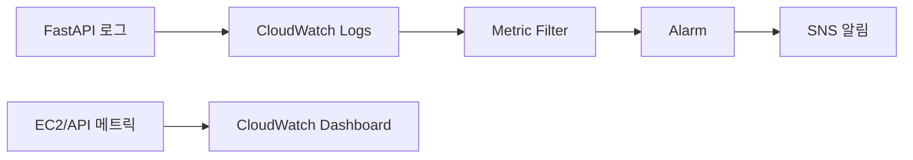

# 13주차 — 모니터링과 운영 (🏁 M3 파이프라인 완성)

**클라우드 MLOps** · 연성대학교 · 230분 (10분 조기 종료)
NCS: `2001070404_20v1.1` 인공지능서비스 운영 자원 점검하기 / `2001070404_20v1.2` 인공지능서비스 운영 인터페이스 점검하기 / `2001070404_20v1.3` 인공지능서비스 운영 성능 모니터링하기 / `2001070404_20v1.4` 인공지능서비스 운영모니터링 결과 관리하기 / `2001070405_20v1.1` 인공지능서비스 운영품질지표 구성하기 / `2001070308_19v1.3` 인공지능 선정모델 성능 관리하기 / `2001070406_20v1.1` 인공지능서비스 운영장애 접수하기(부분)

---

## 0. 회차 요약 (강사용 1페이지)

| 항목 | 내용 |
|---|---|
| 학습목표 | 서비스 로그와 메트릭을 CloudWatch로 수집해 대시보드에서 보고, 지연 시간이 기준을 넘을 때 경보 상태와 기록이 어떻게 바뀌는지 설명할 수 있다. 입력 데이터가 학습 때와 달라지는지 확인하는 간단한 점검 스크립트를 만들 수 있다. |
| 오늘의 결과물 | ① CloudWatch 대시보드(요청 수·응답시간·오류 수·로그) ② `OK → ALARM → OK` 상태 전환과 경보 기록 ③ 드리프트 점검 스크립트 실행 결과 ④ 팀 운영 체크리스트 1장 ⑤ **M3 전 구간 연결 확인표**. 이메일은 학생이 사용할 주소를 직접 제공하고 구독을 승인한 경우에만 선택 실습한다. |
| 사전 준비 | ① CloudWatch에 지표·로그를 보낼 IAM 권한 확인 ② 수업용 로그 그룹 이름과 메트릭 네임스페이스 결정 ③ 학습 데이터 기준통계 파일 `baseline_stats.json` 준비 ④ 이메일 알림을 할 팀만 수신 주소와 SNS 구독 승인 준비 ⑤ 완성본 태그 `week-12-done` |
| 학생 준비물 | 노트북, 12주차에 완성한 자동 배포 저장소, 동작 중인 EC2 API, **수신 확인 메일을 열 수 있는 이메일 계정**(학교 메일 스팸함 주의) |
| 예상 사고 지점 | ① 사용자 정의 메트릭이 콘솔에 나타나기까지 몇 분 걸릴 수 있음 ② 기간·통계·디멘션이 달라 그래프가 비어 보임 ③ 경보 평가 주기를 기다리지 않고 실패로 판단함 ④ SNS 선택 실습에서는 구독 확인을 하지 않아 알림이 오지 않음 |

### 시간표

| 시간 | 구성 | 분 |
|---|---|---|
| 00:00–00:10 | 지난주 복습 + **오늘 만들 결과물 데모** | 10 |
| 00:10–00:55 | 이론 강의 — 서비스가 죽는 이유 / 로그·메트릭·알람 / 데이터 드리프트 / 체크리스트 문화 | 45 |
| 00:55–01:05 | 휴식 | 10 |
| 01:05–01:55 | **실습 A** — CloudWatch Agent · 커스텀 메트릭 · 대시보드 · 알람 + SNS 이메일 | 50 |
| 01:55–02:05 | 휴식 | 10 |
| 02:05–03:30 | **실습 B** — 입력 분포 간이 모니터링 스크립트 + 팀 운영 체크리스트 + **M3 점검** | 85 |
| 03:30–03:45 | 체크포인트 제출 + 다음주 예고 | 15 |
| 03:45–03:50 | **리소스 정리 타임** | 5 |
| **합계** | | **230** |

---

## 1. 도입 (10분)

### 지난주 복습 퀴즈 (구두 3문항)

1. CI/CD 파이프라인 4단계를 순서대로 말해보세요. 그리고 두 번째 단계가 실패하면 네 번째 단계는 어떻게 됩니까? — (테스트 → 빌드 → 푸시 → 배포. 앞이 실패하면 뒤는 실행되지 않습니다.)
2. 우리가 이미지에 커밋 해시를 태그로 붙인 이유가 뭐였죠? — (지금 서버에 도는 코드가 어느 시점 것인지 특정하기 위해서. 그리고 되돌아갈 주소를 남기기 위해서.)
3. GitHub Actions 러너가 우리 EC2에 명령을 내릴 때 SSH를 안 쓰고 무엇을 썼습니까? — (SSM Run Command. 포트를 열 필요도, 키 파일을 GitHub에 둘 필요도 없습니다.)

### 오늘 만들 것 데모 (강사 시연 절차)

1. 강사 데모 API의 CloudWatch 대시보드를 띄운다. 위젯 네 개: 추론 횟수, 평균 응답시간, 에러율, 서버 메모리 사용률.
2. 학생들에게 말한다 — "지금 이 화면만 보고 여러분에게 서비스 상태를 설명할 수 있습니다. 서버에 접속 안 했습니다."
3. 터미널에서 정상 요청을 30번 연속으로 쏜다. 1~2분 뒤 대시보드에서 추론 횟수 선이 올라가는 것을 보여준다.
4. 이번엔 **일부러 깨지는 요청**을 20번 쏜다(필수 필드 빼고 POST). 에러율 위젯이 치솟는다.
5. 강사 휴대폰/메일함을 화면에 띄운다. **"ALARM: mlops-api-error-rate"** 메일이 도착해 있다.
6. 마지막 한마디 — "오늘 여러분이 만들 것은 이 메일 한 통입니다. 그리고 오늘 수업이 끝나면 여러분의 파이프라인은 **데이터부터 모니터링까지 전 구간이 처음으로 연결됩니다.** 그게 M3입니다."

---

## 2. 이론 (45분)

### 2-1. 서비스가 죽는 이유 top 5 (10분)

**강의 스크립트**

> 여러분 API는 지금 잘 돌고 있습니다. 그런데 이번 주말에 죽습니다. 농담이 아니라 통계입니다. 제가 실제로 학생 프로젝트에서 본 사망 원인을 빈도순으로 다섯 개 뽑았습니다.
>
> **1위, 디스크가 꽉 찹니다.** 이게 압도적 1위입니다. 왜냐고요? 여러분 컨테이너가 로그를 계속 씁니다. 도커 이미지도 배포할 때마다 쌓입니다. 지난주에 자동 배포를 만들었죠? 커밋할 때마다 이미지가 하나씩 EC2에 내려받아집니다. 30GB짜리 EBS는 생각보다 금방 찹니다. 디스크가 100% 되면 리눅스는 로그도 못 쓰고, 도커도 못 돌고, SSH 접속도 안 됩니다. **가장 조용하고 가장 확실한 사망 원인입니다.**
>
> **2위, 메모리 부족으로 컨테이너가 강제 종료됩니다.** t3.medium은 메모리가 4GB입니다. 모델을 메모리에 올리고, 요청마다 판다스 데이터프레임을 만들면 금방 찹니다. 리눅스 커널이 "제일 많이 먹는 놈"을 골라서 죽입니다. 이걸 OOM Kill이라고 합니다. `docker ps` 하면 컨테이너가 사라져 있고, 로그에는 아무 이유도 안 적혀 있습니다.
>
> **3위, 재부팅했는데 서비스가 안 올라옵니다.** EC2를 중지했다 켜면 컨테이너가 자동으로 안 뜹니다. 지난주 `deploy.sh`에 `--restart unless-stopped` 를 넣은 이유가 이겁니다.
>
> **4위, 의존성이 조용히 바뀝니다.** `requirements.txt`에 `pandas` 라고만 써놓으면 다음 빌드에서 새 버전이 깔립니다. 어제까지 되던 코드가 오늘 안 됩니다. **버전을 못 박으세요.** `pandas==2.2.2`.
>
> **5위, 외부 의존 서비스가 먼저 죽습니다.** S3에서 모델을 받아오는 구조인데 IAM 권한이 만료됐다거나, Bedrock 호출이 쿼터 초과로 막히는 경우입니다.
>
> 여기서 질문 하나. **이 다섯 개 중에 여러분이 "지금 일어나고 있는지" 알 수 있는 게 몇 개나 됩니까?** (…) 하나도 없죠. 여러분은 지금 서비스가 살았는지 죽었는지도 모릅니다. 브라우저로 들어가 봐야 압니다. **그래서 오늘 모니터링을 합니다.** 모니터링은 "잘 하고 있나 확인하는 것"이 아니라 **"죽었을 때 내가 먼저 아는 것"** 입니다. 사용자보다 먼저 알아야 합니다.

**판서/슬라이드 요점**
- 사망 원인 1~5위: **디스크 풀 / 메모리 부족(OOM) / 재부팅 후 미기동 / 의존성 버전 변동 / 외부 서비스 장애**
- 1·2위는 **자원(resource)** 문제 → NCS `2001070404_20v1.1` 운영 자원 점검하기
- 3위 대비: `--restart unless-stopped`
- 4위 대비: `requirements.txt` 버전 고정(`==`)
- 모니터링의 정의 = **사용자보다 내가 먼저 아는 것**

**학생 질문 예상 & 답변**
- Q: 디스크가 찼는지 어떻게 미리 봅니까? → A: 오늘 CloudWatch Agent를 깔면 `disk_used_percent` 가 자동으로 올라옵니다. 지금 당장은 `df -h` 로 봅니다. 80%가 넘으면 `docker system prune -af` 로 안 쓰는 이미지를 지웁니다.
- Q: OOM으로 죽은 건 어떻게 확인하나요? → A: `docker inspect mlops-api --format '{{.State.OOMKilled}}'` 가 `true`면 확정입니다. 서버 쪽은 `dmesg | grep -i "killed process"` 입니다.

---

### 2-2. 로그 · 메트릭 · 알람은 무엇이 다른가 (12분)

**강의 스크립트**

> 이 세 단어를 섞어 쓰는 사람이 많은데, 완전히 다른 물건입니다. 병원에 비유하겠습니다.
>
> **로그(Log)는 진료기록부입니다.** 한 줄 한 줄이 "언제 무슨 일이 있었다"는 문장입니다. `2026-05-12 14:03:11 INFO predict 요청 처리 완료 32ms`. 사건 하나에 줄 하나. 상세하고, 그래서 양이 어마어마합니다. **로그는 사후에 원인을 캘 때 봅니다.** 평소에 읽는 게 아닙니다.
>
> **메트릭(Metric)은 체온·혈압 같은 수치입니다.** 시간에 따라 찍히는 숫자 하나. "14시 3분의 평균 응답시간 = 32밀리초", "14시 3분의 요청 수 = 47건". 로그를 요약해서 숫자로 만든 것이라고 생각하면 됩니다. 가볍고, 그래프로 그릴 수 있고, **한눈에 추세가 보입니다.**
>
> 여기서 질문. **로그만 있으면 안 될까요?** 안 됩니다. 왜냐면 "지난 한 시간 평균 응답시간"을 알려면 로그 몇만 줄을 매번 계산해야 하거든요. 그건 느리고 비쌉니다. 그래서 미리 숫자로 뽑아 놓습니다.
>
> **알람(Alarm)은 간호사 호출벨입니다.** "체온이 38도를 넘으면 나를 깨워라." 메트릭에 조건을 걸어두는 겁니다. 알람의 핵심은 **사람이 화면을 안 보고 있어도 작동한다**는 것입니다. 대시보드는 내가 봐야 의미가 있지만, 알람은 자고 있어도 옵니다.
>
> 그럼 어떤 숫자를 봐야 할까요? 인공지능 서비스에서는 세 종류를 봅니다.
>
> 첫째, **인터페이스가 살아 있는가.** 요청이 들어오고 응답이 나가는가. 우리는 `/health` 와 요청 수로 봅니다. NCS 용어로는 "운영 인터페이스 점검"입니다.
>
> 둘째, **성능이 유지되는가.** 응답시간과 에러율입니다. 우리 수업의 핵심 지표 세 개는 **추론 횟수 · 평균 응답시간 · 에러율** 입니다.
>
> 셋째, **자원이 남아 있는가.** CPU, 메모리, 디스크. 아까 사망 원인 1·2위죠.
>
> 마지막으로 중요한 이야기. 지표를 아무거나 100개 만들면 아무도 안 봅니다. **NCS에서는 이걸 "운영품질지표 구성하기"라고 부릅니다.** 지표를 고르는 것 자체가 일이라는 뜻이에요. 좋은 지표의 조건은 세 가지입니다. ① 숫자로 잴 수 있고 ② 나빠지면 사용자가 실제로 불편해지고 ③ 나빠졌을 때 우리가 할 수 있는 조치가 있는 것. 이 셋을 못 채우면 그건 지표가 아니라 장식입니다.

**판서/슬라이드 요점**
- **로그** = 진료기록부(사건 단위 문장, 사후 원인 분석용)
- **메트릭** = 체온·혈압(시간별 숫자, 추세 파악용)
- **알람** = 호출벨(조건 충족 시 사람을 부름, 안 보고 있어도 작동)
- 봐야 할 3종: **인터페이스 살아있음 / 성능(응답시간·에러율) / 자원(CPU·메모리·디스크)**
- 우리 수업 핵심 지표 3개: **추론 횟수 · 평균 응답시간 · 에러율**
- 좋은 지표의 조건: 측정 가능 / 사용자 영향 / **조치 가능**

**학생 질문 예상 & 답변**
- Q: 대시보드가 있는데 알람이 왜 또 필요합니까? → A: 대시보드는 여러분이 볼 때만 작동합니다. 서비스는 새벽 3시에 죽습니다. 실무에서 대시보드는 "원인 파악용", 알람은 "발견용"으로 역할이 나뉩니다.
- Q: 알람이 너무 자주 오면요? → A: 그게 실무에서 제일 큰 문제입니다. 알람 피로(alert fatigue)라고 합니다. 사람이 알람을 무시하기 시작하면 알람이 없는 것보다 나쁩니다. 그래서 임계값은 **"이게 울리면 내가 지금 뭔가 한다"** 수준으로 잡습니다. 오늘은 에러율 10% 이상이 5분간 지속될 때로 잡겠습니다.

---

### 2-3. 모델은 시간이 지나면 나빠진다 — 데이터 드리프트와 재학습 주기 (13분)

**강의 스크립트**

> 지금부터 하는 이야기가 이 과목에서 제일 중요한 이야기 중 하나입니다. 잘 들어주세요.
>
> 여러분이 4주차에 만든 모델, 정확도 나왔죠. 그 숫자는 **테스트 데이터에서 나온 숫자**입니다. 그런데 서비스는 테스트 데이터를 상대하지 않습니다. **미래의 데이터**를 상대합니다. 그리고 미래는 과거와 다릅니다.
>
> 예를 하나 들겠습니다. 따릉이 대여량 예측 모델을 2019년 데이터로 학습했다고 칩시다. 2020년에 무슨 일이 일어났죠? 코로나입니다. 사람들의 이동 패턴이 통째로 바뀝니다. 모델 코드는 한 줄도 안 바뀌었는데, 예측은 다 틀립니다. 서버는 멀쩡히 200 OK를 돌려주고 있습니다. **에러가 안 납니다. 그냥 조용히 틀린 답을 줍니다.**
>
> 이걸 **드리프트(drift)**, 우리말로 "표류"라고 합니다. 두 종류가 있습니다.
>
> **데이터 드리프트** — 들어오는 입력 데이터의 분포가 학습 때와 달라지는 것. 학습 때 고객 평균 연령이 34세였는데 지금 들어오는 요청은 평균 51세라면, 모델은 본 적 없는 영역을 추측하고 있는 겁니다.
>
> **컨셉 드리프트** — 입력과 정답 사이의 관계 자체가 바뀌는 것. "금리가 오르면 대출 연체가 는다"는 관계가 정책 변화로 뒤집히는 경우입니다. 이건 더 무섭고 더 잡기 어렵습니다.
>
> 여기서 질문. **모델이 나빠지고 있는 걸 어떻게 알 수 있을까요?** (…) 가장 정확한 방법은 정답을 받아서 실제 성능을 재는 겁니다. 그런데 문제가 있어요. 정답은 나중에 옵니다. 이탈 예측 모델이 "이 고객 이탈합니다"라고 한 게 맞았는지는 **3개월 뒤에** 압니다. 3개월을 기다릴 수 없죠.
>
> 그래서 **차선책**을 씁니다. **정답이 없어도 입력만 보고 이상을 감지하는 것.** 학습 데이터의 각 컬럼 평균과 표준편차를 미리 저장해 두고, 최근 들어온 요청들의 평균과 비교합니다. 차이가 크면 "지금 우리 모델이 낯선 데이터를 보고 있다"는 경고를 띄웁니다. 오늘 실습 B에서 이걸 만듭니다. 정교하진 않지만 **없는 것보다 압도적으로 낫습니다.**
>
> 마지막으로 **재학습 주기**. 언제 다시 학습해야 할까요? 세 가지 방식이 있습니다.
> ① **정기형** — 매주 월요일 새벽처럼 시간표대로. 단순하고 관리가 쉽습니다.
> ② **감시형** — 드리프트 지표가 임계값을 넘으면. 효율적이지만 지표 설계가 필요합니다.
> ③ **사건형** — 정책이 바뀌었다, 신제품이 나왔다 같은 사건이 생기면.
>
> 여러분 프로젝트는 3주짜리라 실제로 재학습을 돌릴 시간이 없습니다. 대신 **"우리 팀은 어떤 주기로 재학습할 것인가"를 문서에 한 줄 적으세요.** 그 한 줄이 있는 팀과 없는 팀은 발표 때 완전히 다르게 보입니다. NCS `2001070308_19v1.3` "선정모델 성능 관리하기"가 요구하는 게 정확히 이겁니다.

**판서/슬라이드 요점**
- 모델 성능은 **배포 순간부터 하락**한다. 코드가 그대로여도 세상이 바뀐다
- **데이터 드리프트** = 입력 분포 변화 / **컨셉 드리프트** = 입력-정답 관계 변화
- 가장 무서운 점: **에러가 안 난다.** 200 OK로 조용히 틀린다
- 정답은 늦게 온다 → **입력 분포 감시**가 현실적 차선책
- 재학습 주기 3형: **정기형 / 감시형 / 사건형** — 프로젝트에는 한 줄이라도 명시

**학생 질문 예상 & 답변**
- Q: 그럼 드리프트가 감지되면 무조건 재학습하나요? → A: 아닙니다. 먼저 확인할 게 있습니다. 진짜 세상이 바뀐 건지, 아니면 **우리 전처리 코드가 바뀐 건지.** 실무에서 드리프트 경고의 절반 이상은 파이프라인 버그입니다. 컬럼 순서가 바뀌었다든가 단위가 바뀐 경우죠.
- Q: 표준편차 비교 말고 제대로 된 방법은 없나요? → A: 있습니다. PSI(Population Stability Index)나 KS 검정을 씁니다. 오늘은 개념 이해가 목적이라 평균·표준편차 기반으로 갑니다. 관심 있으면 `evidently` 라이브러리를 찾아보세요.

---

### 2-4. 운영 체크리스트라는 문화 + 이번 회차에서 다루지 않는 것 (10분)

**강의 스크립트**

> 마지막 주제는 기술이 아니라 습관입니다.
>
> 비행기 조종사는 아무리 베테랑이어도 이륙 전에 **종이 체크리스트를 소리 내어 읽습니다.** 30년 경력자도 예외가 없습니다. 왜일까요? 사람의 기억은 피곤하면 무너지기 때문입니다. 체크리스트는 실력이 없는 사람을 위한 게 아니라, **실력 있는 사람도 피곤할 때가 있기 때문에** 존재합니다.
>
> 운영도 똑같습니다. 여러분이 앞으로 만들 것은 **일일 점검 체크리스트**입니다. 항목은 다섯 줄이면 충분합니다. "API `/health` 200인가", "어제 에러율 몇 %인가", "디스크 몇 % 찼나", "알람 온 것 있나", "드리프트 점검 결과 정상인가". 이 다섯 줄을 매일 아침 3분 안에 확인하고 표에 기록합니다.
>
> 그리고 이게 NCS `2001070404_20v1.4` **"운영모니터링 결과 관리하기"** 입니다. 재밌는 게, 이 능력단위요소는 "모니터링을 하라"가 아니라 **"모니터링한 결과를 기록하고 관리하라"** 입니다. 봤으면 남기라는 겁니다. 남기지 않은 점검은 안 한 것과 같습니다.
>
> 여기에 하나 더 붙습니다. `2001070406_20v1.1` **"운영장애 접수하기"**. 장애가 났을 때 **누가 어디에 어떻게 신고하는가**를 미리 정해두라는 겁니다. 여러분 팀은 작으니까 이렇게 정하면 됩니다. "알람 메일을 받은 사람이 팀 채팅방에 시각과 증상을 올린다. 담당자는 30분 안에 1차 확인 결과를 회신한다." 이 두 문장이 여러분의 장애 접수 절차입니다.
>
> ---
>
> 여기서 솔직하게 말씀드릴 게 있습니다. **오늘 개념만 소개하고 실습은 하지 않는 영역**이 있습니다.
>
> 하나는 **SLA, 서비스 수준 협약(Service Level Agreement)** 입니다. NCS `2001070407` "이용자관점 운영수준관리"에 있는 내용인데요. 실무에서는 서비스 제공자와 이용자가 "우리는 월 가용률 99.9%를 보장한다, 못 지키면 요금을 깎아준다" 같은 계약을 맺습니다. 그리고 이걸 지키기 위해 SLO(목표)와 SLI(측정지표)를 설계하고, 남은 여유분을 오차 예산(error budget)이라고 부르며 관리합니다.
>
> 다른 하나는 **과금 정책과 VOC 대응**입니다. NCS `2001070402` "이용자관리"에 있습니다. 이용자별 사용량을 집계해 요금을 부과하고, 고객 불만을 접수해 처리 이력을 관리하는 일입니다.
>
> **이 두 영역은 우리 수업에서 실습으로 전환할 수 없습니다.** 왜냐하면 SLA는 협의할 상대방, 즉 고객이 있어야 성립하고, 과금과 VOC는 실제 이용자와 조직의 업무 프로세스가 있어야 합니다. 우리 서비스의 이용자는 여러분 자신입니다. 자기랑 계약을 맺을 수는 없죠.
>
> 그래서 **교육계획서에도 이 부분은 "의도적 미채택 영역"으로 명시해 두었습니다.** 여러분이 나중에 회사에 가면 이 일을 하게 될 겁니다. 그때 "아, 학교에서 이름은 들었다" 정도만 남으면 오늘 목적은 달성입니다. 다만 오늘 만드는 에러율 지표는 **SLI의 가장 기초적인 형태**라는 것만 기억하세요. 가용률 = (전체 요청 - 에러 요청) / 전체 요청. 여러분은 이미 SLI를 만들고 있는 겁니다.

**판서/슬라이드 요점**
- 체크리스트는 **실력 없는 사람용이 아니라 피곤한 사람용**
- 일일 점검 5줄: 헬스체크 / 에러율 / 디스크 / 알람 / 드리프트
- NCS `2001070404_20v1.4` = **"본 것을 기록으로 남겨라"**
- NCS `2001070406_20v1.1` 장애 접수 = **누가 어디에 어떻게 신고하는지 미리 정하기**
- ⚠ **개념만 소개하고 실습하지 않는 영역**
  - **SLA(서비스 수준 협약) · SLO · SLI · 오차예산** (`2001070407` 운영수준관리) — 협의 상대가 없어 실습 전환 불가
  - **과금 정책 · VOC(고객의 소리) 대응** (`2001070402` 이용자관리) — 실 이용자·조직 프로세스 부재
  - 단, 오늘 만드는 **에러율은 SLI의 가장 기초 형태**임을 연결해 이해할 것

**학생 질문 예상 & 답변**
- Q: 그럼 SLA는 시험에 안 나오나요? → A: 개념 문항으로는 나옵니다. "SLA / SLO / SLI의 차이"는 답할 수 있어야 합니다. SLA는 계약, SLO는 우리가 잡은 목표치, SLI는 실제로 재는 숫자입니다.
- Q: 체크리스트를 매일 하라니 현실성이 없는데요? → A: 3분입니다. 그리고 실무에서는 이걸 대부분 자동화합니다. 오늘 만드는 알람이 그 자동화의 시작입니다. 사람이 확인하는 항목을 하나씩 알람으로 옮기는 게 운영 개선입니다.

---

## 3. 실습 A — CloudWatch 로그·메트릭·대시보드·알람 (50분) · 공통 예제 따라하기

**목표** EC2에서 도는 API의 로그를 CloudWatch로 보내고, 추론 횟수·응답시간·에러율을 커스텀 메트릭으로 올려 대시보드와 이메일 알람까지 연결한다.

**사전 배포 파일**
- `app/observability.py` (메트릭 미들웨어)
- `amazon-cloudwatch-agent.json` (에이전트 설정)
- `alarm-error-rate.json` (메트릭 수식 알람 정의)
- 완성본 태그 `week-12-done`

### 수행 순서

**① EC2 인스턴스 역할에 CloudWatch 권한 확인 (5분)**

```bash
# EC2 안에서 실행 — 지금 붙어 있는 역할 이름 확인
TOKEN=$(curl -s -X PUT "http://169.254.169.254/latest/api/token" \
  -H "X-aws-ec2-metadata-token-ttl-seconds: 300")
curl -s -H "X-aws-ec2-metadata-token: $TOKEN" \
  http://169.254.169.254/latest/meta-data/iam/security-credentials/
echo ""

# 권한이 실제로 되는지 즉석 테스트
aws cloudwatch put-metric-data \
  --region ap-northeast-2 \
  --namespace "MLOps/<팀번호>" \
  --metric-name PermissionTest \
  --value 1
echo "종료코드: $?"
```

- 확인 포인트: 첫 명령이 역할 이름을 출력하고, `put-metric-data` 가 아무 오류 없이 종료코드 `0` 이면 성공.
- ⚠ `AccessDenied` 가 뜨면 **강사를 부릅니다.** 인스턴스 역할에 `CloudWatchAgentServerPolicy` 를 붙여야 합니다. 학생 IAM 권한으로는 역할 수정이 안 됩니다.

**② 앱에 메트릭 미들웨어 붙이기** — `app/observability.py`

```python
"""요청 1건마다 CloudWatch에 숫자를 올리는 미들웨어.
- InferenceCount : 추론(요청) 횟수
- LatencyMs      : 응답시간(밀리초)
- ErrorCount     : 5xx 또는 예외로 끝난 요청 수
로그는 파일로도 남긴다(원인 분석용)."""

import json
import logging
import os
import time
from pathlib import Path

import boto3
from botocore.exceptions import BotoCoreError, ClientError

REGION = os.getenv("AWS_REGION", "ap-northeast-2")
TEAM = os.getenv("TEAM", "<팀번호 — 예: T01>")
SERVICE = os.getenv("SERVICE_NAME", "mlops-api")
NAMESPACE = f"MLOps/{TEAM}"

LOG_DIR = Path("/var/log/mlops")
LOG_DIR.mkdir(parents=True, exist_ok=True)

logger = logging.getLogger("mlops")
logger.setLevel(logging.INFO)
_handler = logging.FileHandler(LOG_DIR / "app.log", encoding="utf-8")
_handler.setFormatter(logging.Formatter("%(asctime)s %(levelname)s %(message)s"))
logger.addHandler(_handler)

cw = boto3.client("cloudwatch", region_name=REGION)
DIMENSIONS = [{"Name": "Service", "Value": SERVICE}, {"Name": "Team", "Value": TEAM}]


def put_metrics(latency_ms: float, is_error: bool) -> None:
    """메트릭 전송. 실패해도 서비스는 절대 멈추지 않는다."""
    data = [
        {"MetricName": "InferenceCount", "Dimensions": DIMENSIONS, "Value": 1, "Unit": "Count"},
        {"MetricName": "LatencyMs", "Dimensions": DIMENSIONS, "Value": latency_ms, "Unit": "Milliseconds"},
        {"MetricName": "ErrorCount", "Dimensions": DIMENSIONS, "Value": 1 if is_error else 0, "Unit": "Count"},
    ]
    try:
        cw.put_metric_data(Namespace=NAMESPACE, MetricData=data)
    except (BotoCoreError, ClientError) as exc:
        logger.warning("메트릭 전송 실패: %s", exc)


def register(app):
    """FastAPI 앱에 미들웨어를 등록한다."""

    @app.middleware("http")
    async def _observe(request, call_next):
        if request.url.path == "/health":
            return await call_next(request)

        start = time.perf_counter()
        is_error = False
        status = 500
        try:
            response = await call_next(request)
            status = response.status_code
            is_error = status >= 500
            return response
        except Exception:
            is_error = True
            logger.exception("처리 중 예외 발생 path=%s", request.url.path)
            raise
        finally:
            latency_ms = (time.perf_counter() - start) * 1000
            logger.info(
                json.dumps(
                    {"path": request.url.path, "status": status,
                     "latency_ms": round(latency_ms, 2), "error": is_error},
                    ensure_ascii=False,
                )
            )
            put_metrics(latency_ms, is_error)
```

`app/main.py` 에 **두 줄만** 추가합니다.

```python
from app import observability   # 추가 1

app = FastAPI()

observability.register(app)     # 추가 2 — app 생성 직후
```

`requirements.txt` 에 `boto3==1.34.*` 가 있는지 확인합니다.

**③ 컨테이너를 로그 볼륨과 함께 재기동**

EC2의 `/home/ubuntu/deploy.sh` 에서 `docker run` 부분에 아래 두 옵션을 추가합니다 (강사 배포본에는 이미 포함).

```bash
docker run -d \
  --name "$CONTAINER_NAME" \
  --restart unless-stopped \
  -p 8000:8000 \
  -e AWS_REGION=ap-northeast-2 \
  -e TEAM=<팀번호> \
  -v /var/log/mlops:/var/log/mlops \
  "$IMAGE_URI"
```

```bash
sudo mkdir -p /var/log/mlops && sudo chmod 777 /var/log/mlops
git add . && git commit -m "관측: 커스텀 메트릭·로그 미들웨어 추가" && git push
```

- 확인 포인트: 12주차 파이프라인이 자동으로 돌아 재배포된 뒤, EC2에서 `ls -l /var/log/mlops/app.log` 로 파일이 생성됐는지 본다.

**④ 요청을 몇 번 쏘고 메트릭이 올라오는지 확인**

```bash
for i in $(seq 1 20); do
  curl -s -o /dev/null -w "%{http_code} " \
    -X POST http://localhost:8000/predict \
    -H "Content-Type: application/json" \
    -d '<7주차에 성공했던 요청 JSON을 작은따옴표 안에 그대로 넣는다>'
done
echo ""

tail -3 /var/log/mlops/app.log

aws cloudwatch list-metrics --region ap-northeast-2 \
  --namespace "MLOps/<팀번호>" --output table
```

- 확인 포인트: `list-metrics` 결과에 `InferenceCount`, `LatencyMs`, `ErrorCount` 세 개가 보이면 성공. **메트릭이 콘솔에 뜨기까지 최대 2~3분 걸립니다. 안 보인다고 바로 다시 하지 마세요.**

**⑤ CloudWatch Agent 설치 — 서버 자원과 로그 수집**

```bash
sudo apt-get update -y
wget https://amazoncloudwatch-agent.s3.amazonaws.com/ubuntu/amd64/latest/amazon-cloudwatch-agent.deb
sudo dpkg -i -E ./amazon-cloudwatch-agent.deb
```

설정 파일을 만듭니다. **`<팀번호>` 두 곳만 바꿉니다.**

```bash
sudo tee /opt/aws/amazon-cloudwatch-agent/etc/config.json > /dev/null <<'EOF'
{
  "agent": {
    "metrics_collection_interval": 60,
    "run_as_user": "root"
  },
  "metrics": {
    "namespace": "MLOps/<팀번호>",
    "append_dimensions": {
      "InstanceId": "${aws:InstanceId}"
    },
    "metrics_collected": {
      "mem": {
        "measurement": ["mem_used_percent"],
        "metrics_collection_interval": 60
      },
      "disk": {
        "measurement": ["used_percent"],
        "resources": ["/"],
        "metrics_collection_interval": 60
      }
    }
  },
  "logs": {
    "logs_collected": {
      "files": {
        "collect_list": [
          {
            "file_path": "/var/log/mlops/app.log",
            "log_group_name": "/mlops/<팀번호>/api",
            "log_stream_name": "{instance_id}",
            "retention_in_days": 7
          }
        ]
      }
    }
  }
}
EOF

# JSON 문법 검사 — 여기서 걸러야 한다
python3 -m json.tool /opt/aws/amazon-cloudwatch-agent/etc/config.json > /dev/null && echo "JSON 정상"
```

에이전트를 기동합니다.

```bash
sudo /opt/aws/amazon-cloudwatch-agent/bin/amazon-cloudwatch-agent-ctl \
  -a fetch-config -m ec2 -s \
  -c file:/opt/aws/amazon-cloudwatch-agent/etc/config.json

# 상태 확인
sudo /opt/aws/amazon-cloudwatch-agent/bin/amazon-cloudwatch-agent-ctl -a status
```

- 확인 포인트: `"status": "running"` 이 보여야 한다. `"stopped"` 면 아래 로그를 본다.

```bash
sudo tail -20 /opt/aws/amazon-cloudwatch-agent/logs/amazon-cloudwatch-agent.log
```

**⑥ 대시보드 만들기 (콘솔)**

CloudWatch 콘솔 → **대시보드** → **대시보드 생성** → 이름 `mlops-<팀번호>`

위젯 4개를 추가합니다.

| # | 위젯 | 유형 | 지표 | 통계 | 기간 |
|---|---|---|---|---|---|
| 1 | 추론 횟수 | 선 그래프 | `MLOps/<팀번호>` → `InferenceCount` | 합계(Sum) | 5분 |
| 2 | 평균 응답시간(ms) | 선 그래프 | `LatencyMs` | 평균(Average) | 5분 |
| 3 | 에러율(%) | 선 그래프 | **수식** `(errors/requests)*100` | — | 5분 |
| 4 | 서버 자원 | 선 그래프 | `mem_used_percent`, `disk_used_percent` | 평균 | 5분 |

3번 위젯의 수식 만드는 법:
1. `ErrorCount`(Sum)와 `InferenceCount`(Sum)를 먼저 추가한다.
2. **Math expression 추가** → **Start with empty expression**
3. 식에 `(m1/m2)*100` 입력 (m1이 ErrorCount, m2가 InferenceCount인지 왼쪽 Id 열에서 확인)
4. 라벨을 `에러율(%)` 로 변경하고 원본 두 지표는 눈 아이콘을 꺼서 숨긴다.

- 확인 포인트: 아까 쏜 요청 20건이 1번 위젯에 봉우리로 보이면 성공.

**⑦ SNS 주제 + 이메일 구독 (⚠ 확인 메일 클릭 필수)**

```bash
# 1) 주제 생성
TOPIC_ARN=$(aws sns create-topic --region ap-northeast-2 \
  --name mlops-alert-<팀번호> --query TopicArn --output text)
echo "$TOPIC_ARN"

# 2) 팀원 전원 이메일 구독 (한 명씩 반복)
aws sns subscribe --region ap-northeast-2 \
  --topic-arn "$TOPIC_ARN" \
  --protocol email \
  --notification-endpoint "<본인 이메일 주소>"

# 3) 구독 상태 확인
aws sns list-subscriptions-by-topic --region ap-northeast-2 \
  --topic-arn "$TOPIC_ARN" --query "Subscriptions[].[Endpoint,SubscriptionArn]" --output table
```

- ⚠ **여기가 오늘 최다 사고 지점입니다.** 등록 직후 `AWS Notification - Subscription Confirmation` 메일이 옵니다. **본문의 `Confirm subscription` 링크를 반드시 클릭해야** 합니다. 안 누르면 `SubscriptionArn` 이 계속 `PendingConfirmation` 으로 남고 알람이 영원히 안 옵니다.
- 확인 포인트: 3번 명령 결과의 `SubscriptionArn` 이 `arn:aws:sns:...` 로 시작하면 확정 완료. **학교 메일은 스팸함을 반드시 확인하세요.**

```bash
# 4) 알람 전에 배달 테스트 먼저
aws sns publish --region ap-northeast-2 --topic-arn "$TOPIC_ARN" \
  --subject "구독 테스트" --message "이 메일이 오면 성공입니다."
```

**⑧ 에러율 알람 만들기 (수식 알람)**

```bash
cat > alarm-error-rate.json <<'EOF'
[
  {
    "Id": "errorRate",
    "Expression": "(errors / IF(requests > 0, requests, 1)) * 100",
    "Label": "에러율(%)",
    "ReturnData": true
  },
  {
    "Id": "errors",
    "MetricStat": {
      "Metric": {
        "Namespace": "MLOps/<팀번호>",
        "MetricName": "ErrorCount",
        "Dimensions": [
          {"Name": "Service", "Value": "mlops-api"},
          {"Name": "Team", "Value": "<팀번호>"}
        ]
      },
      "Period": 300,
      "Stat": "Sum"
    },
    "ReturnData": false
  },
  {
    "Id": "requests",
    "MetricStat": {
      "Metric": {
        "Namespace": "MLOps/<팀번호>",
        "MetricName": "InferenceCount",
        "Dimensions": [
          {"Name": "Service", "Value": "mlops-api"},
          {"Name": "Team", "Value": "<팀번호>"}
        ]
      },
      "Period": 300,
      "Stat": "Sum"
    },
    "ReturnData": false
  }
]
EOF

aws cloudwatch put-metric-alarm --region ap-northeast-2 \
  --alarm-name "mlops-<팀번호>-error-rate" \
  --alarm-description "5분간 에러율 10% 초과 시 알림" \
  --metrics file://alarm-error-rate.json \
  --threshold 10 \
  --comparison-operator GreaterThanThreshold \
  --evaluation-periods 1 \
  --treat-missing-data notBreaching \
  --alarm-actions "$TOPIC_ARN" \
  --ok-actions "$TOPIC_ARN"

aws cloudwatch describe-alarms --region ap-northeast-2 \
  --alarm-names "mlops-<팀번호>-error-rate" \
  --query "MetricAlarms[].[AlarmName,StateValue]" --output table
```

**⑨ 일부러 알람 울리기**

```bash
# 잘못된 본문으로 요청 → 서버에서 5xx가 나도록 유도
for i in $(seq 1 30); do
  curl -s -o /dev/null -w "%{http_code} " \
    -X POST http://localhost:8000/predict \
    -H "Content-Type: application/json" \
    -d '{"broken": "이 필드는 스키마에 없다"}'
done
echo ""
```

> 참고: Pydantic 검증에 걸리면 422(4xx)라 `ErrorCount`가 안 오릅니다. 5xx를 만들려면 강사가 배포한 `/predict/_boom` 테스트 엔드포인트를 씁니다.
> `curl -s -o /dev/null -w "%{http_code} " http://localhost:8000/predict/_boom`

- 확인 포인트: 5~10분 안에 알람 상태가 `ALARM`으로 바뀌고 메일이 도착한다. **이 메일 캡처가 오늘 체크포인트 2번입니다.** 확인 후 정상 요청을 다시 쏘면 `OK` 복귀 메일도 옵니다.

### ⚠ 여기서 막히면

| 증상 | 원인 | 조치 |
|---|---|---|
| `put-metric-data` 가 `AccessDenied` | 인스턴스 역할에 CloudWatch 권한 없음 | 강사 호출. `CloudWatchAgentServerPolicy` 부착 필요. 학생 권한으로는 불가 |
| 에이전트 `status: stopped`, 로그에 `Unmarshal` 오류 | `config.json` 문법 오류(쉼표 누락·중괄호 짝) | `python3 -m json.tool <파일>` 로 검사 → 오류 줄 수정 → `fetch-config` 재실행 |
| 에이전트는 running인데 로그 그룹이 안 생김 | `file_path` 경로에 실제 파일이 없음 | `ls -l /var/log/mlops/app.log` 확인. 없으면 컨테이너의 `-v /var/log/mlops:/var/log/mlops` 마운트 누락 |
| 컨테이너 로그에 `Permission denied: '/var/log/mlops/app.log'` | 호스트 디렉터리 권한 | `sudo chmod 777 /var/log/mlops` 후 컨테이너 재기동 |
| 메트릭이 콘솔에 안 보임 | 아직 반영 전 / 네임스페이스 오타 | 3분 대기 후 `aws cloudwatch list-metrics --namespace "MLOps/<팀번호>"` 로 실제 이름 확인 |
| 알람이 계속 `INSUFFICIENT_DATA` | 요청이 없어 데이터 자체가 없음 | `--treat-missing-data notBreaching` 옵션 확인, 요청을 몇 건 쏜 뒤 재확인 |
| 알람은 `ALARM`인데 메일이 안 옴 | **SNS 구독 확인 메일 미클릭** | `list-subscriptions-by-topic` 에서 `PendingConfirmation` 확인 → 메일함·스팸함에서 링크 클릭 |
| 구독 확인 메일 자체가 안 옴 | 학교 메일 서버 차단 | 개인 메일(gmail 등)로 재구독 |
| 알람이 5xx에 반응 안 함 | 4xx(422)는 `ErrorCount`에 안 잡힘 | `/predict/_boom` 사용 또는 미들웨어에서 `status >= 400` 으로 임시 변경해 확인 후 원복 |

### 컷오프 안내

**50분 경과 시 강제 종료.** ⑧번(알람)까지 못 간 학생은 `week-12-done` 태그의 `observability.py` 와 `config.json` 을 그대로 가져다 쓰고 실습 B로 진입합니다. 알람 확인은 실습 B 진행 중 백그라운드로 기다리면 됩니다.

---

## 4. 실습 B — 입력 분포 간이 모니터링 + 운영 체크리스트 + M3 점검 (85분) · 팀이 직접 수행

**목표** 학습 데이터의 기준 통계와 최근 실제 입력을 비교해 드리프트를 숫자로 내고, 팀의 일일 운영 체크리스트를 확정한 뒤, 데이터부터 모니터링까지 전 구간이 연결됐음을 증명한다.

**과제 지시문** (학생에게 그대로 읽어줍니다)

> 지금부터 세 가지를 합니다. 첫째, 여러분 학습 데이터의 평균과 표준편차를 파일 하나로 뽑아서 S3에 올립니다. 이게 "정상이란 이런 모습이다"라는 **기준선**입니다. 둘째, 최근 API로 들어온 입력들을 그 기준선과 비교해서 얼마나 벗어났는지 점수를 냅니다. 셋째, 여러분 팀이 매일 아침 3분 동안 볼 체크리스트를 다섯 줄로 만듭니다. 그리고 마지막 30분에는 **M3 점검표**를 팀별로 통과해야 합니다. M3는 오늘 반드시 넘어갑니다. 여기서 안 넘어가면 14주차 통합 작업이 무너집니다.

### 수행 항목

**① 기준선(baseline) 만들기 — `scripts/make_baseline.py`**

```python
"""학습에 쓴 데이터로 '정상 분포' 기준선을 만든다.
결과: baseline_stats.json → S3의 models/ 아래에 저장"""

import json
from pathlib import Path

import boto3
import pandas as pd

# --- 팀 값 3개만 채운다 ---
S3_BUCKET = "<팀 S3 버킷 이름>"
TRAIN_KEY = "<학습에 쓴 전처리 데이터 경로 — 예: processed/train.csv>"
BASELINE_KEY = "<기준선 저장 경로 — 예: models/baseline_stats.json>"
# ---------------------------

REGION = "ap-northeast-2"
s3 = boto3.client("s3", region_name=REGION)

local_train = Path("/tmp/train.csv")
s3.download_file(S3_BUCKET, TRAIN_KEY, str(local_train))
df = pd.read_csv(local_train)

numeric = df.select_dtypes(include="number")
baseline = {
    "row_count": int(len(df)),
    "columns": {
        col: {
            "mean": float(numeric[col].mean()),
            "std": float(numeric[col].std(ddof=0)),
            "min": float(numeric[col].min()),
            "max": float(numeric[col].max()),
        }
        for col in numeric.columns
    },
}

out = Path("/tmp/baseline_stats.json")
out.write_text(json.dumps(baseline, ensure_ascii=False, indent=2), encoding="utf-8")
s3.upload_file(str(out), S3_BUCKET, BASELINE_KEY)

print(f"기준선 저장 완료: s3://{S3_BUCKET}/{BASELINE_KEY}")
print(json.dumps(baseline, ensure_ascii=False, indent=2)[:600])
```

```bash
python scripts/make_baseline.py
aws s3 ls s3://<팀 S3 버킷 이름>/models/ --region ap-northeast-2
```

**② API가 입력값을 남기도록 한 줄 추가** — `app/main.py` 의 `/predict` 안에

```python
from app.observability import logger  # 이미 있으면 생략

@app.post("/predict")
def predict(item: InputSchema):
    # ... 기존 코드 ...
    logger.info("INPUT " + item.model_dump_json())   # 이 한 줄 추가
    # ... 예측 및 반환 ...
```

> ⚠ **개인정보가 포함된 입력은 절대 그대로 로그에 남기지 않습니다.** 이름·전화번호·주민번호 성격의 컬럼이 있으면 그 필드는 빼고 남기거나 마스킹하세요. 교육계획서 7장 감점 규정에 해당합니다.

**③ 드리프트 점검 스크립트 — `scripts/drift_check.py`**

```python
"""최근 입력 로그를 기준선과 비교해 드리프트 점수를 낸다.
점수 = |최근평균 - 학습평균| / 학습표준편차  (표준화 거리)
0.5 미만 정상 / 0.5~1.0 주의 / 1.0 이상 경고
결과를 CloudWatch 메트릭 DriftScore 로도 올린다."""

import argparse
import json
import re
from pathlib import Path

import boto3
import pandas as pd

# --- 팀 값 2개만 채운다 ---
S3_BUCKET = "<팀 S3 버킷 이름>"
BASELINE_KEY = "<기준선 경로 — 예: models/baseline_stats.json>"
TEAM = "<팀번호 — 예: T01>"
# ---------------------------

REGION = "ap-northeast-2"
LOG_PATH = Path("/var/log/mlops/app.log")
WARN, ALERT = 0.5, 1.0

parser = argparse.ArgumentParser()
parser.add_argument("--last", type=int, default=200, help="최근 몇 건을 볼지")
args = parser.parse_args()

s3 = boto3.client("s3", region_name=REGION)
baseline = json.loads(s3.get_object(Bucket=S3_BUCKET, Key=BASELINE_KEY)["Body"].read())

# 로그에서 INPUT 뒤의 JSON만 뽑아낸다
records = []
for line in LOG_PATH.read_text(encoding="utf-8").splitlines():
    m = re.search(r"INPUT (\{.*\})\s*$", line)
    if m:
        try:
            records.append(json.loads(m.group(1)))
        except json.JSONDecodeError:
            continue

if not records:
    raise SystemExit("최근 입력 기록이 없습니다. /predict 를 몇 번 호출한 뒤 다시 실행하세요.")

recent = pd.DataFrame(records[-args.last:])
print(f"비교 대상 최근 입력: {len(recent)}건 (기준선 학습 행수 {baseline['row_count']}건)\n")

rows, max_score = [], 0.0
for col, stat in baseline["columns"].items():
    if col not in recent.columns:
        continue
    series = pd.to_numeric(recent[col], errors="coerce").dropna()
    if series.empty:
        continue
    std = stat["std"] if stat["std"] > 0 else 1.0
    score = abs(series.mean() - stat["mean"]) / std
    max_score = max(max_score, score)
    verdict = "경고" if score >= ALERT else ("주의" if score >= WARN else "정상")
    out_of_range = int(((series < stat["min"]) | (series > stat["max"])).sum())
    rows.append({
        "컬럼": col,
        "학습평균": round(stat["mean"], 3),
        "최근평균": round(float(series.mean()), 3),
        "표준화거리": round(float(score), 3),
        "학습범위밖": out_of_range,
        "판정": verdict,
    })

report = pd.DataFrame(rows).sort_values("표준화거리", ascending=False)
print(report.to_string(index=False))
print(f"\n최대 표준화거리 = {max_score:.3f}  →  "
      f"{'재학습 검토 필요' if max_score >= ALERT else ('관찰 필요' if max_score >= WARN else '정상')}")

cw = boto3.client("cloudwatch", region_name=REGION)
cw.put_metric_data(
    Namespace=f"MLOps/{TEAM}",
    MetricData=[{
        "MetricName": "DriftScore",
        "Dimensions": [{"Name": "Team", "Value": TEAM}],
        "Value": float(max_score),
        "Unit": "None",
    }],
)
print("DriftScore 메트릭 전송 완료")
```

```bash
# 정상 입력을 20건쯤 쏜 뒤 실행
python scripts/drift_check.py --last 200
```

**④ 드리프트를 일부러 만들어보기 (이해 확인용)**

수치 컬럼 하나에 **학습 범위를 크게 벗어난 값**을 넣어 10건을 호출한 뒤 다시 실행합니다.

```bash
for i in $(seq 1 10); do
  curl -s -o /dev/null -X POST http://localhost:8000/predict \
    -H "Content-Type: application/json" \
    -d '<정상 요청 JSON에서 수치 컬럼 하나만 10배로 키운 것>'
done
python scripts/drift_check.py --last 30
```

- 확인 포인트: 해당 컬럼의 판정이 `경고` 로 바뀌고 `학습범위밖` 건수가 올라간다. **이 전/후 두 화면이 체크포인트 3번입니다.**

**⑤ 대시보드에 DriftScore 위젯 추가**

대시보드 편집 → 위젯 추가 → `MLOps/<팀번호>` → `DriftScore` (통계: 최대, 기간: 1일) → **주석선(Annotation) 1.0** 추가.

**⑥ 팀 운영 체크리스트 작성 — `docs/운영체크리스트.md`**

아래 양식을 팀 저장소에 만들고, **팀 상황에 맞게 값과 담당자를 채웁니다.**

```markdown
# <팀번호> 운영 체크리스트

## 1. 서비스 정보
| 항목 | 값 |
|---|---|
| 서비스 주소 | http://<퍼블릭IP>:8000 |
| EC2 인스턴스 ID | i-<...> |
| CloudWatch 대시보드 | mlops-<팀번호> |
| 알람 이름 | mlops-<팀번호>-error-rate |
| 알람 수신자 | <이름>, <이름> |

## 2. 일일 점검 (매일 09:00, 3분) — 담당: <이름> (주간 순환)
| # | 확인 항목 | 정상 기준 | 확인 방법 |
|---|---|---|---|
| 1 | 서비스 살아있음 | 200 + status=ok | `curl http://<IP>:8000/health` |
| 2 | 어제 에러율 | 1% 미만 | 대시보드 에러율 위젯 |
| 3 | 평균 응답시간 | <팀이 정한 기준> ms 미만 | 대시보드 응답시간 위젯 |
| 4 | 디스크 사용률 | 80% 미만 | 대시보드 자원 위젯 |
| 5 | 드리프트 점수 | 1.0 미만 | `python scripts/drift_check.py` |

## 3. 점검 기록
| 날짜 | 담당 | 1 | 2 | 3 | 4 | 5 | 특이사항 |
|---|---|---|---|---|---|---|---|
| 2026-__-__ | | | | | | | |

## 4. 장애 접수 절차 (NCS 2001070406_20v1.1)
1. 알람 메일을 **먼저 본 사람**이 팀 채팅방에 [장애] 태그로 발생 시각과 증상을 올린다.
2. 당일 담당자는 **30분 안에** 1차 확인 결과를 회신한다.
3. 1차 조치로 해결되지 않으면 강사에게 보고한다.
4. 종료 후 아래 표에 기록한다.

| 발생시각 | 증상 | 원인 | 조치 | 복구시각 | 기록자 |
|---|---|---|---|---|---|
| | | | | | |

## 5. 1차 조치 매뉴얼
| 증상 | 1차 조치 |
|---|---|
| /health 무응답 | `docker ps` → 없으면 `docker start mlops-api` → 그래도 안 되면 `docker logs --tail 100 mlops-api` |
| 에러율 급증 | 직전 배포 확인 → 문제 커밋이면 `git revert` 후 자동 재배포 |
| 디스크 80% 초과 | `docker system prune -af` → `df -h` 재확인 |
| 메모리 90% 초과 | `docker stats` 확인 → 컨테이너 재시작 |
| 드리프트 경고 | ① 전처리 코드 변경 여부부터 확인 ② 진짜 분포 변화면 재학습 검토 |

## 6. 재학습 정책
- 방식: <정기형 / 감시형 / 사건형 중 택1과 이유>
- 주기 또는 조건: <예: DriftScore 1.0 초과가 3일 연속일 때>
- 담당: <이름>
```

**⑦ 🏁 M3 전 구간 연결 점검 (마지막 25분, 팀별로 강사 앞에서 통과)**

5장의 M3 체크리스트를 순서대로 실행해 **강사에게 화면으로 보입니다.** 통과한 팀부터 정리 타임으로 넘어갑니다.

### 팀 프로젝트 연결

- 오늘 만든 대시보드·알람은 최종 산출물 루브릭 **"배포·운영 5점"의 '로그/알람 구성'** 항목 그 자체입니다.
- `docs/운영체크리스트.md` 는 15주차 발표의 "운영" 슬라이드 근거 자료가 됩니다. 14주차 코칭에서 이 파일 유무를 확인합니다.
- **DriftScore와 재학습 정책 한 줄**은 발표에서 "모델을 만들어봤다"와 "모델을 운영해봤다"를 가르는 지점입니다.

### 순회 지도 포인트

1. **기준선을 학습 데이터로 만들었는지, 테스트 데이터로 만들었는지.** 기준선은 반드시 **학습에 쓴 데이터**여야 합니다. 헷갈리는 팀이 반드시 나옵니다.
2. **입력 로그에 개인정보가 들어가 있는지.** 이름·연락처 컬럼이 그대로 찍히는 팀을 잡아냅니다. 감점 사유입니다.
3. **알람 수신자가 팀장 1명뿐인지.** 최소 2명 이상 구독하고 둘 다 확인 메일을 눌렀는지 확인합니다.

---

## 5. 체크포인트 (제출물)

| # | 제출물 | 형식 | 배점 |
|---|---|---|---|
| 1 | CloudWatch 대시보드 전체 화면 (추론 횟수·응답시간·에러율·자원·DriftScore 위젯 포함) | 스크린샷 | 0.5 |
| 2 | 수신된 알람 메일 (`ALARM: mlops-<팀번호>-error-rate` 제목과 본문이 보이게) | 스크린샷 | 0.5 |
| 3 | `drift_check.py` 실행 결과 **정상 상태 / 드리프트 유발 후** 두 장 | 스크린샷 2장 | 0.5 |
| 4 | `docs/운영체크리스트.md` (일일 점검 5줄 + 장애 접수 절차 + 재학습 정책이 채워진 것) | 저장소 URL | 0.5 |
| **합계** | | | **2** |

### 🏁 M3 — 전 구간 연결 완료 체크리스트

**팀별로 아래 12개 항목을 순서대로 실행해 강사 앞에서 통과합니다. 전부 ✅ 여야 M3 통과입니다.**

| # | 구간 | 확인 항목 | 확인 방법 | ✅ |
|---|---|---|---|---|
| 1 | 데이터 | 원본이 S3 `raw/` 에 있고 수정되지 않았다 | `aws s3 ls s3://<버킷>/raw/ --region ap-northeast-2` | ☐ |
| 2 | 데이터 | 전처리 스크립트를 지금 돌리면 `processed/` 산출물이 다시 만들어진다 | 실제 실행 후 `aws s3 ls s3://<버킷>/processed/` 타임스탬프 갱신 확인 | ☐ |
| 3 | 학습 | 학습 스크립트가 처음부터 끝까지 오류 없이 돈다 | 실행 로그 화면 | ☐ |
| 4 | 실험 | MLflow에 비교 가능한 실험이 **5건 이상** 남아 있다 | MLflow UI 실험 목록 화면 | ☐ |
| 5 | 실험 | 최종 채택 모델이 레지스트리에 등록되어 있고 어느 실험에서 나왔는지 추적된다 | MLflow Models 화면 | ☐ |
| 6 | 서빙 | 모델+API가 하나의 이미지로 빌드되고 ECR에 올라가 있다 | `aws ecr describe-images --repository-name <리포> --region ap-northeast-2` | ☐ |
| 7 | 서빙 | `/health` 가 200을 준다 | `curl http://<IP>:8000/health` | ☐ |
| 8 | 서빙 | **다른 팀원의 노트북에서** `/predict` 가 정상 응답한다 | 다른 사람 노트북에서 `curl` 실행 | ☐ |
| 9 | 배포 | 커밋 1회로 자동 배포가 끝까지 성공한다 | Actions 초록 체크 + 버전 문자열 변경 확인 | ☐ |
| 10 | 배포 | 롤백 방법이 README에 적혀 있고 태그가 실제로 존재한다 | README + ECR 태그 목록 | ☐ |
| 11 | 모니터링 | 대시보드에 지표 3종 이상이 실제 데이터로 그려진다 | 대시보드 화면 | ☐ |
| 12 | 모니터링 | 알람이 한 번 이상 실제로 발송된 이력이 있다 | 알람 History 탭 또는 수신 메일 | ☐ |

> **8번이 오늘의 진짜 관문입니다.** "내 노트북에서는 되는데"를 깨는 항목입니다. 팀 안에서 서로 다른 사람의 노트북으로 교차 호출해 보세요.
> 미통과 항목이 있는 팀은 **14주차 코칭 시작 시점에 그 항목부터** 잡습니다.

### 평가 기준 (NCS 수행준거 연계)

- **`2001070404_20v1.1` 인공지능서비스 운영 자원 점검하기**
  - 서비스가 사용하는 **자원(CPU·메모리·디스크)의 사용 현황을 주기적으로 수집**하고 있는가 → CloudWatch Agent의 `mem_used_percent`·`disk_used_percent` 수집 여부
  - 자원 임계치를 정하고 **초과 시 조치 방법을 정의**했는가 → 운영체크리스트 5장 "1차 조치 매뉴얼"
- **`2001070404_20v1.2` 인공지능서비스 운영 인터페이스 점검하기**
  - 서비스 인터페이스(API)의 **정상 응답 여부를 점검할 수 있는가** → `/health` 점검 항목이 체크리스트에 포함되고 실제 200 응답 확인
  - **외부(타 사용자) 관점에서 인터페이스가 동작**함을 확인했는가 → M3 8번 항목
- **`2001070404_20v1.3` 인공지능서비스 운영 성능 모니터링하기**
  - **응답시간·처리량 등 성능 지표를 정의하고 지속 수집**하는가 → `LatencyMs`, `InferenceCount` 메트릭 수집 및 대시보드 시각화
  - 성능 저하를 **판단할 기준값**을 갖고 있는가 → 체크리스트에 기재된 응답시간 기준
- **`2001070404_20v1.4` 인공지능서비스 운영모니터링 결과 관리하기**
  - 모니터링 **결과를 기록·보관**하는가 → `docs/운영체크리스트.md` 3장 점검 기록표, CloudWatch 로그 보존기간(7일) 설정
  - 이상 발생 시 **결과를 근거로 조치 이력을 남기는가** → 장애 기록표 양식 존재
- **`2001070405_20v1.1` 인공지능서비스 운영품질지표 구성하기**
  - 서비스 특성에 맞는 **품질지표를 선정하고 산출식을 정의**했는가 → 에러율 = ErrorCount/InferenceCount×100 수식 알람 구성
  - 지표별 **목표·임계값을 설정**했는가 → 에러율 10%, 디스크 80%, DriftScore 1.0 등 임계값 명시
- **`2001070308_19v1.3` 인공지능 선정모델 성능 관리하기**
  - 배포된 모델의 **성능 변화를 지속적으로 확인할 수단**을 갖추었는가 → DriftScore 산출 및 메트릭 전송
  - 성능 저하 시 **재학습 등 조치 기준을 정의**했는가 → 운영체크리스트 6장 재학습 정책
- **`2001070406_20v1.1` 인공지능서비스 운영장애 접수하기(부분)**
  - 장애를 **인지·접수하는 경로가 정의**되어 있는가 → SNS 이메일 알람 + 팀 채팅방 신고 절차
  - 접수 내용에 **발생 시각·증상·담당자**가 기록되는가 → 장애 기록표 항목 구성

---

## 6. 정리 & 다음 주 예고 (15분)

**오늘 배운 것 3줄 요약**
1. 로그는 사후 원인 분석용 기록, 메트릭은 추세를 보는 숫자, 알람은 내가 안 보고 있어도 나를 부르는 장치다. 셋은 역할이 다르다.
2. 모델은 코드가 그대로여도 시간이 지나면 나빠진다. 에러 없이 조용히 틀리기 때문에 **입력 분포를 따로 감시**해야 한다.
3. 모니터링의 마지막 단계는 화면이 아니라 **기록**이다. 본 것을 남기고, 장애 접수 경로를 미리 정해두는 것까지가 운영이다.

**다음 주 미리보기**
> 다음 주는 강의가 20분뿐입니다. 나머지 시간은 전부 여러분 팀 작업 시간이고, 저는 팀마다 돌면서 15~20분씩 붙어 있겠습니다. **전 회차 중 여러분이 가장 자유롭게 쓰는 시간이자, 가장 많이 남기는 시간입니다.** 그리고 하나 미리 말해둡니다. **발표날 데모는 반드시 실패합니다.** 그래서 다음 주에 시연 영상을 미리 찍습니다.

**리소스 정리 타임 체크 항목**
- [ ] EC2 인스턴스 — **다음 주에도 씁니다. 중지(Stop)만 하고 종료하지 마세요.** 단 중지하면 알람이 `INSUFFICIENT_DATA`로 갑니다(정상입니다).
- [ ] 실습 중 잘못 만든 SNS 주제 중복분 삭제
- [ ] 사용하지 않는 CloudWatch 알람 삭제 (알람 10개 초과분은 과금 대상)
- [ ] 로그 그룹 보존기간이 7일로 설정됐는지 확인 (무기한 보존 시 비용 누적) ⚠
- [ ] `docker system prune -af` 로 쌓인 이미지 정리 후 `df -h` 확인

```bash
# 알람 목록 정리
aws cloudwatch describe-alarms --region ap-northeast-2 \
  --query "MetricAlarms[].AlarmName" --output table
aws cloudwatch delete-alarms --region ap-northeast-2 --alarm-names "<지울 알람 이름>"

# 로그 그룹 보존기간 확인/설정
aws logs describe-log-groups --region ap-northeast-2 \
  --query "logGroups[].[logGroupName,retentionInDays]" --output table
aws logs put-retention-policy --region ap-northeast-2 \
  --log-group-name "/mlops/<팀번호>/api" --retention-in-days 7

# SNS 주제 목록
aws sns list-topics --region ap-northeast-2 --output table
```

---

## 7. 과제

1. **(팀·필수)** 오늘부터 15주차까지 **일일 점검 기록을 최소 5회분** 채운다. `docs/운영체크리스트.md` 3장 표에 날짜·담당·결과를 적고 커밋한다. **커밋 날짜가 실제로 분산되어 있어야 인정한다.**
2. **(팀·필수)** M3에서 미통과한 항목이 있으면 다음 주 수업 전까지 해결하고, 해결 화면을 팀 저장소 `docs/M3.md` 에 붙인다.
3. **(개인·필수)** 아래 문항에 각자 세 문장으로 답해 제출한다.
   - "우리 팀 모델이 6개월 뒤에도 잘 맞을 것 같은가? 그렇게 생각하는(또는 아닌) 이유는 무엇이며, 그것을 어떻게 확인할 것인가?"
4. **(팀·선택, 가산 0.5점)** `drift_check.py` 를 EC2의 `cron` 에 등록해 매일 자동 실행되게 한다.

```bash
crontab -e
# 아래 한 줄 추가 (매일 오전 9시)
0 9 * * * cd /home/ubuntu/<프로젝트 폴더> && /usr/bin/python3 scripts/drift_check.py >> /var/log/mlops/drift.log 2>&1
```

---

## 부록 A. 명령어 치트시트 (1페이지 배포본)

### 서버 상태 즉시 확인 (장애 시 이 순서대로)

```bash
curl -s http://localhost:8000/health          # ① 서비스 살아있나
docker ps -a                                  # ② 컨테이너 상태
docker logs --tail 100 mlops-api              # ③ 최근 로그
docker stats --no-stream                      # ④ CPU/메모리
df -h                                         # ⑤ 디스크
free -m                                       # ⑥ 메모리
docker inspect mlops-api --format '{{.State.OOMKilled}}'   # ⑦ OOM 여부
```

### CloudWatch 메트릭

```bash
# 내 네임스페이스의 메트릭 목록
aws cloudwatch list-metrics --region ap-northeast-2 \
  --namespace "MLOps/<팀번호>" --output table

# 최근 1시간 추론 횟수 (5분 단위)
aws cloudwatch get-metric-statistics --region ap-northeast-2 \
  --namespace "MLOps/<팀번호>" --metric-name InferenceCount \
  --dimensions Name=Service,Value=mlops-api Name=Team,Value=<팀번호> \
  --start-time "$(date -u -d '1 hour ago' +%Y-%m-%dT%H:%M:%SZ)" \
  --end-time "$(date -u +%Y-%m-%dT%H:%M:%SZ)" \
  --period 300 --statistics Sum --output table

# 수동으로 메트릭 하나 올려보기 (권한 테스트)
aws cloudwatch put-metric-data --region ap-northeast-2 \
  --namespace "MLOps/<팀번호>" --metric-name PermissionTest --value 1
```

### CloudWatch Agent

```bash
sudo /opt/aws/amazon-cloudwatch-agent/bin/amazon-cloudwatch-agent-ctl -a status
sudo /opt/aws/amazon-cloudwatch-agent/bin/amazon-cloudwatch-agent-ctl \
  -a fetch-config -m ec2 -s -c file:/opt/aws/amazon-cloudwatch-agent/etc/config.json
sudo /opt/aws/amazon-cloudwatch-agent/bin/amazon-cloudwatch-agent-ctl -a stop
sudo tail -30 /opt/aws/amazon-cloudwatch-agent/logs/amazon-cloudwatch-agent.log
python3 -m json.tool /opt/aws/amazon-cloudwatch-agent/etc/config.json   # 설정 문법 검사
```

### 로그 조회

```bash
# 서버에서 직접
tail -f /var/log/mlops/app.log
grep '"error": true' /var/log/mlops/app.log | tail -20

# CloudWatch Logs에서
aws logs describe-log-groups --region ap-northeast-2 --output table
aws logs tail /mlops/<팀번호>/api --region ap-northeast-2 --since 30m --follow
aws logs tail /mlops/<팀번호>/api --region ap-northeast-2 --since 1h --filter-pattern "error"
```

### SNS · 알람

```bash
aws sns list-topics --region ap-northeast-2 --output table
aws sns list-subscriptions-by-topic --region ap-northeast-2 --topic-arn "<주제 ARN>" --output table
aws sns publish --region ap-northeast-2 --topic-arn "<주제 ARN>" --subject "테스트" --message "배달 확인"

aws cloudwatch describe-alarms --region ap-northeast-2 \
  --query "MetricAlarms[].[AlarmName,StateValue,StateUpdatedTimestamp]" --output table
aws cloudwatch describe-alarm-history --region ap-northeast-2 \
  --alarm-name "mlops-<팀번호>-error-rate" --max-records 5 --output table
aws cloudwatch set-alarm-state --region ap-northeast-2 \
  --alarm-name "mlops-<팀번호>-error-rate" --state-value ALARM \
  --state-reason "수동 테스트"        # 알람 배달 즉시 확인용
```

### 부하 넣어보기 (지표 만들기용)

```bash
# 정상 요청 50건
for i in $(seq 1 50); do
  curl -s -o /dev/null -X POST http://localhost:8000/predict \
    -H "Content-Type: application/json" -d '<정상 요청 JSON>'
done

# 오류 유발 30건
for i in $(seq 1 30); do
  curl -s -o /dev/null http://localhost:8000/predict/_boom
done
```

---

## 부록 B. 용어 정리

| 용어 | 뜻 | 한 줄 설명 |
|---|---|---|
| 로그 | log | 사건 하나에 줄 하나. 사후 원인 분석용 기록 |
| 메트릭 | metric | 시간에 따라 찍히는 숫자. 추세를 보는 용도 |
| 알람 | alarm | 메트릭이 조건을 넘으면 사람을 부르는 장치 |
| 네임스페이스 | namespace | 메트릭을 담는 폴더 이름. 우리는 `MLOps/<팀번호>` |
| 디멘션 | dimension | 메트릭을 구분하는 꼬리표(Service, Team 등) |
| CloudWatch Agent | — | EC2 안에서 로그 파일과 자원 사용량을 CloudWatch로 보내는 프로그램 |
| SNS | Simple Notification Service | 알림을 이메일·SMS 등으로 배달해주는 AWS 서비스 |
| 구독 확인 | subscription confirmation | SNS 등록 후 반드시 눌러야 하는 이메일 링크. 안 누르면 알림이 안 온다 |
| 데이터 드리프트 | data drift | 입력 데이터 분포가 학습 때와 달라지는 현상 |
| 컨셉 드리프트 | concept drift | 입력과 정답의 관계 자체가 바뀌는 현상 |
| 표준화 거리 | standardized distance | \|최근평균 − 학습평균\| ÷ 학습표준편차. 오늘 쓴 드리프트 점수 |
| 재학습 주기 | retraining cadence | 모델을 다시 학습시키는 기준. 정기형/감시형/사건형 |
| OOM Kill | Out Of Memory Kill | 메모리 부족으로 커널이 프로세스를 강제 종료하는 것 |
| SLA | Service Level Agreement, 서비스 수준 협약 | 제공자와 이용자 간 서비스 수준 계약. **개념만 소개, 실습 제외** |
| SLO / SLI | 목표 / 측정지표 | SLO는 우리가 잡은 목표치, SLI는 실제로 재는 숫자. 오늘의 에러율이 SLI의 기초형 |
| VOC | Voice of Customer, 고객의 소리 | 이용자 불만·요청 접수와 처리 이력 관리. **개념만 소개, 실습 제외** |

---

## 부록. AWS 화면과 공식 문서


- 콘솔: <https://console.aws.amazon.com/cloudwatch/>
- 이동 경로: **CloudWatch → Dashboards → Create dashboard**, **Alarms → All alarms**
- 화면에서 확인: 기간, 통계, 단위, 리전, 임계값, 알림 상태
- 대시보드 공식 문서: <https://docs.aws.amazon.com/AmazonCloudWatch/latest/monitoring/create_dashboard.html>
- 알람을 대시보드에 추가: <https://docs.aws.amazon.com/AmazonCloudWatch/latest/monitoring/add_alarm_dashboard.html>



---

## 실제 AWS 콘솔 화면 실습 가이드

### 01. CloudWatch 대시보드 목록


- 콘솔 경로: **CloudWatch → Dashboards → Custom dashboards**
- 확인할 것: 대시보드가 늦게 로드될 수 있으므로 목록 개수와 로딩 상태를 구분한다.
- [AWS 콘솔 열기](https://ap-northeast-2.console.aws.amazon.com/cloudwatch/home?region=ap-northeast-2#dashboards)

### 02. 로그·지표·대시보드·경보 생성


- 콘솔 경로: **CloudShell → logs·cloudwatch 명령 실행**
- 확인할 것: 대시보드 검증 오류가 없고 새 경보가 데이터 부족으로 시작하는지 확인한다.
- [AWS 콘솔 열기](https://ap-northeast-2.console.aws.amazon.com/cloudshell/home?region=ap-northeast-2)

### 03. 13주차 대시보드 생성 확인


- 콘솔 경로: **CloudWatch → Dashboards**
- 확인할 것: 기존 대시보드와 ysu-mlops-week13이 함께 표시되는지 확인한다.
- [AWS 콘솔 열기](https://ap-northeast-2.console.aws.amazon.com/cloudwatch/home?region=ap-northeast-2#dashboards)

### 04. 운영 대시보드와 로그 위젯


- 콘솔 경로: **CloudWatch → Dashboards → ysu-mlops-week13**
- 확인할 것: 요청·오류, 지연 시간, 최근 로그 위젯의 목적을 구분한다.
- [AWS 콘솔 열기](https://ap-northeast-2.console.aws.amazon.com/cloudwatch/home?region=ap-northeast-2#dashboards/dashboard/ysu-mlops-week13)

### 05. 새 메트릭의 초기 전파 지연


- 콘솔 경로: **CloudShell → get-metric-statistics**
- 확인할 것: 전송 직후에는 데이터 포인트가 비어도 설정 오류라고 단정하지 않는다.
- [AWS 콘솔 열기](https://ap-northeast-2.console.aws.amazon.com/cloudshell/home?region=ap-northeast-2)

### 06. CloudWatch 로그 그룹


- 콘솔 경로: **CloudWatch → Logs → Log groups**
- 확인할 것: /ysu/mlops/week13 로그 그룹과 보존 기간을 확인한다.
- [AWS 콘솔 열기](https://ap-northeast-2.console.aws.amazon.com/cloudwatch/home?region=ap-northeast-2#logsV2:log-groups)

### 07. 로그 스트림 목록


- 콘솔 경로: **CloudWatch → Log groups → /ysu/mlops/week13 → Log streams**
- 확인할 것: lab 스트림의 마지막 이벤트 시간을 확인한다.
- [AWS 콘솔 열기](https://ap-northeast-2.console.aws.amazon.com/cloudwatch/home?region=ap-northeast-2#logsV2:log-groups/log-group/$252Fysu$252Fmlops$252Fweek13)

### 08. 애플리케이션 로그 이벤트


- 콘솔 경로: **CloudWatch → Log groups → /ysu/mlops/week13 → lab**
- 확인할 것: 시작, health, 예측 요청을 시간순으로 연결해 본다.
- [AWS 콘솔 열기](https://ap-northeast-2.console.aws.amazon.com/cloudwatch/home?region=ap-northeast-2#logsV2:log-groups/log-group/$252Fysu$252Fmlops$252Fweek13/log-events/lab)

### 09. 경보 목록의 정상 상태


- 콘솔 경로: **CloudWatch → Alarms → All alarms**
- 확인할 것: LatencyMs 500ms 초과 조건과 현재 정상 상태를 확인한다.
- [AWS 콘솔 열기](https://ap-northeast-2.console.aws.amazon.com/cloudwatch/home?region=ap-northeast-2#alarmsV2:)

### 10. 지연 시간 경보 상세


- 콘솔 경로: **CloudWatch → Alarms → YSU-Week13-HighLatency**
- 확인할 것: 네임스페이스, 디멘션, 평균 통계, 1분 평가, 누락 데이터 처리를 확인한다.
- [AWS 콘솔 열기](https://ap-northeast-2.console.aws.amazon.com/cloudwatch/home?region=ap-northeast-2#alarmsV2:alarm/YSU-Week13-HighLatency)

### 11. 920ms 지연 데이터 전송


- 콘솔 경로: **CloudShell → put-metric-data·put-log-events**
- 확인할 것: 500ms 임계값보다 큰 920ms 지표와 WARN 로그를 같은 시점에 남긴다.
- [AWS 콘솔 열기](https://ap-northeast-2.console.aws.amazon.com/cloudshell/home?region=ap-northeast-2)

### 12. 대시보드의 이상 징후


- 콘솔 경로: **CloudWatch → Dashboards → ysu-mlops-week13**
- 확인할 것: 그래프 데이터와 latency_ms=920 WARN 로그를 함께 확인한다.
- [AWS 콘솔 열기](https://ap-northeast-2.console.aws.amazon.com/cloudwatch/home?region=ap-northeast-2#dashboards/dashboard/ysu-mlops-week13)

### 13. 경보 상태 전환


- 콘솔 경로: **CloudWatch → Alarms → YSU-Week13-HighLatency**
- 확인할 것: 평가 주기가 지난 뒤 상태가 정상에서 경보 상태로 바뀌는지 확인한다.
- [AWS 콘솔 열기](https://ap-northeast-2.console.aws.amazon.com/cloudwatch/home?region=ap-northeast-2#alarmsV2:alarm/YSU-Week13-HighLatency)

### 14. 경보 상태 변경 기록


- 콘솔 경로: **CloudWatch → Alarm detail → History**
- 확인할 것: 생성, 데이터 부족→정상, 정상→경보 전환 시간이 기록되는지 확인한다.
- [AWS 콘솔 열기](https://ap-northeast-2.console.aws.amazon.com/cloudwatch/home?region=ap-northeast-2#alarmsV2:alarm/YSU-Week13-HighLatency)

### 15. 105ms 회복 데이터 전송


- 콘솔 경로: **CloudShell → put-metric-data·put-log-events**
- 확인할 것: 임계값 아래 지표와 recovery 로그를 전송한다.
- [AWS 콘솔 열기](https://ap-northeast-2.console.aws.amazon.com/cloudshell/home?region=ap-northeast-2)

### 16. CLI에서 정상 복귀 확인


- 콘솔 경로: **CloudShell → cloudwatch describe-alarms**
- 확인할 것: 105ms가 500ms보다 작아서 상태가 OK로 바뀌었다는 이유를 읽는다.
- [AWS 콘솔 열기](https://ap-northeast-2.console.aws.amazon.com/cloudshell/home?region=ap-northeast-2)

### 17. 콘솔에서 정상 복귀 확인


- 콘솔 경로: **CloudWatch → Alarms → YSU-Week13-HighLatency**
- 확인할 것: 상태 정상과 마지막 상태 업데이트 시간을 확인한다.
- [AWS 콘솔 열기](https://ap-northeast-2.console.aws.amazon.com/cloudwatch/home?region=ap-northeast-2#alarmsV2:alarm/YSU-Week13-HighLatency)

### 18. 메트릭 데이터 포인트 확인


- 콘솔 경로: **CloudShell → get-metric-statistics**
- 확인할 것: 130.5ms, 920ms, 105ms 세 데이터 포인트와 시간을 비교한다.
- [AWS 콘솔 열기](https://ap-northeast-2.console.aws.amazon.com/cloudshell/home?region=ap-northeast-2)

### 19. 임시 모니터링 리소스 삭제


- 콘솔 경로: **CloudShell → delete-alarms·delete-dashboards·delete-log-group**
- 확인할 것: 13주차 임시 리소스만 삭제하고 기존 운영 대시보드·경보는 보존한다.
- [AWS 콘솔 열기](https://ap-northeast-2.console.aws.amazon.com/cloudshell/home?region=ap-northeast-2)

### 20. 정리 후 대시보드 목록


- 콘솔 경로: **CloudWatch → Dashboards**
- 확인할 것: ysu-mlops-week13은 사라지고 ysu-mlops-lab-dashboard만 남았는지 확인한다.
- [AWS 콘솔 열기](https://ap-northeast-2.console.aws.amazon.com/cloudwatch/home?region=ap-northeast-2#dashboards)

> 실제 검증 결과: `LatencyMs`가 130.5ms일 때 정상, 920ms일 때 경보, 105ms일 때 다시 정상으로 바뀌었다. 상태 변경은 각각 분 단위 평가 뒤 기록에 남았다. 수신 이메일 주소가 제공되지 않았으므로 SNS 이메일 구독은 만들지 않았고, 메일 수신 대신 경보 상태와 기록을 필수 증거로 삼았다.
