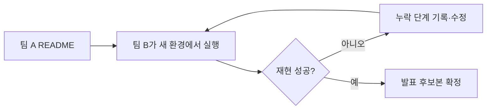

# 14주차 — 프로젝트 집중 워크숍

**클라우드 MLOps** · 연성대학교 · 230분 (10분 조기 종료)
NCS: `2001070405_20v1.2` 인공지능서비스 운영품질 점검하기 / `2001070408_20v1.1` 인공지능서비스 운영개선사항 식별하기 / `2001070408_20v1.3` 인공지능서비스 운영개선사항 수행하기(부분) / `2001070403_20v1.4` 인공지능서비스 운영매뉴얼 관리하기(부분)

> **이 회차는 전 회차 중 학생 자율 작업 비중이 가장 높습니다.**
> 강의는 20분뿐이고 175분(전체의 76%)이 팀 작업 시간입니다. 강사는 가르치지 않고 **순회하며 점검하고 막힌 곳을 뚫습니다.**
> 그래서 이 교안은 "실습 A / 실습 B" 구성을 쓰지 않고 **3장 하나를 "팀별 작업·코칭"으로 통합**했습니다. 나머지 구조(0장 회차 요약, 5장 체크포인트, 6장 정리, 부록)는 표준 템플릿을 그대로 따릅니다.

---

## 0. 회차 요약 (강사용 1페이지)

| 항목 | 내용 |
|---|---|
| 학습목표 | 팀 산출물을 통합해 다른 사람 환경에서도 재현·호출되는 상태로 만들고, 발표자료 초안과 **시연 영상 백업**을 완성해 리허설까지 마칠 수 있다. |
| 오늘의 결과물 | ① 발표자료 초안(10~12장) ② 재현 가능한 `README.md` ③ **시연 영상 백업 파일(3분 이내, mp4)** ④ 코칭 체크리스트 통과본 ⑤ 리소스·비용 정리 현황표 |
| 사전 준비 | ① 팀별 코칭 순서표와 시각 배정(칠판 게시) ② 코칭 체크리스트 인쇄본 팀 수만큼 ③ 화면 녹화 도구 안내(Windows `Win+G`, macOS `Cmd+Shift+5`, OBS) ④ 발표자료 템플릿(부록 C) 배포 ⑤ 15주차 발표 순서 추첨용 제비 ⑥ 각 팀의 M3 미통과 항목 정리표 |
| 학생 준비물 | 노트북, 팀 저장소, 동작 중인 서비스, 13주차 운영체크리스트, **발표에서 보여줄 실제 입력 데이터 3건**, 녹화용 여유 저장공간 2GB |
| 예상 사고 지점 | ① "내 노트북에서만 되는" 상태가 이 시점에 발각됨 ② README에 적힌 명령이 실제로는 안 돌아감 ③ 팀원 중 한 명도 전 구간을 혼자 돌려본 적이 없음 |

### 시간표

| 시간 | 구성 | 분 |
|---|---|---|
| 00:00–00:05 | 도입 — 오늘 운영 방식 안내, 코칭 순서 공지 | 5 |
| 00:05–00:20 | **미니강의** — 발표 구성법 + 데모 실패 대비(시연 영상 백업) | 15 |
| 00:20–00:30 | 휴식 (1차) | 10 |
| 00:30–02:00 | **팀별 작업 · 코칭 로테이션 1부** (통합 점검 · 재현성) | 90 |
| 02:00–02:10 | 휴식 (2차) | 10 |
| 02:10–03:35 | **팀별 작업 · 코칭 로테이션 2부** (발표자료 · 시연 영상 · 리허설) | 85 |
| 03:35–03:50 | 마무리 — 제출 확인, 발표 순서 추첨, 15주차 안내 | 15 |
| **합계** | | **230** |

> 미니강의 20분(도입 5 + 강의 15) · 휴식 20분(10분씩 2회) · 팀별 작업·코칭 175분(90+85) · 마무리 15분.
> 휴식을 20분 연속으로 두면 작업 흐름이 끊기므로 **10분씩 두 번으로 분할 운영**합니다.

---

## 1. 도입 (5분)

### 지난주 복습 퀴즈 (구두 3문항)

1. 로그와 메트릭의 차이를 한 문장씩으로 말해보세요. — (로그는 사건 단위 기록으로 사후 원인 분석용, 메트릭은 시간별 숫자로 추세 파악용입니다.)
2. 모델이 나빠지는데 에러가 안 나는 이유가 뭐였죠? — (서버는 정상 동작하고 200을 돌려줍니다. 예측값이 틀릴 뿐이라 시스템 관점에서는 아무 문제가 없어 보입니다.)
3. M3 체크리스트 8번, "다른 팀원의 노트북에서 `/predict` 가 된다"를 왜 넣었을까요? — ("내 컴퓨터에선 되는데요"를 깨기 위해서입니다. 심사자는 남의 환경에서 호출합니다.)

### 오늘의 운영 방식 안내 (강사 멘트)

> 오늘은 제가 가르치는 시간이 15분밖에 없습니다. 나머지 175분은 전부 여러분 시간입니다. **이 과목에서 여러분이 가장 자유롭게 쓰는 회차이자, 손에 가장 많이 남는 회차입니다.**
>
> 다만 자유 시간이라고 해서 "알아서 하세요"는 아닙니다. 저는 팀마다 15~20분씩 붙어서 네 가지를 점검합니다. 칠판에 적어두었습니다.
>
> **① 전 구간이 진짜 도는가 — 다른 사람 계정·다른 사람 노트북에서**
> **② README만 보고 처음 보는 사람이 재현할 수 있는가**
> **③ MLflow에 실험 기록이 남아 있는가**
> **④ 리소스와 비용이 정리되어 있는가**
>
> 이 네 가지는 다음 주 최종 평가 루브릭 25점의 뼈대와 정확히 같습니다. 오늘 제 앞에서 통과하면 다음 주가 편해집니다.
>
> 코칭 순서는 칠판에 붙여뒀습니다. **본인 팀 차례가 아닌 시간에는 자기 작업을 하세요.** 대기하지 마세요. 그리고 오늘 반드시 끝내야 하는 것이 하나 있습니다. **시연 영상 백업입니다.** 이건 예외 없습니다. 이유는 잠시 후에 말씀드리겠습니다.

---

## 2. 미니강의 (15분)

### 2-1. 발표는 문제 → 접근 → 결과 → 배운 점 (9분)

**강의 스크립트**

> 다음 주 발표는 15분입니다. 15분에 12주 작업을 다 넣을 수 없습니다. 그러니 **버릴 것을 먼저 정해야** 합니다.
>
> 제가 지금까지 본 학생 발표의 가장 흔한 실패는 이겁니다. **"저희는 이런 걸 했습니다"를 시간 순서대로 나열하는 것.** "1주차에 S3를 배웠고, 2주차에 EC2를 만들었고, 3주차에 데이터를 모았고…" 이렇게 하면 15분이 5분 만에 사라지고, 듣는 사람은 아무것도 기억 못 합니다.
>
> 발표는 시간 순서가 아니라 **네 덩어리**로 짭니다. 칠판에 적겠습니다.
>
> **문제 → 접근 → 결과 → 배운 점.**
>
> **문제(3분)** — 여러분이 무엇을 해결하려 했는지. 여기서 제일 중요한 건 **"그래서 누가 불편했는데?"** 에 답하는 겁니다. "따릉이 대여량을 예측했습니다"는 문제가 아닙니다. "따릉이 재배치 담당자가 새벽에 어느 정류소에 몇 대를 갖다 놓을지 감으로 정하고 있습니다"가 문제입니다. 문제가 살아 있으면 나머지가 다 살아납니다.
>
> **접근(4분)** — 어떻게 풀었는지. 여기서 조심할 게 있어요. **여러분이 쓴 기술을 자랑하지 마세요.** "FastAPI를 썼고 Docker로 컨테이너화했고 GitHub Actions로 CI/CD를 구성했습니다"… 듣는 사람 입장에서 이건 그냥 단어 나열입니다. 대신 **선택의 이유**를 말하세요. "모델을 세 개 비교했는데 정확도는 A가 높았지만 응답시간이 3배라서 B를 골랐습니다." 이런 게 접근입니다. **의사결정이 보여야 합니다.** 최종 산출물 루브릭에 "문제정의·의사결정 근거가 명확"이라고 적혀 있는 게 이겁니다.
>
> **결과(5분, 이 중 시연 3분)** — 숫자와 화면입니다. 숫자는 반드시 **비교 대상**과 함께 제시하세요. "F1이 0.82입니다"는 아무 의미가 없습니다. "규칙 기반 베이스라인이 0.61이었고 저희 모델이 0.82입니다"여야 의미가 생깁니다. 그리고 **라이브 시연**. 여기가 발표의 심장입니다.
>
> **배운 점(3분)** — 여기서 점수가 갈립니다. 진짜로. **실패를 말하는 팀이 이깁니다.** "처음엔 정확도만 봤는데 데이터가 불균형이라 의미가 없다는 걸 알았습니다", "학습 때 쓴 전처리를 서빙에서 빼먹어서 예측이 다 틀렸습니다" — 이런 이야기를 하는 팀이 "저희는 다 잘됐습니다"라고 하는 팀보다 항상 높은 점수를 받습니다. 왜냐면 **실패를 말할 수 있다는 건 그 지점을 정확히 이해했다는 증거**거든요.
>
> 질문 하나 던지겠습니다. **발표 첫 30초에 무슨 말을 해야 할까요?** (…) 제목과 팀원 소개? 아닙니다. 그건 슬라이드에 이미 있습니다. 첫 30초에는 **"저희가 만든 것"을 한 문장으로** 말해야 합니다. "저희는 편의점 발주 담당자가 내일 몇 개를 시켜야 할지 알려주는 API를 만들었습니다." 이 한 문장이 나오면 청중의 머리에 그림이 그려지고, 그 다음 14분 30초가 그 그림 위에 얹힙니다.

**판서/슬라이드 요점**
- 발표는 시간 순서가 아니라 **문제(3) → 접근(4) → 결과·시연(5) → 배운 점(3)**
- 문제는 "무엇을 예측했다"가 아니라 **"누가 무엇 때문에 불편했다"**
- 접근은 기술 나열이 아니라 **선택의 이유** (루브릭: 의사결정 근거)
- 숫자는 반드시 **비교 대상과 함께** (베이스라인 대비)
- **실패와 배운 점을 말하는 팀이 이긴다**
- 첫 30초 = "저희가 만든 것" 한 문장

**학생 질문 예상 & 답변**
- Q: 슬라이드는 몇 장이 적당한가요? → A: 10~12장입니다. 15분에 20장 넘어가면 읽기만 하다 끝납니다. 부록 C에 장별 구성 템플릿을 넣어뒀으니 그대로 쓰세요.
- Q: 팀원 4명이 다 발표해야 하나요? → A: 발표자는 2명 이내를 권합니다. 대신 **질의응답은 전원이 받습니다.** 자기가 맡은 부분 질문에 답할 수 있어야 합니다. 그게 "각자 최소 1회는 전 구간을 혼자 돌려보기" 요구사항을 확인하는 방법이기도 합니다.
- Q: 코드를 슬라이드에 넣어도 되나요? → A: 딱 한 장, 핵심 10줄 이내로만. 코드 나열은 루브릭에서 "하(미흡)" 판정 문구에 그대로 적혀 있습니다.

---

### 2-2. 데모는 반드시 실패한다 — 시연 영상 백업 (6분)

**강의 스크립트**

> 이제 오늘 가장 중요한 이야기입니다. 잘 들으세요.
>
> **다음 주 발표에서 여러분의 라이브 데모는 실패합니다.** 겁주는 게 아니라 확률 이야기입니다. 매년 반드시 두세 팀이 겪습니다. 왜 그럴까요? 이유가 정해져 있습니다.
>
> 첫째, **강의실 와이파이입니다.** 30명이 동시에 붙어 있고, 여러분 API는 EC2에 있습니다. 평소 100밀리초 걸리던 요청이 그날은 타임아웃 납니다.
>
> 둘째, **인스턴스를 중지해뒀다가 다시 켜서 퍼블릭 IP가 바뀝니다.** 2주차에 배웠죠. 발표자료에 적어둔 주소가 죽은 주소가 됩니다.
>
> 셋째, **어제 밤에 마지막으로 고친 코드가 배포에 실패해 있습니다.** 자동 배포를 만들었으니 push하면 자동으로 나가는데, 그게 빨간 X로 끝났는데 아무도 안 봤습니다.
>
> 넷째, 이게 제일 허무한데요. **발표 직전에 누가 실수로 컨테이너를 지웠습니다.**
>
> 그래서 오늘 **시연 영상을 찍습니다.** 규칙은 이렇습니다.
>
> - 길이 **3분 이내**. 발표에 통째로 틀 게 아니라 데모가 실패했을 때 갈아 끼울 대체재입니다.
> - **소리는 없어도 됩니다.** 대신 화면에 무엇을 하는지 자막이나 큰 글씨로 표시하세요.
> - 담을 내용은 다섯 장면입니다. ① 서비스 주소를 브라우저에 입력 ② Swagger UI 또는 데모 화면에서 **실제 입력값을 타이핑하는 손** ③ 예측 결과가 나오는 순간 ④ CloudWatch 대시보드에서 그 요청이 그래프에 찍히는 것 ⑤ 코드를 한 줄 고쳐 push하고 Actions가 초록으로 끝나는 것 (배속 가능)
> - 파일은 **팀 저장소가 아니라** 공유 드라이브에 올리고, **발표하는 노트북에 로컬 파일로도 한 벌 둡니다.** 인터넷이 안 될 수 있으니까요.
>
> 그리고 하나 더. 영상만 믿지 말고 **백업 3단 구성**을 갖추세요.
> **1단 — 라이브 데모.** 되면 제일 좋습니다.
> **2단 — 로컬 실행.** 노트북에서 `docker run` 으로 같은 컨테이너를 띄워둡니다. 네트워크가 죽어도 로컬은 삽니다. **발표 시작 전에 미리 띄워두세요.**
> **3단 — 시연 영상.** 위 둘이 다 죽으면 영상을 틉니다.
>
> 마지막으로 한마디. **데모가 실패했을 때 당황하지 않는 것 자체가 평가 대상입니다.** "네트워크가 불안정하네요, 준비한 영상으로 보여드리겠습니다" 하고 3초 만에 넘어가는 팀은 감점이 없습니다. 오히려 준비성으로 점수를 받습니다. 5분 동안 "어? 왜 안 되지?" 하는 팀이 점수를 잃습니다.

**판서/슬라이드 요점**
- 데모 실패 4대 원인: **강의실 와이파이 / 퍼블릭 IP 변경 / 마지막 배포 실패 / 컨테이너 삭제**
- 시연 영상: **3분 이내**, 5장면(주소 → 입력 → 결과 → 대시보드 → 자동배포)
- **로컬 파일로도 반드시 소지** (인터넷 없이 재생 가능해야 함)
- **백업 3단**: 라이브 → 로컬 실행 → 영상
- **당황하지 않는 것이 평가 대상.** 3초 안에 전환하면 감점 없음

**학생 질문 예상 & 답변**
- Q: 녹화 도구가 없는데요. → A: 윈도우는 `Win + G` (Xbox Game Bar), 맥은 `Cmd + Shift + 5` 로 별도 설치 없이 됩니다. 화질을 더 원하면 OBS Studio가 무료입니다.
- Q: 영상에 실패 장면이 섞였는데 다시 찍어야 하나요? → A: 다시 찍으세요. 3분짜리라 두 번 찍어도 10분입니다. 다만 **완벽하게 편집하려고 30분 쓰지는 마세요.** 오늘의 우선순위는 영상 완성도가 아니라 서비스가 실제로 도는 것입니다.
- Q: 퍼블릭 IP가 바뀌는 문제는 근본적으로 못 막나요? → A: 탄력적 IP(Elastic IP)를 붙이면 고정됩니다. 8주차에 다뤘죠. 다만 **인스턴스에 연결되지 않은 탄력적 IP는 요금이 나갑니다.** 다음 주 정리 실습에서 반드시 해제합니다.

---

## 3. 팀별 작업 · 코칭 로테이션 (175분)

> 표준 템플릿의 3장(실습 A)·4장(실습 B)을 이 한 장으로 통합했습니다.
> 학생은 **175분 내내 자기 팀 작업**을 하고, 강사가 순회하며 팀당 15~20분씩 코칭합니다.

**목표** 산출물을 통합해 남의 환경에서 재현·호출되는 상태로 만들고, 발표자료 초안·시연 영상·리허설을 완료한다.

**과제 지시문** (학생에게 그대로 읽어줍니다)

> 오늘 여러분이 끝내야 할 것은 다섯 개입니다. 칠판에 적어두겠습니다.
> **① 재현되는 README ② 남의 노트북에서 도는 API ③ 발표자료 초안 10~12장 ④ 시연 영상 3분 ⑤ 리소스·비용 정리 현황표.**
> 이 순서대로 하세요. 발표자료를 먼저 만들고 싶겠지만, **서비스가 안 돌면 발표자료는 아무 의미가 없습니다.** ①②를 먼저 끝내고 ③으로 갑니다.
> 그리고 오늘은 저를 최대한 부려먹으세요. 12주 동안 안 풀린 게 있으면 지금이 마지막 기회입니다. 다음 주는 발표하는 날이지 고치는 날이 아닙니다.

### 3-1. 코칭 로테이션 운영 (강사용)

**팀당 15~20분 × 6~8팀. 1부(90분)에서 전 팀 1회, 2부(85분)에서 전 팀 2회를 돕니다.**

| 라운드 | 시간 | 초점 | 강사가 하는 일 |
|---|---|---|---|
| **1라운드** (1부, 팀당 15분) | 00:30–02:00 | **동작과 재현성** | 코칭 체크리스트 A~D 항목을 학생 화면 앞에서 직접 실행시켜 확인. 미통과 항목을 종이에 적어 팀에 남김 |
| **2라운드** (2부, 팀당 12분) | 02:10–03:35 | **발표와 마무리** | 1라운드 미통과 항목 해결 확인 → 발표자료 초안 검토 → 시연 영상 확인 → 3분 리허설 청취 |

**코칭할 때의 원칙 (강사 자기 규율)**
1. **키보드를 뺏지 않는다.** 학생이 치게 하고 강사는 말로만 안내합니다. 시간이 두 배 걸려도 그렇게 합니다.
2. **"돌아가나요?"라고 묻지 않고 "돌려보세요"라고 한다.** 말로 확인하지 말고 화면으로 확인합니다.
3. **팀원 중 가장 말이 없는 사람에게 질문한다.** "이 부분 설명해줄 수 있어요?" 무임승차는 여기서 드러납니다.
4. 한 팀에 20분을 넘기지 않습니다. 남은 문제는 종이에 적어주고 다음 팀으로 갑니다.

### 3-2. 점검 항목 4가지 (학생용 — 이 순서로 스스로 먼저 해보세요)

**A. 전 구간이 실제로 도는가 — 다른 사람 계정·다른 노트북에서**

```bash
# ① 팀원 중 한 명이 자기 노트북에서 (개발에 참여 안 한 사람일수록 좋다)
curl -i http://<팀 서비스 퍼블릭 IP>:8000/health

curl -X POST http://<팀 서비스 퍼블릭 IP>:8000/predict \
  -H "Content-Type: application/json" \
  -d '<발표 때 쓸 실제 입력 JSON 3건 중 1번>'

# ② 학교 와이파이가 아닌 다른 망(휴대폰 테더링)에서 한 번 더
```

- 확인 포인트: 두 환경 모두에서 200과 정상 예측값이 나와야 한다.
- ⚠ **한쪽만 되면 보안그룹 문제입니다.** 인바운드 규칙에 `8000` 포트가 `0.0.0.0/0` 또는 필요한 대역으로 열려 있는지 확인하세요.

```bash
# 보안그룹 인바운드 확인
aws ec2 describe-security-groups --region ap-northeast-2 \
  --group-ids <보안그룹 ID> \
  --query "SecurityGroups[].IpPermissions[].[FromPort,ToPort,IpRanges[].CidrIp]" \
  --output json
```

**B. README만 보고 재현 가능한가 — "백지 재현 테스트"**

> 이건 팀 안에서 서로 못 합니다. **팀 사정을 아는 사람은 무의식적으로 빠진 단계를 채워 넣기 때문**입니다.
> **옆 팀과 README를 교환해서 서로 재현해보세요.** 오늘 이 교차 테스트를 반드시 한 번 합니다.

교차 테스트 절차:
1. 옆 팀 README만 받는다. **말로 물어보는 것 금지.**
2. 적힌 대로 `git clone` → 환경 구성 → 학습 스크립트 실행까지 시도한다. (15분 제한)
3. **막힌 지점을 그대로 적어서 돌려준다.** "3번 단계에서 `ModuleNotFoundError: mlflow` 발생, requirements에 없음"
4. 받은 팀은 그 지적을 README에 반영한다.

- 확인 포인트: 지적사항이 0개인 팀은 거의 없습니다. **평균 3~5개 나옵니다.** 0개가 나왔다면 테스트를 대충 한 겁니다.

**C. MLflow 실험 기록이 남아 있는가**

```bash
# MLflow 서버 기동 확인
curl -s -o /dev/null -w "%{http_code}\n" http://<MLflow 서버 IP>:5000

# 실험 목록과 건수 확인 (5건 이상이어야 루브릭 '상')
mlflow experiments search --view all
```

- 확인 포인트: UI에서 **실험 5건 이상**이 파라미터·메트릭과 함께 비교 가능한 상태로 보이는가. 최종 채택 모델이 **어느 실행(run)에서 나왔는지 추적**되는가.
- ⚠ MLflow 서버를 12주 동안 껐다 켰다 하면서 `mlruns` 디렉터리가 날아간 팀이 매년 나옵니다. **없으면 지금 다시 5건을 돌리세요.** 학습이 10분 이내로 끝나도록 설계했으니 가능합니다. 없는 채로 발표하는 것보다 낫습니다.

**D. 리소스·비용 정리 상태**

```bash
# ① 우리 팀 태그가 붙은 EC2 인스턴스 전부
aws ec2 describe-instances --region ap-northeast-2 \
  --filters "Name=tag:Team,Values=<팀번호>" \
  --query "Reservations[].Instances[].[InstanceId,InstanceType,State.Name,PublicIpAddress]" \
  --output table

# ② 연결되지 않은 탄력적 IP (요금 발생) ⚠
aws ec2 describe-addresses --region ap-northeast-2 \
  --query "Addresses[?AssociationId==null].[PublicIp,AllocationId]" --output table

# ③ SageMaker 엔드포인트 — 10주차 이후 남아 있으면 큰일 ⚠
aws sagemaker list-endpoints --region ap-northeast-2 --output table

# ④ 연결 해제된 EBS 볼륨 (요금 발생) ⚠
aws ec2 describe-volumes --region ap-northeast-2 \
  --filters "Name=status,Values=available" \
  --query "Volumes[].[VolumeId,Size,CreateTime]" --output table

# ⑤ 디스크 여유 (발표 당일 사망 원인 1위)
df -h /
```

- 확인 포인트: ②③④가 **전부 비어 있어야** 합니다. 하나라도 있으면 지금 지웁니다.
- ⚠ 교육계획서 7장 감점 규정: **리소스 미정리 적발 시 회당 -2점.** 오늘이 스스로 고칠 마지막 기회입니다.

### 3-3. 오늘 반드시 끝내야 할 산출물 5종

| # | 산출물 | 완료 기준 | 목표 시각 |
|---|---|---|---|
| 1 | `README.md` | 옆 팀 교차 테스트 지적사항이 전부 반영됨 | 1부 종료(02:00)까지 |
| 2 | 남의 노트북에서 도는 API | 팀원 2명 이상의 서로 다른 노트북에서 `/predict` 성공 | 1부 종료(02:00)까지 |
| 3 | 발표자료 초안 | 부록 C 구성대로 10~12장, 숫자와 화면 캡처 포함 | 03:00까지 |
| 4 | **시연 영상 백업** | 3분 이내 mp4, 공유 드라이브 + 발표 노트북 로컬에 각 1부 | 03:20까지 |
| 5 | 리소스·비용 정리 현황표 | 부록 A 명령 5개 실행 결과 캡처 + Cost Explorer 팀 태그 누적 비용 | 03:30까지 |

### 3-4. 시연 영상 찍는 법 (구체 절차)

```bash
# 촬영 전 준비 — 서비스가 확실히 살아 있는지 먼저 확인
curl -s http://<서비스 IP>:8000/health
docker ps --format "table {{.Names}}\t{{.Status}}\t{{.Ports}}"
```

1. **화면 정리** — 개인 메신저, 다른 브라우저 탭, 바탕화면 아이콘을 정리합니다. 발표 영상에 카톡 알림이 뜨는 사고가 매년 있습니다.
2. **브라우저 확대 125%** — 뒤에서 보는 사람도 글씨가 보이게.
3. **녹화 시작** — 윈도우 `Win + G` → 녹화 버튼 / 맥 `Cmd + Shift + 5` → 선택 영역 기록.
4. **장면 순서대로 촬영** (중간에 멈추지 말고 한 번에)
   - 장면1 (15초) 브라우저 주소창에 `http://<IP>:8000/docs` 입력 → Swagger UI 로딩
   - 장면2 (40초) `/predict` → Try it out → **실제 입력값 타이핑** → Execute
   - 장면3 (20초) 응답 JSON을 화면 가운데로. 예측값을 마우스로 가리키기
   - 장면4 (30초) CloudWatch 대시보드 새로고침 → 방금 요청이 그래프에 찍힘
   - 장면5 (60초, 4배속 가능) 코드 한 줄 수정 → `git push` → Actions 초록 체크 → `/health` 버전 변경 확인
5. **파일명** `<팀번호>_시연영상_<날짜>.mp4` 로 저장
6. **두 곳에 보관** — 팀 공유 드라이브 + **발표할 노트북의 바탕화면**
7. **재생 테스트** — 인터넷을 끄고 로컬 파일이 재생되는지 확인합니다.

### 3-5. 리허설 (2라운드 강사 코칭 시간에)

- 발표자가 **3분 압축 버전**으로 문제 → 접근 → 결과 → 배운 점을 말합니다.
- 강사는 **질문 2개**를 던집니다. 다음 주 심사에서 나올 법한 질문으로.
  - "왜 이 모델을 골랐습니까? 다른 후보 대비 뭐가 나았나요?"
  - "이 서비스를 6개월 뒤에도 쓰려면 뭘 해야 합니까?"
- 팀원 중 **발표자가 아닌 사람**에게 하나 더 묻습니다. "이 부분은 누가 만들었나요? 설명해줄 수 있어요?"

### 순회 지도 포인트

1. **작업 순서가 뒤집힌 팀.** 서비스가 안 도는데 발표자료 디자인을 하고 있는 팀이 반드시 있습니다. 즉시 순서를 되돌립니다.
2. **한 명만 손을 움직이는 팀.** 나머지 셋이 휴대폰을 보고 있으면 개입합니다. "지금 각자 다른 노트북에서 `/predict` 한 번씩 쳐보세요."
3. **시연 영상을 미루는 팀.** "나중에 집에서 찍을게요"는 100% 안 찍습니다. **03:20 전까지 강사에게 파일을 보여주는 것**을 오늘 필수 통과 조건으로 못 박습니다.

---

## 4. (해당 없음)

> 이 회차는 실습 A/B를 3장 "팀별 작업·코칭"으로 통합 운영하므로 4장을 두지 않습니다.
> 템플릿의 4장 "팀 프로젝트 연결" 내용은 3장 전체가 곧 팀 프로젝트 작업이므로 별도로 분리하지 않습니다.

---

## 5. 체크포인트 (제출물)

| # | 제출물 | 형식 | 배점 |
|---|---|---|---|
| 1 | 코칭 체크리스트 (부록 B) 강사 서명본 — A~D 전 항목 판정 완료 | 인쇄물 제출 | 0.5 |
| 2 | 발표자료 초안 (10~12장, 부록 C 구성 준수) | PDF 업로드 | 0.5 |
| 3 | **시연 영상 백업** (3분 이내 mp4, 5장면 포함) | 공유 드라이브 링크 | 0.5 |
| 4 | 옆 팀 README 교차 테스트 결과지 (지적사항 + 반영 커밋 링크) | 문서 URL | 0.5 |
| **합계** | | | **2** |

> ⚠ **3번(시연 영상)은 미제출 시 다음 주 발표 점수에서 감점**합니다. 교육계획서 11장 "최종 발표 시 데모 실패" 리스크 대응 항목의 의무 사항입니다.

### 평가 기준 (NCS 수행준거 연계)

- **`2001070405_20v1.2` 인공지능서비스 운영품질 점검하기**
  - 정의한 **품질지표에 따라 서비스 상태를 실제로 점검**했는가 → 13주차에 정의한 지표(응답시간·에러율·드리프트)를 오늘 실측하고 기준 대비 판정했는가
  - 점검을 **정해진 절차·양식에 따라** 수행했는가 → 코칭 체크리스트(부록 B) A~D 전 항목 수행 및 판정 기록
  - 점검 결과 **미흡 항목을 식별**했는가 → 미통과 항목이 종이에 기록되고 조치 여부가 표시되었는가
- **`2001070408_20v1.1` 인공지능서비스 운영개선사항 식별하기**
  - 운영 중 발견된 **문제점을 구체적으로 도출**했는가 → 옆 팀 교차 재현 테스트에서 나온 지적사항 목록
  - 개선사항에 **우선순위를 부여**했는가 → 오늘 반드시 끝낼 5종 산출물의 처리 순서를 근거와 함께 설명할 수 있는가
- **`2001070408_20v1.3` 인공지능서비스 운영개선사항 수행하기(부분)**
  - 식별한 개선사항을 **실제로 반영하고 결과를 확인**했는가 → 교차 테스트 지적사항이 반영된 커밋이 존재하고, 반영 후 재현이 성공했는가
- **`2001070403_20v1.4` 인공지능서비스 운영매뉴얼 관리하기(부분)**
  - 서비스를 **다른 사람이 운영할 수 있는 수준의 문서**를 작성·최신화했는가 → README의 설치·실행·배포·롤백·장애조치 항목이 실제 동작과 일치하는가
  - 문서가 **변경사항을 반영해 갱신**되는가 → 오늘 반영 커밋의 이력으로 확인

---

## 6. 정리 & 다음 주 예고 (15분)

### 마무리 진행 순서

1. **(5분) 산출물 제출 확인** — 팀별로 시연 영상 파일을 강사 화면에 실제로 재생해 보입니다. 링크만 제출하고 재생이 안 되는 사고를 여기서 잡습니다.
2. **(5분) 발표 순서 추첨** — 제비뽑기로 다음 주 발표 순서를 정하고 칠판·공지에 게시합니다. 첫 번째 팀은 **09:00 정각 시작**임을 못 박습니다.
3. **(5분) 다음 주 준비물 안내 및 리소스 정리 타임**

**오늘 정리 3줄 요약**
1. 발표는 시간 순서가 아니라 문제 → 접근 → 결과 → 배운 점으로 짜고, 실패와 배운 점을 말하는 팀이 높은 점수를 받는다.
2. 라이브 데모는 실패할 수 있으므로 **라이브 → 로컬 실행 → 시연 영상**의 3단 백업을 갖춘다.
3. "우리 팀 노트북에서 되는 것"은 완성이 아니다. **남의 환경에서 README만 보고 재현되는 것**이 완성이다.

**다음 주 미리보기 (준비물 안내)**
> 다음 주는 발표하는 날입니다. 고치는 날이 아닙니다. 오늘 상태 그대로 가져오세요.
> 준비물은 **① 발표자료 최종 PDF(USB에도 한 벌) ② 시연 영상 로컬 파일 ③ 발표용 입력 데이터 3건 ④ 노트북 충전기 ⑤ 상호평가지 작성용 필기구**입니다.
> 그리고 다음 주에는 **여러분이 학기 내내 만든 AWS 리소스를 전부 지웁니다.** 40분을 통째로 씁니다. 마지막 비용도 다 같이 확인합니다. 그러니 **지우면 안 되는 것은 오늘 미리 백업**해두세요. 특히 **MLflow 실험 기록 스크린샷, 대시보드 캡처, 모델 성능 수치**는 포트폴리오에 쓸 자료입니다. AWS에서 지워지면 끝입니다.

**리소스 정리 타임 체크 항목**
- [ ] 발표에 쓸 EC2는 **중지(Stop)** — 다음 주에 다시 켭니다. 종료(Terminate) 금지
- [ ] ⚠ 연결되지 않은 탄력적 IP 해제 (`describe-addresses` 결과가 비어 있어야 함)
- [ ] ⚠ SageMaker 엔드포인트 0개 확인
- [ ] ⚠ 사용하지 않는 EBS 볼륨(`status=available`) 삭제
- [ ] 팀 태그(`Course=MLOps`, `Team=<팀번호>`)가 모든 리소스에 붙어 있는지 — 다음 주 비용 확인 때 필요
- [ ] **포트폴리오용 캡처 백업**: MLflow 실험 비교 화면 / CloudWatch 대시보드 / Actions 성공 로그 / API 응답 화면

---

## 7. 과제

1. **(팀·필수)** 발표자료를 **최종본으로 확정**해 PDF로 저장하고, 발표 노트북 로컬과 USB 두 곳에 넣는다. 폰트가 깨질 수 있으므로 PPT 원본이 아니라 **PDF로** 가져온다.
2. **(팀·필수)** 발표 리허설을 **타이머를 켜고 실제 시간(15분)으로 최소 1회** 진행한다. 초과분을 잘라낸다.
3. **(개인·필수)** 상호평가에 대비해, 다른 팀 발표를 들을 때 볼 관점 3가지를 미리 정해 온다. (부록 D의 상호평가 항목 참고)
4. **(팀·선택, 가산 0.5점)** README에 **아키텍처 그림 1장**을 추가한다. 데이터 → 학습 → 이미지 → 배포 → 모니터링이 화살표로 이어진 그림이면 충분하다. 손그림을 찍어 올려도 인정한다.

---

## 부록 A. 명령어 치트시트 (1페이지 배포본)

### 오늘 반드시 실행할 확인 명령 5개

```bash
# 1) 서비스 살아있나 (다른 사람 노트북에서)
curl -i http://<서비스 IP>:8000/health

# 2) 우리 팀 EC2 전부
aws ec2 describe-instances --region ap-northeast-2 \
  --filters "Name=tag:Team,Values=<팀번호>" \
  --query "Reservations[].Instances[].[InstanceId,InstanceType,State.Name,PublicIpAddress]" \
  --output table

# 3) 연결 안 된 탄력적 IP (있으면 요금) ⚠
aws ec2 describe-addresses --region ap-northeast-2 \
  --query "Addresses[?AssociationId==null].[PublicIp,AllocationId]" --output table

# 4) SageMaker 엔드포인트 (있으면 즉시 삭제) ⚠
aws sagemaker list-endpoints --region ap-northeast-2 --output table

# 5) 붙어 있지 않은 EBS 볼륨 (있으면 요금) ⚠
aws ec2 describe-volumes --region ap-northeast-2 \
  --filters "Name=status,Values=available" \
  --query "Volumes[].[VolumeId,Size,CreateTime]" --output table
```

### 즉시 정리 명령

```bash
# 탄력적 IP 해제
aws ec2 release-address --region ap-northeast-2 --allocation-id <AllocationId>

# 엔드포인트 삭제
aws sagemaker delete-endpoint --region ap-northeast-2 --endpoint-name <엔드포인트명>
aws sagemaker delete-endpoint-config --region ap-northeast-2 --endpoint-config-name <구성명>

# 미사용 볼륨 삭제
aws ec2 delete-volume --region ap-northeast-2 --volume-id <VolumeId>

# 서버 디스크 확보
docker system prune -af && df -h /
```

### 서비스 복구 (발표 전 사고 대비)

```bash
docker ps -a
docker start mlops-api                    # 멈춘 컨테이너 재기동
docker logs --tail 100 mlops-api          # 안 뜨면 로그부터
bash /home/ubuntu/deploy.sh <ECR 이미지 URI>:latest   # 통째로 재배포

# 퍼블릭 IP가 바뀐 경우 새 주소 확인
aws ec2 describe-instances --region ap-northeast-2 \
  --instance-ids <인스턴스 ID> \
  --query "Reservations[].Instances[].PublicIpAddress" --output text
```

### 로컬 백업 실행 (발표용 2단 백업)

```bash
# 발표 노트북에서 미리 띄워두기
aws ecr get-login-password --region ap-northeast-2 \
  | docker login --username AWS --password-stdin <계정ID>.dkr.ecr.ap-northeast-2.amazonaws.com
docker pull <계정ID>.dkr.ecr.ap-northeast-2.amazonaws.com/<리포지토리>:latest
docker run -d --name demo-backup -p 8000:8000 \
  <계정ID>.dkr.ecr.ap-northeast-2.amazonaws.com/<리포지토리>:latest
curl http://localhost:8000/health
```

### 비용 확인 (팀 태그별)

```bash
aws ce get-cost-and-usage --region us-east-1 \
  --time-period Start=<학기시작일 YYYY-MM-DD>,End=<오늘 YYYY-MM-DD> \
  --granularity MONTHLY --metrics "UnblendedCost" \
  --group-by Type=TAG,Key=Team \
  --output table
```
> Cost Explorer API 엔드포인트는 `us-east-1` 고정입니다. 리소스 리전과 무관합니다.

---

## 부록 B. 코칭 체크리스트 (강사·팀 공용 · 팀 수만큼 인쇄해 배포)

**팀번호: ________  일시: ________  코칭 강사: ________**

### A. 전 구간 동작 (배점 비중 높음)

| # | 확인 항목 | 확인 방법 | 판정 |
|---|---|---|---|
| A1 | `/health` 가 200 + `status: ok` | 강사 노트북에서 `curl` | ☐ 통과 ☐ 미흡 |
| A2 | `/predict` 가 **강사 노트북에서** 정상 응답 | 강사가 직접 요청 전송 | ☐ 통과 ☐ 미흡 |
| A3 | 학교 와이파이가 아닌 망에서도 호출됨 | 테더링으로 재시도 | ☐ 통과 ☐ 미흡 |
| A4 | 전처리 → 학습 → 저장 스크립트가 오류 없이 완주 | 학생이 눈앞에서 실행 | ☐ 통과 ☐ 미흡 |
| A5 | 커밋 1회로 자동 배포가 성공 | Actions 최근 실행 초록 확인 | ☐ 통과 ☐ 미흡 |
| A6 | 데모 UI(Streamlit 등)가 있으면 접속됨 | 브라우저 확인 | ☐ 통과 ☐ 미흡 ☐ 해당없음 |

### B. 재현성 (README)

| # | 확인 항목 | 확인 방법 | 판정 |
|---|---|---|---|
| B1 | README에 **설치·실행 명령**이 복붙 가능한 형태로 있음 | 육안 + 1개 실행 | ☐ 통과 ☐ 미흡 |
| B2 | 필요한 환경변수·시크릿 목록이 명시됨 | 육안 | ☐ 통과 ☐ 미흡 |
| B3 | 데이터 출처와 취득 방법이 적혀 있음 | 육안 | ☐ 통과 ☐ 미흡 |
| B4 | 배포·롤백 방법이 적혀 있음 | 육안 | ☐ 통과 ☐ 미흡 |
| B5 | **옆 팀 교차 재현 테스트** 수행 및 지적사항 반영 | 결과지 + 반영 커밋 | ☐ 통과 ☐ 미흡 |
| B6 | `requirements.txt` 버전이 `==` 로 고정됨 | 파일 확인 | ☐ 통과 ☐ 미흡 |

### C. 실험 관리 (MLflow)

| # | 확인 항목 | 확인 방법 | 판정 |
|---|---|---|---|
| C1 | 실험 기록이 **5건 이상** 남아 있음 | MLflow UI | ☐ 통과 ☐ 미흡 |
| C2 | 파라미터·메트릭이 비교 가능한 형태로 기록됨 | UI 비교 화면 | ☐ 통과 ☐ 미흡 |
| C3 | 최종 채택 모델이 어느 실행에서 나왔는지 추적됨 | 레지스트리 화면 | ☐ 통과 ☐ 미흡 |
| C4 | 모델 선택 **이유를 말로 설명**할 수 있음 | 학생에게 질문 | ☐ 통과 ☐ 미흡 |

### D. 리소스·비용 정리

| # | 확인 항목 | 확인 방법 | 판정 |
|---|---|---|---|
| D1 | 팀 EC2가 필요한 대수만 존재 (중복 없음) | `describe-instances` | ☐ 통과 ☐ 미흡 |
| D2 | ⚠ 미연결 탄력적 IP 0개 | `describe-addresses` | ☐ 통과 ☐ 미흡 |
| D3 | ⚠ SageMaker 엔드포인트 0개 | `list-endpoints` | ☐ 통과 ☐ 미흡 |
| D4 | ⚠ 미사용 EBS 볼륨 0개 | `describe-volumes` | ☐ 통과 ☐ 미흡 |
| D5 | 디스크 사용률 80% 미만 | `df -h /` | ☐ 통과 ☐ 미흡 |
| D6 | 모든 리소스에 `Team` 태그 부착 | 콘솔 태그 편집기 | ☐ 통과 ☐ 미흡 |

### E. 발표 준비 (2라운드에서 확인)

| # | 확인 항목 | 판정 |
|---|---|---|
| E1 | 발표자료 10~12장, 부록 C 구성 준수 | ☐ 통과 ☐ 미흡 |
| E2 | 성능 숫자가 **베이스라인과 비교** 형태로 제시됨 | ☐ 통과 ☐ 미흡 |
| E3 | **시연 영상 3분 이내 완성 및 로컬 재생 확인** | ☐ 통과 ☐ 미흡 |
| E4 | 3분 리허설 수행, 15분 내 완주 가능 판단 | ☐ 통과 ☐ 미흡 |
| E5 | 발표자 외 팀원도 담당 부분을 설명함 | ☐ 통과 ☐ 미흡 |

### 미통과 항목 및 조치 (강사 기입 후 팀에 전달)

| 항목 번호 | 문제 내용 | 조치 방법 | 기한 |
|---|---|---|---|
| | | | |
| | | | |
| | | | |

**강사 서명: ____________**

---

## 부록 C. README 필수 항목 & 발표자료 구성 템플릿

### C-1. README 필수 항목 (이 순서 그대로)

````markdown
# <프로젝트 이름>
> 한 문장 소개 — "누가 무엇을 할 수 있게 되는가"

## 1. 문제 정의
- 배경: 누가 어떤 상황에서 불편한가
- 입력: 무엇을 받는가 (컬럼 목록과 의미)
- 출력: 무엇을 돌려주는가
- 평가지표와 성공 기준: 왜 이 지표인가

## 2. 데이터
| 항목 | 내용 |
|---|---|
| 출처 | (링크) |
| 기간 | |
| 행 수 / 컬럼 수 | |
| 라이선스 | |
| 개인정보 포함 여부 | |

## 3. 시스템 구성
- 아키텍처 그림 1장 (데이터 → 학습 → 이미지 → 배포 → 모니터링)
- 사용 서비스: S3 / EC2 / ECR / CloudWatch / GitHub Actions / MLflow

## 4. 실행 방법 (복붙 가능해야 함)
### 4-1. 환경 준비
```bash
git clone <저장소 URL>
cd <폴더>
python -m venv .venv && source .venv/bin/activate
pip install -r requirements.txt
```
### 4-2. 필요한 환경변수
| 이름 | 설명 | 예시 |
|---|---|---|
| `AWS_REGION` | 리전 | `ap-northeast-2` |
| `S3_BUCKET` | 데이터 버킷 | |
| `MLFLOW_TRACKING_URI` | 실험 서버 주소 | |

### 4-3. 전처리 → 학습 → 저장
```bash
python scripts/preprocess.py
python scripts/train.py
```
### 4-4. API 실행
```bash
docker build -t <이미지명> .
docker run -d -p 8000:8000 <이미지명>
curl http://localhost:8000/health
```

## 5. API 명세
| 메서드 | 경로 | 설명 | 요청 예시 | 응답 예시 |
|---|---|---|---|---|
| GET | `/health` | 상태 확인 | — | `{"status":"ok"}` |
| POST | `/predict` | 예측 | (JSON) | (JSON) |

## 6. 실험 결과
| 실험 | 모델 | 주요 파라미터 | 성능 | 선택 여부 |
|---|---|---|---|---|
| baseline | | | | |
> 최종 채택 모델과 **선택 이유** 3줄

## 7. 배포
- 배포 방식: `main`에 PR 병합 시 GitHub Actions 자동 배포
- 배포 대상: EC2 `i-<...>` / ECR `<리포지토리>`
- 롤백 방법: (명령 3줄)

## 8. 모니터링·운영
- 대시보드: `mlops-<팀번호>`
- 지표: 추론 횟수 / 응답시간 / 에러율 / DriftScore
- 알람: 에러율 10% 초과 시 이메일
- 일일 점검 체크리스트: `docs/운영체크리스트.md`
- 재학습 정책: (한 줄)

## 9. 한계와 다음 단계
- 알고 있는 한계 3가지
- 시간이 더 있다면 무엇을 할 것인가

## 10. 팀 구성과 역할
| 이름 | 역할 | 주요 기여 |
|---|---|---|
````

### C-2. 발표자료 구성 템플릿 (10~12장 / 15분)

| 장 | 제목 | 담을 내용 | 시간 |
|---|---|---|---|
| 1 | 표지 | 프로젝트명 / 팀번호 / 팀원. **"저희가 만든 것"을 한 문장으로** 부제에 | 0:00–0:30 |
| 2 | 문제 | 누가 어떤 상황에서 불편한가. 사진이나 실제 사례 1건 | 0:30–1:30 |
| 3 | 문제를 ML 문제로 | 입력 / 출력 / 평가지표 / 성공 기준 (표 1개) | 1:30–3:00 |
| 4 | 데이터 | 출처·기간·규모·전처리에서 발견한 문제 1가지 | 3:00–4:30 |
| 5 | 시스템 구성 | **아키텍처 그림 1장.** 화살표로 전 구간 | 4:30–6:00 |
| 6 | 모델 선택 | 실험 비교표(MLflow 캡처) + **왜 이걸 골랐는가** | 6:00–8:00 |
| 7 | 성능 | 베이스라인 대비 개선 수치. 그래프 1개 | 8:00–9:00 |
| 8 | **라이브 시연** | 슬라이드는 "시연" 한 단어만. 화면 전환 | 9:00–12:00 |
| 9 | 배포·자동화 | Actions 성공 화면 + "커밋 1회로 배포" 한 문장 | 12:00–12:40 |
| 10 | 운영·모니터링 | 대시보드 캡처 + 경보 상태·기록 + 재학습 정책 | 12:40–13:30 |
| 11 | **배운 점 / 실패한 것** | 막혔던 지점 2가지와 해결 과정. **여기서 점수가 갈림** | 13:30–14:30 |
| 12 | 한계와 다음 단계 | 알고 있는 한계 3가지 | 14:30–15:00 |

**만들 때 지킬 것**
- 한 장에 메시지 하나. 글머리표는 최대 5개, 한 줄 20자 이내
- 폰트 24pt 이상. 뒷자리에서 안 보이면 없는 것과 같다
- 코드는 딱 한 장, 10줄 이내
- 스크린샷은 필요한 부분만 잘라내고 **화살표나 동그라미로 볼 곳을 지정**
- 마지막에 **PDF로 저장.** 폰트 깨짐과 애니메이션 사고를 원천 차단

---

## 부록 D. 용어 정리

| 용어 | 뜻 | 한 줄 설명 |
|---|---|---|
| 재현성 | reproducibility | 다른 사람이 같은 절차로 같은 결과를 얻을 수 있는 성질 |
| 백지 재현 테스트 | — | 사전 지식 없이 README만 보고 처음부터 돌려보는 검증. 옆 팀과 교차로 수행 |
| 시연 영상 백업 | demo fallback video | 라이브 데모 실패 시 대체 재생할 3분 이내 녹화본. 로컬 파일 필수 |
| 백업 3단 | — | 라이브 데모 → 로컬 컨테이너 실행 → 시연 영상 순의 대비책 |
| 코칭 로테이션 | — | 강사가 팀을 순회하며 정해진 체크리스트로 점검하는 운영 방식 |
| 탄력적 IP | Elastic IP | 고정 공인 IP. **연결되지 않은 상태로 두면 요금이 발생한다** ⚠ |
| 운영매뉴얼 | operation manual | 다른 사람이 이 서비스를 운영할 수 있게 하는 문서. 우리 수업에서는 README + 운영체크리스트 |
| 운영개선사항 | — | 점검에서 발견된 미흡 항목 중 실제로 고칠 것으로 선정한 것 |
| 우선순위 부여 | prioritization | 개선사항을 영향도와 긴급도로 줄 세우는 것. 오늘은 "서비스 동작 > 문서 > 발표자료" 순 |

---

## 부록. 운영 화면 확인 경로

- EC2: <https://console.aws.amazon.com/ec2/>
- ECR: <https://console.aws.amazon.com/ecr/repositories>
- CloudWatch: <https://console.aws.amazon.com/cloudwatch/>
- SageMaker AI: <https://console.aws.amazon.com/sagemaker/>
- 확인할 것: 다른 팀 재현 성공, 경보 정상, 사용하지 않는 리소스 없음, README의 링크 유효



---

## 실제 AWS 콘솔 화면 실습 가이드

### 01. 점검 계정과 리전


- 콘솔 경로: **CloudShell → sts get-caller-identity**
- 확인할 것: 평가할 계정, 호출 주체, 서울 리전, 점검 시각을 한 화면에 남긴다.
- [AWS 콘솔 열기](https://ap-northeast-2.console.aws.amazon.com/cloudshell/home?region=ap-northeast-2)

### 02. EC2·EBS·탄력적 IP 인벤토리


- 콘솔 경로: **CloudShell → ec2 describe-instances·describe-volumes·describe-addresses**
- 확인할 것: EC2 stopped, 암호화된 8GiB gp3, 미사용 탄력적 IP 없음으로 판정한다.
- [AWS 콘솔 열기](https://ap-northeast-2.console.aws.amazon.com/cloudshell/home?region=ap-northeast-2)

### 03. VPC·보안 그룹 1차 점검


- 콘솔 경로: **CloudShell → describe-vpcs·describe-subnets·describe-security-groups**
- 확인할 것: 인바운드 규칙이 비어 있고, 잘못 넣은 VPC ID 때문에 서브넷 결과가 비었다는 점을 구분한다.
- [AWS 콘솔 열기](https://ap-northeast-2.console.aws.amazon.com/cloudshell/home?region=ap-northeast-2)

### 04. VPC ID 수정과 라우팅 점검


- 콘솔 경로: **CloudShell → 태그로 VPC ID 조회 → 서브넷·라우팅 조회**
- 확인할 것: 10.42.1.0/24 퍼블릭 서브넷과 인터넷 게이트웨이 경로를 확인한다.
- [AWS 콘솔 열기](https://ap-northeast-2.console.aws.amazon.com/cloudshell/home?region=ap-northeast-2)

### 05. S3 데이터·모델 산출물 점검


- 콘솔 경로: **CloudShell → s3api list-objects-v2·get-bucket-encryption**
- 확인할 것: 학습 데이터, 모델 메타데이터, AES256 기본 암호화를 확인한다.
- [AWS 콘솔 열기](https://ap-northeast-2.console.aws.amazon.com/cloudshell/home?region=ap-northeast-2)

### 06. ECR 이미지 버전 점검


- 콘솔 경로: **CloudShell → ecr describe-repositories·describe-images**
- 확인할 것: 1.0·1.1·1.2·릴리스 태그와 이미지 다이제스트를 대응시킨다.
- [AWS 콘솔 열기](https://ap-northeast-2.console.aws.amazon.com/cloudshell/home?region=ap-northeast-2)

### 07. SageMaker·MLflow 상태 점검


- 콘솔 경로: **CloudShell → sagemaker list-endpoints·list-models·list-mlflow-tracking-servers**
- 확인할 것: 실행 엔드포인트 없음, MLflow Stopped, v1 모델·구성 잔여를 확인한다.
- [AWS 콘솔 열기](https://ap-northeast-2.console.aws.amazon.com/cloudshell/home?region=ap-northeast-2)

### 08. CloudWatch 상시 운영 자산 점검


- 콘솔 경로: **CloudShell → cloudwatch list-dashboards·describe-alarms**
- 확인할 것: 상시 대시보드 1개, CPU 경보 1개 정상, 빈 SageMaker 로그 그룹을 확인한다.
- [AWS 콘솔 열기](https://ap-northeast-2.console.aws.amazon.com/cloudshell/home?region=ap-northeast-2)

### 09. IAM 역할·정책·OIDC 점검


- 콘솔 경로: **CloudShell → iam list-roles·list-attached-role-policies·list-open-id-connect-providers**
- 확인할 것: 수업 역할 3개, EC2 정책, GitHub OIDC 없음, 정리용 역할 잔여를 확인한다.
- [AWS 콘솔 열기](https://ap-northeast-2.console.aws.amazon.com/cloudshell/home?region=ap-northeast-2)

### 10. 태그 기반 리소스 검색


- 콘솔 경로: **CloudShell → resourcegroupstaggingapi get-resources**
- 확인할 것: Course=Cloud-MLOps와 Cleanup=After-Capture 태그가 붙은 잔여 리소스를 확인한다.
- [AWS 콘솔 열기](https://ap-northeast-2.console.aws.amazon.com/cloudshell/home?region=ap-northeast-2)

### 11. 비용 조회 첫 쿼리 오류


- 콘솔 경로: **CloudShell → ce get-cost-and-usage**
- 확인할 것: 응답 필드 이름을 잘못 사용하면 Amount가 None으로 보인다는 점을 확인한다.
- [AWS 콘솔 열기](https://ap-northeast-2.console.aws.amazon.com/cloudshell/home?region=ap-northeast-2)

### 12. 비용 조회 필드 수정


- 콘솔 경로: **CloudShell → Metrics.UnblendedCost.Amount로 재조회**
- 확인할 것: CloudWatch 비용 0 USD와 비용 반영 지연 안내를 함께 기록한다.
- [AWS 콘솔 열기](https://ap-northeast-2.console.aws.amazon.com/cloudshell/home?region=ap-northeast-2)

### 13. EC2 프로젝트 인스턴스 화면


- 콘솔 경로: **EC2 → Instances → ysu-mlops-lab-ec2**
- 확인할 것: 중지 상태와 서비스 상태·예정 이벤트를 확인한다.
- [AWS 콘솔 열기](https://ap-northeast-2.console.aws.amazon.com/ec2/home?region=ap-northeast-2#Instances:instanceId=i-09e3f0c913e337111)

### 14. 보안 그룹 인바운드 없음


- 콘솔 경로: **EC2 → Security Groups → ysu-mlops-lab-sg → Inbound rules**
- 확인할 것: 인터넷에 공개된 인바운드 규칙이 없음을 콘솔에서 확인한다.
- [AWS 콘솔 열기](https://ap-northeast-2.console.aws.amazon.com/ec2/home?region=ap-northeast-2#SecurityGroup:groupId=sg-0bb5a3d4cbc06cdda)

### 15. S3 프로젝트 폴더 화면


- 콘솔 경로: **S3 → ysu-mlops-lab-20260824-a7c9 → Objects**
- 확인할 것: datasets와 models 폴더가 분리되어 있는지 확인한다.
- [AWS 콘솔 열기](https://s3.console.aws.amazon.com/s3/buckets/ysu-mlops-lab-20260824-a7c9?region=ap-northeast-2&tab=objects)

### 16. ECR 프로젝트 이미지 화면


- 콘솔 경로: **Amazon ECR → ysu-mlops-api → Images**
- 확인할 것: 태그, 크기, 다이제스트, 마지막 pull 시간을 확인한다.
- [AWS ECR 리포지토리 목록 열기](https://ap-northeast-2.console.aws.amazon.com/ecr/private-registry/repositories?region=ap-northeast-2)

### 17. SageMaker 활성 엔드포인트 없음


- 콘솔 경로: **SageMaker AI → Deployments and inference → Endpoints**
- 확인할 것: 현재 리소스가 없습니다 문구로 지속 비용 엔드포인트가 없음을 확인한다.
- [AWS 콘솔 열기](https://ap-northeast-2.console.aws.amazon.com/sagemaker/home?region=ap-northeast-2#/endpoints)

### 18. 상시 대시보드 내용 점검


- 콘솔 경로: **CloudWatch → Dashboards → ysu-mlops-lab-dashboard**
- 확인할 것: 대시보드는 존재하지만 위젯이 보이지 않아 발표 증거로는 보완이 필요하다고 판정한다.
- [AWS 콘솔 열기](https://ap-northeast-2.console.aws.amazon.com/cloudwatch/home?region=ap-northeast-2#dashboards/dashboard/ysu-mlops-lab-dashboard)

### 19. Cost Explorer 콘솔


- 콘솔 경로: **Billing and Cost Management → Cost Explorer**
- 확인할 것: 기간, 월별 세분성, 서비스 그룹화, 예상 비용 안내를 확인한다.
- [AWS 콘솔 열기](https://console.aws.amazon.com/costmanagement/home#/cost-explorer)

### 20. Resource Explorer 검색


- 콘솔 경로: **AWS Resource Explorer → Resource search**
- 확인할 것: ECR, 보안 그룹, CloudWatch 경보 등 여러 서비스의 리소스를 한 화면에서 찾는다.
- [AWS 콘솔 열기](https://ap-northeast-2.console.aws.amazon.com/resource-explorer/home?region=ap-northeast-2#/search)

### 프로젝트 판정표

| 영역 | 실제 상태 | 판정 | 다음 조치 |
|---|---|---|---|
| 컴퓨팅 비용 | EC2 stopped, 탄력적 IP 없음 | 통과 | 발표 시에만 시작 |
| 네트워크 노출 | 보안 그룹 인바운드 규칙 없음 | 통과 | 공개 데모가 필요하면 제한된 소스만 임시 허용 |
| ML 배포 비용 | SageMaker 엔드포인트 없음, MLflow Stopped | 통과 | v1 모델·구성 메타데이터는 최종 정리 후보 |
| 데이터·이미지 재현성 | S3 데이터·메타데이터, ECR 버전 3개와 릴리스 태그 | 통과 | README에 정확한 URI와 태그 기록 |
| 모니터링 증거 | 경보는 정상이나 상시 대시보드 위젯이 보이지 않음 | 보완 필요 | 13주차 대시보드 캡처를 발표자료에 사용하거나 상시 대시보드 위젯 재구성 |
| 자격 증명 | CloudShell 호출 주체가 root로 표시됨 | 개선 필요 | 수업 운영용 IAM 관리자 역할 또는 IAM Identity Center 사용 |
| 태그·정리 | Course 태그는 일부에만 있고 정리용 IAM 역할·SageMaker 잔여가 있음 | 개선 필요 | 15주차에 안전한 범위만 정리하고 보존 자산 목록 작성 |
